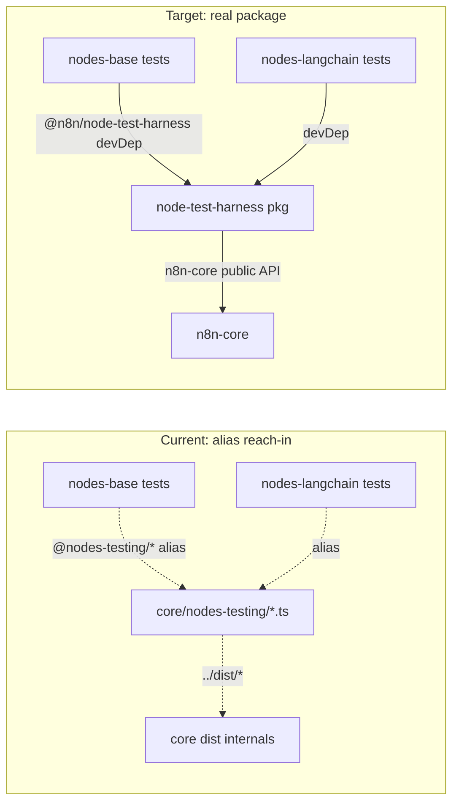

# Sketch: extract the node test harness into its own package

> Status: **sketch / RFC**. No code moved yet — this describes the follow-up
> execution PR. Clears the largest turbo boundaries cluster (389 reach-in
> violations), the last structural item under
> [DEVP-646](https://linear.app/n8n/issue/DEVP-646/module-boundaries-and-library-tagging).

## Problem

`packages/core/nodes-testing/` is a test-helper directory that lives **inside**
the `core` package but is imported by *other* packages' tests through a
tsconfig + vite path alias:

```jsonc
// packages/nodes-base/tsconfig.json
"paths": { "@nodes-testing/*": ["../core/nodes-testing/*"] }
```

Because the directory is a sibling of core's `rootDir: src`, it is **not**
compiled into core's `dist`. It reaches core internals at test time via
relative `../dist/*` imports, and consumers reach *it* via the alias. Turbo
boundaries flags every such import as leaving the package:

- `@nodes-testing/node-test-harness` — **386** imports
- `@nodes-testing/credentials-helper` — **3** imports

Consumers: `nodes-base` (383 files) and `@n8n/nodes-langchain` (3 files).



## Why it's unblocked

Every internal import the harness makes is **already exported from
`n8n-core`'s public barrel** (`packages/core/src/index.ts`) — no new core
exports required:

| Current deep import | Symbol | Public barrel path |
|---|---|---|
| `../dist/errors` | `UnrecognizedCredentialTypeError`, `UnrecognizedNodeTypeError` | `export * from './errors'` |
| `../dist/nodes-loader/lazy-package-directory-loader` | `LazyPackageDirectoryLoader` | `export * from './nodes-loader'` |
| `../dist/execution-engine/execution-lifecycle-hooks` | `ExecutionLifecycleHooks` | `export * from './execution-engine'` |
| `../dist/execution-engine/workflow-execute` | `WorkflowExecute` | `export * from './execution-engine'` |
| `../dist/credentials` | `Credentials` | `export * from './credentials'` |

The harness has **no static import of `nodes-base`** → no circular dependency
(nodes are loaded from disk at runtime by `load-nodes-and-credentials.ts`).

## Target package

`packages/@n8n/node-test-harness`, published name **`@n8n/node-test-harness`**.

Files moved verbatim from `packages/core/nodes-testing/` into `src/`:
`node-test-harness.ts`, `credentials-helper.ts`, `load-nodes-and-credentials.ts`,
`credential-types.ts`, `node-types.ts`, `test-data-node.ts`, `mock-extended.ts`.

`src/index.ts` re-exports the two consumed symbols:

```ts
export { NodeTestHarness } from './node-test-harness';
export { CredentialsHelper } from './credentials-helper';
```

### package.json (deps derived from the actual imports)

```jsonc
{
  "name": "@n8n/node-test-harness",
  "private": true,
  "main": "src/index.ts",           // consumed only by vitest — no build step needed
  "dependencies": {
    "n8n-core": "workspace:*",        // replaces the 5 ../dist/* reaches
    "n8n-workflow": "workspace:*",
    "@n8n/decorators": "workspace:*",
    "@n8n/di": "workspace:*",
    "@n8n/utils": "workspace:*",
    "callsites": "catalog:",
    "fast-glob": "catalog:",
    "lodash": "catalog:",
    "nock": "catalog:"
  },
  "peerDependencies": { "vitest": "catalog:", "vitest-mock-extended": "catalog:" }
}
```

`vitest` / `vitest-mock-extended` are peers: the harness calls `expect`/`mock`
and must share the consumer's vitest instance. `n8n-core` was previously
`../dist/*`; as a workspace dep it resolves to core's built output — same effect,
declared.

## Execution steps (the follow-up PR)

1. Scaffold `packages/@n8n/node-test-harness` (package.json above, `tsconfig.json`
   extending `@n8n/typescript-config`, `vitest.config.ts`).
2. `git mv` the 7 files into `src/`; add `src/index.ts`.
3. Rewrite the 5 `../dist/*` imports → `n8n-core` (single symbol each).
4. Migrate consumers — mechanical, one sed per specifier:
   - `@nodes-testing/node-test-harness` → `@n8n/node-test-harness` (386)
   - `@nodes-testing/credentials-helper` → `@n8n/node-test-harness` (3, symbol re-exported from root)
5. Add `"@n8n/node-test-harness": "workspace:*"` to the `devDependencies` of
   `nodes-base` and `@n8n/nodes-langchain`.
6. Delete the `@nodes-testing` alias from both packages' `tsconfig.json`,
   `vite.config.ts`, and `nodes-base/vitest.integration.config.ts`.
7. `pnpm install`, run the migrated test suites, then `pnpm boundaries:baseline`.

## Verification

- `pnpm boundaries` drops by **389** (386 + 3) — the entire reach-in cluster.
- nodes-base + nodes-langchain test suites pass unchanged (imports differ only
  in specifier; the harness code is byte-identical).

## Open questions

- **Package location/name:** `@n8n/node-test-harness` vs folding into the
  existing `@n8n/backend-test-utils`. Proposing a dedicated package — it's
  node-specific and has a distinct dependency surface (nock, fast-glob, dynamic
  node loading).
- **No build step:** consumed source-only by vitest (like the current setup).
  Confirm no non-vitest consumer needs a compiled `dist`.
