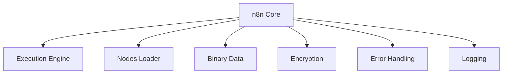

# n8n Core Architecture

This document provides a high-level overview of the n8n core architecture, with links to more detailed documentation for key subsystems.

## System Architecture

n8n's core package contains several critical subsystems that work together to provide the workflow execution engine, node loading, credential management, and other foundational features.

## Key Subsystems

### Execution Engine

The [Execution Engine](./execution-engine/README.md) is responsible for executing workflows, including:

- Running full and partial workflow executions
- Managing active workflows with triggers and pollers
- Handling execution contexts for different node types
- Process node-to-node data passing
- Error handling and recovery

For detailed information, see the [Execution Engine Documentation](./execution-engine/README.md).

### Nodes Loader

The [Nodes Loader](./nodes-loader/README.md) system handles loading, managing, and providing access to n8n nodes and credentials:

- Loading nodes and credentials from various sources
- Managing node and credential metadata
- Lazy loading for improved performance
- Isolated class loading

For detailed information, see the [Nodes Loader Documentation](./nodes-loader/README.md).

### Binary Data

The Binary Data subsystem manages binary data handling throughout n8n:

- File system and object storage management
- Binary data streaming and processing
- File type detection and handling
- Data deduplication

### Encryption

The Encryption subsystem provides services for:

- Credential encryption/decryption
- Secure storage of sensitive data
- Key management
- Encryption scheme versioning

### Error Handling

The Error Handling subsystem provides:

- Standardized error classes
- Error reporting and collection
- Workflow error recovery
- User-friendly error messages

### Logging

The Logging subsystem handles:

- Structured logging
- Log level management
- Log routing (console, file, etc.)
- Sensitive data redaction

## Design Principles

The n8n core architecture adheres to several key design principles:

1. **Separation of Concerns**: Each subsystem has clear responsibilities
2. **Dependency Injection**: Services are loosely coupled through dependency injection
3. **Extensibility**: Systems are designed to be extended with new functionality
4. **Type Safety**: Extensive use of TypeScript interfaces and type checking
5. **Performance Optimization**: Lazy loading, partial execution, and other optimizations
6. **Error Resilience**: Comprehensive error handling at multiple levels

## Implementation Patterns

Throughout the codebase, you'll find consistent implementation patterns:

- **Service Pattern**: Most subsystems are implemented as injectable services
- **Factory Pattern**: Used for creating specialized contexts and instances
- **Strategy Pattern**: Allows for different implementations of core functionality
- **Decorator Pattern**: Used for adding behavior to classes
- **Repository Pattern**: Used for data access abstraction

## Getting Started with Development

To contribute to n8n core, start by understanding the subsystem relevant to your task. The linked documentation provides detailed explanations of each subsystem's architecture and components.
