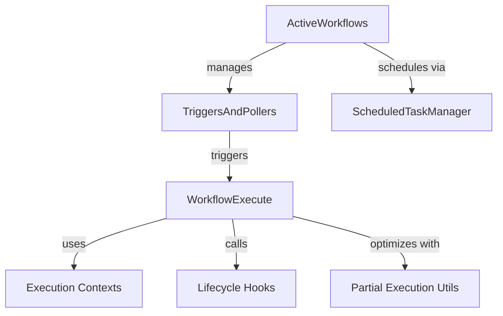
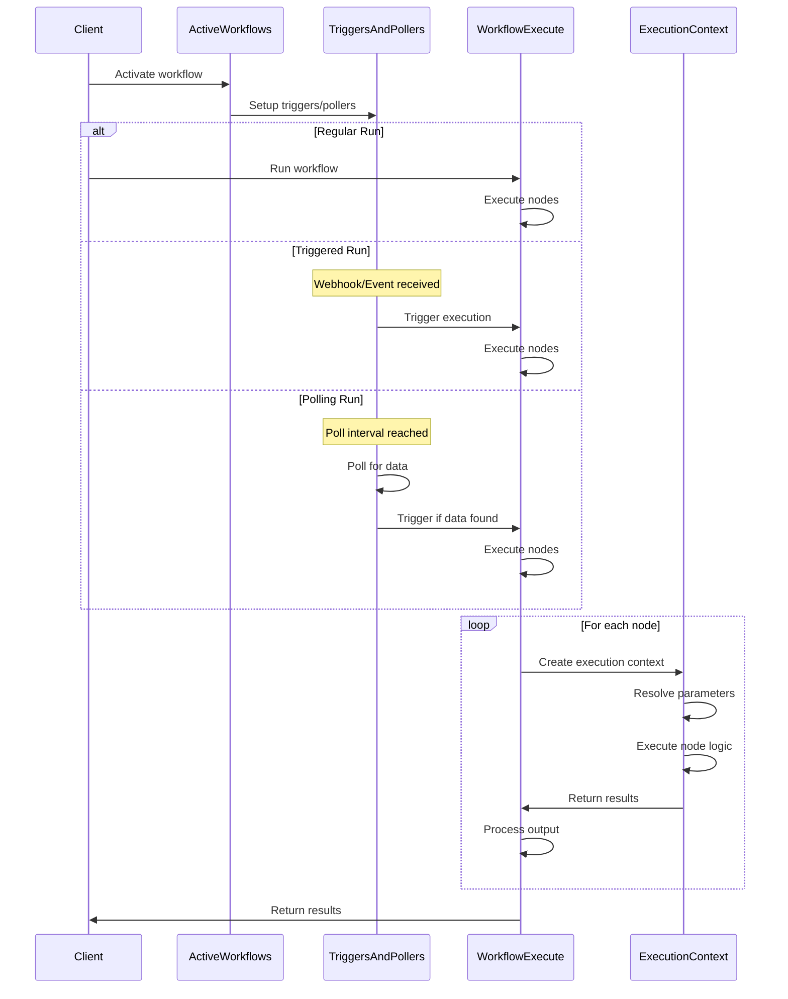
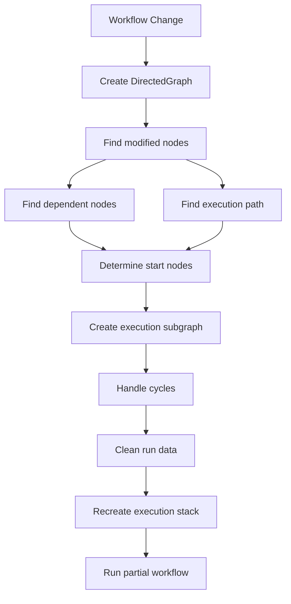

# n8n Execution Engine Architecture

This document provides a high-level overview of the n8n execution engine architecture and its components.

## Core Components

The execution engine consists of several key components that work together to execute workflows:



### WorkflowExecute

The central component responsible for executing workflows. It manages:
- The node execution stack
- Data passing between nodes
- Error handling and retries
- Partial workflow execution

### ActiveWorkflows

Manages currently active workflows that have trigger or polling nodes:
- Activates and deactivates workflows
- Sets up triggers and polling operations
- Manages workflow state in memory

### TriggersAndPollers

Handles trigger and polling nodes:
- Sets up event listeners for triggers
- Manages scheduled polling operations
- Processes incoming webhook requests
- Initiates workflow executions

### ScheduledTaskManager

Manages scheduled tasks including polling operations:
- Registers cron jobs for polling nodes
- Handles timing and scheduling of poll executions
- Ensures scheduled tasks run on the appropriate instance in a clustered environment

### Execution Contexts

Specialized contexts for different node types and execution scenarios:
- NodeExecutionContext: Base abstract class
- ExecuteContext: Regular node execution
- WebhookContext: Webhook handling
- TriggerContext: Trigger nodes
- PollContext: Polling nodes
- And several other specialized contexts

### Execution Lifecycle Hooks

Provides hooks for workflow and node execution events:
- Before/after node execution
- Before/after workflow execution
- Supports features like monitoring and debugging

### Partial Execution Utilities

Optimizes workflow execution by only running necessary parts:
- DirectedGraph: Graph representation of the workflow
- Finding start nodes and subgraphs
- Handling cyclic dependencies
- Recreating execution state for partial runs

## Execution Flow

The high-level execution flow in n8n follows these steps:



## Data Flow

Data flows through the workflow execution as follows:

```mermaid
flowchart TD
    A[Node A Output] -->|Connection| B[Node B Input]
    B -->|Processing| C[Node B Output]
    C -->|Connection| D[Node C Input]
    
    subgraph "Data Structure"
        X[INodeExecutionData[][]]
        X -->|"Outer Array"| Y["Different outputs (main, error)"]
        Y -->|"Inner Array"| Z["Data items"]
    end
    
    subgraph "Paired Items"
        I[Input Items] -->|"Maps to"| O[Output Items]
        O -->|"Tracked via"| P["pairedItem property"]
    end
```

## Execution Modes

n8n supports different execution modes:

1. **Manual Execution**: Triggered manually by a user
2. **Webhook Execution**: Triggered by an HTTP request
3. **Polling Execution**: Triggered by periodic polling
4. **Scheduled Execution**: Triggered at specific times

## Partial Execution

Partial execution is an optimization that re-executes only the necessary parts of a workflow:



## Error Handling

The execution engine provides multiple error handling mechanisms:

1. **Node-level error handling**:
   - continueOnFail: Continue execution despite node failures
   - retryOnFail: Retry node execution multiple times
   - onError output: Route errors to specific outputs

2. **Workflow-level error handling**:
   - Error workflows: Separate workflows triggered on error
   - Error reporting: Centralized error collection and reporting
   - Error node: Handle errors within the workflow

## Trigger Nodes

Trigger nodes are specialized nodes that start workflow executions based on external events or conditions:

### Initialization and Lifecycle

1. When a workflow with trigger nodes is activated:
   - `ActiveWorkflows.add()` identifies trigger nodes in the workflow
   - For each trigger node, it calls `TriggersAndPollers.runTrigger()`
   - `TriggersAndPollers` creates a `TriggerContext` with helper functions
   - The node's trigger function is executed with this context, setting up event listeners
   - The node is now "listening" for events

2. During runtime:
   - When an external event occurs (like a webhook request), the node processes it
   - If the event matches the trigger criteria, the node calls `emit()` provided by `TriggerContext`
   - This emitted data becomes the initial input for the workflow execution
   - The workflow execution engine starts processing from the trigger node

3. When deactivating:
   - `ActiveWorkflows.remove()` calls the trigger's close function to clean up listeners
   - Resources used by the trigger node are released

### Types of Triggers

1. **Event-based triggers**: Listen for external events, such as:
   - Webhooks (HTTP requests)
   - External system events (e.g., Slack messages, email arrivals)
   - Custom events from other applications

2. **Polling triggers**: Periodically check for conditions at scheduled intervals:
   - Registered with the scheduling system via cron expressions
   - Execute `runPoll()` at scheduled times
   - Emit data when conditions are met during polling

3. **Manual triggers**: Can be manually activated by users:
   - Special handling via `manualTriggerResponse` captures the first emission
   - Used primarily for testing and manual workflow execution

### Trigger Context

The `TriggerContext` provides trigger nodes with:
- `emit()`: Function to send data when a trigger condition is met
- `emitError()`: Function to handle and report errors in triggers
- Helper methods for HTTP requests, credentials access, and binary data operations
- Methods to log information and retrieve workflow-related data

### Partial Execution with Triggers

When performing partial workflow executions:
- `findTriggerForPartialExecution()` identifies which trigger node should be the entry point
- It prioritizes triggers based on criteria like pinned data or position in the workflow
- The identified trigger's data is used as the starting point for the partial execution

## Polling Nodes

Polling nodes are specialized nodes that check external systems at scheduled intervals to trigger workflow executions when specific conditions are met:

### Initialization and Lifecycle

1. When a workflow with polling nodes is activated:
   - `ActiveWorkflows.add()` identifies polling nodes in the workflow
   - For each polling node, it calls `activatePolling()`
   - `activatePolling()` extracts polling interval configuration from node parameters
   - A cron expression is created from the polling interval
   - The poll function is executed immediately to verify it works
   - The cron job is registered with the `ScheduledTaskManager`

2. During runtime:
   - When the scheduled time is reached, the cron job executes
   - `TriggersAndPollers.runPoll()` is called for the polling node
   - A specialized `PollContext` is created with helper functions
   - The node's poll function is executed with this context
   - If data is found, `emit()` is called to start workflow execution
   - The workflow execution engine starts processing from the polling node

3. When deactivating:
   - `ActiveWorkflows.remove()` calls `ScheduledTaskManager.deregisterCrons()`
   - The cron jobs for the workflow are stopped
   - Resources used by the polling node are released

### Scheduling

1. **Timing Configuration**:
   - Polling intervals are specified in node parameters
   - Minimum polling interval is typically one minute
   - Intervals are converted to cron expressions
   - Custom cron expressions can also be provided directly

2. **ScheduledTaskManager**:
   - Uses the `cron` package to manage scheduled jobs
   - Handles registration and deregistration of cron jobs
   - Supports timezone-aware scheduling
   - Ensures jobs only run on the leader instance in a clustered environment

### Poll Context

The `PollContext` provides polling nodes with:
- `emit()`: Function to send data when poll conditions are met
- `emitError()`: Function to handle and report errors in polling
- Helper methods for HTTP requests, credentials access, and data operations
- Methods to log information and retrieve workflow-related data

### Key Differences from Trigger Nodes

1. **Execution Model**:
   - Trigger nodes are reactive (wait for events)
   - Polling nodes are proactive (actively check at intervals)

2. **Timing**:
   - Trigger nodes listen continuously
   - Polling nodes execute at scheduled intervals

3. **Resource Usage**:
   - Trigger nodes maintain persistent connections or listeners
   - Polling nodes only use resources during scheduled checks

4. **Initialization**:
   - Polling nodes execute immediately upon activation to verify functionality
   - Trigger nodes set up listeners without immediate execution

## Extensibility

The architecture is designed to be extensible:
- Specialized node execution contexts can be added
- Additional execution lifecycle hooks can be registered
- Custom error handlers can be implemented
- Custom trigger mechanisms can be developed

## Key Design Principles

1. **Separation of concerns**: Each component has specific responsibilities
2. **Dependency injection**: Components are loosely coupled
3. **Extensibility**: New functionality can be added with minimal changes
4. **Performance optimization**: Partial execution minimizes unnecessary work
5. **Error resilience**: Comprehensive error handling at multiple levels