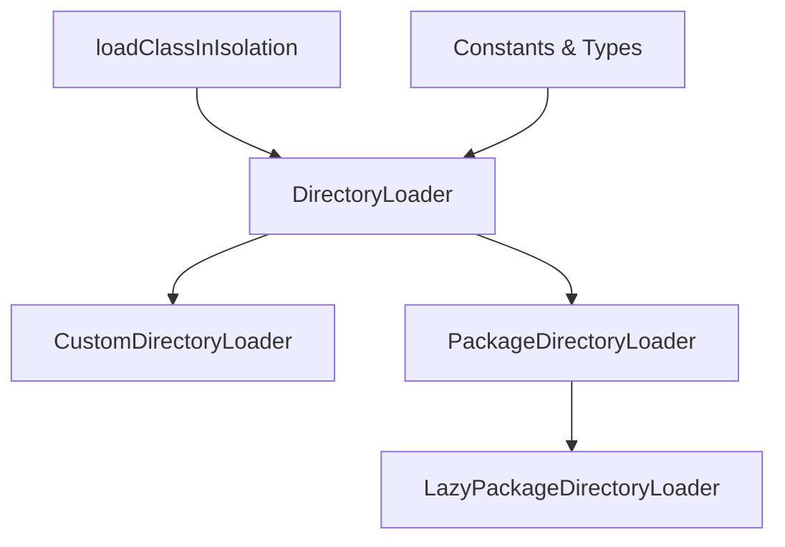
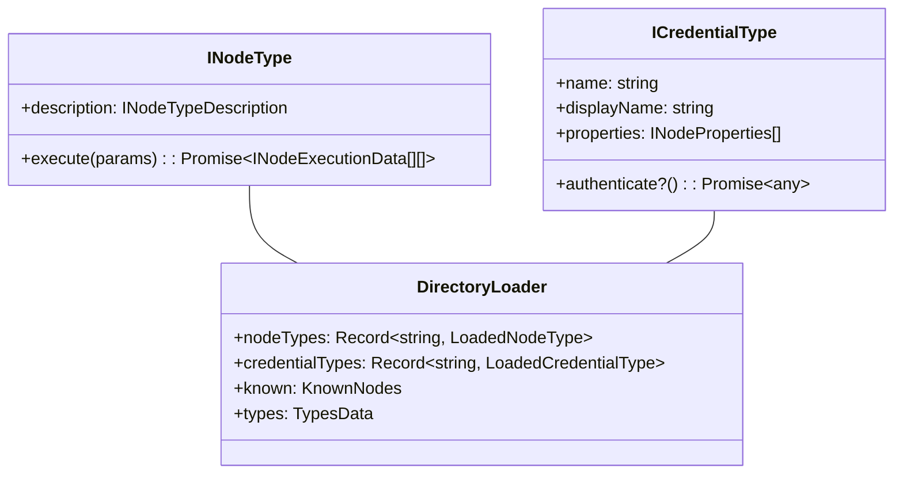
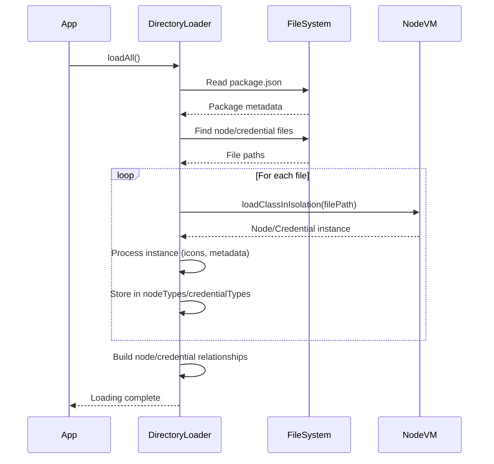
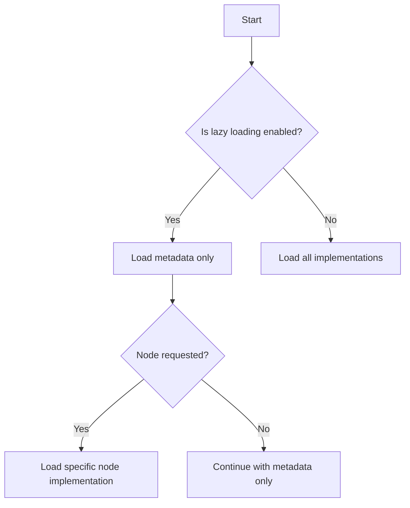

# n8n Nodes Loader Architecture

This document provides a comprehensive overview of the n8n nodes-loader system, which is responsible for loading, managing, and providing access to n8n nodes and credentials.

## Core Components

The nodes-loader system consists of several key components that work together to load node and credential types from various sources:



### DirectoryLoader (Base Class)

The `DirectoryLoader` is an abstract base class that provides the core functionality for loading nodes and credentials from a directory. It handles:

- Path resolution and file management
- Class loading and instantiation
- Type registration and validation
- Icon URL handling and normalization

### CustomDirectoryLoader

The `CustomDirectoryLoader` extends the `DirectoryLoader` to load custom nodes from a user-defined directory:

- Used for loading user-created nodes and credentials
- Has special handling for "CUSTOM" package naming
- Scans directory for node and credential files

### PackageDirectoryLoader

The `PackageDirectoryLoader` loads nodes and credentials from an installed n8n package:

- Reads package.json to identify node and credential files
- Validates package structure
- Loads node and credential classes
- Manages relationships between nodes and credentials

### LazyPackageDirectoryLoader

The `LazyPackageDirectoryLoader` extends the `PackageDirectoryLoader` to provide lazy loading capabilities:

- Loads node and credential metadata without loading full implementations
- Improves startup performance by deferring full loading
- Supports including/excluding specific nodes
- Falls back to full loading when necessary

### loadClassInIsolation

The `loadClassInIsolation` utility loads node and credential classes in an isolated VM context:

- Prevents cross-contamination between different node versions
- Improves stability by isolating node code
- Uses Node.js VM module for sandboxing

## Data Structures

### Node and Credential Types



The loaders manage two primary types of components:

1. **Node Types**: Classes that implement `INodeType` interface
   - Define node appearance, parameters, and behavior
   - Include the `execute` method that contains the node's business logic

2. **Credential Types**: Classes that implement `ICredentialType` interface
   - Define credential fields and validation
   - May include authentication methods
   - Can be linked to specific nodes

### Loading Process



## Special Features

### Lazy Loading

The lazy loading system improves startup performance by:

1. Loading only metadata (types, names, descriptions) initially
2. Deferring the loading of actual implementation code
3. Loading specific nodes on-demand when needed



### Node-Credential Relationships

The system tracks relationships between nodes and credentials:

- Which credentials are used by which nodes
- Which nodes are supported by which credentials
- Inheritance relationships between credentials

This information is used to:
- Optimize node and credential loading
- Provide better user experience when configuring nodes
- Enable proper HTTP request handling

## Usage Patterns

### Loading All Nodes

```typescript
// Create loader instance
const loader = new PackageDirectoryLoader('/path/to/nodes-package');

// Load all nodes and credentials
await loader.loadAll();

// Access loaded types
const nodeTypes = loader.nodeTypes;
const credentialTypes = loader.credentialTypes;
```

### Lazy Loading

```typescript
// Create lazy loader instance
const loader = new LazyPackageDirectoryLoader('/path/to/nodes-package');

// Load metadata only
await loader.loadAll();

// Access specific node (will load implementation if needed)
const nodeType = loader.getNode('my-node');
```

### Including/Excluding Nodes

```typescript
// Create loader with include/exclude filters
const loader = new LazyPackageDirectoryLoader(
  '/path/to/nodes-package',
  ['package.excludedNode'], // Nodes to exclude
  ['package.includedNode']  // Nodes to include
);

await loader.loadAll();
```

## Best Practices

1. **Use LazyPackageDirectoryLoader** for better performance in most cases
2. **Reset loaders** when package directories change
3. **Handle errors gracefully** from node loading
4. **Use the nodesByCredential** information for credential management
5. **Respect package scopes** when filtering nodes

## Implementation Details

- The system uses Node.js VM module for isolation
- Path resolution is normalized across platforms
- Icon paths are transformed for web server accessibility
- Code handles package.json parsing errors gracefully
- Type registries ensure uniqueness of node and credential types