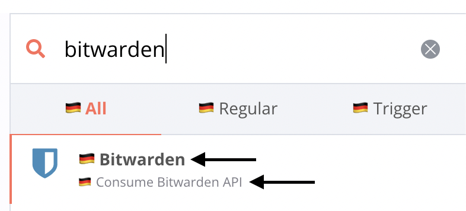
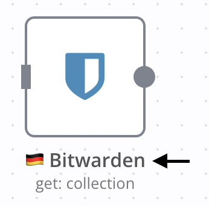
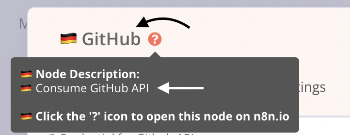
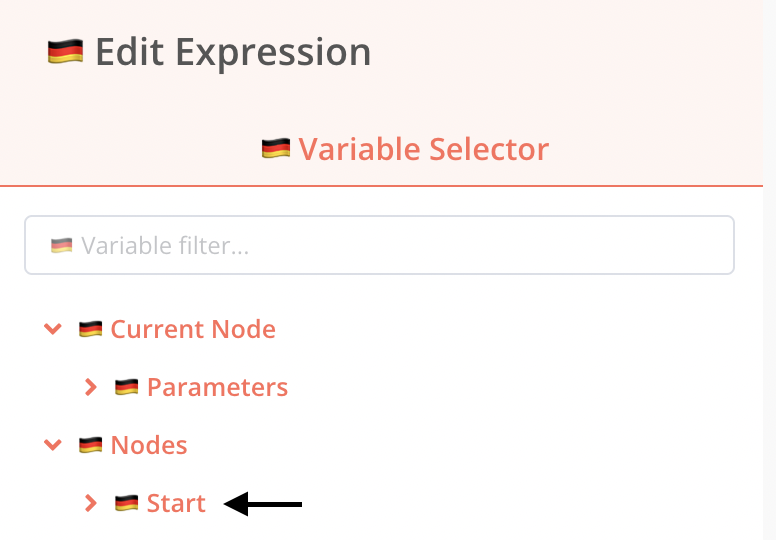
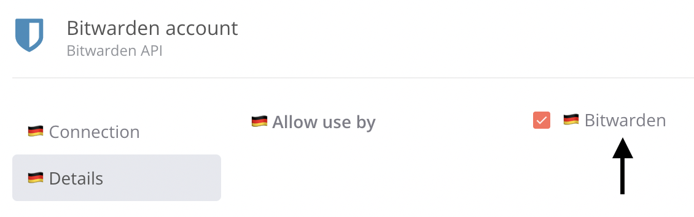
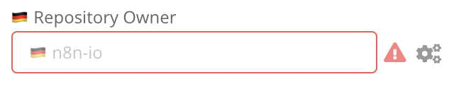
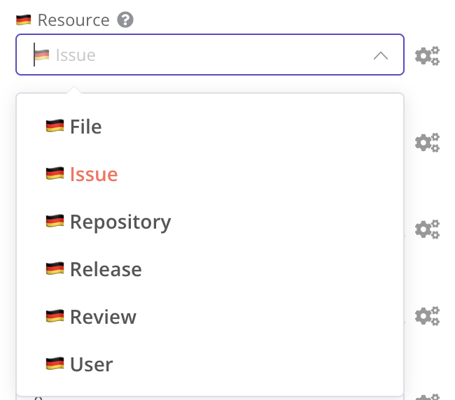
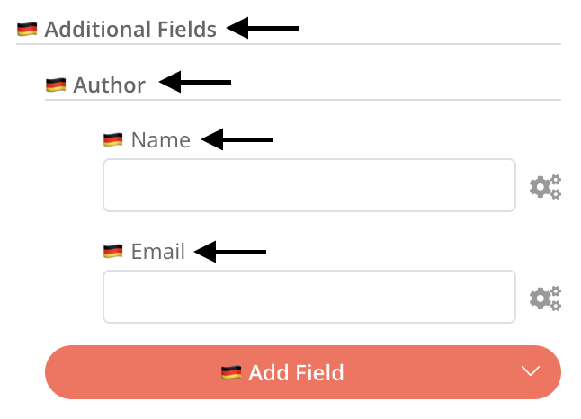

# i18n in n8n

## Scope

n8n allows for internalization of the majority of UI text:

- base text, e.g. menu display items in the left-hand sidebar menu,
- node text, e.g. parameter display names and placeholders in the node view,
- credential text, e.g. parameter display names and placeholders in the credential modal,
- header text, e.g. node display names and descriptions at various spots.

Currently, n8n does _not_ allow for internalization of:

- messages from outside the `editor-ui` package, e.g. `No active database connection`,
- strings in certain Vue components, e.g. date time picker
- node subtitles, e.g. `create: user` or `getAll: post` below the node name on the canvas,
- new version notification contents in the updates panel, e.g. `Includes node enhancements`, and
- options that rely on `loadOptionsMethod`.

Pending functionality:

- Search in nodes panel by translated node name
- UI responsiveness to differently sized strings
- Locale-aware number formatting

## Locale identifiers

A **locale identifier** is a language code compatible with the [`Accept-Language` header](https://developer.mozilla.org/en-US/docs/Web/HTTP/Headers/Accept-Language), e.g. `de` (German), `es` (Spanish), `ja` (Japanese). Regional variants of locale identifiers, such as `-AT` in `de-AT`, are _not_ supported. For a list of all locale identifiers, see [column 639-1 in this table](https://en.wikipedia.org/wiki/List_of_ISO_639-1_codes).

By default, n8n runs in the `en` (English) locale. To have run it in a different locale, set the `N8N_DEFAULT_LOCALE` environment variable to a locale identifier. When running in a non-`en` locale, n8n will display UI strings for the selected locale and fall back to `en` for any untranslated strings.

```
export N8N_DEFAULT_LOCALE=de
pnpm start
```

Output:

```
Initializing n8n process
n8n ready on 0.0.0.0, port 5678
Version: 0.156.0
Locale: de

Editor is now accessible via:
http://localhost:5678/

Press "o" to open in Browser.
```

## Base text

Base text is rendered with no dependencies, i.e. base text is fixed and does not change in any circumstances. Base text is supplied by the user in one file per locale in the `/editor-ui` package.

### Locating base text

The base text file for each locale is located at `/packages/editor-ui/src/plugins/i18n/locales/` and is named `{localeIdentifier}.json`. Keys in the base text file can be Vue component dirs, Vue component names, and references to symbols in those Vue components. These keys are added by the team as the UI is modified or expanded.

```json
{
	"nodeCreator.categoryNames.analytics": "🇩🇪 Analytics",
	"nodeCreator.categoryNames.communication": "🇩🇪 Communication",
	"nodeCreator.categoryNames.coreNodes": "🇩🇪 Core Nodes"
}
```

### Translating base text

1. Select a new locale identifier, e.g. `de`, copy the `en` JSON base text file with a new name:

```
cp ./packages/editor-ui/src/plugins/i18n/locales/en.json ./packages/editor-ui/src/plugins/i18n/locales/de.json
```

2. Find in the UI a string to translate, and search for it in the newly created base text file. Alternatively, find in `/editor-ui` a call to `$locale.baseText(key)`, e.g. `$locale.baseText('workflowActivator.deactivateWorkflow')`, and take note of the key and find it in the newly created base text file.

> **Note**: If you cannot find a string in the new base text file, either it does not belong to base text (i.e., the string might be part of header text, credential text, or node text), or the string might belong to the backend, where i18n is currently unsupported.

3. Translate the string value - do not change the key. In the examples below, a string starting with 🇩🇪 stands for a string translated from English into German.

As an optional final step, remove any untranslated strings from the new base text file. Untranslated strings in the new base text file will trigger a fallback to the `en` base text file.

> For information about **interpolation** and **reusable base text**, refer to the [Addendum](./ADDENDUM.md).

## Dynamic text

Dynamic text relies on data specific to each node and credential:

- `headerText` and `nodeText` in the **node translation file**
- `credText` in the **credential translation file**

### Locating dynamic text

#### Locating the credential translation file

A credential translation file is placed at `/nodes-base/credentials/translations/{localeIdentifier}`

```
credentials
	└── translations
		└── de
			├── githubApi.json
			└── githubOAuth2Api.json
```

Every credential must have its own credential translation file.

The name of the credential translation file must be sourced from the credential's `description.name` property:

```ts
export class GithubApi implements ICredentialType {
	name = 'githubApi'; // to use for credential translation file
	displayName = 'Github API';
	documentationUrl = 'github';
	properties: INodeProperties[] = [
```

#### Locating the node translation file

A node translation file is placed at `/nodes-base/nodes/{node}/translations/{localeIdentifier}`

```
GitHub
	├── GitHub.node.ts
	├── GitHubTrigger.node.ts
	└── translations
		└── de
			├── github.json
			└── githubTrigger.json
```

Every node must have its own node translation file.

> For information about nodes in **versioned dirs** and **grouping dirs**, refer to the [Addendum](./ADDENDUM.md).

The name of the node translation file must be sourced from the node's `description.name` property:

```ts
export class Github implements INodeType {
	description: INodeTypeDescription = {
		displayName: 'GitHub',
		name: 'github', // to use for node translation file name
		icon: 'file:github.svg',
		group: ['input'],
```

### Translating dynamic text

#### Translating the credential translation file

> **Note**: All translation keys are optional. Missing translation values trigger a fallback to the `en` locale strings.

A credential translation file, e.g. `githubApi.json` is an object containing keys that match the credential parameter names:

```ts
export class GithubApi implements ICredentialType {
	name = 'githubApi';
	displayName = 'Github API';
	documentationUrl = 'github';
	properties: INodeProperties[] = [
		{
			displayName: 'Github Server',
			name: 'server', // key to use in translation
			type: 'string',
			default: 'https://api.github.com',
			description: 'The server to connect to. Only has to be set if Github Enterprise is used.',
		},
		{
			displayName: 'User',
			name: 'user', // key to use in translation
			type: 'string',
			default: '',
		},
		{
			displayName: 'Access Token',
			name: 'accessToken', // key to use in translation
			type: 'string',
			default: '',
		},
	];
}
```

The object for each node credential parameter allows for the keys `displayName`, `description`, and `placeholder`.

```json
{
	"server.displayName": "🇩🇪 Github Server",
	"server.description": "🇩🇪 The server to connect to. Only has to be set if Github Enterprise is used.",
	"user.placeholder": "🇩🇪 Hans",
	"accessToken.placeholder": "🇩🇪 123"
}
```

<p align="center">
	
</p>

Only existing parameters are translatable. If a credential parameter does not have a description in the English original, adding a translation for that non-existing parameter will not result in the translation being displayed - the parameter will need to be added in the English original first.

#### Translating the node translation file

> **Note**: All keys are optional. Missing translations trigger a fallback to the `en` locale strings.

Each node translation file is an object that allows for two keys, `header` and `nodeView`, which are the _sections_ of each node translation.

The `header` section points to an object that may contain only two keys, `displayName` and `description`, matching the node's `description.displayName` and `description.description`.

```ts
export class Github implements INodeType {
	description: INodeTypeDescription = {
		displayName: 'GitHub', // key to use in translation
		description: 'Consume GitHub API', // key to use in translation
		name: 'github',
		icon: 'file:github.svg',
		group: ['input'],
		version: 1,
```

```json
{
	"header": {
		"displayName": "🇩🇪 GitHub",
		"description": "🇩🇪 Consume GitHub API"
	}
}
```

Header text is used wherever the node's display name and description are needed:

<p align="center">
		
		
		
</p>

<p align="center">
		
		
</p>

In turn, the `nodeView` section points to an object containing translation keys that match the node's operational parameters, found in the `*.node.ts` and also found in `*Description.ts` files in the same dir.

```ts
export class Github implements INodeType {
	description: INodeTypeDescription = {
		displayName: 'GitHub',
		name: 'github',
		properties: [
			{
				displayName: 'Resource',
				name: 'resource', // key to use in translation
				type: 'options',
				options: [],
				default: 'issue',
				description: 'The resource to operate on.',
			},
```

```json
{
	"nodeView.resource.displayName": "🇩🇪 Resource"
}
```

A node parameter allows for different translation keys depending on parameter type.

#### `string`, `number` and `boolean` parameters

Allowed keys: `displayName`, `description`, `placeholder`

```ts
{
	displayName: 'Repository Owner',
	name: 'owner', // key to use in translation
	type: 'string',
	required: true,
	placeholder: 'n8n-io',
	description: 'Owner of the repository.',
},
```

```json
{
	"nodeView.owner.displayName": "🇩🇪 Repository Owner",
	"nodeView.owner.placeholder": "🇩🇪 n8n-io",
	"nodeView.owner.description": "🇩🇪 Owner of the repository"
}
```

<p align="center">
	
</p>

#### `options` parameter

Allowed keys: `displayName`, `description`, `placeholder`

Allowed subkeys: `options.{optionName}.displayName` and `options.{optionName}.description`.

```js
{
	displayName: 'Resource',
	name: 'resource',
	type: 'options',
	options: [
		{
			name: 'File',
			value: 'file', // key to use in translation
		},
		{
			name: 'Issue',
			value: 'issue', // key to use in translation
		},
	],
	default: 'issue',
	description: 'Resource to operate on',
},
```

```json
{
	"nodeView.resource.displayName": "🇩🇪 Resource",
	"nodeView.resource.description": "🇩🇪 Resource to operate on",
	"nodeView.resource.options.file.name": "🇩🇪 File",
	"nodeView.resource.options.issue.name": "🇩🇪 Issue"
}
```

<p align="center">
	
</p>

For nodes whose credentials may be used in the HTTP Request node, an additional option `Custom API Call` is injected into the `Resource` and `Operation` parameters. Use the `__CUSTOM_API_CALL__` key to translate this additional option.

```json
{
	"nodeView.resource.options.file.name": "🇩🇪 File",
	"nodeView.resource.options.issue.name": "🇩🇪 Issue",
	"nodeView.resource.options.__CUSTOM_API_CALL__.name": "🇩🇪 Custom API Call"
}
```

#### `collection` and `fixedCollection` parameters

Allowed keys: `displayName`, `description`, `placeholder`, `multipleValueButtonText`

Example of `collection` parameter:

```js
{
	displayName: 'Labels',
	name: 'labels', // key to use in translation
	type: 'collection',
	typeOptions: {
		multipleValues: true,
		multipleValueButtonText: 'Add Label',
	},
	displayOptions: {
		show: {
			operation: [
				'create',
			],
			resource: [
				'issue',
			],
		},
	},
	default: { 'label': '' },
	options: [
		{
			displayName: 'Label',
			name: 'label', // key to use in translation
			type: 'string',
			default: '',
			description: 'Label to add to issue',
		},
	],
},
```

```json
{
	"nodeView.labels.displayName": "🇩🇪 Labels",
	"nodeView.labels.multipleValueButtonText": "🇩🇪 Add Label",
	"nodeView.labels.options.label.displayName": "🇩🇪 Label",
	"nodeView.labels.options.label.description": "🇩🇪 Label to add to issue",
	"nodeView.labels.options.label.placeholder": "🇩🇪 Some placeholder"
}
```

Example of `fixedCollection` parameter:

```js
{
	displayName: 'Additional Parameters',
	name: 'additionalParameters',
	placeholder: 'Add Parameter',
	description: 'Additional fields to add.',
	type: 'fixedCollection',
	default: {},
	displayOptions: {
		show: {
			operation: [
				'create',
				'delete',
				'edit',
			],
			resource: [
				'file',
			],
		},
	},
	options: [
		{
			name: 'author',
			displayName: 'Author',
			values: [
				{
					displayName: 'Name',
					name: 'name',
					type: 'string',
					default: '',
					description: 'Name of the author of the commit',
					placeholder: 'John',
				},
				{
					displayName: 'Email',
					name: 'email',
					type: 'string',
					default: '',
					description: 'Email of the author of the commit',
					placeholder: 'john@email.com',
				},
			],
		},
	],
}
```

```json
{
	"nodeView.additionalParameters.displayName": "🇩🇪 Additional Parameters",
	"nodeView.additionalParameters.placeholder": "🇩🇪 Add Field",
	"nodeView.additionalParameters.options.author.displayName": "🇩🇪 Author",
	"nodeView.additionalParameters.options.author.values.name.displayName": "🇩🇪 Name",
	"nodeView.additionalParameters.options.author.values.name.description": "🇩🇪 Name of the author of the commit",
	"nodeView.additionalParameters.options.author.values.name.placeholder": "🇩🇪 Jan",
	"nodeView.additionalParameters.options.author.values.email.displayName": "🇩🇪 Email",
	"nodeView.additionalParameters.options.author.values.email.description": "🇩🇪 Email of the author of the commit",
	"nodeView.additionalParameters.options.author.values.email.placeholder": "🇩🇪 jan@n8n.io"
}
```

<p align="center">
		
</p>

> For information on **reusable dynamic text**, refer to the [Addendum](./ADDENDUM.md).

# Building translations

## Base text

When translating a base text file at `/packages/editor-ui/src/plugins/i18n/locales/{localeIdentifier}.json`:

1. Open a terminal:

```sh
export N8N_DEFAULT_LOCALE=de
pnpm start
```

2. Open another terminal:

```sh
export N8N_DEFAULT_LOCALE=de
cd packages/editor-ui
pnpm dev
```

Changing the base text file will trigger a rebuild of the client at `http://localhost:8080`.

## Dynamic text

When translating a dynamic text file at `/packages/nodes-base/nodes/{node}/translations/{localeIdentifier}/{node}.json`,

1. Open a terminal:

```sh
export N8N_DEFAULT_LOCALE=de
pnpm start
```

2. Open another terminal:

```sh
export N8N_DEFAULT_LOCALE=de
cd packages/nodes-base
pnpm n8n-generate-translations
pnpm watch
```

After changing the dynamic text file:

1. Stop and restart the first terminal.
2. Refresh the browser at `http://localhost:5678`

If a `headerText` section was changed, re-run `pnpm n8n-generate-translations` in `/nodes-base`.

> **Note**: To translate base and dynamic text simultaneously, run three terminals following the steps from both sections (first terminal running only once) and browse `http://localhost:8080`.
