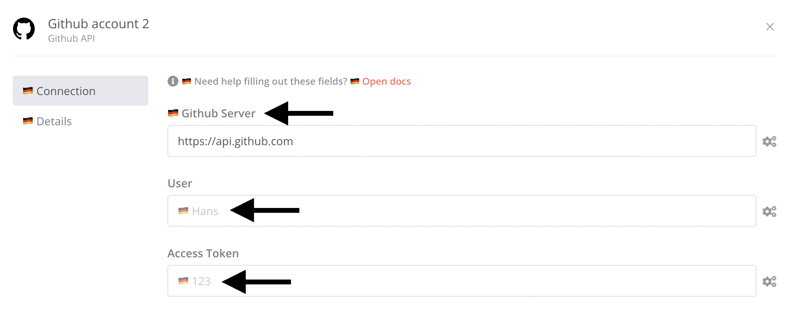

# i18n in n8n

## Scope

n8n allows for internalization of the majority of UI text:

- base text, e.g. menu display items in the left-hand sidebar menu,
- node text, e.g. parameter display names and placeholders in the node view,
- header text, e.g. node display names and descriptions in the nodes panel.

Currently, n8n does _not_ allow for internalization of:

- messages from outside the `editor-ui` package, e.g. `No active database connection`,
- node subtitles, e.g. `create: user` or `getAll: post` below the node name on the canvas,
- new version notification contents in the updates panel, e.g. `Includes node enhancements`.

## Locale identifiers

A locale identifier is a language code compatible with the [`Accept-Language` header](https://developer.mozilla.org/en-US/docs/Web/HTTP/Headers/Accept-Language), e.g. `de` (German), `es` (Spanish), `ja` (Japanese). Regional variants of locale identifiers are not supported, i.e. use `de`, not `de-AT`. For a list of all locale identifiers, refer to the [639-1 column in the ISO 639-1 codes article](https://en.wikipedia.org/wiki/List_of_ISO_639-1_codes).

By default, n8n runs in the `en` (English) locale. To have it run in a different locale, set the `N8N_DEFAULT_LOCALE` environment variable. If it has been set and is not `en`, n8n will use the UI strings for that locale - for any untranslated UI strings, n8n will automatically fall back to `en`.

```sh
export N8N_DEFAULT_LOCALE=de
npm run start
```

## Base text

Base text is directly rendered with no dependencies. Base text is supplied by the user in one file per locale in the `/editor-ui` package.

### Locating base text

Each base text file is located at `/packages/editor-ui/src/plugins/i18n/locales/{localeIdentifier}.json` and exports an object where keys are Vue component names (and their containing dirs if any) and references to parts of those Vue components.

```json
"nodeCreator": {
	"categoryNames": {
		"analytics": "🇩🇪 Analytics",
		"communication": "🇩🇪 Communication",
		"coreNodes": "🇩🇪 Core Nodes",
```

### Translating base text

1. For the new locale identifier, e.g. `de`, copy the `en` base text and rename it:

```sh
cp ./packages/editor-ui/src/plugins/i18n/locales/en.json ./packages/editor-ui/src/plugins/i18n/locales/de.json
```

2. Check in the UI for a base text string to translate, and find it in the newly created base text file.

> **Note**: If you cannot find a string in the new base text file, either it does not belong to base text (i.e., the string might be part of header text, credential text, or node text), or the string might belong to the backend, where i18n is currently unsupported.

3. Translate the string value - do not change the key. In the examples below, a string starting with 🇩🇪 stands for a translated string.

Optionally, remove any untranslated strings from the new base text file. Untranslated strings in the new base text file will automatically fall back to the `en` base text file.

#### Reusable base text

As a convenience, the base text file may contain the special key `reusableBaseText` to share strings between translations. For more information, refer to Vue i18n's [linked locale messages](https://kazupon.github.io/vue-i18n/guide/messages.html#linked-locale-messages).

```json
{
	"reusableBaseText": {
		"save": "🇩🇪 Save",
	},
	"duplicateWorkflowDialog": {
		"enterWorkflowName": "🇩🇪 Enter workflow name",
		"save": "@:reusableBaseText.save",
	},
	"saveButton": {
		"save": "@:reusableBaseText.save",
		"saving": "🇩🇪 Saving",
		"saved": "🇩🇪 Saved",
	},
```

<!--
As a convenience, the base text file may also contain the special key `numberFormats` to localize numbers. For more information, refer to Vue i18n's [number localization](https://kazupon.github.io/vue-i18n/guide/number.html#number-localization).

```json
{
	"numberFormats": {
		"decimal": {
			"style": "decimal",
		},
	},
}
``` -->

#### Interpolation

Some base text strings use [interpolation](https://kazupon.github.io/vue-i18n/guide/formatting.html#named-formatting) with a variable in curly braces, e.g. `Execution ID {activeExecutionId} was stopped`. In case of interpolation, the translated string must not modify the variable: `Die Ausführung mit der ID {activeExecutionId} wurde gestoppt`.

## Dynamic text

Dynamic text is **text that relies on node-related data** in order to be rendered. Node-related data is supplied by the user in multiple files in the `/nodes-base` package. Dynamic text is mostly visible in the node view, i.e. the node on the canvas and the node parameters modal.

### Locating dynamic text

Dynamic text is divided into files located in `/translations` dirs alongside the translated nodes:

```
GitHub
  ├── GitHub.node.ts
  ├── GitHubTrigger.node.ts
  └── translations
      ├── de.json
      ├── es.json
      └── ja.json
```

Each node translation file may contain the translations for one or both (regular and trigger) nodes.

For nodes in grouping dirs, e.g. `Google`, `Aws`, and `Microsoft`, locate the `/translations` dir alongside the `*.node.ts` file:

```
Google
  └── Drive
      ├── GoogleDrive.node.ts
      └── translations
          ├── de.json
          ├── es.json
          └── ja.json
```

For nodes in versioned dirs, locate the `/translations` dir alongside the versioned `*.node.ts` file:

```
Mattermost
  └── Mattermost.node.ts
      └── v1
          ├── MattermostV1.node.ts
          ├── actions
          ├── methods
          ├── transport
          └── translations
               ├── de.json
               ├── es.json
               └── ja.json
```

### Translating dynamic text

> **Note**: In the examples below, the node source is located at `/packages/nodes-base/nodes/Github/GitHub.node.ts` and the node translation is located at `/packages/nodes-base/nodes/Github/translations/de.json`.

Each node translation is an object with a key that matches the node's `description.name`:

```ts
export class Github implements INodeType {
	description: INodeTypeDescription = {
		displayName: 'GitHub',
		description: 'Consume GitHub API',
		name: 'github', // key to use in translation
		icon: 'file:github.svg',
		group: ['input'],
		version: 1,
```

```json
{
	"github": {}, // key from node's description.name
	"githubTrigger": {}, // key from node's description.name
}
```

The object inside allows for three keys: `header`, `credentialsModal` and `nodeView`. These are the _sections_ of each node translation:

```json
{
	"github": {
		"header": {},
		"credentialsModal": {},
		"nodeView": {},
	},
	"githubTrigger": {
		"header": {},
		"credentialsModal": {},
		"nodeView": {},
	},
}
```

> **Note**: These three keys as well as all keys described below are optional. Remember that, in case of missing sections or missing translations, n8n will fall back to the `en` locale.

#### `header` section

The `header` section points to an object that may contain only two keys, `displayName` and `description`, matching the node's `description.displayName` and `description.description`. These are used in the nodes panel, in the node view and in the node credentials modal.

```ts
export class Github implements INodeType {
	description: INodeTypeDescription = {
		displayName: 'GitHub', // key to use in translation
		description: 'Consume GitHub API', // key to use in translation
		name: 'github',
		icon: 'file:github.svg',
		group: ['input'],
		version: 1,
```

```json
{
	"github": {
		"header": {
			"displayName": "🇩🇪 GitHub",
			"description": "🇩🇪 Consume GitHub API",
		},
	},
}
```

Header text is used wherever the node's display name and description are needed:

<p align="center">
    
    
    
</p>

<p align="center">
    
    
</p>

#### `credentialsModal` section

> **Note**: In the examples below, the node credential source is located at `/packages/nodes-base/credentials/GithubApi.credentials.ts`.

The `credentialsModal` section points to an object containing a key that matches the node credential `name`.

```ts
export class GithubApi implements ICredentialType {
	name = 'githubApi'; // key to use in translation
	displayName = 'Github API';
	documentationUrl = 'github';
	properties: INodeProperties[] = [
```

```json
{
	"github": {
		"header": {},
		"credentialsModal": {
			"githubApi": {} // key from node credential name
		},
		"nodeView": {},
	},
}
```

The node credential `name` key points to an object containing translation keys that match the node's credential parameter names:

```ts
export class GithubApi implements ICredentialType {
	name = 'githubApi';
	displayName = 'Github API';
	documentationUrl = 'github';
	properties: INodeProperties[] = [
		{
			displayName: 'Github Server',
			name: 'server', // key to use in translation
			type: 'string',
			default: 'https://api.github.com',
			description: 'The server to connect to. Only has to be set if Github Enterprise is used.',
		},
		{
			displayName: 'User',
			name: 'user', // key to use in translation
			type: 'string',
			default: '',
		},
		{
			displayName: 'Access Token',
			name: 'accessToken', // key to use in translation
			type: 'string',
			default: '',
		},
	];
}
```

```json
{
	"github": {
		"header": {},
		"credentialsModal": {
			"githubApi": {
				"server": {} // key from node credential parameter name
				"user": {} // key from node credential parameter name
				"accessToken": {} // key from node credential parameter name
			},
		},
		"nodeView": {},
	},
}
```

The object for each node credential parameter allows for the keys `displayName`, `description`, and `placeholder`.

```json
{
	"github": {
		"header": {},
		"credentialsModal": {
			"githubApi": {
				"server": {
					"displayName": "🇩🇪 Github Server",
					"description": "🇩🇪 The server to connect to. Only has to be set if Github Enterprise is used.",
				},
				"user": {
					"placeholder": "🇩🇪 Hans",
				},
				"accessToken": {
					"placeholder": "🇩🇪 123",
				},
			},
		},
		"nodeView": {},
	},
}
```

<p align="center">
    
</p>

#### `nodeView` section

The `nodeView` section points to an object containing translation keys that match the node's operational parameters.

```ts
export class Github implements INodeType {
	description: INodeTypeDescription = {
		displayName: 'GitHub',
		name: 'github',
		properties: [
			{
				displayName: 'Resource',
				name: 'resource', // key to use in translation
				type: 'options',
				options: [],
				default: 'issue',
				description: 'The resource to operate on.',
			},
```

```json
{
	"github": {
		"header": {},
		"credentialsModal": {},
		"nodeView": {
			"resource": {}, // key from node parameter name
		},
	},
}
```

> **Note**: Other than in the `*.node.ts` file, operational parameters may also be found in `*Description.ts` files in the same dir, e.g. `UserDescription.ts`.

A node parameter allows for different translation keys depending on parameter type.

#### `string`, `number` and `boolean` parameters

Allowed keys: `displayName`, `description`, and `placeholder`.

```ts
{
	displayName: 'Repository Owner',
	name: 'owner', // key to use in translation
	type: 'string',
	required: true,
	placeholder: 'n8n-io',
	description: 'Owner of the repository.',
},
```

```json
{
	"github": {
		"header": {},
		"credentialsModal": {},
		"nodeView": {
			"owner": { // key from node parameter name
				"displayName": "🇩🇪 Repository Owner",
				"placeholder": "🇩🇪 n8n-io",
				"description": "🇩🇪 Owner of the repository.",
			},
		},
	},
}
```

<p align="center">
    
</p>

#### `options` parameter

Allowed keys: `displayName`, `description`, and `placeholder`.

Allowed subkeys: `options.{optionName}.displayName` and `options.{optionName}.description`.

```ts
{
	displayName: 'Resource',
	name: 'resource',
	type: 'options',
	options: [
		{
			name: 'File',
			value: 'file', // key to use in translation
		},
		{
			name: 'Issue',
			value: 'issue', // key to use in translation
		},
	],
	default: 'issue',
	description: 'The resource to operate on.',
},
```

```json
{
	"github": {
		"header": {},
		"credentialsModal": {},
		"nodeView": {
			"resource": {
				"displayName": "🇩🇪 Resource",
				"description": "🇩🇪 The resource to operate on.",
				"options": {
					"file": { // key from node parameter options name
						"displayName": "🇩🇪 File",
					},
					"issue": { // key from node parameter options name
						"displayName": "🇩🇪 Issue",
					},
				},
			},
		},
	},
}
```

<p align="center">
    
</p>

#### `collection` and `fixedCollection` parameters

Allowed keys: `displayName`, `description`, `placeholder`, and `multipleValueButtonText`.

```ts
{
	displayName: 'Labels',
	name: 'labels', // key to use in translation
	type: 'collection',
	typeOptions: {
		multipleValues: true,
		multipleValueButtonText: 'Add Label',
	},
	displayOptions: {
		show: {
			operation: [
				'create',
			],
			resource: [
				'issue',
			],
		},
	},
	default: { 'label': '' },
	options: [
		{
			displayName: 'Label',
			name: 'label', // key to use in translation
			type: 'string',
			default: '',
			description: 'Label to add to issue.',
		},
	],
},
```

To reduce nesting and to share translations, a parameter inside a collection's or fixed collection's `options` parameter sits at the same level of nesting as the containing collection in the `nodeView` section:

```json
{
	"github": {
		"header": {},
		"credentialsModal": {},
		"nodeView": {
			// collection
			"labels": {
				"displayName": "🇩🇪 Labels",
				"multipleValueButtonText": "🇩🇪 Add Label",
			},
			// collection item - same level of nesting
			"label": {
				"displayName": "🇩🇪 Label",
				"description": "🇩🇪 Label to add to issue.",
			},

			// fixed collection
			"additionalParameters": {
				"displayName": "🇩🇪 Additional Fields",
				"options": {
					"author": {
						"displayName": "🇩🇪 Author",
					},
				},
			},
			// fixed collection item - same level of nesting
			"author": {
				"displayName": "🇩🇪 Author",
			},
		},
	},
}
```

<p align="center">
    
</p>

> **Note**: In case of deep nesting, i.e. a child of a child of a `collection` and `fixedCollection` parameter, the deeply nested child in principle should be translatable at the same level of nesting as the `collection` and `fixedCollection` parameter, but this has not been fully tested for this first release.

#### Reusable dynamic text

The base text file may contain the special key `reusableDynamicText`, allowing for a node parameter to be translated once and reused in all other node parameter translations.

Currently only the keys `oauth.clientId` and `oauth.clientSecret` are supported as a PoC - these two translations will be reused in all node credential parameters.

```json
{
	"reusableDynamicText": {
		"oauth2": {
			"clientId": "🇩🇪 Client ID",
			"clientSecret": "🇩🇪 Client Secret",
```

# Building translations

## Base text

When translating a base text file at `/packages/editor-ui/src/plugins/i18n/locales/{localeIdentifier}.json`:

1. Open a terminal:

```sh
export N8N_DEFAULT_LOCALE=de
npm run start
```

2. Open another terminal:

```sh
export N8N_DEFAULT_LOCALE=de
cd packages/editor-ui
npm run dev
```

Changing the base text file will trigger a rebuild of the client at `http://localhost:8080`.

## Dynamic text

When translating a dynamic text file at `/packages/nodes-base/nodes/{node}/translations/{localeIdentifier}.json`,

1. Open a terminal:

```sh
export N8N_DEFAULT_LOCALE=de
npm run start
```

2. Open another terminal:

```sh
export N8N_DEFAULT_LOCALE=de
cd packages/nodes-base
npm run build:translations
npm run watch
```

After changing the dynamic text file:

1. Stop and restart the first terminal.
2. Refresh the browser at `http://localhost:5678`

If a `headerText` section was changed, re-run `npm run build:translations` in `/nodes-base`.

> **Note**: To translate base and dynamic text simultaneously, run three terminals following the steps from both sections (first terminal running only once) and browse `http://localhost:8080`.