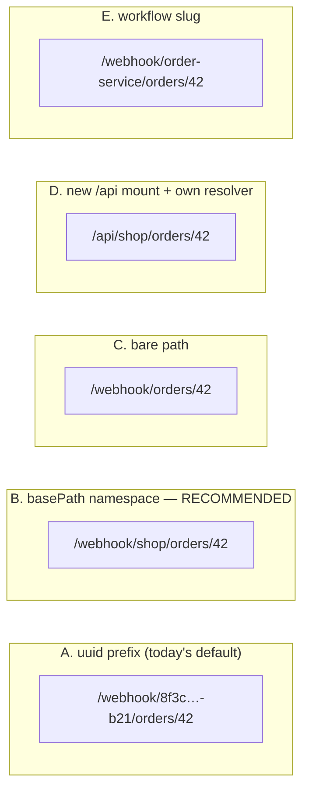
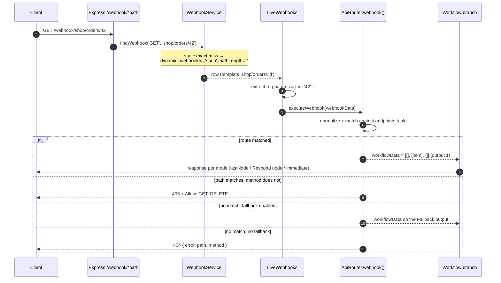
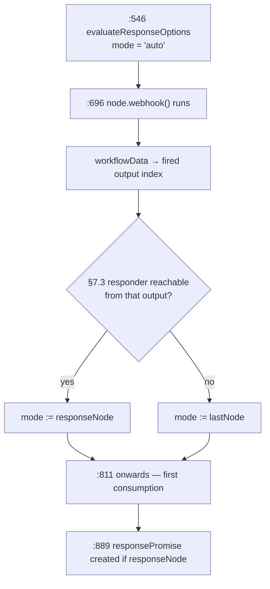

# API Router — design

Status: **implemented** on `poc/ui-builder`, uncommitted. Research citations in
§2 describe the code *as it was before* these changes; §5 and §7 describe what
now exists. Anything unconfirmed is marked **unverified**.

Built: the `namespace` + `routes` platform additions (§5.1, §5.2), the
`findAccessControlOptions` fix (§5.3), the `auto` response mode and its runtime
fallback (§7), the `webhook_entity` migration, and the `ApiRouter` node with
route matching, auth, CORS, OpenAPI import/export and ajv validation.

Not built, deliberately: §5.5 (cosmetic alias mount) and all editor-side work —
per-endpoint URL display, copy-as-curl and the availability lint (§8 ideas 1, 2,
5) — which belong in `packages/frontend` and were out of scope for this pass.

**Decisions taken at review:**

1. Both platform changes approved — §5.1 (`namespace` + the `webhook_entity`
   migration, including the pre-existing unprefixed-dynamic-path defect) and
   §5.2 (`routes` fan-out).
2. **The router owns `basePath/*`.** Any unmatched path under the namespace
   reaches the node and leaves via the Fallback output; the node answers
   404/405 itself. Catch-all registration is in scope (§5.2, §7.7).
3. **Response mode is inferred, not configured** — see §7. `Auto` is the
   default and the only mode most users will ever see.
4. The two response-mode validation sharp edges from §2.6 are resolved by §7.5
   (runtime fallback) rather than by fixing `checkResponseModeConfiguration`.

An API Router is a trigger that owns a set of HTTP endpoints (`GET /orders`,
`POST /orders`, `GET /orders/:id`) and exposes **one labelled canvas output per
endpoint**. It is meant to replace the plain Webhook node whenever a workflow
serves more than a single hook.

---

## 1. Recommendation: the URL scheme

### 1.1 The shape

```
https://<host>/webhook/<basePath>/<route>
                       ^^^^^^^^^^
                       one required, instance-unique namespace per router node
```

- `basePath` is a **required node parameter** (`shop`, `crm`, `billing/v2`).
  It may contain slashes.
- Each endpoint registers at `<basePath>/<route>`, e.g. `shop/orders`,
  `shop/orders/:id`.
- If the user leaves `basePath` empty, the node falls back to its own
  `node.webhookId` uuid. **Correct by default, pretty by choice.**

Example: `https://n8n.example.com/webhook/shop/orders/42`

### 1.2 Why this is collision-free

Collision prevention is not something the node invents — it falls out of a
constraint the platform already enforces. `webhook_entity` has a composite
primary key on `(webhookPath, method)`, instance-global, with no workflow or
project component:

- `packages/@n8n/db/src/entities/webhook-entity.ts:10-14` — `@PrimaryColumn()
  webhookPath` + `@PrimaryColumn({ type: 'text' }) method`.
- `packages/@n8n/db/src/migrations/postgresdb/1589476000887-WebhookModel.ts:6` —
  `CONSTRAINT "PK_…" PRIMARY KEY ("webhookPath", "method")`.

So every registered path is unique across the instance, enforced by the
database and therefore also across multi-main processes
(`packages/cli/src/webhooks/webhook.service.ts:215-216` says exactly this).

That gives all three required guarantees for free:

| Conflict | Caught by |
| --- | --- |
| Two API Routers in one workflow with the same `basePath` | in-memory pre-flight at publish, `webhook.service.ts:466-487`, plus the PK |
| Two API Routers in **different** workflows | cross-workflow pre-flight `webhook.service.ts:489-500`, plus the PK at insert |
| API Router vs. a plain Webhook node on the same path | same PK — they share one row space |

Failure is a publish-time `ConflictError`
(`packages/cli/src/workflows/workflow.service.ts:753-763`) or
`WebhookPathTakenError` at registration
(`packages/workflow/src/errors/webhook-taken.error.ts:6`: *"The URL path that
the "X" node uses is already taken. Please change it to something else."*).
Never a silent mis-route, never a runtime surprise.

### 1.3 The trade-off, stated honestly

**`basePath` is an instance-global namespace that anyone can claim.** Two teams
in the same n8n instance both wanting `api` will race, and the loser has to
rename — which changes a URL they may already have handed out. That is the price
of a short URL. A uuid never collides precisely because it is meaningless.

I think this is the right trade because:

- the failure is **loud, early and actionable** (publish-time, names the node,
  names the conflicting workflow) rather than silent;
- namespaces are already how every API gateway works, and users understand
  "that name is taken";
- the uuid escape hatch is always there for anyone who doesn't care about the URL.

Mitigation (see §8, UX idea 2): a design-time availability check in the NDV so
"taken" is discovered while typing, not at publish.

### 1.4 What this needs from the platform

**One change.** Today, a webhook path containing `:param` segments *must* be
served at `/webhook/<node-uuid>/…` — the resolver hard-requires it. Details and
the proposed fix are in §5.1. Static-only routers work today with no change at
all.

### 1.5 Alternatives considered and rejected



**A — uuid prefix (`/webhook/<node-uuid>/orders/:id`).** What the platform does
today for dynamic paths (`packages/workflow/src/node-helpers.ts:1132-1136`
force-prefixes the uuid). Rejected on aesthetics — but also **it does not
actually work for this node**: see §4.2, two routers with the same route *shape*
collide on the PK even though their URLs differ, because dynamic templates are
stored **without** the uuid prefix. So A is both ugly and broken for our case.

**C — bare path (`/webhook/orders/:id`).** Beautiful, and the collision surface
is the entire instance for a name as generic as `orders`. Rejected: the first
two teams to build an orders API break each other. Also, `:param` paths cannot
be served un-prefixed at all today (§4.2).

**D — new top-level mount with its own resolver.** Tempting: total control over
matching, own uniqueness domain, zero regression risk to the Webhook node.
Rejected because it forks the parts you least want two of — registration,
activation/deactivation, leadership change, cache invalidation, multi-main
serialization, the test-webhook lifecycle. Also `/api` is already the Public API
(`packages/@n8n/config/src/configs/public-api.config.ts:11`, mounted at
`/api/v1`), so it would need a worse prefix anyway. A *cosmetic alias mount* is
cheap and separable — see §5.4.

**E — workflow slug (`/webhook/<workflow-slug>/…`).** A new instance-wide
uniqueness domain (slug column, rename handling, reserved words) that buys
exactly what `basePath` already buys, while coupling the public URL to the
workflow's name. Rejected as redundant. Note there is **no** project or workflow
scoping of webhook URLs today (`projectId` appears in `packages/cli/src/webhooks/`
only as execution context, never in a path or key).

---

## 2. Findings: how the platform behaves today

### 2.1 Registration and storage

`WebhookService.getNodeWebhooks` (`packages/cli/src/webhooks/webhook.service.ts:317-425`)
turns a node into `IWebhookData[]`:

1. Iterates **`nodeType.description.webhooks`** — `webhook.service.ts:338`.
2. Resolves `path`, `isFullPath`, `restartWebhook`, `httpMethod` via
   `evaluateDescriptionProperty` (`:433-451`), which tries a native resolver
   first and falls back to `workflow.expression.getSimpleParameterValue`.
3. Builds the stored path with `NodeHelpers.getNodeWebhookPath`
   (`packages/workflow/src/node-helpers.ts:1096-1121`).
4. **Fans out over methods**: `String(webhookMethods).split(',')` — `:408-421`.

Path assembly (`node-helpers.ts:1105-1119`):

```ts
if (restartWebhook === true) return path;                    // raw, unprefixed
if (node.webhookId === undefined) {
  webhookPath = `${workflowId}/${nodeName.toLowerCase()}/${path}`;
} else {
  if (isFullPath === true) return path || node.webhookId;    // user path IS the URL
  webhookPath = `${node.webhookId}/${path}`;
}
```

Every user-facing trigger sets `isFullPath: true` — Webhook
(`packages/nodes-base/nodes/Webhook/description.ts:29`), Form
(`packages/nodes-base/nodes/Form/v2/FormTriggerV2.node.ts:65,75`), MCP
(`packages/@n8n/nodes-langchain/nodes/mcp/McpTrigger/McpTrigger.node.ts:139,149,159`).
That is precisely why user paths land in one flat global namespace.

Rows are written by `WebhookTriggerRegistrar.normalizeWebhookPath`
(`packages/cli/src/workflows/triggers/webhook-trigger-registrar.ts:257-272`) and
its legacy twin (`packages/cli/src/active-workflow-manager.ts:174-184`):

```ts
if ((webhookPath.startsWith(':') || webhookPath.includes('/:')) && nodeWebhookId) {
  webhook.webhookId = nodeWebhookId;
  webhook.pathLength = webhook.webhookPath.split('/').length;
}
```

**The uuid is not part of `webhookPath`.** It lives in the `webhookId` column;
`pathLength` is the template's segment count.

### 2.2 Resolution

Express mounts a catch-all of arbitrary depth:
`this.app.all('/${this.endpointWebhook}/*path', …)` —
`packages/cli/src/abstract-server.ts:250-253`. Array segments are re-joined at
`packages/cli/src/webhooks/webhook-request-handler.ts:293-296`.

`WebhookService.findWebhook` (`webhook.service.ts:210-212`) is two-phase:

1. **Static** — cache, then `findOneBy({ webhookPath: path, method })`
   (`:66-99`). Exact string match on the whole path.
2. **Dynamic** — `:196-208`:
   ```ts
   const [uuidSegment, ...otherSegments] = path.split('/');
   const dynamicWebhooks = await this.webhookRepository.findBy({
     webhookId: uuidSegment, method, pathLength: otherSegments.length,
   });
   return this.pickMatchingTemplate(dynamicWebhooks, new Set(otherSegments)) ?? null;
   ```

There is **no regex**. Matching is (a) first segment equals the `webhookId`
column, (b) exact segment-count match, (c) most-static-segments-wins via
`pickMatchingTemplate` (`:172-190`), with an all-wildcard template as fallback.

Path params are extracted afterwards in
`packages/cli/src/webhooks/live-webhooks.ts:102-112`:

```ts
const pathElements = path.split('/').slice(1);           // drop the uuid
webhook.webhookPath.split('/').forEach((ele, index) => {
  if (ele.startsWith(':')) request.params[ele.slice(1)] = pathElements[index];
});
```

Trailing slash: a single trailing `/` is stripped before lookup
(`live-webhooks.ts:273-276`); paths are otherwise byte-exact and
case-**sensitive**.

### 2.3 Collision detection: three points, all at publish/activation

1. **Pre-flight** — `workflow.service.ts:830` → `webhookService.findWebhookConflicts`
   (`webhook.service.ts:516-525`), reporting both intra-workflow duplicates
   (`:470-487`) and cross-workflow takeovers (`:489-500`). Throws `ConflictError`
   with a JSON payload of `{trigger, conflict}` (`workflow.service.ts:753-763`).
2. **Insert** — `storeWebhook` (`:214-249`) inserts on the PK; on violation it
   re-reads the row and throws `WebhookPathTakenError` if it belongs to another
   workflow, or refreshes it if it's a stale row of the same workflow.
3. **Registrar** — `webhook-trigger-registrar.ts:106-110` converts a raw
   `QueryFailedError` into `WebhookPathTakenError`.

Nothing is checked at *save*; nothing is checked at *first request*.
`WebhookPathTakenError` is explicitly non-retryable
(`packages/cli/src/workflows/triggers/trigger-activation-retry.ts:11`).

### 2.4 The `webhooks` array is static per node type

Definitive. Every read site is
`nodeTypes.getByNameAndVersion(node.type, node.typeVersion).description.webhooks`,
i.e. the shared singleton node-type object: `webhook.service.ts:330,338`,
`live-webhooks.ts:224`,
`packages/core/src/execution-engine/node-execution-context/utils/webhook-helper-functions.ts:21,23`,
`packages/cli/src/modules/mcp/tools/webhook-utils.ts:54`. None mutate it.

There is **no** `getWebhooks()` node method. `INodeType`
(`packages/workflow/src/interfaces.ts:2384-2441`) has `webhook?()` — the *request
handler* — and `webhookMethods?` (`:2424-2428`, only `checkExists|create|delete`).
Nothing returns descriptions.

`path` **cannot** fan out: an array return is flattened by
`nodeWebhookPath.toString().trim()` (`webhook.service.ts:357`), so `['a','b']`
becomes the single path `"a,b"`. `undefined`/`null` skips the webhook with an
error log (`:349-355`).

`httpMethod` **can** fan out — `String(webhookMethods).split(',')` (`:408`).
This is how the Webhook node's multi-method mode produces N rows from one
description (`packages/nodes-base/nodes/Webhook/Webhook.node.ts:96-132`,
`description.ts:31`).

So today: **N paths per node instance is not expressible**, only N methods per
path. Existing nodes work around it with a fixed set of descriptions — MCP
declares 3 (`McpTrigger.node.ts:134-164`), Wait 3
(`packages/nodes-base/nodes/Wait/Wait.node.ts:285-311`), Form 2
(`packages/nodes-base/nodes/Form/Form.node.ts:310-329`).

### 2.5 Dynamic labelled outputs on a trigger: already shipped

`INodeTypeDescription.outputs` accepts an `ExpressionString`
(`packages/workflow/src/interfaces.ts:2932`, `:2843`), evaluated by
`getNodeOutputs` (`packages/workflow/src/node-helpers.ts:1192-1246`) with
`$parameter` and `$nodeVersion` in scope but **no run data**
(`packages/workflow/src/workflow-expression.ts:204`). Labels come from
`INodeOutputConfiguration.displayName` (`interfaces.ts:2834-2841`); the parallel
`outputNames?: string[]` is static-only and unread by the backend.

The idiom is to stringify a self-contained pure function:

```ts
outputs: `={{(${configuredOutputs})($parameter)}}`   // SwitchV3.node.ts:61
```

A webhook node routes to a specific output by returning a 2-D
`workflowData` (`interfaces.ts:3117-3121`), which
`packages/cli/src/webhooks/webhook-helpers.ts:436-446` assigns **whole** to
`IExecuteData.data.main` and
`packages/core/src/execution-engine/workflow-execute.ts:1420-1426` passes
through verbatim.

**The Webhook node already does exactly this** — `group: ['trigger']`
(`Webhook.node.ts:51`), dynamic outputs (`:74`), and
`packages/nodes-base/nodes/Webhook/utils.ts:117-128` placing the item at a
computed index in an array of empty arrays. No trigger-specific single-output
special-casing exists in `packages/workflow` or `packages/cli`.

Caveat: **pin data collapses to output 0** —
`workflow-execute.ts:1830-1833` (`nodeSuccessData = [nodePinData]`) and
`packages/core/src/execution-engine/partial-execution-utils/recreate-node-execution-stack.ts:133-134`
(pinned branch ignores `outputIndex`).

### 2.6 How a webhook responds

Response mode is resolved from the **webhook description**, before the node's
`webhook()` runs, via the same `evaluateDescriptionProperty` path
(`packages/cli/src/webhooks/webhook-execution-context.ts:32-68`). The valid set
is `onReceived | lastNode | responseNode | formPage | streaming | hostedChat`
(`webhook-helpers.ts:546-559`); `formPage`/`hostedChat` are injected by
`autoDetectResponseMode` (`:208`) and are not user-selectable.

The four that matter here:

| Mode | Who answers | Where |
| --- | --- | --- |
| `onReceived` | the platform, immediately, before the workflow runs | `webhook-helpers.ts:811`, `:1012-1042` |
| `lastNode` | the platform, from the last executed node's data | `:1032`, `:1069-1075` |
| `responseNode` | a `Respond to Webhook` node anywhere downstream | `:890-896`, `:1046-1050` |
| `streaming` | the node writes chunked headers itself | `Webhook.node.ts:330-348` |

`lastNode` uses `WorkflowHelpers.getLastExecutedNodeData(runData)`
(`packages/cli/src/workflow-helpers.ts:81-93`) — i.e. `resultData.lastNodeExecuted`,
reading `main[0]` only unless `checkAllMainOutputs` is set, which is hardcoded
to the Chat Trigger (`webhook-helpers.ts:1161`). Shape is chosen by
`responseData` (`allEntries | firstEntryJson | firstEntryBinary | noData`) and
extracted in `packages/cli/src/webhooks/webhook-last-node-response-extractor.ts`.

**Answering the "how do webhooks return" question directly:** there is no third
mechanism. `Respond to Webhook` is the explicit one; `lastNode` is the implicit
one; `onReceived` is the fire-and-forget one; `streaming` is a variant of the
node answering inline. For a router, **`lastNode` is the right default** — one
branch runs per request, so its terminal node *is* `lastNodeExecuted`, and the
user gets "return whatever the branch ends with" for free. `Respond to Webhook`
stays available for status codes/headers and early returns.

Two sharp edges for a multi-branch trigger:

- `checkResponseModeConfiguration` (`packages/nodes-base/nodes/Webhook/utils.ts:205-256`)
  validates against **all** descendants via `getChildNodes(name)`, which takes no
  output index (`packages/core/src/execution-engine/node-execution-context/node-execution-context.ts:106`).
  So "3 of my 8 branches have a Respond node" passes validation.
- A `responseNode` branch with no Respond node does **not** hang: on completion
  `packages/cli/src/active-executions.ts:277-278` resolves the response promise
  with `{}`. Silent empty 200.

Both are addressed in §7.

### 2.7 Auth, CORS, body handling — what is reusable

**Auth is fully reusable.** `packages/nodes-base/nodes/Webhook/description.ts`
exports `authenticationProperty(propertyName, includeN8nOAuth2)` (`:80`),
`credentialsProperty(propertyName)` (`:43`, wiring `httpBasicAuth` /
`httpHeaderAuth` / `jwtAuth`), and `utils.ts:258-379` exports
`validateWebhookAuthentication(ctx, authPropertyName)` which takes the property
name as an argument. Errors are `WebhookAuthorizationError`
(`packages/nodes-base/nodes/Webhook/error.ts`). Three nodes already reuse these
(Form, Wait, MCP Trigger).

**CORS is entirely in the CLI, and it will not work for this node as-is.**
`webhook-request-handler.ts:181-231` handles preflight and headers; `OPTIONS`
short-circuits at `:60-62` so the node is never invoked. The allowlist is read
by `live-webhooks.ts:69-77`, which finds the node by string-comparing raw
parameters:

```ts
parameters?.path === path && (parameters?.httpMethod ?? 'GET') === httpMethod
```

An API Router has no top-level `path` parameter equal to the request path, so
`allowedOrigins` would be **silently dropped**. Fix in §5.3. (Note the Webhook
node doesn't expose `allowedOrigins` at all — only the Chat Trigger does,
`ChatTrigger.node.ts:84`.)

**Body handling splits CLI/node.** The CLI pre-parses:
`parseRequestBody` (`webhook-helpers.ts:1190-1235`) handles JSON, text, form-urlencoded
and XML, and routes `multipart/form-data` to
`packages/cli/src/webhooks/webhook-form-data.ts`. The node materializes binaries:
`handleFormData` is exported (`Webhook/utils.ts:381-444`) but `handleBinaryData`
is a **private class method** (`Webhook.node.ts:360-400`) — it has no `this`
dependency and should be lifted into `utils.ts` for reuse.

**Not reusable as-is:** `optionsProperty` (`description.ts:299-497`) hardcodes
`/httpMethod`, `/responseMode`, `/responseData` sibling refs and `@version: [1]`
gates; `configuredOutputs`/`setupOutputConnection` (`utils.ts:69`, `:90`)
hardcode `getNodeParameter('httpMethod')` and `getNodeWebhookUrl('default')`;
`checkResponseModeConfiguration` hardcodes node type ids.

---

## 3. Request → match → output



---

## 4. Route matching semantics

The node owns matching; the platform only delivers the request into the router's
namespace. Spelled out so it is testable:

**Normalization (both at config time and request time).**
1. Strip a leading `/` and a single trailing `/`. The platform already strips one
   trailing slash before lookup (`live-webhooks.ts:273-276`) and both ends at
   registration (`webhook.service.ts:358-363`).
2. Split on `/`; percent-decode **each segment after splitting**, so an encoded
   `%2F` never creates a segment.
3. Drop empty segments produced by `//`.
4. Query string is never part of matching.

**Case.** Path segments are case-**sensitive** (matching HTTP and the platform's
exact-match lookup). Methods are uppercased before comparison. Header names are
lowercased by Node.

**Precedence**, evaluated in order, first win:
1. Exact static match: `/orders/new` beats `/orders/:id`.
2. Otherwise, most static segments wins; ties broken by leftmost static segment.
3. Single-segment param `:name`.
4. Trailing catch-all `*rest` (if we support it — see open question 4), lowest.
5. Fallback output.

**Method.** Matching is path-first, then method. If a path pattern matches but no
endpoint declares the method, return **405** with an `Allow` header listing the
methods that *are* declared for that path. Only a total path miss is **404**.
This is strictly better than the platform's behaviour, which returns 404 for a
wrong method with a hint string
(`packages/cli/src/errors/response-errors/webhook-not-found.error.ts:28`).

**Config-time errors, surfaced at publish:**
- two endpoints normalizing to the same `(method, shape)` — `/orders/:id` and
  `/orders/:orderId` are the same shape;
- a param name repeated within one route;
- `basePath` empty *and* the uuid fallback disabled;
- `basePath` containing `:` or `*`.

**Shadowing**, surfaced as a warning not an error: `/orders/:id` declared before
`/orders/new` still routes correctly (rule 1), but the editor should say so.

### 4.1 Item shape

```ts
{
  route:   { name: 'Get order', method: 'GET', path: '/orders/:id' },
  params:  { id: '42' },
  query:   { include: 'items' },
  body:    { … },
  headers: { … },
  webhookUrl: 'https://…/webhook/shop/orders/:id',
  executionMode: 'production' | 'test',
}
```

Matches the Webhook node's `{headers, params, query, body}` core
(`Webhook.node.ts:313-328`) plus `webhookUrl`/`executionMode`
(`utils.ts:90-129`), so expressions written against a Webhook node keep working.
`route` is the addition. Declare
`sensitiveOutputFields: ['headers.authorization', 'headers.cookie']` as the
Webhook node does (`Webhook.node.ts:77`).

### 4.2 The blocker: `:param` paths are pinned to a uuid first segment

Two facts, both load-bearing:

**(a) The dynamic resolver keys on the first URL segment being the `webhookId`
column value.** `webhook.service.ts:197-203` splits the request path and queries
`findBy({ webhookId: uuidSegment, method, pathLength })`. `basePath = 'shop'`
produces rows whose `webhookId` is the node uuid, so `shop/orders/42` looks up
`webhookId = 'shop'` and finds nothing. A `:param` route cannot be served under
a non-uuid prefix.

**(b) Dynamic templates are stored *without* their prefix, so the global PK
applies to the bare template.** `normalizeWebhookPath`
(`webhook-trigger-registrar.ts:257-272`) stores `webhookPath = 'orders/:id'` and
puts the uuid in the `webhookId` column. Two workflows each with a Webhook node
at `orders/:id` therefore collide on `PK (webhookPath, method)` **even though
their URLs differ by uuid**.

(b) is a pre-existing defect, not something the API Router introduces. It is
also inconsistent with the pre-flight detector, which keys on the uuid-prefixed
path (`getWebhookPath`, `webhook.service.ts:308-312`) and so reports *no*
conflict for a pair that the insert will reject. I did not find a test covering
two workflows with identical dynamic templates — **unverified end-to-end**, but
the code path is unambiguous.

Both are fixed by the same change.

---

## 5. Proposed platform changes

### 5.1 `webhookId` becomes a namespace key; `webhookPath` becomes the real URL path

**The change.** Store the full post-prefix URL path in `webhookPath`, and treat
the `webhookId` column as "the first path segment" rather than "the node's uuid".

Add one expression-capable field to the webhook description:

```ts
export interface IWebhookDescription {
  // …
  /**
   * First path segment, used as the routing namespace for paths with `:param`
   * segments. Defaults to the node's `webhookId`, which is what every node
   * relied on implicitly before this field existed.
   */
  namespace?: string;
}
```

`packages/workflow/src/interfaces.ts:3030-3046`. The index signature at `:3031`
already admits extra fields, so this is purely a documentation/typing addition.

**Registration** (`webhook-trigger-registrar.ts:257-272`, and the twin at
`active-workflow-manager.ts:174-184`):

```ts
const namespace = resolvedNamespace ?? nodeWebhookId;
if (isDynamic(webhook.webhookPath) && namespace) {
  if (!webhook.webhookPath.startsWith(`${namespace}/`)) {
    webhook.webhookPath = `${namespace}/${webhook.webhookPath}`;
  }
  const [first, ...rest] = webhook.webhookPath.split('/');
  webhook.webhookId = first;
  webhook.pathLength = rest.length;
}
```

`pathLength` semantics are **unchanged**: today it is `split(bare).length`, which
already equals `rest.length` after prefixing. That is what makes this migratable
with a single `UPDATE`.

**Blast radius** — 7 files plus one migration:

| File | Change |
| --- | --- |
| `packages/workflow/src/interfaces.ts:3030` | add `namespace?` |
| `packages/workflow/src/node-helpers.ts:1096-1141` | `getNodeWebhookPath` returns the namespaced path; drop the `isFullPath=false` override at `:1132-1136` when a namespace is present |
| `packages/cli/src/workflows/triggers/webhook-trigger-registrar.ts:257-272` | as above |
| `packages/cli/src/active-workflow-manager.ts:174-184` | legacy twin, same |
| `packages/@n8n/db/src/entities/webhook-entity.ts:33-45` | `staticSegments` skips segment 0; `uniquePath`/`cacheKey` stop re-joining `webhookId` |
| `packages/cli/src/webhooks/live-webhooks.ts:102-112` | param extraction iterates `webhookPath.split('/').slice(1)` |
| `packages/cli/src/webhooks/webhook.service.ts:308-312` | `getWebhookPath` returns `webhook.path` unchanged |
| `packages/cli/src/webhooks/test-webhook-registrations.service.ts:113-127` | dynamic `toKey` uses the same slice |
| new migration | `UPDATE webhook_entity SET "webhookPath" = "webhookId" \|\| '/' \|\| "webhookPath" WHERE "webhookId" IS NOT NULL` |

**What it buys beyond the API Router:** dynamic templates become per-namespace
unique instead of instance-globally unique, which fixes §4.2(b) and removes the
pre-flight/insert disagreement. Storage and the public URL finally agree.

**Risk:** this touches live routing for every existing webhook with a `:param`
path. It needs the migration to be exactly right and integration coverage of the
Webhook node's dynamic paths before and after. This is the single riskiest item
in the plan.

### 5.2 `routes` — the fan-out API that makes N endpoints clean

Without this, "N endpoints" has to be faked. The two fakes and why they lose:

- **Fixed pool of descriptions** (say 30, path `={{…endpoints[7].path}}`). Every
  unused slot resolves to `undefined` and logs an error on *every* registration
  *and* every request (`webhook.service.ts:350`, re-entered from
  `live-webhooks.ts:148`). 30 dead entries ship in every node-type payload.
  Hard cap. Reject.
- **Depth-bucketed catch-alls alone** — register `shop/:s1`, `shop/:s1/:s2`, …
  up to a fixed depth, all methods, and match inside the node. This *works*
  (given §5.1) and needs no new node API. But CORS preflight over-advertises
  every method (`getWebhookMethods` reads rows,
  `webhook-request-handler.ts:190-192`), the NDV can't derive per-endpoint URLs
  from descriptions, and **`responseMode`/`responseCode`/`responseData` are
  per-description**, so a shared catch-all cannot vary them per endpoint.

Per decision 2 the catch-alls are still registered — but *underneath* the exact
routes, purely to claim the subtree (§7.7). They are the fallback layer, not the
routing mechanism. The clean version of the routing mechanism:

```ts
export interface IWebhookRoute {
  path: string;
  httpMethod: IHttpRequestMethods | IHttpRequestMethods[];
  responseMode?: WebhookResponseMode;
  responseCode?: number;
  responseData?: WebhookResponseData;
}

export interface IWebhookDescription {
  // …
  /**
   * Expression resolving to `IWebhookRoute[]`. When present, `path` and
   * `httpMethod` on this description are ignored and one webhook is registered
   * per route, each with a description synthesized from this one.
   */
  routes?: string;
}
```

Implementation is ~20 lines in `getNodeWebhooks` (`webhook.service.ts:338-422`):
when `routes` resolves to an array, loop it and push one `IWebhookData` per
`(route, method)` with

```ts
webhookDescription: { ...baseDescription, ...route }
```

— a **synthesized per-route description**, not the shared reference used today
(`:415`). That single detail makes everything downstream work unchanged:
`WebhookExecutionContext` (`webhook-execution-context.ts:32-68`) re-reads
`responseMode`/`responseCode`/`responseData` from `webhookDescription`, so
per-endpoint response modes fall out for free.

Authoring uses the existing `fromFunction` helper
(`packages/workflow/src/webhook-description-fields.ts:67-74`), so the frontend
resolves the same template the backend resolves natively.

**Blast radius:** one function in `webhook.service.ts`, one interface in
`packages/workflow`. Additive — no existing node has `routes`, so nothing
changes for them. Much smaller and safer than §5.1.

**Deliberately not proposed:** widening `WebhookType` from `'default' | 'setup'`
(`interfaces.ts:3006`) to `string` so `getWebhookName()` identifies the route.
It would touch the `webhookMethods` record keying for marginal benefit — the
node can re-match the request path itself.

### 5.3 Fix `findAccessControlOptions` so CORS works for non-trivial nodes

`live-webhooks.ts:69-77` finds the node by string-comparing raw parameters
against the request path. Replace with a resolution through
`findTriggerWebhooksByPath` (`webhook.service.ts:120-138`), which already exists
and already does correct static-then-dynamic selection, then read `options` off
the resolved node. Small, self-contained, and fixes CORS for every
expression-path or multi-method node — not just this one.

### 5.4 Dropped: `getChildNodes(name, { outputIndex })`

Proposed in the first draft so the node could answer "is there a Respond node on
this output?". **No longer needed** — §7 puts the inference in the platform,
which already holds the full `Workflow` at the decision point, so the node never
has to see the graph. `node-execution-context.ts:106` stays as it is.

### 5.5 Optional: cosmetic alias mount

Adding `this.app.all('/${this.endpointApi}/*path', createWebhookHandlerFor(liveWebhooks, 'api'))`
next to the MCP mount (`abstract-server.ts:284`) plus `nodeType: 'api'` on the
description gives `https://host/<prefix>/shop/orders/42` with **zero** new
resolution logic — the `nodeType` discriminator
(`packages/cli/src/webhooks/node-type-matcher.ts:5-10`) already gates which
prefix serves which node. Three lines plus a config field.

**Do not default it to `api`** — the Public API owns `/api/v1`
(`public-api.config.ts:11`) and ordering-dependent Express matches there would
be a maintenance trap. Ship behind `N8N_ENDPOINT_API_ROUTER`, default unset,
i.e. `/webhook/` remains the only mount unless an operator opts in.

---

## 6. Node description sketch

```ts
type ApiRouterEndpoint = {
  name?: string;                 // output label override; defaults to `${method} ${path}`
  method: IHttpRequestMethods;
  path: string;                  // '/orders', '/orders/:id'
  authentication?: 'inherit' | 'none';
  responseMode?: 'inherit' | 'onReceived' | 'lastNode' | 'responseNode';
  requestSchema?: string;        // JSON Schema, populated by OpenAPI import
};

const configuredOutputs = (parameters: { endpoints?: { endpoint?: ApiRouterEndpoint[] };
                                          options?: { fallbackOutput?: boolean } }) => {
  const endpoints = parameters.endpoints?.endpoint ?? [];
  const outputs = endpoints.map((e) => ({
    type: 'main',
    displayName: e.name || `${e.method} ${e.path}`,
  }));
  if (parameters.options?.fallbackOutput) {
    outputs.push({ type: 'main', displayName: 'Fallback' });
  }
  return outputs.length ? outputs : [{ type: 'main', displayName: 'No endpoints' }];
};

const configuredRoutes = (parameters) => {
  const base = (parameters.basePath ?? '').replace(/^\/|\/$/g, '');
  return (parameters.endpoints?.endpoint ?? []).map((e) => ({
    path: [base, e.path.replace(/^\//, '')].filter(Boolean).join('/'),
    httpMethod: e.method,
    responseMode: e.responseMode === 'inherit' ? undefined : e.responseMode,
  }));
};

export class ApiRouter implements INodeType {
  description: INodeTypeDescription = {
    displayName: 'API Router',
    name: 'apiRouter',
    group: ['trigger'],
    version: 1,
    defaults: { name: 'API Router' },
    inputs: [],
    outputs: `={{(${configuredOutputs})($parameter)}}`,
    supportsCORS: true,
    sensitiveOutputFields: ['headers.authorization', 'headers.cookie'],
    credentials: credentialsProperty('authentication'),   // reused verbatim
    webhooks: [
      {
        name: 'default',
        isFullPath: true,
        namespace: '={{$parameter["basePath"]}}',          // §5.1
        ...webhookDescriptionFields({
          routes: fromFunction(configuredRoutes),          // §5.2
          responseMode: fromParameter('responseMode'),
          responseCode: fromFunction(getResponseCode),
          responseData: fromFunction(getResponseData),
        }),
      },
    ],
    properties: [
      { displayName: 'Base Path', name: 'basePath', type: 'string', default: '',
        placeholder: 'shop',
        description: 'URL namespace for every endpoint. Leave empty for a unique random path.' },

      { displayName: 'Endpoints', name: 'endpoints', type: 'fixedCollection',
        typeOptions: { multipleValues: true, sortable: true },
        default: { endpoint: [{ method: 'GET', path: '/' }] },
        options: [{ name: 'endpoint', displayName: 'Endpoint', values: [
          { displayName: 'Method', name: 'method', type: 'options', default: 'GET',
            options: HTTP_METHODS },
          { displayName: 'Path', name: 'path', type: 'string', default: '/',
            placeholder: '/orders/:id' },
          { displayName: 'Name', name: 'name', type: 'string', default: '' },
          { displayName: 'Authentication', name: 'authentication', type: 'options',
            default: 'inherit', options: [/* inherit | none */] },
          { displayName: 'Respond', name: 'responseMode', type: 'options',
            default: 'inherit', options: [/* inherit | auto | onReceived | streaming */] },
        ] }] },

      authenticationProperty('authentication'),            // reused verbatim
      { displayName: 'Respond', name: 'responseMode', type: 'options',
        default: 'auto', options: [/* auto | onReceived | streaming */] },   // §7.7

      { displayName: 'Options', name: 'options', type: 'collection', default: {}, options: [
        { displayName: 'Allowed Origins (CORS)', name: 'allowedOrigins', type: 'string', default: '*' },
        { displayName: 'Fallback Output', name: 'fallbackOutput', type: 'boolean', default: false },
        { displayName: 'Validate Requests', name: 'validateRequests', type: 'boolean', default: false },
        { displayName: 'Serve OpenAPI Spec', name: 'serveSpec', type: 'boolean', default: false },
        { displayName: 'IP(s) Allowlist', name: 'ipWhitelist', type: 'string', default: '' },
        { displayName: 'Raw Body', name: 'rawBody', type: 'boolean', default: false },
      ] },
    ],
  };

  async webhook(context: IWebhookFunctions): Promise<IWebhookResponseData> {
    // 1. validateWebhookAuthentication(context, 'authentication')  — reused
    // 2. isIpAllowed(...)                                          — reused
    // 3. normalize + match request path → endpoint index | 405 | 404 | fallback
    // 4. optional JSON Schema validation → 400
    // 5. build item, place at outputs[index], return { workflowData }
  }
}
```

Notes on the sketch:

- `responseMode: auto` is the default and resolves per request from the fired
  branch's graph — see §7. It only works because §5.2 synthesizes a description
  per route.
- Per-endpoint auth is `inherit | none` only. Credentials are keyed by **type**
  on the node (`credentialsProperty`, `description.ts:43-73`), so two different
  header-auth credentials on one node is not expressible. Per-endpoint *schemes*
  would need one credential slot per scheme; out of scope.
- Reordering endpoints reorders outputs, which **breaks existing canvas
  connections** — connections are stored by output index
  (`workflow-execute.ts:519`). The editor must remap on reorder, or reordering
  must be forbidden. Flagged as a risk.

---

## 7. Response mode: inferred, not configured

**Verdict: yes, auto is safe as the default — but only paired with a runtime
fallback.** Static graph analysis alone is *not* safe, and the case that kills it
is the ordinary one: a Respond node behind an IF that doesn't fire on this
request. Inference says `responseNode`, nothing responds, and the caller gets the
silent empty 200 from `active-executions.ts:277-278`. Reachable ≠ guaranteed, and
it is not merely IF/Switch — **any** node emitting zero items starves its
downstream branch (`workflow-execute.ts:711-720`), so "will the Respond node
run?" is undecidable statically.

The runtime fallback (§7.5) dissolves that entire class of imprecision, and once
it exists the inference can be deliberately *permissive*.

### 7.1 Timing — the inference window exists

Response mode is resolved from the description **before** the node runs, at
`packages/cli/src/webhooks/webhook-helpers.ts:546` (`evaluateResponseOptions`).
But it is not **consumed** until much later. Scanning `:546-815`, the only
occurrences are the validity check at `:550-557` and:

```ts
const shouldDeferOnReceivedResponse = responseMode === 'onReceived' && !didSendResponse;  // :811
```

Meanwhile the node's `webhook()` runs at `:696`
(`WebhookService.runWebhook`) and returns `webhookResultData`, whose
`workflowData` **is** the output routing —
`main: webhookResultData.workflowData ?? []` at `:442`. The fired output index is
the first non-empty slot. And `responsePromise` is only created at `:889-891`,
gated on the mode.

So there is a clean window — after `:755`, before `:811` — where the fired
branch is known and the mode can still be refined. `WebhookExecutionContext`
already carries the full `Workflow` (`webhook-execution-context.ts:22`).

**Therefore the inference belongs in the platform, not the node.** This also
retires the §5.4 proposal: the node never needs to see the graph.



### 7.2 Why `routes` (§5.2) is still required

With one shared description, a per-endpoint mode is inexpressible — the
description's resolvers only see `$parameter`, never the request. §5.2's
synthesized per-route description is what lets each endpoint carry its own
`responseMode`, including the `auto` sentinel. The inference then refines `auto`
into a concrete mode using the fired index.

### 7.3 The graph analysis

`getChildNodes` **cannot** answer this. It flattens every output index —
`connections[nodeName][type].forEach((connectionsByIndex) => …)`
(`packages/workflow/src/common/get-connected-nodes.ts:83-84`) — and, taking only
`IConnections`, never sees `disabled`. Nothing in `packages/workflow` is
output-index aware for downstream traversal.

`DirectedGraph` is. `GraphConnection` carries `outputIndex`
(`packages/core/src/execution-engine/partial-execution-utils/directed-graph.ts:5-11`),
`getDirectChildConnections` exposes it (`:216-231`), `getChildren` is cycle-safe
via a visited set (`:233-244`), and `filterDisabledNodes` rewires around disabled
nodes (`filter-disabled-nodes.ts:5-18`). It is exported from `n8n-core`
(`packages/core/src/execution-engine/index.ts:103`) and already used in
`packages/cli` (`manual-execution.service.ts:74`,
`workflow-execution.service.ts:603`).

The predicate:

```
hasResponder(workflow, triggerNode, firedOutputIndex):
  graph = filterDisabledNodes(DirectedGraph.fromWorkflow(workflow))
  frontier = graph.getDirectChildConnections(triggerNode)
              .filter(c => c.type === 'main' && c.outputIndex === firedOutputIndex)
  BFS from frontier over main edges, visited set:
    - node type ∈ WEBHOOK_RESPONSE_NODE_TYPES        → true
    - node type is Execute Workflow                   → do not descend (§7.4 case E)
  → false
```

Semantics I am choosing explicitly, because no existing utility chooses them:

- **Merges / shared Respond node.** If a Respond node is reachable from output 0
  *and* output 1, both endpoints infer `responseNode`. Correct: whichever fires,
  that node is on its path.
- **Reachable only via a merge from another endpoint's branch.** Still counts as
  reachable, so we infer `responseNode`. Over-inference — free, per §7.6.
- **Loops.** A cycle back into the trigger's subgraph is visited once. Both the
  "loop" and "done" outputs of a Loop Over Items node are followed.
- **Error outputs.** An error output is just the last `main` index with
  `category: 'error'` (`packages/workflow/src/node-helpers.ts:1222-1243`), and is
  invisible in `IConnections`. We follow it like any other edge — a Respond node
  on an error branch counts.
- **Disabled nodes.** `filterDisabledNodes` rewires through them. This is
  slightly *more* permissive than full execution, which collapses a disabled
  node to input 0 → output 0 only (`workflow-execute.ts:932-944`). Acceptable
  under the permissive bias.

### 7.4 Where it breaks

| # | Case | What happens under naive auto | Severity | Verdict |
| --- | --- | --- | --- | --- |
| A | Respond node behind an IF/Switch/Filter that doesn't fire | infers `responseNode`, nothing responds → empty 200 | **high** (common) | **inference-fatal without §7.5**; benign with it |
| B | Any upstream node returns 0 items (`workflow-execute.ts:711-720`) | same as A, but undetectable statically — no conditional node to warn on | **high** | same as A; the reason a design-time warning can't be the only guard |
| C | Multiple Respond nodes on one branch, or one inside a loop | first `resolve` wins; later ones are no-ops on a settled promise | low | benign, no action |
| D | Respond node reachable only via a merge from another endpoint's branch | infers `responseNode` for both | low | benign (over-inference) |
| E | Respond node inside an `Execute Workflow` sub-workflow | `sendResponse` hook is not registered for sub-executions (`execution-lifecycle-hooks.ts:797-817`), so it silently no-ops; parent gets the `{}` empty 200 | medium | **treat Execute Workflow as a hard boundary**; warn |
| F | Respond node on an error output | infers `responseNode`; fires only if the node errors | medium | same shape as A |
| G | Disabled Respond node | `filterDisabledNodes` removes it → infers `lastNode` | low | correct |
| H | Pinned node mid-branch | pin data doesn't block downstream, but collapses to output 0 (`workflow-execute.ts:1830-1833`) | low | manual runs only |
| I | Respond node fires but we inferred `lastNode` | `resolveResponsePromise` finds no promise and no-ops — the user's status code and headers are **silently dropped** | medium | the one failure mode of *under*-inference; drives the permissive bias |
| J | Branch hits a `Wait` node | execution status is `waiting`, `resolveExecutionResponsePromise` skips (`active-executions.ts:277`), socket stays open | — | must be preserved; see §7.5 gate |

Only A and B are inference-fatal, and only in the absence of §7.5.

### 7.5 The runtime fallback — feasible, and it fixes an existing bug

**Feasible, but it must *prevent* the empty response, not detect it.** The
ordering at `packages/cli/src/workflow-runner.ts:465-473` is decisive:

```ts
this.activeExecutions.resolveExecutionResponsePromise(executionId);   // :472  resolves {}
this.activeExecutions.finalizeExecution(executionId, fullRunData);    // :473  resolves executePromise
```

`resolveExecutionResponsePromise` (`active-executions.ts:266-281`) resolves with
`{}` **before** `finalizeExecution`, so `setupResponseNodePromise`'s handler
(`webhook-helpers.ts:323-368`) is queued first and has already called
`responseCallback` — and `process.nextTick(() => res.end())` at `:367` — by the
time the `lastNode` code at `:1052` could run. Detect-then-respond is too late.

There is also no existing "did it respond?" signal: `didSendResponse` is a local
in `webhook-helpers.ts:656`, invisible to the other closure; `IDeferredPromise`
(`packages/@n8n/utils/src/promise/deferred-promise.ts`) exposes only
`{promise, resolve, reject}` with no state; and "the Respond node ran" is not
equivalent to "it responded" — it deliberately skips `sendResponse` when
streaming and in chat `responseNodes` mode
(`RespondToWebhook.node.ts:565-576`).

As built, five edits (the `didSendResponse` guard replaced the settled-flag
sketch, and the queue twin turned out to be a separate site):

1. `IExecutingWorkflowData.didRespond?: boolean` in `packages/cli/src/interfaces.ts`.
2. `ActiveExecutions.resolveResponsePromise` sets it, and a new `hasResponded()`
   reads it. That method is the genuine `sendResponse`-hook path only, so the
   Form-redirect chain keeps working.
3. `ActiveExecutions.resolveExecutionResponsePromise` resolves `{}` only when
   `didRespond`; otherwise it leaves the promise pending so the webhook layer can
   answer. `ScalingService`'s `job-finished` handler got the same treatment —
   without it the fallback would work in `regular` mode only.
4. `executeWebhook` gained `respondOnce`, a single guarded entry point to the
   response that every path in the function now goes through, including
   `setupResponseNodePromise`. Whoever gets there first wins; a racing late
   response is dropped instead of writing to a closed socket. This is the
   idempotency guard for §9 risk 8.
5. The `responseNode` branch of the post-execution handler now bails out only
   when the Respond node actually answered (a flag set from
   `setupResponseNodePromise`) or the execution is parked on a Wait/Form leg
   (`runData.waitTill ?? runData.status === 'waiting'` — mandatory, or every
   multi-leg flow breaks, case J). Otherwise it falls through to the `lastNode`
   extraction directly below, which already has `runData`, `lastNodeTaskData`
   and every response option in scope.

The shared `@n8n/utils` deferred promise was deliberately **not** widened to
expose settled-ness: six node-execution contexts consume it.

Queue mode is affordable: `needsFullExecutionData` is evaluated at job
completion, so it consults `hasResponded()` and fetches full execution data
**only** on the rare unanswered path — the common case pays nothing.

Streaming is unaffected: it never creates a `responsePromise`
(`webhook-helpers.ts:890`) and sets `didSendResponse = true` at `:910`, skipping
the whole block. The two modes are disjoint.

**This fixes the silent empty 200 for the existing Webhook node too**, which is
sharp edge #2 from §2.6 — independent of the API Router.

### 7.6 The permissive bias

Over-inferring `responseNode` costs one extra fallback (and, in queue mode, one
DB fetch) on a request that would have been `lastNode` anyway. Under-inferring
silently discards the user's status code and headers (case I). Asymmetric — so
**any responder reachable from the fired output ⇒ `responseNode`**, no
conditionality analysis, no cleverness.

A cheaper variant, if the `DirectedGraph` work slips: use whole-node
`getChildNodes` and ignore the output index entirely. Strictly more permissive,
still correct under §7.5, and about ten lines. Worth keeping as the fallback
plan.

### 7.7 Parameter surface

Inference cannot reach `onReceived` (fire-and-forget) or `streaming` — those are
*intent*, not graph shape. So something must remain.

An earlier draft hid `lastNode` and `responseNode` behind `Auto`. **Rejected at
review: existing-user familiarity beat the simplification.** All of today's
modes stay selectable; `Auto` is added as the new default:

```ts
// node level
{ displayName: 'Respond', name: 'responseMode', type: 'options', default: 'auto',
  options: [
    { name: 'Automatically',                    value: 'auto' },
    { name: 'Immediately',                      value: 'onReceived' },
    { name: 'When Last Node Finishes',          value: 'lastNode' },
    { name: "Using 'Respond to Webhook' Node",  value: 'responseNode' },
    { name: 'Streaming',                        value: 'streaming' },
  ] }

// per endpoint — same list plus:
{ name: 'Inherit', value: 'inherit' }   // the default
```

`Auto` picks between `lastNode` and `responseNode` per request; choosing either
explicitly pins it and skips the inference. Response shaping (`Response Code`,
`Response Data`, `Property Name`) stays under Options and applies to whichever
concrete mode is in force.

`auto` needs adding to `WebhookResponseMode`
(`packages/workflow/src/interfaces.ts:3140-3147`) and to the validity list at
`webhook-helpers.ts:546-552`, where it must be resolved away before `:811`.

### 7.8 Catch-all ownership (decision 2)

Owning `basePath/*` means registering depth-bucketed all-wildcard templates
under the exact routes — `shop/:s1`, `shop/:s1/:s2`, … to a fixed depth, across
all methods. The platform's own matcher prefers them last: `pickMatchingTemplate`
scores by static-segment count (`webhook.service.ts:172-190`), and an
all-wildcard template has zero, hitting the `staticSegments.length === 0`
fallback branch at `:180-182`. So exact routes always win, and the catch-alls
only collect what nothing else claimed.

Consequences to accept: preflight over-advertises methods for catch-all-only
paths (`webhook-request-handler.ts:190-192` reads rows), and the depth cap is a
real limit. Unmatched requests reach the node, which answers 404/405 itself and
emits on the Fallback output. Response mode for the Fallback output is `auto`
like any other.

### 7.9 Knock-on: `checkResponseModeConfiguration`

Auto mode makes the per-branch problem **moot, not more urgent.** The function
(`packages/nodes-base/nodes/Webhook/utils.ts:205-256`) exists to catch two
mismatches — "`responseNode` selected but no Respond node" and "Respond node
present but another mode selected". Under `auto` neither is expressible: the mode
is derived *from* the presence of a Respond node. The API Router should simply
not call it.

Its per-branch imprecision therefore needs no fix for this node. Fixing it for
the **existing** Webhook node is now also lower priority, because §7.5 turns its
worst outcome (silent empty 200) into a correct `lastNode` response. Recommend
closing the deferred item rather than scheduling it.

---

## 8. UX ideas, ranked

Ranked by (value ÷ cost). Costs are relative, not calendar estimates.

1. **Endpoint list with live URLs + copy-as-curl.** Each row shows the resolved
   production and test URL and a curl button. *Rationale:* the reason people
   reach for a router is to hand URLs to someone else. *Cost: S.*
2. **Design-time conflict + shadowing lint.** A `GET /rest/webhooks/availability?path=`
   endpoint the NDV calls while typing `basePath`, plus in-node warnings for
   duplicate shapes, shadowed routes, and `responseNode` branches with no
   Respond node. *Rationale:* converts §1.3's main weakness — a publish-time
   namespace clash — into a typing-time nudge; also covers §2.6's silent empty
   200. *Cost: M.* **This is the one that makes the recommended URL scheme
   feel safe.**
3. **Mock responses per endpoint.** A static JSON body an endpoint returns while
   its branch is empty. *Rationale:* you can publish the URL and share the
   contract on day one, then fill in branches. This is the feature that makes
   "design your API first" real. *Cost: M.*
4. **Serve the spec at `<basePath>/openapi.json`.** A reserved route the router
   answers itself from its own configuration. *Rationale:* makes the OpenAPI
   export a live artifact instead of a download, and turns the node into
   something a consumer can point a codegen tool at. *Cost: S* once export
   exists.
5. **One-click test fire per endpoint.** Sends a sample request (built from the
   schema, if present) to the test URL. *Rationale:* the standard webhook
   "listen then go find curl" loop is the worst part of building a webhook.
   *Cost: M-L* — needs editor work.
6. **`Allow` header + accurate preflight.** Correct 405s and a preflight that
   advertises only the methods the path actually serves. *Rationale:* browsers
   are the main consumer of a hand-built API; getting CORS subtly wrong is the
   #1 support burden. *Cost: S* for 405, *M* including §5.3. Low placement only
   because it's invisible when it works.
7. **Per-endpoint max body size / rate limit.** *Rationale:* real. *Cost: L* —
   body size is enforced in the CLI parser
   (`endpoints.config.ts:138`), rate limiting doesn't exist. Out of scope here.

Deliberately **not** proposed: Postman-collection import (OpenAPI covers it), a
`/v1` versioning toggle (`basePath` already is one), per-endpoint scripting (that
is what the branch is for).

---

## 9. Implementation plan

Ordered, each chunk independently reviewable. Sizes are relative.

| # | Chunk | Depends on | Size |
| --- | --- | --- | --- |
| 1 | Extract reusable bits: lift `handleBinaryData` out of `Webhook.node.ts:360` into `utils.ts`; parameterize `configuredOutputs`/`setupOutputConnection`. Pure refactor, no behaviour change. | — | S |
| 2 | `routes` fan-out in `getNodeWebhooks` + `IWebhookRoute`/`IWebhookDescription.routes` (§5.2), with unit tests for the synthesized-description behaviour. Additive. | — | M |
| 3 | Namespace change + migration (§5.1). Integration tests for the Webhook node's dynamic paths before/after. | — | **L, risky** |
| 4 | **Runtime fallback (§7.5): `didRespond`, the two resolve-guards, the `waitTill` gate, the queue-mode twin.** Ships standalone — fixes the Webhook node's silent empty 200 with no API Router in sight, so it can land and bake first. | — | **M, risky** |
| 5 | `auto` response mode: add to `WebhookResponseMode`, resolve it in the §7.1 window using `DirectedGraph` (§7.3). Behind the scenes only — no node opts in yet. | 2, 4 | M |
| 6 | `ApiRouter` node v1: parameters, `configuredOutputs`, `configuredRoutes`, matcher, item shape, 404/405/fallback output. Static routes only if 3 slips. | 1, 2 | L |
| 7 | Catch-all depth buckets so the router owns `basePath/*` (§7.8). | 3, 6 | M |
| 8 | Auth wiring (reuse `validateWebhookAuthentication`), IP allowlist, per-endpoint `inherit \| none`. | 6 | S |
| 9 | Response-mode surface: node-level + per-endpoint `auto \| onReceived \| streaming` (§7.7). | 5, 6 | S |
| 10 | CORS: `allowedOrigins` option + `findAccessControlOptions` fix (§5.3). | 6 | M |
| 11 | Matcher test suite: precedence, trailing slash, case, percent-decoding, 405 vs 404, shadowing. | 6 | M |
| 12 | Inference test suite: every row of §7.4's table as an integration test. | 5, 6 | M |
| 13 | OpenAPI import → endpoints table. Parse-only, no validation. | 6 | M |
| 14 | OpenAPI export + optional `<basePath>/openapi.json` route. | 13 | S |
| 15 | Request validation against schemas, automatic 400 (`ajv`, lazy `await import`). | 13 | M |
| 16 | Editor: endpoint list with URLs, copy-as-curl, availability lint. *(frontend — separate owner)* | 6 | M |

Chunks 3 and 4 are the two risky ones and they are independent — land them in
either order, but not in the same PR.

Note for 11: `ajv` is **not** currently a `nodes-base` dependency; it exists at
`packages/@n8n/agents/package.json:118` (`^8.18.0`) and is not in the catalog.
Adding it means a new dependency in `nodes-base` — lazy-load it per
`AGENTS.md`'s guidance so it isn't paid for on every node load.

### Risky / uncertain

0. **The runtime fallback changes observable behaviour for existing users**
   (chunk 4). A `responseNode` webhook whose Respond node never fires returns an
   empty 200 today and would start returning the last node's data. That is the
   point, but it is a behaviour change on a shipped node with no existing flag
   to gate it — **unverified** whether anyone depends on the empty body.
   Recommend landing it unconditionally and calling it out in the changelog
   rather than adding a setting nobody will find.
1. **The namespace migration (chunk 3).** Rewrites `webhookPath` for every
   dynamic row on every existing instance. Wrong and production webhooks stop
   resolving. Needs a reversible migration and integration coverage, not unit
   mocks.
2. **Set-based template matching.** `pickMatchingTemplate`
   (`webhook.service.ts:172-190`) compares `staticSegments` against a `Set` of
   request segments, so it is **position-insensitive**: with two routers under
   the same first segment, `shop/orders/v2` can select a template meant for
   `shop/v2/:x`. Today this is masked because every namespace is a unique uuid;
   shared namespaces expose it. Should be fixed to positional matching as part
   of chunk 3.
3. **Dynamic rows are never cache-hit.** `cacheKey` is built from `uniquePath`
   (`webhook-entity.ts:33-41`) — `<webhookId>/<template>` — a string no request
   ever produces, while lookups key on the raw request path
   (`webhook.service.ts:67`). So every API Router request does a DB query. Fine
   for a webhook, questionable at API-gateway volumes. Worth fixing (cache the
   resolved template under the request path) but separable.
4. **Reordering endpoints breaks connections** (§6). Needs an editor-side remap
   or a locked order.
5. **Pin data collapses to output 0** (`workflow-execute.ts:1830-1833`). Manual
   re-runs from pinned trigger data can't exercise a non-zero branch — a real
   dent in the iterate-on-one-endpoint loop, and not fixable inside the node.
6. **Test-webhook namespace is separate and weaker.** Registrations live in the
   cache, keyed `method|path` or `method|webhookId|len`
   (`test-webhook-registrations.service.ts:113-127`), are not checked against
   production rows, and the duplicate check only fires for static paths
   (`test-webhooks.ts:418-430`). Test-URL collisions between two users editing
   routers with the same `basePath` are **unverified** and probably possible.
7. **Frontend rendering of many labelled outputs on a trigger.** The Webhook
   node proves 2-6 works; 20 endpoints on one node is **unverified** and may
   need canvas work. Not investigated (frontend is another owner's area on this
   branch).
8. **The queue-mode ordering race appears not to be real.** Both messages are
   published by the same worker on the same Bull job via `await job.progress()`
   — `respond-to-webhook` from the `sendResponse` lifecycle hook during the run
   (`job-processor.ts:229-236`), `job-finished` after it returns (`:353-360`) —
   and arrive on one `global:progress` handler
   (`scaling.service.ts:346-372`). Publisher order over a single Redis pub/sub
   channel is preserved, and the awaited `job.progress` calls enforce program
   order, so `respond-to-webhook` cannot follow `job-finished`. The previous code
   already leaned on this, relying on promise-settle-once to make the trailing
   `{}` a no-op. The `respondOnce` guard (§7.5 edit 4) makes it structural rather
   than incidental, which is worth having, but it is defence in depth — not a
   patch over a live bug. **Unverified:** behaviour under a Redis failover that
   replays or reorders a channel.

---

## 10. Open questions for review

All answered at review. Recorded here with what was built:

1. **Platform-change budget** — both approved and built (§5.1, §5.2).
2. **`webhook_entity` migration** — approved; `NamespaceDynamicWebhookPaths`
   rewrites dynamic rows in one guarded `UPDATE`, re-runnable, reversible.
3. **Subtree ownership** — the router owns `basePath/*` via depth-bucketed
   catch-alls (§7.8), registered only when the Fallback output is enabled, since
   that output is where unmatched requests are meant to go.
4. **Response mode** — inferred (§7), with all existing modes kept selectable
   per decision 3.
5. **Runtime fallback** — ships unconditional, for every webhook node.
6. **`basePath` default** — empty falls back to the node's `webhookId`.
7. **`ajv` in `nodes-base`** — accepted, lazy-loaded at point of use.
8. **Catch-all depth cap** — 6, overridable via `options.catchAllDepth`.

Left open for a follow-up: whether the depth cap should instead be derived from
the deepest configured route (cheaper, but changes the registered row set
whenever a route is edited).
</content>
