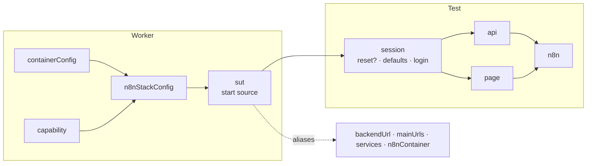

# Harness design: one suite for every n8n deployment

| | |
| --- | --- |
| Status | Draft for review |
| Owner | Developer Platform |
| Parent plan | [DEVP-1063](https://linear.app/n8n/issue/DEVP-1063) — separate SUT lifecycle from Playwright |
| Project | [Deployment Compatibility and Test Parity](https://linear.app/n8n/project/deployment-compatibility-and-test-parity-220dd0aa526f) |
| Assessment | [Deployment testing maturity assessment](https://linear.app/n8n/document/deployment-testing-maturity-assessment-d26c27122caf) |
| Baseline | [HARNESS_BASELINE.md](./HARNESS_BASELINE.md) |
| Plan | [HARNESS_PLAN.md](./HARNESS_PLAN.md) |

## Decision

Use one Playwright harness for every place n8n runs. A test describes behavior.
The harness decides how to reach the system under test (SUT), what the test may
change, and how to sign in.

The same eligible tests and reports must run against a local instance, a
Testcontainers stack, a K3s/Helm deployment, and later an instance that another
system owns.

## Why

- Container tests run 20 of 38 priority checks. The setup can represent 29.
- Helm CI automatically runs 1 of 9 key profiles.
- `fixtures/base.ts` treats "not Docker" as "local". A K3s run gets the local
  project set and skips container checks.

A new deployment must not need a new framework.

## Terms

| Term | Meaning |
| --- | --- |
| SUT | The running n8n instance under test: endpoints plus the operations it permits |
| Source | How the harness gets a SUT. Two exist: `testcontainers` creates one, `attached` connects to one. |
| Known state | An empty database with seeded users. Created by `reset()`. |
| Defaults | The features and quotas every test starts with. Applied by `applyDefaults()`. |
| Session | The storage state for one role, created by one login |
| Profile | A named deployment configuration from the registry ([DEVP-964](https://linear.app/n8n/issue/DEVP-964), [DEVP-966](https://linear.app/n8n/issue/DEVP-966)) |

## Principles

These keep the fixtures flat. Each one removes branches from the current code.

| Principle | Effect |
| --- | --- |
| **One contract.** Tests see only `Sut`. | The app layer never branches on the source. |
| **Null objects for absent things.** A forbidden reset throws when called. Missing services throw a named error. `@auth:none` is an empty session. | No `if (!x)` checks in fixtures |
| **`await using` for contexts.** Fixture teardown runs after `use()`, even when the test fails. | No `try`/`finally` |
| **One reset, one set of defaults.** Both are functions on `Sut`. | No hidden ordering, no duplicate resets |
| **Push provider details down.** The containers package handles keepalive and engine databases. | No provider conditionals in fixtures |
| **Attach grants nothing.** An attached SUT allows no reset or shutdown without an explicit grant. | Safe on shared instances |
| **Ask what the SUT can do, never which SUT it is.** | No project-name or `!n8nContainer` checks |
| **Do not override built-ins to change their value.** Pass `baseURL` and `storageState` to each context the harness creates. | No leaked sessions in manual contexts |
| **Fail loudly.** Harness calls to the test controller throw on failure. | No tests on the wrong license |

## Fixture graph



Every dependency is a fixture parameter. API-only tests never request `page`, so
they launch no browser. Each test signs in once.

Add-on fixtures (Currents, coverage, quarantine, a11y) are merged with
`mergeTests`. Use `extend` when a fixture depends on another. Define each
fixture name in one module only, because the last definition wins silently.

## SUT contract

This is the Playwright view of the SUT. Reconcile it with the external
environment contract in [DEVP-970](https://linear.app/n8n/issue/DEVP-970)
before attached deployments beyond local use it.

```ts
interface Sut {
  url: string;                    // backend, from the test process
  editorUrl: string;              // frontend, from the test process
  internalUrl: string;            // n8n as seen from inside the SUT network
  mainUrls: string[];             // direct mains
  services: ServiceHelpers;       // a missing service throws a named error
  stack?: N8NStack;               // Docker only: provider controls
  reset(): Promise<void>;         // destructive; throws when not permitted
  applyDefaults(): Promise<void>; // default features and quotas
  stop(): Promise<void>;
}
```

## Sources

```ts
export async function startTestcontainers(config: N8NConfig): Promise<Sut> {
  const stack = await createN8NStack(config);   // stop() handles keepalive
  const sut: Sut = {
    url: stack.baseUrl,
    editorUrl: stack.baseUrl,
    internalUrl: stack.internalMainUrls[0],
    mainUrls: stack.mainUrls,
    services: stack.services,
    stack,
    reset: () => resetDatabase(stack.baseUrl, stack.engineDatabase),
    applyDefaults: () => applyDefaultFeatures(stack.baseUrl),
    stop: stack.stop,
  };
  await sut.reset();   // an empty container needs seeded users
  return sut;
}

export function attach(env = process.env): Sut {
  const url = requireEnv(env, 'N8N_BASE_URL');
  return {
    url,
    editorUrl: env.N8N_EDITOR_URL ?? url,
    internalUrl: env.N8N_INTERNAL_URL ?? url,
    mainUrls: [],                 // an attached instance does not expose its mains
    services: unavailableServices('attached SUT'),
    reset: env.RESET_E2E_DB === 'true' ? () => resetDatabase(url) : denied('Reset'),
    applyDefaults: () => applyDefaultFeatures(url),
    stop: async () => {},
  };
}
```

| Source | Used for | Lifecycle | Reset at start | Per-test reset |
| --- | --- | --- | --- | --- |
| `testcontainers` | Container projects | One stack per worker | Yes | With `@db:reset` |
| `attached` | Local, K3s started by CI, later deployed | Owned outside the worker | No. Workers share the instance. `global-setup.ts` resets once per run when granted. | Only when granted |

K3s uses `attached`. CI already starts Helm outside Playwright and passes the
URL. Kubernetes checks stay in provider-specific tests
([DEVP-1074](https://linear.app/n8n/issue/DEVP-1074)).

## Fixtures

```ts
export const test = base.extend<TestFixtures, WorkerFixtures>({
  containerConfig: [{}, { scope: 'worker', option: true }],
  capability: [undefined, { scope: 'worker', option: true }],

  n8nStackConfig: [async ({ containerConfig, capability }, use) =>
    use(resolveConfig(containerConfig, capability, parseGlobalTestEnv())),
  { scope: 'worker', box: true }],

  sut: [async ({ n8nStackConfig }, use) => {
    const sut = await startSut(n8nStackConfig);
    await use(sut);
    await sut.stop();
  }, { scope: 'worker', box: true }],

  session: async ({ sut }, use, { tags }) => {
    if (tags.includes('@db:reset')) await sut.reset();
    await sut.applyDefaults();
    await use(await signIn(sut.url, roleFromTags(tags)));
  },

  api: async ({ sut, session, n8nStackConfig }, use) => {
    await using ctx = await request.newContext({ baseURL: sut.url, storageState: session });
    await use(new ApiHelpers(ctx, apiOptions(n8nStackConfig)));
  },

  page: async ({ page, session }, use) => {
    await setupDefaultInterceptors(page.context());
    await page.context().setStorageState(session);
    await use(page);
  },

  // n8n.api shares the page's cookies, so API and UI sign-in change the same session.
  n8n: async ({ page, apiOptions }, use) =>
    use(new n8nPage(page, ApiHelpers.forPage(page, apiOptions))),
});
```

```ts
export const NO_SESSION: StorageState = { cookies: [], origins: [] };

export async function signIn(url: string, role: UserRole | 'none'): Promise<StorageState> {
  if (role === 'none') return NO_SESSION;
  await using ctx = await request.newContext({ baseURL: url });
  await new ApiHelpers(ctx).signin(role);
  return await ctx.storageState();
}
```

## Why defaults run for every test

Feature toggles live in process memory for the whole worker. Today only the
`n8n` fixture enables the project features. An API-only test sees them only if
a UI test ran earlier in the same worker. Applying defaults in `session` gives
every test the same start. The call is idempotent, so it is safe on a shared
attached instance.

No current spec disables a default feature. Three specs disable other features
(`variables`, `logStreaming`, `workerView`). Specs that set `maxTeamProjects`
set it to `-1`, which matches the default.

## Identity rules

- Do not override the built-in `storageState` option. Playwright copies it into
  every `browser.newContext()` and `request.newContext()`.
- `setStorageState()` replaces the cookie transfer between contexts.
- `createApiForMain` becomes a context on `mainUrls[i]` with the same session.
- `n8n.api` shares the page's cookies (`ApiHelpers.forPage()`). The editor dev
  server proxies backend routes, so this works when the editor runs on another
  port. API sign-in switches the browser user in every mode.
- The `api` fixture stays isolated: its own cookies, the same starting session.
- Do not cache sessions across tests on controller SUTs. Logout, MFA changes,
  and resets revoke them.

## Services

A service helper needs connection details, not a container
([DEVP-1071](https://linear.app/n8n/issue/DEVP-1071)). Mailpit is the first
example. Change other helpers only when a non-Docker SUT needs them.

| Helper | Needs today |
| --- | --- |
| Mailpit, Kafka, LocalStack, Kent, observability, tracing | A URL in `meta` |
| Proxy | A mapped port read in the factory |
| Keycloak | `meta`, plus one `exec` method |
| Postgres, Gitea | `container.exec` |

Keep provider controls provider-specific. Do not add a universal `exec`.

### Where a service runs

Where a service runs does not depend on where n8n runs. A K3s SUT can use a
Mailpit container, a Mailpit pod, or a hosted Mailpit. Tests do not care.

A service connection has three parts. Whoever provisions the service fills them:

| Part | Used by | Example |
| --- | --- | --- |
| Test address | The test process | `localhost:51234` |
| n8n address | n8n, inside the SUT network | `kafka:9092` |
| Credentials | Both, when the service needs them | SASL user, TLS settings |

The protocol decides how a remote service can be reached:

| Service | Test side | n8n side | Reach from outside the SUT network |
| --- | --- | --- | --- |
| Mailpit | HTTP API | SMTP | Put the HTTP API behind an ingress path. SMTP stays inside the network. |
| Kafka | Kafka protocol | Kafka protocol | An HTTP path proxy does not work. The broker returns its advertised addresses, and the client connects to those. It needs a second listener that advertises the address the test process uses: a NodePort, a load balancer, or network access to a managed cluster. |

On a shared service, a test removes only what it created: its topics, consumer
groups, and messages.

## Reports

- Tag each run: `testConfig.tag = '@sut:<source>'`.
- Record the profile, image or chart, and n8n version in `testConfig.metadata`.
  [DEVP-989](https://linear.app/n8n/issue/DEVP-989) publishes them.
- Compare performance results only within one profile and source.

## Playwright features used

The package uses Playwright 1.62.1.

| Feature | Since | Use |
| --- | --- | --- |
| `mergeTests` | 1.39 | Combine independent add-ons |
| Option fixtures with `defineConfig<Options, WorkerOptions>` | Old | Type `containerConfig` and remove the `ProjectUse` cast |
| `failOnStatusCode` per request | 1.51 | Make controller calls fail loudly |
| `testConfig.tag` | 1.57 | Identify the source in reports |
| `browserContext.setStorageState()` | 1.59 | Apply and switch sessions |
| `await using` on `APIRequestContext` | 1.59 | Dispose contexts without `try`/`finally` |

## Later, on evidence

These have a real use case but no consumer yet. Build them when the consumer exists.

| Item | Trigger |
| --- | --- |
| Deployed SUT: login from environment credentials, features verified through `/rest/settings`, a session cache per role in a setup project, `test.abort()` on `/rest/e2e/**` | The first real external environment ([DEVP-970](https://linear.app/n8n/issue/DEVP-970)) |
| Static needs beyond today's tags (controller, callback, role) | The deployed SUT |
| Feature toggles on every main | A multi-main test that fails because main-2 has the real license |
| Test locks, `Reporter.preprocess()`, isolated retries | Workers that share one attached instance in CI |
| Shard placement cost model | Startup telemetry shows a measurable gain |

## Known limitations

- `log-streaming-delivery.spec.ts` hard-codes the Docker alias `http://proxyserver:1080`.
- Feature toggles reach main-1 only in multi-main stacks. Accepted until a test depends on it.

## Out of scope

- `tests/infrastructure/encryption/`, which runs its own stack.
- `tests/cli-workflows/`, which needs no SUT.
- Provisioning cloud environments.
