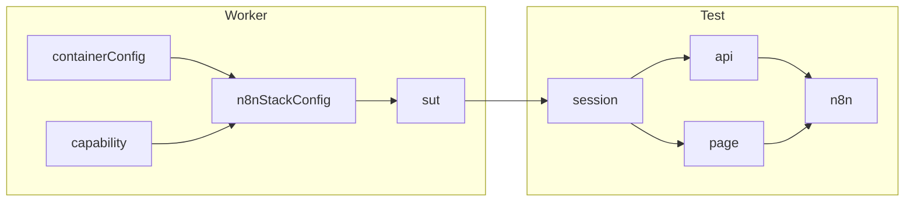
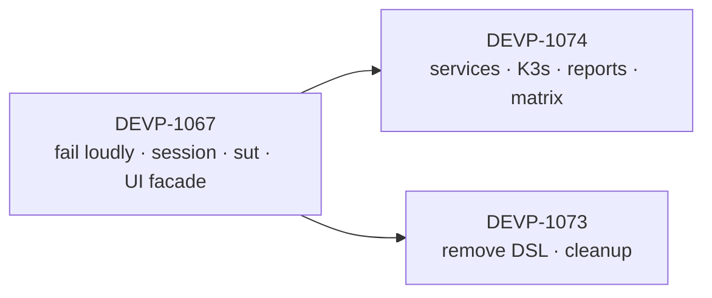

# Harness plan

| | |
| --- | --- |
| Status | Draft for review |
| Design | [HARNESS_DESIGN.md](./HARNESS_DESIGN.md) |
| Parent plan | [DEVP-1063](https://linear.app/n8n/issue/DEVP-1063) |
| Baseline | [HARNESS_BASELINE.md](./HARNESS_BASELINE.md) |

This plan delivers the fixture graph in [HARNESS_DESIGN.md](./HARNESS_DESIGN.md).
Sections are steps. The [Tickets](#tickets) table groups the steps into five
existing tickets.

## End state



- Two sources: `testcontainers` and `attached`. Local and K3s use `attached`.
- Four test fixtures. Each has at most one line of logic.
- No `try`/`finally`, no `null!`, no mode branches in fixtures.

## Status

| Ticket | State |
| --- | --- |
| [DEVP-1064](https://linear.app/n8n/issue/DEVP-1064) Contract tests and baseline | Done |
| [DEVP-1066](https://linear.app/n8n/issue/DEVP-1066) Startup telemetry | Done |
| [DEVP-1065](https://linear.app/n8n/issue/DEVP-1065) Safe acquisition and cleanup | Done |
| [DEVP-1068](https://linear.app/n8n/issue/DEVP-1068) Startup deadlines and cancellation | Done |
| [DEVP-1067](https://linear.app/n8n/issue/DEVP-1067) Reset once, then sign in | In progress. Scope change proposed below. |

## Tickets

The work happens locally. The PR E2E run tests the fixtures by using them, so
each ticket is one large, coherent change with one outcome. Three tickets
remain. All of them already exist.

| Ticket | Outcome | Steps (sections below) | Proof |
| --- | --- | --- | --- |
| [DEVP-1067](https://linear.app/n8n/issue/DEVP-1067) | Flat fixtures: one SUT, one session, clients built from them | P0, DEVP-1067, DEVP-1069, DEVP-1070 | PR E2E, harness counts, and a local attached run (rows 2 and 3) pasted in the PR |
| [DEVP-1074](https://linear.app/n8n/issue/DEVP-1074) | The same suite proven on every environment, with attached services | DEVP-1071, P11, DEVP-1074, P7, P10 | The proof matrix table, plus a local SASL run |
| [DEVP-1073](https://linear.app/n8n/issue/DEVP-1073) | No requirements DSL and no legacy guards | DEVP-1073, P9 | PR E2E with an unchanged test set |

Ticket changes:

- DEVP-1069 and DEVP-1070 are duplicates of DEVP-1067.
- DEVP-1071 is a duplicate of DEVP-1074.
- DEVP-1072 and DEVP-1075 stay in the backlog. The multi-environment goal does
  not need them.
- The DEVP-1063 delivery contract allows one large PR per ticket, or a short
  stack when review needs it.

## Order



DEVP-1074 and DEVP-1073 are independent of each other.

## What PR CI proves, and what it does not

| Evidence | PR CI | Add by hand |
| --- | --- | --- |
| Managed Testcontainers path | Yes: the E2E container projects | — |
| Attached path (local, pre-started stack) | No. CI never attaches. | Run rows 2 and 3 locally. Paste the result in the PR. |
| Kafka with TLS and SASL | No | One local run against a SASL broker |
| K3s | Only when Helm files change | The matrix job |

## Rules for every PR

- Keep the selected test set and assertions. Do not add unexplained skips,
  retries, or timeout increases.
- Prove fixture changes through the product specs. There is no separate harness
  suite. Unit-test pure fixture logic next to the code.
- Keep existing fixture names as aliases.
- A green PR E2E run is the main evidence. Record timings only when startup
  changes: DEVP-1067 and DEVP-1069.

```bash
pnpm --filter=n8n-playwright typecheck
pnpm --filter=n8n-playwright lint
pnpm --filter=n8n-playwright test:unit
pnpm --filter=n8n-playwright janitor
```

---

## P0 — Make harness calls fail loudly

Step 1 of DEVP-1067 · S

**Goal.** Remove silent failures before the refactor, so it starts from true results.

| File | Change |
| --- | --- |
| `services/api-helper.ts` | `setFeature`, `setQuota`, `setQueueMode`, and the environment-flag helpers pass `failOnStatusCode: true` per request |
| `fixtures/base.ts` | `services` throws a named error when no container exists |
| `tests/e2e/settings/log-streaming/log-streaming-delivery.spec.ts` | Read the proxy address from the helper, not `http://proxyserver:1080` |
| `tests/e2e/api/workflow-publication-service.spec.ts` | Declare the Postgres capability |

**Acceptance**

- A failed toggle fails its test with the endpoint and status.
- A local run gets a named error from `services`, not a `TypeError`.

**Verify.** Full `sqlite:e2e` and `multi-main:e2e` runs. A new failure means a
spec relied on a silent failure. Fix the spec.

---

## DEVP-1067 — `session` fixture

Step 2 of DEVP-1067 · M · in progress · scope change

**Scope change.** The branch adds `testSession`, then signs in inside each
client. Replace it with one `session` fixture that returns a storage state.
This removes the cookie transfer in the same PR, because the page gets the
session directly.

**Goal.** One reset, then defaults, then one login, in one fixture.

| File | Change |
| --- | --- |
| `fixtures/known-state.ts` (new) | `resetDatabase(url, engineDb?)` and `applyDefaultFeatures(url)`. Both use `await using` and `failOnStatusCode`. |
| `fixtures/session.ts` (new) | `NO_SESSION`, `roleFromTags(tags)`, `signIn(url, role)` |
| `fixtures/base.ts` | Add `session`. `api` and `createApiForMain` create contexts with `storageState: session`. `page` applies interceptors, the debounce init script, and `setStorageState(session)`. Remove `testSession`, the cookie transfer, and `withProjectFeatures` from `n8n`. |
| `services/api-helper.ts` | Remove `setupFromTags` and `setupTest` |

The `n8n` fixture keeps one branch until DEVP-1070: same-origin runs still use
`page.context().request` for `n8n.api`.

**Removes:** `testSession`, the duplicate reset, per-client sign-in, about 40
lines of cookie transfer, and `withProjectFeatures` in the fixture.

**Behavior change.** API-only tests now start with the default project
features. No spec disables a default feature. Three specs disable other
features.

**Acceptance**

| Consumer | Resets per test | Logins per test | Browser |
| --- | ---: | ---: | --- |
| API only | 0, or 1 with `@db:reset` | 1 | None |
| UI only | 0, or 1 with `@db:reset` | 1 | One |
| Combined | 0, or 1 with `@db:reset` | 1 | One |
| `@auth:none` | 0, or 1 with `@db:reset` | 0 | The API context has no cookie |

- Sign-in follows the reset. A failed reset stops the test body.
- Same-origin and split frontend/backend runs pass.

**Verify.** Harness suite, `test:container:sqlite:e2e`, `test:container:multi-main:e2e`,
and `test:dev-server-smoke` for split URLs.

---

## DEVP-1069 — `sut` fixture

Step 3 of DEVP-1067 (DEVP-1069 merged in) · M

**Goal.** An always-present `sut` with two sources. Behavior does not change.

| File | Change |
| --- | --- |
| `fixtures/sut.ts` (new) | `Sut` type, `startTestcontainers(config)`, `attach(env)`, `startSut(config)`, `denied(op)`, `unavailableServices(label)` |
| `fixtures/resolve-config.ts` (new) | `resolveConfig()`, moved from the `n8nStackConfig` fixture, with unit tests |
| `containers/stack.ts` | `stop()` handles `N8N_CONTAINERS_KEEPALIVE`. Expose `engineDatabase` only when an engine runs. |
| `fixtures/base.ts` | Add `sut`. `session` calls `sut.reset()` and `sut.applyDefaults()`. `backendUrl`, `frontendUrl`, `internalUrl`, `mainUrls`, `services`, and `n8nContainer` read `sut`. Remove `dbSetup`, `n8nUrl`, and `n8nContainer`'s `null!`. |
| `playwright.config.ts` | Declare `containerConfig` as a typed worker option. Remove the `ProjectUse` cast. |
| `fixtures/backend-v8-coverage.ts` | Read `backendUrl` |
| `fixtures/observability.ts` | Read `sut.stack` |
| `fixtures/sut.test.ts` (new) | Unit tests: `attach` denies a reset without a grant, never stops the instance, and names a missing service. |

`startSut` holds the only source choice:

```ts
export const startSut = (config: N8NConfig) =>
  process.env.N8N_BASE_URL ? attach() : startTestcontainers(config);
```

**Removes:** `dbSetup`, `void dbSetup`, `n8nUrl`, the null stack, the
`ProjectUse` cast, and the keepalive and engine conditionals in fixtures.

**Acceptance**

- `resolveConfig` gives the same result as today for every project.
- An attached run never calls reset unless `RESET_E2E_DB=true`, and never stops the instance.
- A missing service fails with the service name and "attached SUT".

**Verify.** Harness suite, `test:container:sqlite:e2e`, `test:container:multi-main:e2e`,
`test:container:engine-v2:e2e`, and `test:local`. Compare the fixture graph and
startup timings with the baseline.

---

## DEVP-1070 — UI facade from prepared dependencies

Step 4 of DEVP-1067 (DEVP-1070 merged in) · M

**Goal.** `n8n` is `new n8nPage(page, ApiHelpers.forPage(page, apiOptions))` with no branches.

| File | Change |
| --- | --- |
| `services/api-helper.ts` | `ApiHelpers.forPage(page, options)`: a client on the page's cookie jar. The editor dev server proxies backend routes, so it reaches the API in every mode. |
| `pages/n8nPage.ts` | Require `api`. Remove the fallback `new ApiHelpers(page.context().request)`. |
| `fixtures/base.ts` | `n8n` uses `ApiHelpers.forPage`. Remove the same-origin branch. |
| `composables/TestEntryComposer.ts` | `forPage(page)` becomes public and replaces `wrapPage`. `withUser`, `newTab`, and `fromNewPage` use it. |
| `chat-hub-workflow-agent.spec.ts` | Use `n8n.start.forPage()` for popup tabs |

`n8n.api` keeps sharing the browser's cookies, as it did in same-origin runs.
The call sites that switch the browser user through `n8n.api.signin()` do not
change. The editor dev server proxy (#39562) makes them work with split URLs.

**Removes:** the last mode branch, the hidden fallback client, and silent
identity drift in split-URL runs.

**Acceptance**

- Constructing `n8n` has no side effects.
- Second-user, tab, and popup paths keep the intended identity.
- `admin-smoke.spec.ts` compares the admin menu with the owner menu in split-URL runs.

**Verify.** Harness suite, `tests/e2e/building-blocks/user-service.spec.ts`,
`credentials/global.spec.ts`, `settings/users/users.spec.ts`, and `auth/admin-smoke.spec.ts`.

---

## DEVP-1071 — Mailpit service connection

Step 1 of DEVP-1074 (DEVP-1071 merged in) · S

**Goal.** Build the Mailpit client from connection details. Keep the ticket's scope.

| File | Change |
| --- | --- |
| `containers/services/mailpit.ts` | Build the helper from supplied connection details |
| `containers/service-stack.ts` | Service-only startup returns services, with no application URL |
| `fixtures/sut.ts` | `attach` builds Mailpit from a supplied URL variable, for example `N8N_TEST_MAILPIT_URL` |

**Acceptance**

- The email journey passes on Docker n8n and on local n8n with containerized Mailpit.
- Concurrent consumers do not clear each other's messages.

---

## DEVP-1072a — Shared configuration identity

Backlog · not needed for the multi-environment goal

**Goal.** Discovery, image selection, and runtime use the same resolved
configuration.

| Area | Change |
| --- | --- |
| `janitor/src/core/test-discovery-analyzer.ts` | Resolve the full configuration with `resolveConfig`, not the first capability tag |
| Image requirements | Derive from the same resolved configuration. This fixes the missing Keycloak image for dynamic credentials. |
| Identity | A hash of the resolved configuration. Swap in registry profile names when DEVP-966 lands. |

**Not in this PR:** the placement cost model (DEVP-1072b). Build it only if
startup telemetry shows a measurable gain.

**Acceptance.** The selected spec set is unchanged. Equivalent inline options
produce one identity.

---

## DEVP-1073 — Remove the requirements DSL

Step 1 of DEVP-1073 · L · after DEVP-1067 · split by feature folder if too large

**Goal.** Replace `TestRequirements` with ordinary helpers and small fixtures.

- Migrate the spec files that use `setupRequirements`.
- Remove `TestRequirements`, `setupTestRequirements`, and `setupRequirements`.
- Add two Janitor rules: no provisioner imports in `tests/e2e/`, and no
  `testInfo.project.name` checks in specs.
- Normal Janitor and TCR use the same rule set.

If the migration is too large for one PR, ask for approval to split it by
feature folder.

---

## DEVP-1074 — K3s as an attached SUT

Step 3 of DEVP-1074 · M

**Goal.** Run the shared API and UI sentinels against K3s through `attach`.

| File | Change |
| --- | --- |
| `containers/helm-stack.ts` | Per-run kubeconfig. Do not change the user's default context. |
| `.github/workflows/test-e2e-helm.yml` | Pass `N8N_BASE_URL`, `N8N_INTERNAL_URL`, and `RESET_E2E_DB=true`. The run owns the cluster, so it grants reset. |
| Queue sentinel | Prove that a worker ran a workflow, not only that the pods are ready |

**Acceptance**

- Two K3s runs do not affect each other or the user's kubeconfig.
- Reports name the chart, image, and mode.

---

## P7 — SUT identity in reports

Step 4 of DEVP-1074 · S

- Set `testConfig.tag` to `@sut:testcontainers` or `@sut:attached`.
- Add the profile or resolved configuration identity, the image or chart, and
  the n8n version to `testConfig.metadata`.

---

## P9 — Cleanup

Step 2 of DEVP-1073 · S

- Replace the 12 `!n8nContainer` skip guards with a declared capability.
- Remove the explicit default-feature and `setMaxTeamProjectsQuota(-1)` calls.
  `session` applies these now.

---

## Proof matrix

The same suite runs against each environment. The results prove that the
harness works, and they record what each environment can and cannot do.

### Environments

| # | Environment | Started by | Source | Grants |
| --- | --- | --- | --- | --- |
| 1 | Testcontainers, managed | Playwright worker | `testcontainers` | All |
| 2 | Testcontainers, pre-started | `pnpm --filter n8n-containers stack --env E2E_TESTS=true` | `attached` | Reset (`RESET_E2E_DB=true`) |
| 3 | Testcontainers, pre-started, no grant | Same as 2 | `attached` | None |
| 4 | K3s standalone | `pnpm --filter n8n-containers stack:helm` | `attached` | Reset |
| 5 | K3s queue | `stack:helm --mode queue` | `attached` | Reset |
| 6 | Testcontainers, no test controller | `stack` without `E2E_TESTS=true` | `attached` | None |

- Rows 2 and 3 simulate an instance that another system owns. Row 3 proves
  that attach never resets or stops what it does not own.
- Row 6 simulates a production-like deployment. Today every test fails there
  at `applyDefaults()`, loudly. That result is the evidence for the deployed
  SUT work, not a defect in this plan.
- The stack CLI sets `E2E_TESTS=false` by default (`containers/services/n8n.ts:58`).
  Pass `--env E2E_TESTS=true` for rows 2 and 3.

### Suites

| Suite | Rows | Proves |
| --- | --- | --- |
| Sentinels: `tests/e2e/building-blocks/` plus one `@db:reset` spec, one Mailpit spec, one multi-main spec, and the queue worker sentinel | 1–6 | The same API and UI journeys work on every source |
| Full `e2e` project | 1, 2, 4 | The eligibility map: what runs, what is filtered, what skips and why |

`tests/e2e/building-blocks/` is the set the Helm workflow runs today.

### Expected results

This is the hypothesis. The first matrix run replaces it with evidence.

| Check | 1 | 2 | 3 | 4 | 5 | 6 |
| --- | --- | --- | --- | --- | --- | --- |
| API, UI, and combined journeys | Pass | Pass | Pass | Pass | Pass | Fails loudly |
| `@db:reset` | Pass | Pass | Fails: "Reset is not permitted" | Pass | Pass | Fails loudly |
| Mailpit (`capability: 'email'`) | Pass | Skip, unless a Mailpit URL is supplied | Skip | Skip | Skip | Skip |
| Multi-main (`mainUrls`) | Pass on the multi-main profile | Skip: one main URL | Skip | Skip | Skip | Skip |
| Provider controls (`n8nContainer`) | Pass | Skip | Skip | Skip | Skip | Skip |
| Queue worker executes a workflow | Pass on the queue profile | Pass on a queue stack | — | — | Pass | — |
| Callback through `internalUrl` | Pass | Pass with `N8N_INTERNAL_URL` | Pass | Pass with the in-cluster URL | Pass | — |
| Kafka produce and trigger (P11) | Pass | Pass with a supplied Kafka connection | Pass with a supplied Kafka connection | Skip until K3s Kafka exists | Skip | — |

Run `@db:reset` specs on rows 2 and 3 with `PLAYWRIGHT_ALLOW_CONTAINER_ONLY=true`,
so the reset-permission check executes and does not get filtered out.

### Output

- Each run carries `@sut:<source>` and the environment row in its metadata (P7).
- Capture the eligible set with `--list --reporter=json` before each run. A
  test in the full list but not the eligible list is "not eligible", not "skipped".
- Merge the reports into one table per check and environment. This table is the
  first input to the support matrix in [DEVP-988](https://linear.app/n8n/issue/DEVP-988).

### Limits

- Rows 2 and 3 use the same image and network as row 1. They prove the attach
  path, not cloud wiring, ingress, or managed services.
- Docker results do not prove Helm behavior. K3s results do not prove n8n Cloud.

### Gates

| Ticket | Must pass before merge |
| --- | --- |
| DEVP-1067 | Sentinels on rows 1, 2, and 3 |
| DEVP-1074 | The whole matrix, once, with the results table attached. Mailpit and Kafka pass on rows 1 and 2. |
| DEVP-1073 | PR E2E with an unchanged test set |

---

## P10 — Proof matrix job

Step 5 of DEVP-1074 · M

**Goal.** Run the proof matrix on demand and on a schedule, and publish the table.

| File | Change |
| --- | --- |
| `containers/n8n-start-stack.ts` | Add `--url-file`, which `helm-start-stack.ts` already has |
| `.github/workflows/test-sut-matrix.yml` (new) | One job per row. Start the environment outside Playwright, run the suites, upload the tagged report. A final job merges the reports into the table. |
| `packages/quality/testing/playwright/README.md` | A how-to for running any row locally |

**Cadence.** Use `workflow_dispatch` and a nightly schedule. K3s startup is too
slow for every PR. Align with [DEVP-958](https://linear.app/n8n/issue/DEVP-958).

**Acceptance**

- Every row publishes a result, including row 6. A missing row is shown as missing, not as a pass.
- The table lists pass, fail, skip with reason, and not eligible for each check.

---

## P11 — Kafka service connection

Step 2 of DEVP-1074 · M

**Goal.** Kafka tests and benchmarks work with any Kafka that the test process
and n8n can both reach.

Today the helper already takes a broker string, but the n8n side is hard-coded:
`brokers: 'kafka:9092'` appears in `tests/e2e/nodes/kafka-nodes.spec.ts` (twice)
and `utils/benchmark/kafka-driver.ts`. There is no TLS or SASL support.

| File | Change |
| --- | --- |
| `containers/services/kafka.ts` | `KafkaConnection`: test brokers, n8n brokers, optional TLS and SASL. `KafkaHelper` takes a connection. Add `credentialData({ clientId })`, which returns the n8n credential for this connection. The helper records the topics it creates and deletes only those. |
| `kafka-nodes.spec.ts`, `kafka-driver.ts` | Use `services.kafka.credentialData()`, not `'kafka:9092'` |
| `containers/n8n-start-stack.ts` | Write the service connections with `--connections-file` |
| `fixtures/sut.ts` | `attach` reads one connections file, `N8N_SUT_FILE`, when set. The file holds URLs and service connections. Secrets stay in environment variables that the file names. |

The connections file replaces a growing list of variables (URLs, reset grant,
Mailpit, Kafka). It is the first concrete example of the DEVP-970 contract.
Introduce it here, with the second service, not earlier.

**Acceptance**

- The Kafka node spec passes on row 1, and on row 2 with a Kafka started by `stack --kafka`.
- The same spec passes when the connection has TLS and SASL. Use a local broker with SASL enabled.
- No secret appears in logs, reports, or the connections file.
- Two concurrent tests do not share or delete each other's topics.

**Not in this PR**

- Kafka inside K3s. The K3s container exposes only port 30080 today. It needs an
  extra NodePort before start, and a broker listener that advertises
  `host:mappedPort`. Build it when a deployment profile requires Kafka.
- Managed Kafka, such as MSK. It needs network access from the runner and IAM
  or SASL settings. Build it with the first real external environment.

---

## Later, on evidence

| Item | Build when |
| --- | --- |
| Deployed SUT (DEVP-970) | The first real external environment exists |
| Kafka inside K3s | A deployment profile requires Kafka |
| Managed Kafka (MSK or similar) | The first real external environment with Kafka exists |
| DEVP-1072b placement cost model | Telemetry shows a measurable gain |
| Feature toggles on every main | A multi-main test fails because of it |
| Playwright 1.63: locks, `preprocess`, isolated retries | CI runs workers against one shared attached instance |

## Not building

These were considered and rejected. Do not reintroduce them without a consumer.

| Idea | Why not |
| --- | --- |
| An `Auth` port with adapters | Every current source uses the same seeded login |
| A `Features` port with verify-only mode | Only a deployed SUT needs it |
| A `permissions` object | `reset` as a function, or a function that throws, is enough |
| A `SutSource` interface or registry | Two functions and one ternary cover both sources |
| A K3s source inside Playwright | CI already starts Helm outside Playwright |
| A rewrite of `getProjects` | Project selection does not change until a new source exists |
| A needs schema with seven dimensions | Existing tags and `capability` cover current sources |
| A universal `exec` for services | DEVP-1063 forbids it. Provider controls stay specific. |
| Overriding the built-in `storageState` | It leaks the session into every manual context |

## Decisions needed

| Decision | Needed by |
| --- | --- |
| Approve the DEVP-1067 scope change to a `session` fixture | DEVP-1067 |
| Accept default features for API-only tests | DEVP-1067 |
| Allow one large PR per ticket (DEVP-1063 delivery contract) | DEVP-1067 |
