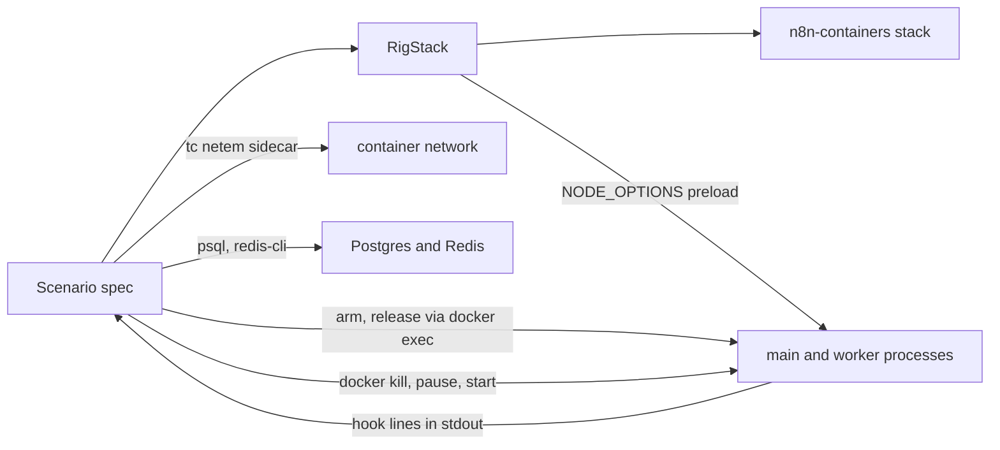

# Test rig

`@n8n/test-rig` runs real n8n stacks under test control. A test can pause or change any method inside a running n8n process, send signals, freeze containers, slow or cut the network between them, and read Postgres, Redis and logs. Scenarios use it to reproduce timing bugs on the image before a fix and check the image after it, to check failover, and to run seeded chaos against a steady workload.

The rig needs no product change. It works on released images and on images built from any branch.

## How it works



- **Hooks.** A preload goes into every n8n process through `NODE_OPTIONS` as a data URL. It wraps methods in compiled files as they load, from a list of hook specs in `TEST_RIG_HOOKS`. A hook can pause a call until the test releases it, log the call, make it fail, or skip it. The test arms and releases hooks by writing files in the container, and sees hits as `[test-rig]` lines in the container log.
- **Process control.** `signal`, `freeze`, `startAgain` and `waitForExit` wrap `docker kill`, `docker pause` and `docker start`.
- **Network faults.** `network.delay`, `network.cut` and `network.restore` run `tc netem` from a short-lived sidecar that joins the sender's network namespace. The rig builds the small `n8n-test-rig/netem` image the first time it needs it.
- **Probes.** `rig.db` and `rig.redis` read executions, execution data, Bull lists and jobs, and the multi-main leader key.
- **Scenarios.** `Scenario` records a timeline, collects container logs, runs checks for the variant under test, writes one JSONL line per run and always stops the stack.
- **Workload and invariants.** `Workload` sends steady webhook traffic to a workflow that writes one row per run. The invariants check that executions finish, no accepted request is lost, no run writes twice, the queue drains and only one main leads at a time.

## Set up

From the repository root:

```bash
pnpm install
pnpm turbo build --filter='n8n-playwright^...' > build.log 2>&1
```

Docker must be running. The scenarios start up to six containers each and run one at a time.

## Run scenarios

Scenarios live in `packages/quality/testing/playwright/tests/infrastructure/test-rig/`. Each one is listed in `scenarios.json` there, with the issue it reproduces and its `before` and `after` images. The runner pulls released images, runs each variant several times and prints a pass table:

```bash
cd packages/quality/testing/test-rig
pnpm scenarios                                       # every scenario, both variants, 5 runs
pnpm scenarios worker-drain-fetched-job --runs 1     # one scenario, one run each
pnpm scenarios --variant before                      # only the before images
pnpm scenarios --after-image n8nio/n8n:my-build      # every after variant on one image
```

- A variant passes when the image behaves as the spec expects for it: the bug on `before`, the fix on `after`. A `before` run that fails another way counts as a failure
- A scenario with no image for a variant is skipped. A missing local build fails the run
- Results go to `$TMPDIR/test-rig-results/<timestamp>/<scenario>.<variant>.jsonl`. Each line holds the outcome fields, the failed checks and a timeline
- Container logs of each run are in `<results dir>/<scenario>.<variant>/*/logs/`

To run one spec by hand:

```bash
cd packages/quality/testing/playwright
TEST_IMAGE_N8N=n8nio/n8n:2.42.2 TEST_RIG_VARIANT=before \
npx playwright test --project=test-rig --reporter=line tests/infrastructure/test-rig/<spec>
```

The containers package reads `TEST_IMAGE_N8N` when it loads and derives the runners image from it (`n8nio/runners:<same tag>`), so set it on the command. The `test-rig` project is not one of the `*:infrastructure` projects, so `pnpm test:infrastructure` does not start these scenarios.

### Multi-main scenarios

A multi-main stack needs a licence that allows several mains. Set `N8N_LICENSE_ACTIVATION_KEY` or `N8N_LICENSE_CERT` in your shell before you run one. The stack uses the sandbox licence tenant by default, so use a sandbox key. Never commit a key or cert. Every fresh stack activates the key once, so prefer a cert when you run many: read it from the `settings` table (`key = 'license.cert'`) of a stack that activated, and export it as `N8N_LICENSE_CERT`.

Single-main stacks always get an empty licence, so a licence in your shell cannot change their results.

## Build an image from a branch

An `after` image for an unmerged fix comes from a local build. `afterRef` in `scenarios.json` names the ref to build.

1. Make a throwaway worktree at a short path. pnpm puts the absolute source path into its package directory names and cuts long names; under a long path the build fails with `No files left under *@file+*packages+*/dist/*.js.map`:

   ```bash
   git worktree add --detach ~/rb/<name> <ref>
   ```

2. Build under your own tag. Do not use the `local` tag, which other work on the machine uses:

   ```bash
   cd ~/rb/<name>
   pnpm install --frozen-lockfile > install.log 2>&1
   IMAGE_TAG=rig-<name> pnpm build:docker > build.log 2>&1
   ```

   This makes `n8nio/n8n:rig-<name>` and `n8nio/runners:rig-<name>` in about 15 minutes.

3. Remove the worktree and images when you are done.

## Write a scenario

```ts
import { FILES, hook, is, RigStack, Scenario, signal, waitForExit } from '@n8n/test-rig';
import { expect, test } from '@playwright/test';

test('worker drain: a fetched job runs before the worker exits', async () => {
	const rig = await RigStack.start({
		name: 'fetched-job',
		workers: 2,
		runners: 'internal',
		scale: 6,
		hooks: [{ point: 'job-start', file: FILES.jobProcessor, target: 'JobProcessor.prototype', method: 'processJob' }],
	});
	const s = new Scenario('worker-drain-fetched-job', rig, test.info().outputPath());
	await s.run(test.info(), async () => {
		// drive the stack, then record and check the outcome
		const failed = s.verify({ before: [...], after: [['execution status', status, is('success')]] });
		expect(failed).toEqual([]);
	});
});
```

- `scale` divides the Bull lock, renew and stall timeouts and the shutdown window; `env` overrides any of them
- `workflows.ts` builds workflows: `chain(name, [nodes.webhook(path), nodes.code(...), ...])`
- Wait on product state: a log line naming an id, a process exit, a database or Bull state. Never wait a fixed time. Where log text differs between versions, add an `observe` hook and wait for its hit
- Checks are data: `s.verify({ before, after, always })` takes `[label, value, expectation]` entries (`is`, `isNot`, `below`, `atMost`, `includes`, `excludes`, `anything`) and returns the failed ones. The JSONL result keeps them

### Hook specs

| Field | Meaning |
|---|---|
| `point` | Name for arming, hits and logs |
| `file` | Path suffix of the compiled file; `FILES` lists the known ones |
| `target`, `method` | Dotted path inside `module.exports` (`JobProcessor.prototype`, `prototype` for a class export, `''` for the exports object) and the method to wrap |
| `kind` | `pause` (wait for release, then call through), `observe` (log a hit only), `fault` (reject or throw), `drop` (return `returns` instead of calling) |
| `arm` | `file` (default; enable with `hook(...).arm()`) or `always` (default for `observe`) |
| `once` | Fire once per arm (default for all kinds but `drop`) |
| `scope` | Fire only inside an async call of another method, once per call |
| `where` | Filters: `[{ path: 'args.0.node.name', equals: 'Pause' }]` |
| `detail` | Values to log with each hit: `{ executionId: 'args.0.executionId' }`. Paths start at `args`, `this`, `scope.args` or `result` |
| `phase` | `before` the call or `after` it resolves; `where` and `detail` can then read `result`. Default `before`, except `fault`, which defaults to `after` (call through, then reject) |
| `preserve` | For `fault` after: methods copied from the original return value onto the rejected promise |
| `roles`, `lazy` | Containers that must show the hook installed before the scenario starts (default `worker`); `lazy` skips the check for files that load on first use |

`RigStack.start` validates every spec and fails at once if a hook did not install. The preload validates them again, because it cannot import the schema.

## Chaos runs

`pnpm chaos` starts a stack, runs the workload, and applies a seeded schedule of faults from a menu: signals, freezes, restarts, hook faults and network faults. It then checks the invariants. A failing seed replays the same schedule with `--seed`. `--shrink` removes faults one at a time, repeating each candidate, until the smallest failing schedule is left. See `pnpm chaos --help`.

A seed fixes the schedule, not the outcome: Docker timing still varies, so the shrinker counts a candidate as failing only when it fails in enough of its repeats.

## Clean up

A stack stops when its scenario ends, after a timeout, and on Ctrl-C in `pnpm chaos`. If a process dies before that, remove what is left:

```bash
docker ps -aq --filter 'name=^rig-' | xargs docker rm -f
docker network prune -f --filter 'label=org.testcontainers=true'
```

## Tests of the rig

```bash
pnpm test           # unit tests, no Docker
pnpm test:docker    # contract tests: hook install matrix, smoke, network, workload
```

The hook install matrix starts one stack for each scenario image that exists locally, and checks that every method in `src/hooks/catalogue.ts` exists in it, from the release that first has it. Add a method to the catalogue when a spec hooks a new one; a unit test fails if a spec hooks a method the catalogue does not list.

## Limits

- Hooks depend on compiled file paths, class and method names. The install check and the matrix name any hook that does not install
- Some anchors depend on product log text, which changes between versions
- One Playwright process uses one image. The runners image follows `TEST_IMAGE_N8N`, so a per-stack `image` suits internal runners only
- Scenarios shorten timeouts to keep runs short. They show the mechanism, not production timing
