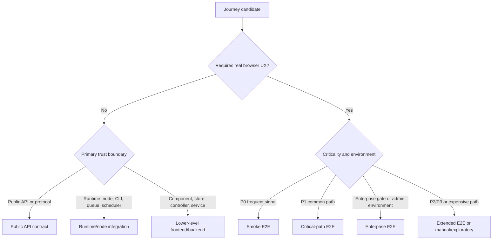

# E2E Target Suite Plan

Status: Target model drafted before existing E2E comparison. Existing E2E tests have not been inspected.
Date: 2026-05-19

## Inputs

- `packages/testing/03-e2e-journey-prioritization.md`
- `packages/testing/02-e2e-journey-map.md`
- `packages/testing/01-product-feature-inventory.md`

## Scope

This file defines the target testing model that should be used to evaluate the current suite later. It deliberately does not reference current Playwright specs, fixtures, page objects, helpers, tags, snapshots, or coverage.

The purpose is to make trust criteria explicit before Task 5 compares the source-backed journey map against the existing E2E implementation.

## Trust Criteria

| ID | Criterion | Required Standard | Low-Trust Signal |
| --- | --- | --- | --- |
| TC-01 | User outcome | A browser E2E test must assert an outcome a real actor can observe or rely on. | The test ends after clicking a control without checking product state. |
| TC-02 | Durable state | Critical writes must be verified through durable state, such as saved workflow data, execution records, credential metadata, permissions, or public API response. | The test asserts only a toast, route, CSS class, or local component state after a write. |
| TC-03 | Data ownership | Each test owns the data it creates or uses, including users, projects, workflows, credentials, tables, variables, webhooks, and API keys. | The test depends on shared mutable resources, seed order, or a previous test run. |
| TC-04 | Isolation | Tests must not depend on ordering, worker count, browser reuse, prior suite state, clock timing, or global mutable settings unless the suite explicitly owns that environment. | The test passes alone but fails in parallel or after unrelated tests. |
| TC-05 | Cleanup or namespace | Tests must either remove created resources or use an isolated namespace that makes leftovers harmless and searchable. | The test leaves generic resources that can collide with future runs. |
| TC-06 | Event-driven waits | Tests should wait for specific UI, API, execution, push, or persistence signals instead of fixed sleeps. | The test uses arbitrary timeouts to hide races. |
| TC-07 | Controlled integrations | AI providers, identity providers, OAuth callbacks, webhooks, mail, external APIs, and package registries should use controlled contracts or local stubs unless the journey explicitly validates an external environment. | The test relies on live providers, random model output, real email delivery, real package registries, or internet availability. |
| TC-08 | Permission boundary | Journeys crossing auth, project roles, sharing, API scopes, or enterprise gates must assert both allowed and denied behavior when that boundary is the risk. | The test covers the happy path but never proves unauthorized access is blocked. |
| TC-09 | Actionable diagnostics | A failure must identify the actor, journey ID, resource IDs, setup state, runtime state, and the exact failed expectation. | A failure only reports a missing selector or generic timeout. |
| TC-10 | Layer fit | Browser E2E should be reserved for user-visible flows where the browser adds real confidence. Engine, API, protocol, node, CLI, and large input-matrix behavior should move to lower layers. | Browser tests cover pure algorithmic behavior, every node variant, or API-only authorization semantics. |

## Proposed Suite Layers

| Layer | Purpose | Target Journeys | Frequency | Required Properties |
| --- | --- | --- | --- | --- |
| Smoke E2E | Prove the product can be opened, authored, saved, activated, configured, and run through the highest-value happy paths. | The 11 smoke candidates from prioritization. | Frequent local and CI gate candidate. | Small, deterministic, parallel-safe, no live external providers, no broad permutations. |
| Critical-path E2E | Protect common builder, collaborator, external-user, and admin flows where browser interaction is part of the risk. | P1 journeys with browser fit `Yes` or a thin browser slice for `Partial`. | Regular CI, likely after smoke. | Outcome-oriented assertions, API-backed setup, durable state verification. |
| Extended E2E | Cover important but broader flows that are valuable at browser level and can run less frequently. | P2 journeys with browser fit plus selected P1 `Partial` journeys. | Scheduled or broader PR signal. | Explicit cost justification, deterministic fixtures, minimal duplication with lower layers. |
| Enterprise E2E | Validate licensed, identity, security, permission, source control, and operations flows that require special environment setup. | Enterprise-recommended journeys from prioritization. | Environment-specific CI or scheduled gate. | Feature gates controlled, setup documented, allowed and denied behavior asserted. |
| Public API contract | Validate public API, API key, OAuth, MCP protocol, and automation contracts without browser overhead. | Journeys recommended as `API contract`. | Frequent API-level CI. | Versioned request/response assertions, auth and scope coverage, durable state checks. |
| Runtime/node integration | Validate workflow engine, scheduler, triggers, error workflows, expression evaluation, node semantics, CLI, and self-hosted operations. | Journeys recommended as `Component/integration test` when runtime is the boundary. | Package-level CI and targeted regression suites. | Precise payload assertions, controlled clocks, controlled queues, focused diagnostics. |
| Lower-level frontend/backend | Validate static rendering, stores, composables, controllers, services, RBAC decorators, feature-flag resolution, and UI edge states. | Journeys where browser E2E would add little confidence. | Package-level CI. | Fast, narrow, deterministic, with explicit input/output expectations. |
| Manual/exploratory | Validate expensive, environment-specific, plan-specific, or nondeterministic paths that cannot yet be made reliable. | Journeys marked `Manual/exploratory`. | Release, environment validation, or incident-driven. | Runbook, required environment, expected evidence, and promotion criteria to automated coverage. |

## Initial Suite Backlog By Layer

### Smoke E2E

These journeys form the first target smoke suite. They should remain a small set, and every test should map to exactly one primary journey ID.

| Journey | Target Browser Scope |
| --- | --- |
| D01-CJ01 Owner setup | Fresh instance setup to authenticated app. |
| D01-CJ02 Sign in, sign out, and guarded routing | Protected route redirect, login, return, logout. |
| D02-CJ01 Navigate product areas and resource contexts | Authenticated shell navigation across primary areas and resource context. |
| D04-CJ01 Workflow creation | Empty workflow to persisted workflow with connected nodes. |
| D04-CJ04 Save and dirty state | Edit, save, reload, and verify no data loss. |
| D04-CJ05 Publish and activation | Activate or publish a runnable workflow and verify activation state. |
| D05-CJ01 Node discovery | Find and add a representative trigger/action node. |
| D05-CJ02 Node configuration | Edit representative node parameters and validate saved configuration. |
| D05-CJ03 Credential setup | Create/select a controlled credential and assign it to a node. |
| D06-CJ01 Manual workflow execution | Run a workflow, wait for execution completion, inspect node output. |
| D06-CJ06 Runtime webhooks | Trigger a test or production webhook and verify caller response plus execution record. |

### Critical-Path E2E

| Journey | Target Browser Scope |
| --- | --- |
| D01-CJ03 Password recovery and change | Controlled mail/reset token path plus settings password update. |
| D02-CJ02 Create from global and scoped entry points | Resource creation lands in the correct project or personal context. |
| D03-CJ01 Workflow library management | Search, duplicate, archive, restore, delete, and verify list state. |
| D04-CJ02 Workflow import | Import controlled workflow JSON and verify persisted graph. |
| D04-CJ03 Canvas editing | Move, duplicate, delete, connect, and verify saved canvas state. |
| D05-CJ04 OAuth credential callback | Thin browser callback path with local OAuth stub. |
| D06-CJ02 Node-level execution | Execute selected node and verify partial run data. |
| D06-CJ03 Run data inspection | Inspect JSON, table, binary, and redacted run data states with controlled payloads. |
| D06-CJ04 Execution debugging | Open prior failed execution, debug in editor, rerun successfully. |
| D06-CJ05 Execution list operations | Filter, preview, stop or delete controlled executions. |
| D06-CJ07 Public forms | External form submission records execution and response. |
| D07-CJ01 Template start | Import a controlled template and reach editable workflow state. |
| D08-CJ01 Data table CRUD and grid work | Create table, edit schema and rows, verify persisted table state. |
| D08-CJ03 Variables | Create variable, use it in expression autocomplete, verify persisted value. |
| D09-CJ08 Public chat | Controlled public chat interaction with stubbed AI/workflow response. |
| D10-CJ01 Projects | Create project, add member, change role, verify project access. |
| D10-CJ02 Sharing | Share workflow or credential and verify recipient access and restrictions. |
| D11-CJ01 Invitations | Invite, accept, reinvite, and verify user state transitions. |

### Extended E2E

| Journey | Target Browser Scope |
| --- | --- |
| D03-CJ02 Cross-resource organization | Move resources across projects/folders with ownership verification. |
| D04-CJ06 Workflow history and versions | Create versions, compare, restore, and verify workflow state. |
| D06-CJ08 Wait and resume | Thin browser path for waiting execution with controlled resume signal. |
| D06-CJ13 Binary data lifecycle | Upload or generate binary data and verify preview/download behavior. |
| D08-CJ02 Data table CSV and workflow writes | CSV import/export plus one workflow write path. |
| D09-CJ01 Instance AI threads | Stubbed thread creation, response, artifact, and approval state. |
| D09-CJ03 AI workflow builder and Ask AI | Stubbed generation or modification with diff acceptance. |
| D09-CJ04 Agent creation and publish | Create, configure, publish, and verify agent availability. |
| D09-CJ05 Agent chat and sessions | Controlled session with stubbed model/tool response. |
| D09-CJ06 Chat Hub model conversation | Controlled provider conversation with session persistence. |
| D09-CJ07 Chat Hub custom and workflow agents | Thin path for custom or workflow-backed agent selection. |
| D10-CJ03 Folders | Nested folder creation, movement, breadcrumb, and deletion. |
| D10-CJ04 Live collaboration | Multi-user lock or active-editor behavior with deterministic setup. |
| D12-CJ04 Insights dashboard and summaries | Navigate insights and verify summary data from controlled fixtures. |

### Enterprise E2E

| Journey | Target Scope |
| --- | --- |
| D01-CJ04 MFA login and recovery | Browser flow for setup, challenge, recovery code, and disable where supported. |
| D01-CJ05 Enterprise login entry | Thin browser callback path for SAML/OIDC/LDAP entry with controlled identity provider. |
| D09-CJ09 MCP settings and workflow availability | Admin enables MCP access and verifies available workflow/tool listing. |
| D11-CJ02 User admin and offboarding | Transfer/delete user resources and verify affected access. |
| D11-CJ03 Custom roles | Configure role, assign user, verify allowed and denied resource actions. |
| D11-CJ04 SSO | Controlled identity provider setup and login callback. |
| D11-CJ07 Security settings | Enforced MFA, sharing policy, publishing policy, and redaction toggles. |
| D12-CJ01 Source control | Controlled repository flow for connect, status, pull, push, and read-only branch mode. |
| D12-CJ02 External secrets | Controlled provider setup, test, reload, and credential field completion. |
| D12-CJ03 Ops observability | Worker/log streaming status surfaced through controlled operational state. |

### Public API Contract

| Journey | Target Contract Scope |
| --- | --- |
| D09-CJ10 MCP OAuth client and tool execution | OAuth client, consent, scope enforcement, and tool execution protocol responses. |
| D11-CJ06 API keys | Key creation, scope enforcement, revocation, and denied requests. |
| D12-CJ05 Public API automation | Workflow, execution, credential, project, tag, variable, data table, and source-control API behavior. |

### Runtime/Node Integration

| Journey | Target Integration Scope |
| --- | --- |
| D06-CJ09 Scheduled execution | Controlled clock and scheduler ownership. |
| D06-CJ10 Service-triggered execution | Trigger activation and service event handling. |
| D06-CJ11 Error workflow handling | Error execution payload and recovery semantics. |
| D06-CJ12 Sub-workflow execution | Parent/child execution contract and data propagation. |
| D06-CJ14 Expression evaluation | Expression engine input matrix and error diagnostics. |
| D06-CJ15 Representative node execution | Node family semantics with mocked provider contracts. |
| D09-CJ11 AI/LangChain workflow graph | AI node graph semantics with deterministic model/tool stubs. |
| D12-CJ06 Community nodes | Package install/load policy and custom node discovery. |
| D12-CJ07 CLI and self-hosted operations | CLI commands, import/export, worker, webhook, and queue process behavior. |

### Manual/Exploratory

| Journey | Manual Scope |
| --- | --- |
| D09-CJ02 Instance AI approvals and gateway | Local gateway and high-risk approval behavior across supported plans. |
| D11-CJ05 LDAP | Directory infrastructure, provisioning, and environment-specific login behavior. |
| D11-CJ08 Licensing | License state, plan transition, trial, limit, and upgrade behavior. |

## Data Setup Rules

| ID | Rule | Standard |
| --- | --- | --- |
| DS-01 | Namespace every resource | Every generated user, project, workflow, credential, folder, tag, variable, table, agent, webhook path, and API key should include a unique run namespace such as `e2e-<suite>-<worker>-<timestamp>-<shortid>`. |
| DS-02 | Prefer API setup for prerequisites | Use product APIs or stable setup utilities for prerequisite state. Use the browser only for the behavior under test. |
| DS-03 | Keep first-run setup explicit | Owner setup tests should own a fresh or reset instance state. Other suites should not depend on first-run side effects. |
| DS-04 | Keep credential data controlled | Use local stubs, dummy secrets, or fake providers. Never require real third-party secrets for trusted E2E. |
| DS-05 | Make runtime inputs deterministic | Webhook bodies, form payloads, execution payloads, binary files, AI responses, and OAuth callbacks should be generated from fixtures with known expected outputs. |
| DS-06 | Avoid shared mutable fixtures | Shared read-only fixtures are acceptable. Shared workflows, users, projects, credentials, or settings are not acceptable unless the journey is explicitly about shared state. |
| DS-07 | Model permission actors deliberately | Permission tests should create named actors for owner, admin, project admin, editor, viewer, and external user as needed, then verify both allowed and denied outcomes. |
| DS-08 | Keep feature gates explicit | Enterprise, cloud, self-host, and feature-flag conditions should be declared in suite metadata and setup output. |
| DS-09 | Separate data creation from assertions | Setup steps should expose created resource IDs and expected state so the assertion phase can report precise failures. |
| DS-10 | Make cleanup idempotent | Cleanup should succeed if resources are already gone and should log remaining namespace resources when deletion fails. |

## Assertion Rules

| ID | Rule | Standard |
| --- | --- | --- |
| AR-01 | Assert the product outcome | Each test should end by verifying the actor achieved the journey goal, not just that a click occurred. |
| AR-02 | Verify persistence after writes | Workflow edits, credentials, variables, data tables, roles, settings, and source-control state should be verified after reload or through supported APIs. |
| AR-03 | Verify runtime through execution records | Manual runs, webhook runs, public forms, public chat, and workflow writes should assert execution status, relevant node output, and caller-facing response where applicable. |
| AR-04 | Treat toasts as supporting evidence | Toasts can help diagnose, but they should not be the only proof of a critical action. |
| AR-05 | Avoid implementation details | Do not assert private component names, generated CSS classes, store internals, or route internals unless they are documented contracts. |
| AR-06 | Cover denied access when security is the risk | Auth, MFA, SSO, project roles, sharing, API keys, MCP scopes, and custom roles should include denied-path assertions for critical boundaries. |
| AR-07 | Keep AI assertions contract-based | AI tests should assert stubbed request shape, chosen tool/action, accepted artifact, saved workflow diff, or displayed controlled response. They should not assert live model wording. |
| AR-08 | Make realtime assertions state-backed | Push, collaboration, live execution, and chat tests should assert final persisted state or an observable stream event, not only transient loading text. |
| AR-09 | Prefer semantic selectors | Selectors should target stable user-facing roles, labels, or single-value test IDs. CSS layout selectors should be avoided for behavior tests. |
| AR-10 | Keep assertions narrow and meaningful | Broad screenshot-only or page-text assertions are insufficient for critical paths unless paired with specific state checks. |

## Isolation And Cleanup Rules

| ID | Rule | Standard |
| --- | --- | --- |
| IC-01 | No order dependency | Any test in a trusted suite must pass when run alone, in a shuffled order, or in parallel with unrelated tests. |
| IC-02 | No global state leakage | Tests that modify settings, feature gates, auth policy, source-control state, or external secret providers must restore the previous state or run in an isolated environment. |
| IC-03 | Unique external endpoints | Webhook, OAuth, form, chat, and MCP tests must use unique paths, tokens, clients, or workflow IDs to prevent cross-test traffic. |
| IC-04 | Controlled clocks for time behavior | Scheduler, wait, expiration, recovery code, token, and retry behavior should use lower-level controlled-clock tests unless a browser journey genuinely needs wall-clock behavior. |
| IC-05 | Multi-user tests own sessions | Collaboration and permission tests should create and isolate all browser contexts, users, and resource membership for the scenario. |
| IC-06 | Cleanup is best effort plus searchable | If teardown fails, remaining resources must include the namespace and failure diagnostics so follow-up cleanup is mechanical. |
| IC-07 | Keep failure evidence before destructive cleanup | Runtime and browser artifacts should be preserved before deleting the resources needed to debug the failure. |
| IC-08 | No live external cleanup dependency | A failed cleanup against a third-party service should not block the suite. Live services should not be required in trusted browser runs. |

## Diagnostics Requirements

| ID | Requirement | Standard |
| --- | --- | --- |
| DR-01 | Journey metadata | Failure output should include journey ID, suite layer, actor, namespace, and test title. |
| DR-02 | Resource IDs | Setup should log user IDs, project IDs, workflow IDs, credential IDs, execution IDs, table IDs, agent IDs, API key IDs, and unique webhook paths when created. |
| DR-03 | Browser artifacts | Browser suites should retain trace, screenshot, and video on failure where supported by the runner. |
| DR-04 | Setup and teardown logs | API setup responses, failed cleanup responses, and environment feature-gate state should be captured in sanitized logs. |
| DR-05 | Runtime evidence | Execution tests should preserve execution status, node names, run data summary, error payload, and relevant server-side execution identifiers. |
| DR-06 | Realtime evidence | Push, collaboration, chat, and live execution tests should record the expected event names and whether each event arrived before final state assertions. |
| DR-07 | External contract evidence | OAuth, AI, MCP, webhook, mail, and provider stubs should log sanitized request and response summaries. |
| DR-08 | Permission evidence | Permission tests should report the actor, role, attempted action, expected permission result, and observed result. |
| DR-09 | Flake triage data | Retried tests should keep first-failure artifacts, not only the successful retry artifacts. |
| DR-10 | Local reproduction note | A trusted test should have enough metadata in its failure output for an engineer to rerun that single journey locally. |

## Ownership Model

| Ownership Area | Responsibility |
| --- | --- |
| Journey owner | Owns the source-backed journey definition, priority, target layer, and acceptance signals for one or more journey IDs. |
| Suite owner | Owns suite runtime, tagging, environment setup, reporting, and flake policy for one layer such as Smoke E2E or Public API contract. |
| Domain owner | Owns consistency across related journeys in a journey domain such as Account, Workflow authoring, Execution, AI, Collaboration, or Operations. |
| Test author | Maps every new automated test to a journey ID and states why the chosen layer adds confidence. |
| Reviewer | Checks that data setup, assertions, isolation, cleanup, and diagnostics satisfy the trust criteria before accepting coverage. |
| Flake owner | Owns any flaky test from first detection through quarantine, repair, replacement, or deletion. |

Every automated test created from this plan should carry a stable journey ID in the title, tag, metadata, or surrounding describe block. Tests without a journey ID should be treated as unmapped until Task 5 proves they cover a source-backed journey.

## Browser E2E Exclusions

These should not become browser-level E2E tests unless later evidence shows repeated browser-only regressions:

- Pure formatting or visual polish with no product journey.
- Static rendering with no meaningful user action, state transition, or permission boundary.
- Exhaustive node catalog permutations.
- Provider-specific API behavior better covered by node tests, runtime integration tests, or contract mocks.
- Feature-flag permutations that produce the same user-visible outcome.
- Scheduler, trigger, queue, retry, expression, CLI, import/export, and protocol behavior where a lower layer provides stronger control and diagnostics.
- Live AI provider output, live identity provider behavior, live email delivery, live package registry availability, or real third-party API health.

## Migration Path

Task 5 should compare existing coverage against this target model and classify each current test or missing journey into one of these action buckets:

| Bucket | Meaning | Required Action |
| --- | --- | --- |
| Keep as-is | The test maps to a journey, sits in the right layer, and satisfies trust criteria. | Record the journey ID and keep the test. |
| Rename/reclassify | The test is useful but its name, tag, or suite placement hides the journey it covers. | Rename, retag, or move it without changing behavior. |
| Refactor for trust | The test covers a target journey but has weak data setup, assertions, isolation, cleanup, waits, or diagnostics. | Keep the journey, replace the weak mechanics. |
| Split into lower-level test | The test uses a browser for API, runtime, node, CLI, or algorithmic behavior. | Move the important assertion into API, integration, component, or unit coverage. |
| Replace with a better journey test | The current test touches the area but does not prove the user outcome. | Add a new journey-oriented test before deleting the old one. |
| Delete after replacement | The test is redundant, low-value, or covered more reliably elsewhere. | Delete only after replacement coverage exists and is linked in the matrix. |
| Add missing journey | A priority journey has no trusted coverage in the chosen layer. | Add the missing coverage according to the target layer and trust criteria. |

### First Implementation Slices After Task 5

| Slice | Goal | Acceptance Signal |
| --- | --- | --- |
| Slice 1: Smoke suite definition and tagging | Establish the 11 smoke journeys as the first trusted browser target. | Every smoke candidate has coverage state, proposed owner, and keep/refactor/add action in the coverage matrix. |
| Slice 2: Deterministic data setup and cleanup | Standardize namespace, API setup, cleanup, and diagnostics patterns before expanding coverage. | New or refactored smoke tests can run independently and in parallel without shared mutable state. |
| Slice 3: Highest-priority missing or low-trust journeys | Address P0 gaps first, then P1 browser-fit gaps with auth, persistence, or external-user risk. | Coverage matrix shows no unowned P0 browser journey and clear actions for P1 gaps. |

## Task 5 Handoff

Use this file as the scoring model when creating `packages/testing/05-e2e-coverage-matrix.md`.

For each P0/P1 journey, Task 5 should decide:

- Does an existing test map to the journey goal?
- Is the existing test in the target layer?
- Does it satisfy the trust criteria above?
- If it fails the criteria, which rule failed?
- Should the proposed action be keep, rename, refactor, split, replace, delete after replacement, or add missing journey?

Existing E2E tests may be inspected only after this file is complete.
