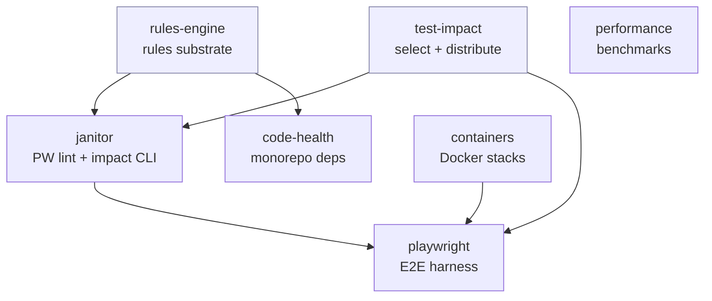

# packages/testing

n8n's **test platform** — the infrastructure that decides what to test, runs it, and measures it. Each package is one concern; they compose rather than overlap.

## Packages

| Package | Name | Purpose | Entry point | Consumed by |
|---|---|---|---|---|
| **rules-engine** | `@n8n/rules-engine` | Generic, typed rules engine for static-analysis tools (register → run → report). The shared substrate. | library | janitor, code-health |
| **test-impact** | `@n8n/test-impact` | Test Impact Analysis: build the coverage→impact map, select impacted specs, distribute them across shards. Framework-agnostic. | library | janitor (CLI), playwright |
| **janitor** | `@n8n/playwright-janitor` | Static analysis + architecture enforcement for the Playwright suite; also hosts the impact/orchestrate CLI used by CI. | `janitor` CLI | playwright, CI |
| **code-health** | `@n8n/code-health` | Static analysis for monorepo dependency hygiene. | `code-health` CLI | CI |
| **containers** | `n8n-containers` | Composable Docker stack for tests (sqlite / postgres / queue / multi-main / observability / kafka …). | `stack:*` scripts | playwright, local dev |
| **playwright** | `n8n-playwright` | The E2E harness — page objects, composables, fixtures, and the shard distributor that drives CI. | `test:*` scripts | CI, local dev |
| **performance** | `@n8n/performance` | Microbenchmarks for critical code paths (`bench`, baseline, compare). | `bench:*` scripts | CI (nightly), local |

## How they fit together

- **Static-analysis lane:** `rules-engine` (substrate) → `janitor` (Playwright architecture) and `code-health` (monorepo deps).
- **Selection lane:** `test-impact` (coverage map → select → distribute) feeds the janitor CLI and the playwright shard distributor.
- **Execution lane:** `playwright` runs E2E against `containers`-provided stacks.
- **Performance lane:** `performance` is standalone (benchmarks).

## Where to look (quick nav for humans + agents)

| I want to… | Go to |
|---|---|
| change which E2E specs a PR runs (impact map, selection, sharding) | `test-impact/` (+ `janitor` CLI `select` / `distribute`) |
| add/modify an architecture-lint rule for tests | `janitor/src/rules/` (engine: `rules-engine/`) |
| write or fix an E2E test, page object, or fixture | `playwright/` (see its `AGENTS.md`) |
| spin a DB/queue/multi-main stack for a test | `containers/` (`stack:*`) |
| add a microbenchmark | `performance/` |
| enforce a monorepo dependency rule | `code-health/` |

Per-package detail lives in each package's own `README.md` (and `playwright/AGENTS.md`).
