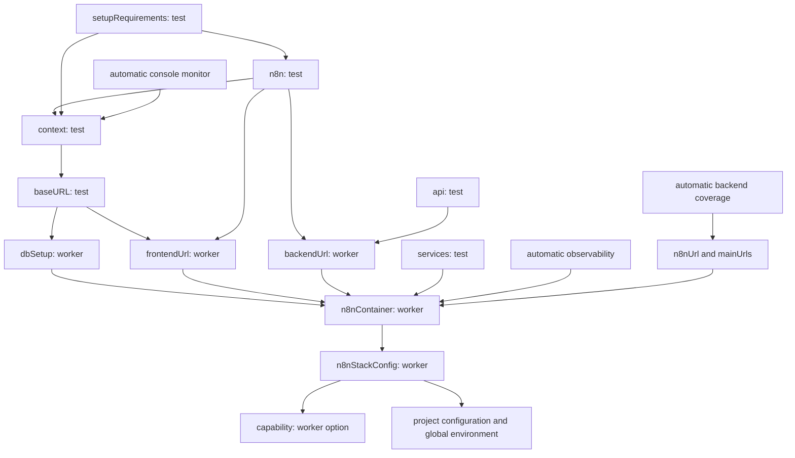

# Harness baseline

This reference records the fixture contracts and remaining evidence for [DEVP-1064](https://linear.app/n8n/issue/DEVP-1064).
The source baseline is `33eb5c196e0ce3a2c71525929a4ef861cb94b168`.
The parent plan is [DEVP-1063](https://linear.app/n8n/issue/DEVP-1063).

## Consumer contracts

`pnpm test:harness` runs six Vitest cases. Each case starts a real Playwright process that imports `fixtures/base.ts`.
The process uses an isolated configuration, one worker, zero retries, and an allowlisted environment.
It does not inherit application endpoints, provider credentials, proxy settings, or telemetry configuration.
The supplied quarantine list is empty. No live quarantine request is needed.

| Consumer | Required evidence |
| --- | --- |
| API only | Authentication precedes a checked request. The body runs and the process exits successfully. |
| UI only | Separate loopback frontend/backend ports preserve browser authentication. The supplied page works. |
| Combined | API and UI requests use the intended member identity. All resets precede the body. |
| Service only | The production service fixture exposes a supplied Mailpit client. Its clear/list operations reach the server. |
| Body failure | The process fails. The original error and a unique browser-console marker remain in the report. |
| Bootstrap failure | The reset request fails. The body does not run. The original setup error remains in the report. |

Every case checks that acquired loopback servers close and launched browsers report process exit.
The driver has an outer safety timeout and removes its temporary files.
The two deliberate failures must produce nonzero child exit codes. They are not Playwright expected-failure tests.

## Proof boundaries

The suite replaces only infrastructure acquisition, the supplied frontend URL, and the quarantine list.
It retains the production API, UI, bootstrap, service, and diagnostic fixtures.

| Covered | Not covered |
| --- | --- |
| Playwright fixture resolution and consumer wiring | Real Docker acquisition, readiness, and resource removal |
| API/browser cookie plumbing | n8n authorization and database semantics |
| Owned support-server teardown | Cleanup correctness inside `createN8NStack()` |
| Original failure and console attachment | Every production diagnostic collector |
| Observed reset order | Process-local state reset or session invalidation |

The fake backend does not invalidate sessions on reset. Duplicate resets remain a known defect, not a passing contract.
The support stack rejects unsupported field access. It is not a complete `N8NStack` implementation.
The process-group cleanup currently targets Linux and macOS.

Chromium must already be installed with the package's `install-browsers` command or Playwright's normal installation command.
The runner prefers the package-local browser directory when present.
The driver lives beside the framework consumers at `tests/framework/harness-contract.test.ts`.
It is not a product Playwright spec because it does not use the `.spec.ts` suffix.
These tests use `vitest.harness.config.ts`. They are separate from browser-free `test:unit` jobs.
`tests/framework/consumers.ts` is synthetic input, not a product `.spec.ts` file.
It is absent from product discovery and the application project list.

## Local observations

One local sample used Node 24.20.0, pnpm 11.25.0, Playwright 1.62.1, and Vitest 4.1.9 on macOS.
All six contracts passed. These counts describe current behavior. They are not required future counts.

| Consumer | Browser launches | Reset requests | Login requests | Closed support servers |
| --- | ---: | ---: | ---: | ---: |
| API only | 1 | 1 | 1 | 1 |
| UI only | 1 | 1 | 1 | 2 |
| Combined | 1 | 3 | 2 | 1 |
| Service only | 1 | 1 | 0 | 1 |
| Body failure | 1 | 1 | 1 | 1 |
| Bootstrap failure | 0 | 1 | 0 | 1 |

The whole local run took approximately 17 seconds. This includes subprocess and browser startup against synthetic endpoints.
It is not an n8n startup benchmark. Matched real-runtime timing remains outstanding.
The verbose runner output records reset/login counts and the Playwright attempt duration for each case.
Attempt duration does not include all worker startup. A zero bootstrap-failure duration is not zero setup cost.

## Discovery baseline

| Inventory | Count | Meaning |
| --- | ---: | --- |
| Tracked product spec files | 263 | 222 E2E, 25 infrastructure, 10 performance, 3 evals, 2 dev-server, 1 CLI workflow |
| `multi-main:e2e` listed spec files | 222 | Playwright list output, not an impact-selected CI shard |
| Listed tests | 981 | 934 expected-passed and 47 expected-skipped |
| Listed skip annotations | 44 fixme, 3 skip | Static expectations, not runtime results |
| Janitor discovered specs | 244 | 64 with capability tags and 180 without |
| Janitor inventory | 9 fixtures, 19 services, 25 helpers | Static inventory, not a complete runtime dependency graph |

The list report contains no execution results. Expected-passed does not mean passed.
Runtime conditional skips and Currents actions can change execution. The list report does not establish the live quarantine count.
The production quarantine fixture uses the fallback webhook only when Currents reporting is not configured.
Discovery extracts capability tags from titles. It does not resolve every runtime configuration override.

## Fixture dependency reference

Arrows mean "requires". This diagram records important paths, including automatic fixtures.

The automatic console monitor activates the browser path even for API/service-only consumers.
That path also activates `dbSetup`. Removing the browser dependency must not accidentally remove required bootstrap.
The combined consumer calls `setupFromTags()` independently through API and UI fixtures. This causes duplicate per-test resets.
The coverage `context` override depends on its parent fixture. It is not a self-cycle.

Numerical cognitive/cyclomatic scores and complete graph fan-in/fan-out are not measured in this baseline yet.
The static inventory cannot substitute for resolved fixture inheritance and automatic activation.

## Requirements migration inventory

There are 27 consumer specs, 19 direct type consumers, and 57 textual `setupRequirements(` calls.
Textual calls do not equal independent journeys. Three shared configuration modules also require migration.
Paths below are relative to `tests/e2e/`.

| Area | Consumer specs |
| --- | --- |
| AI (7) | `ai/assistant-basic.spec.ts`, `ai/assistant-code-help.spec.ts`, `ai/assistant-credential-help.spec.ts`, `ai/assistant-support-chat.spec.ts`, `ai/builder-setup-wizard.spec.ts`, `ai/eval-collections-compare.spec.ts`, `ai/workflow-builder.spec.ts` |
| App configuration (5) | `app-config/demo-reimport.spec.ts`, `app-config/demo.spec.ts`, `app-config/nps-survey.spec.ts`, `app-config/security-notifications.spec.ts`, `app-config/versions.spec.ts` |
| Auth, Cloud, Instance AI (3) | `auth/authenticated.spec.ts`, `cloud/cloud.spec.ts`, `instance-ai/open-by-default.spec.ts` |
| Regression (5) | `regression/ADO-1338-ndv-missing-input-panel.spec.ts`, `regression/ADO-2929-can-load-old-switch-node-workflows.spec.ts`, `regression/ADO-4462-template-setup-experiment.spec.ts`, `regression/SUG-121-fields-reset-after-closing-ndv.spec.ts`, `regression/SUG-38-inline-expression-preview.spec.ts` |
| Workflows (7) | `workflows/demo-diff.spec.ts`, `workflows/demo-executable-chat-trigger.spec.ts`, `workflows/editor/canvas/focus-panel.spec.ts`, `workflows/editor/execution/logs.spec.ts`, `workflows/editor/ndv/pinning.spec.ts`, `workflows/templates/credentials-setup.spec.ts`, `workflows/templates/templates.spec.ts` |

Shared modules: `config/ai-assistant-fixtures.ts`, `config/ai-builder-fixtures.ts`, and `config/ai-builder-wizard-fixtures.ts`.
The migration also includes `Types.ts`, the base fixture, the requirements helper, and documentation references.

DEVP-1073 combines this migration with architecture enforcement. Its one-PR size is a risk, not an approved split.
Each consumer still needs a mapping from setup fields to preserved behavioral assertions before migration starts.

## Remaining acceptance evidence

- Real application sentinels with the production stack, without the support override.
- Matched n8n startup/bootstrap timings, runner identity, sample counts, and service source.
- Runtime quarantine and conditional-skip evidence for the selected workload.
- Complete fixture graph metrics and reproducible function-complexity measurements.
- Per-consumer setup/assertion mapping and a reviewable scope decision for each later ticket.

Historical CI results in the parent are context, not substitutes for these measurements.
This initial suite does not by itself complete DEVP-1064.

## Commands

All commands run from `packages/testing/playwright`. Discovery and listing do not execute application tests.

| Purpose | Command |
| --- | --- |
| Fixture contracts | `pnpm test:harness --reporter=verbose --silent=false` |
| Browser-free unit suite | `pnpm test:unit` |
| Types | `pnpm typecheck` |
| Lint | `pnpm lint` |
| Static discovery | `pnpm janitor discover` |
| Static inventory | `pnpm janitor inventory` |
| Product test list | `env -u N8N_BASE_URL -u N8N_BACKEND_URL -u N8N_EDITOR_URL pnpm exec playwright test --list --project=multi-main:e2e --reporter=json` |

Do not use these measurements to justify fewer required tests, weaker assertions, or weaker isolation.
