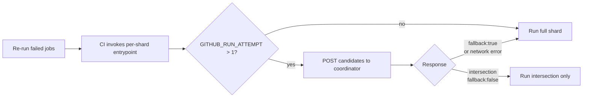

# Custom Test Orchestration

Capability-aware test distribution across CI shards.

## How It Works

| Step | What Happens |
|------|--------------|
| 1. Discovery | `pnpm janitor discover` (AST-based, detects `test.fixme()`/`test.skip()` automatically) |
| 2. Metrics | Get `avgDuration` per spec from Currents (last 30 days) |
| 3. Default | Missing specs get **60s** default (accounts for container startup) |
| 4. Group | Group specs by `@capability:xxx` tag for worker reuse |
| 5. Effective Duration | Calculate actual time accounting for container reuse within groups |
| 6. Split | If a group exceeds **5 min**, split into sub-groups |
| 7. Bin Pack | Greedy assign groups + standard specs to lightest shard |

### Why Group by Capability?

Tests requiring containers (proxy, email, etc.) include ~20s startup overhead. When grouped on the same shard, only the first test pays this cost - the rest reuse the worker.

**Example:** 15 proxy tests across 8 shards = 8 container starts (160s). Grouped on 2 shards = 2 starts (40s). **Saves 120s.**

### Self-Balancing

Metrics auto-correct over time. As grouped tests run, they report actual execution time (not startup overhead), so future distributions become more accurate.

## Writing Tests with Capabilities

### 1. Use capability option (enables worker reuse)

```typescript
// String capability - maps to predefined config
test.use({ capability: 'proxy' });

// Custom config - full control over container settings
test.use({
  capability: {
    proxyServerEnabled: true,
    env: { MY_VAR: 'value' },
  },
});
```

### 2. Add @capability tag (required for orchestration grouping)

```typescript
test('My feature @capability:proxy', async ({ page }) => {
  // This test will be grouped with other proxy tests
});

// Or at describe level:
test.describe('Feature @capability:email', () => {
  // All tests inherit the tag
});
```

### Available Capabilities

| Capability | Tag | Containers |
|------------|-----|-----------|
| `'proxy'` | `@capability:proxy` | Proxy server |
| `'email'` | `@capability:email` | Mailpit |
| `'source-control'` | `@capability:source-control` | Git server |
| `'task-runner'` | `@capability:task-runner` | Task runner |
| `'oidc'` | `@capability:oidc` | OIDC provider |
| `'observability'` | `@capability:observability` | VictoriaLogs + VictoriaMetrics + Vector |

## Modes vs Capabilities

**Capabilities** (`@capability:X`) are add-on features you can combine with any infrastructure:
- Use `test.use({ capability: 'proxy' })` to configure the worker
- Add-on containers (proxy, email, gitea, etc.) spin up alongside n8n

**Modes** (`@mode:X`) define the infrastructure configuration itself:
- `@mode:postgres` - n8n with PostgreSQL database (vs default sqlite)
- `@mode:queue` - n8n with EXECUTIONS_MODE=queue (workers via Bull, rarely used as tag)
- `@mode:multi-main` - n8n HA setup with leader election (implies queue mode)

Most e2e tests run against ALL modes via projects (`sqlite:e2e`, `postgres:e2e`, etc).
Use `@mode:X` only for tests that ONLY work with a specific infrastructure.

```typescript
// Capability - add-on feature
test.use({ capability: 'proxy' });
test('API mocking @capability:proxy', ...);

// Mode - infrastructure requirement (no test.use needed, project handles it)
test('Postgres-specific test @mode:postgres', ...);

// Combined - capability ON a specific mode
test.use({ capability: 'observability' });
test('Multi-main logs @capability:observability @mode:multi-main', ...);
```

Both `@capability:X` and `@mode:X` tests are skipped in local mode (they require containers).

## Temporarily Disabling Tests

Use `test.fixme()` to mark tests that need fixing. The janitor's `discover` command detects `test.fixme()` and `test.skip()` calls via AST analysis and automatically excludes them from CI distribution.

```typescript
// Individual test
test.fixme('broken test', async ({ n8n }) => {
  // Excluded from CI distribution automatically
});

// Entire describe block
test.describe('Feature', () => {
  test.fixme(); // Marks all tests in this block

  test('test 1', async ({ n8n }) => { ... });
  test('test 2', async ({ n8n }) => { ... });
});
```

## Attempt-Aware Retry Filtering

When a Playwright shard fails in CI and the user clicks **Re-run failed jobs**, GitHub re-runs the shard's full manifest by default. Janitor's per-shard entrypoint (`orchestrate --shard-index=<i>`) can shrink that to just the specs that actually failed in the previous attempt.

### How it works



1. CI calls `janitor orchestrate --shards=N --shard-index=K` for each shard.
2. When `GITHUB_RUN_ATTEMPT > 1` and `orchestration.retry.coordinatorUrl` is set, the entrypoint POSTs `{ runId, previousAttempt, candidates }` to the coordinator.
3. The coordinator (an n8n workflow) looks up the previous attempt's Currents run, intersects the failed specs with this shard's candidates, and returns the subset.
4. The shard runs only those specs. All failure modes (no previous run, no failures, no intersection, coordinator error, timeout) fall back to the full shard.

### Configuration

```js
// janitor.config.mjs
orchestration: {
  retry: {
    coordinatorUrl: process.env.JANITOR_RETRY_COORDINATOR_URL
      ?? 'https://internal.users.n8n.cloud/webhook/failed-specs',
    timeoutMs: 2_000, // optional, defaults to 2s
  },
}
```

Set `JANITOR_RETRY_COORDINATOR_URL=''` to disable filtering (e.g. fork PRs where the internal webhook isn't reachable).

### Coordinator contract

The coordinator is the abstraction seam — swap it later if Currents is replaced.

**Request** — `POST {coordinatorUrl}`:

```json
{
  "runId": "26450220703",
  "previousAttempt": "1",
  "candidates": ["tests/e2e/workflows/executions/filter.spec.ts"]
}
```

**Response** — always `200`:

```json
{
  "intersection": ["tests/e2e/workflows/executions/filter.spec.ts"],
  "fallback": false,
  "fallbackReason": null
}
```

When `fallback: true`, the `intersection` field still holds a safe list to run (the full candidate set), so the client can trust the list unconditionally.

### Required environment variables (CI)

- `GITHUB_RUN_ATTEMPT` — triggers the filter when `> 1`
- `GITHUB_RUN_ID` — used by the coordinator to locate the previous attempt's Currents run

Both are set automatically by GitHub Actions.

## Refreshing Metrics

```bash
CURRENTS_API_KEY=<key> node packages/testing/playwright/scripts/fetch-currents-metrics.mjs --project=<id>
```

This fetches the last 30 days of test durations from Currents, aggregates by spec, and writes to `.github/test-metrics/playwright.json`.

**When to refresh:**
- Weekly (recommended)
- After significant test changes
- When adding new specs (optional - they get 60s default)

## Architecture

```
janitor orchestrate (generic)          distribute-tests.mjs (n8n CI adapter)
┌──────────────────────────┐          ┌──────────────────────────┐
│ AST discovery            │          │ Calls janitor orchestrate│
│ Metrics loading          │   JSON   │ Maps capabilities →      │
│ Capability grouping      │ ──────→  │   Docker images          │
│ Group splitting          │          │ Adds container overhead  │
│ Greedy bin-packing       │          │ Outputs GH Actions matrix│
└──────────────────────────┘          └──────────────────────────┘
```

The janitor handles generic orchestration (works for any Playwright project).
`distribute-tests.mjs` is n8n's CI adapter that maps capabilities to Docker images.

## Scripts

| Script | Purpose |
|--------|---------|
| `scripts/distribute-tests.mjs` | CI adapter — calls janitor, maps images, outputs matrix |
| `scripts/fetch-currents-metrics.mjs` | Fetches metrics from Currents API |

### Testing Locally

```bash
# Janitor orchestration (generic output)
pnpm janitor orchestrate --shards=14

# CI adapter (n8n-specific output with Docker images)
node scripts/distribute-tests.mjs --matrix 14 --orchestrate

# Get specs for shard 0
node scripts/distribute-tests.mjs 14 0
```

## Troubleshooting

| Problem | Solution |
|---------|----------|
| Specs not running | Check path matches janitor test patterns in `janitor.config.mjs` |
| Unbalanced shards | Refresh metrics - durations may have drifted |
| Worker not reused | Use string capabilities like `'proxy'`, not inline objects |
