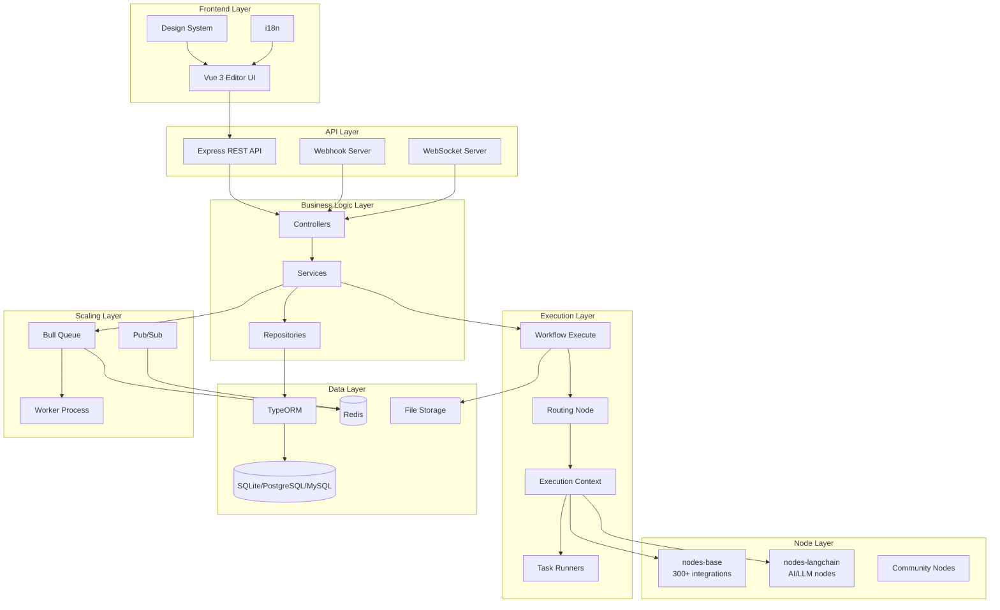
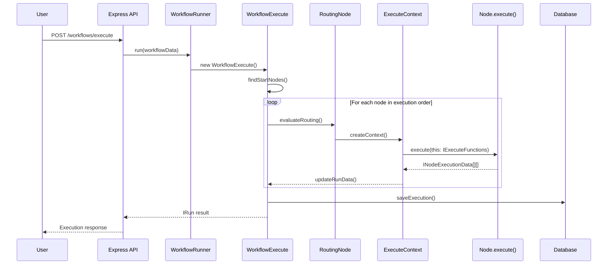
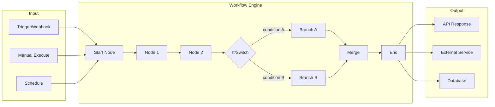
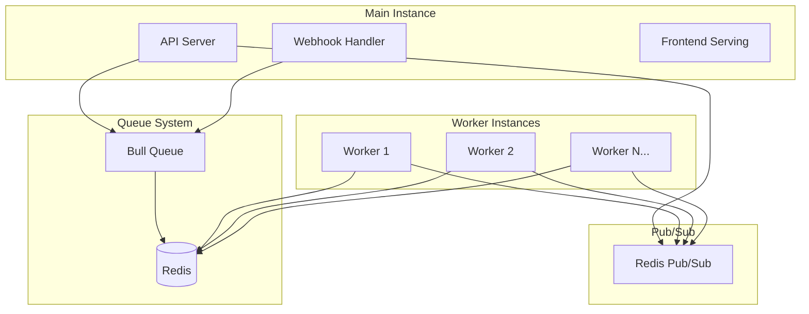

# Architecture Overview - n8n Workflow Automation Platform

## TL;DR
n8n là một workflow automation platform được xây dựng trên TypeScript monorepo với kiến trúc phân tách rõ ràng: **Core Engine** (thực thi workflow), **CLI/Server** (REST API + database), **Nodes** (300+ integrations), và **Frontend** (Vue 3 editor). Hệ thống hỗ trợ scaling horizontal qua queue mode với Redis.

---

## High-Level Architecture Diagram



---

## Monorepo Package Structure

```mermaid
graph LR
    subgraph "Core Packages"
        WF[n8n-workflow<br/>Domain Model]
        CORE[n8n-core<br/>Execution Engine]
        CLI[n8n<br/>CLI + Server]
    end

    subgraph "Node Packages"
        NB[nodes-base<br/>Built-in Nodes]
        NLC[nodes-langchain<br/>AI Nodes]
    end

    subgraph "Frontend Packages"
        EDITOR[editor-ui<br/>Vue 3 App]
        DESIGN[@n8n/design-system]
        STORES[@n8n/stores]
    end

    subgraph "Utility Packages"
        DI[@n8n/di<br/>Dependency Injection]
        CONFIG[@n8n/config<br/>Configuration]
        TYPES[@n8n/api-types<br/>Shared Types]
        DB[@n8n/db<br/>Database Layer]
    end

    CLI --> CORE
    CLI --> WF
    CLI --> NB
    CLI --> NLC
    CLI --> DB

    CORE --> WF
    NB --> WF
    NLC --> WF

    EDITOR --> DESIGN
    EDITOR --> STORES
    EDITOR --> TYPES

    CLI --> DI
    CLI --> CONFIG
    CLI --> TYPES
```

---

## Package Details

### Core Packages

| Package | Path | Description | Size |
|---------|------|-------------|------|
| `n8n-workflow` | `packages/workflow` | Workflow domain model, types, expression parser | ~95KB interfaces |
| `n8n-core` | `packages/core` | Execution engine, routing, context | ~86KB main file |
| `n8n` (CLI) | `packages/cli` | Express server, REST API, database | 225+ services |

### Node Packages

| Package | Path | Description |
|---------|------|-------------|
| `n8n-nodes-base` | `packages/nodes-base` | 300+ built-in integration nodes |
| `@n8n/nodes-langchain` | `packages/@n8n/nodes-langchain` | 21 AI/LLM node types |

### Frontend Packages

| Package | Path | Description |
|---------|------|-------------|
| `n8n-editor-ui` | `packages/frontend/editor-ui` | Main Vue 3 application |
| `@n8n/design-system` | `packages/frontend/@n8n/design-system` | Reusable Vue components |
| `@n8n/stores` | `packages/frontend/@n8n/stores` | Pinia state management |

---

## Execution Architecture



---

## Data Flow Architecture



---

## Scaling Architecture



### Execution Modes

1. **In-Process Mode** (Default)
   - Single instance xử lý tất cả
   - Phù hợp development/small deployments

2. **Queue Mode** (Production)
   - Main instance: API + Webhooks + UI
   - Worker instances: Process jobs từ Bull queue
   - Redis: Queue storage + Pub/Sub

---

## File References

| Component | Key File |
|-----------|----------|
| Workflow Model | `packages/workflow/src/workflow.ts` |
| Execution Engine | `packages/core/src/execution-engine/workflow-execute.ts` |
| Routing Logic | `packages/core/src/execution-engine/routing-node.ts` |
| Server Setup | `packages/cli/src/server.ts` |
| Database Layer | `packages/@n8n/db/src/` |
| Frontend Entry | `packages/frontend/editor-ui/src/main.ts` |

---

## Key Takeaways

1. **Monorepo Architecture**: Sử dụng pnpm workspaces với Turbo build orchestration, cho phép phát triển độc lập từng package nhưng vẫn share code hiệu quả.

2. **Separation of Concerns**: Rõ ràng phân tách giữa domain model (`workflow`), execution engine (`core`), và API layer (`cli`).

3. **Extensible Node System**: Plugin architecture cho phép thêm nodes mới mà không cần sửa core engine.

4. **Horizontal Scaling**: Bull queue + Redis cho phép scale worker processes theo nhu cầu.

5. **Type Safety**: TypeScript throughout với shared types package (`@n8n/api-types`) đảm bảo consistency giữa frontend và backend.
