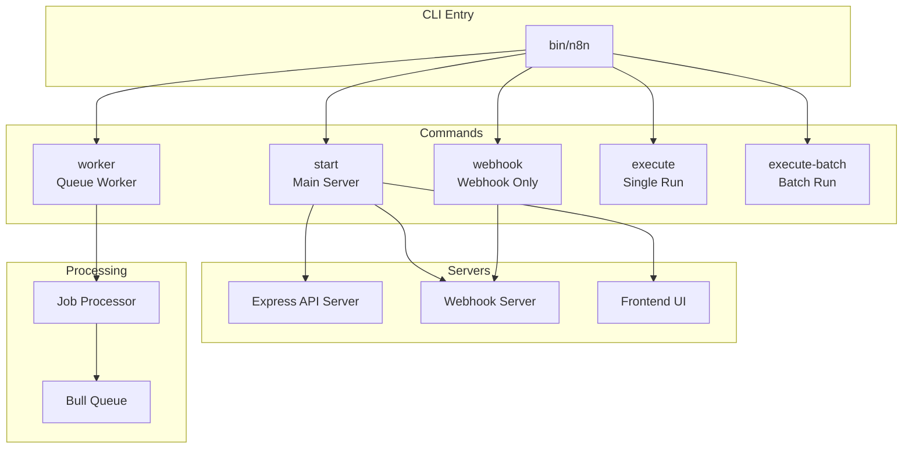
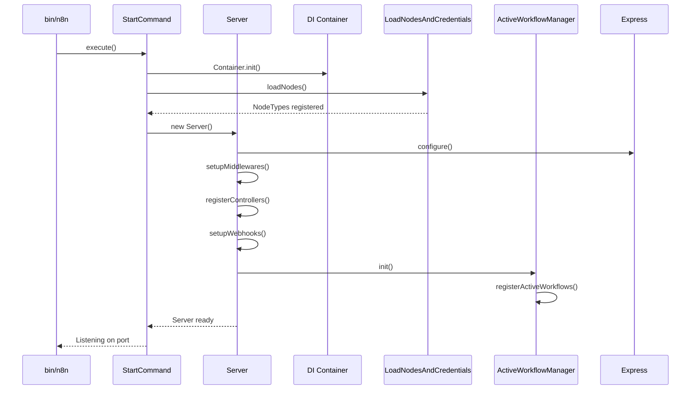
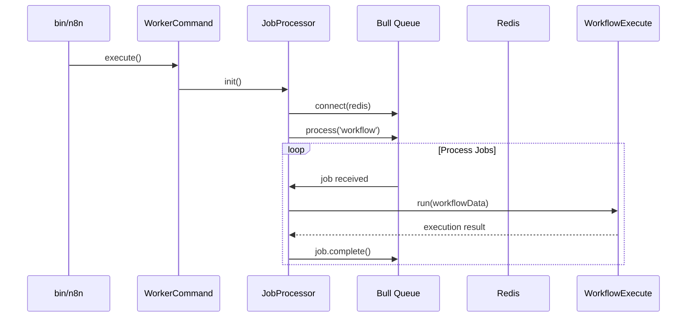
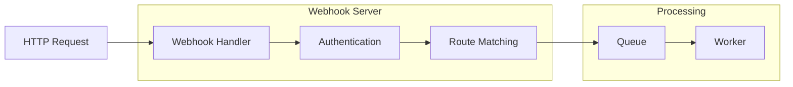
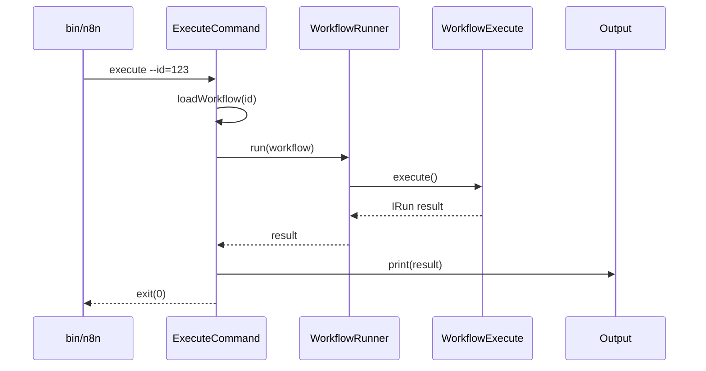
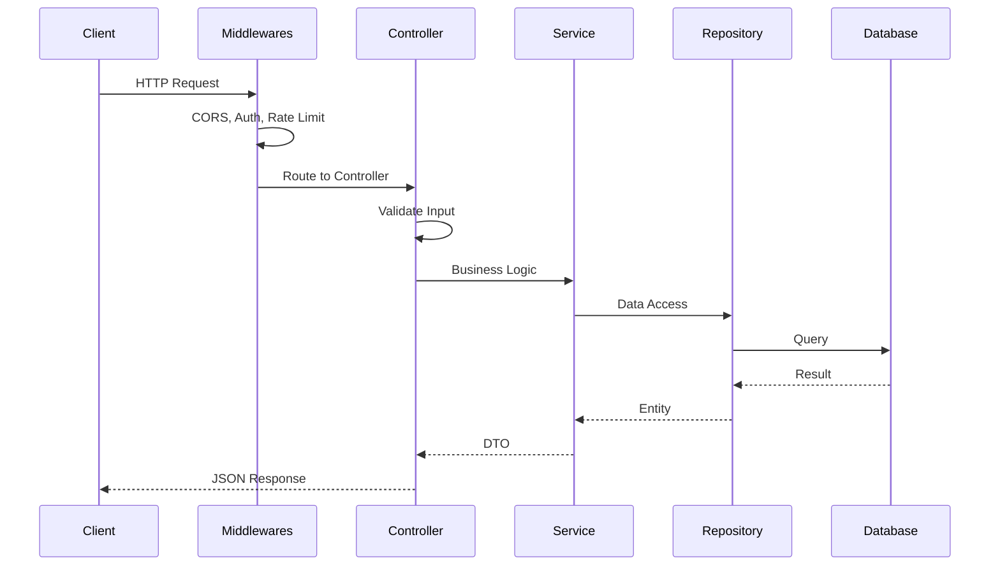
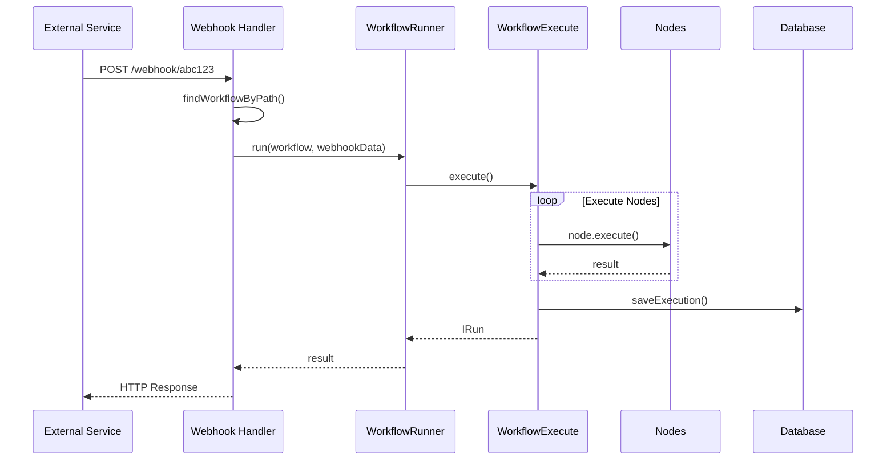
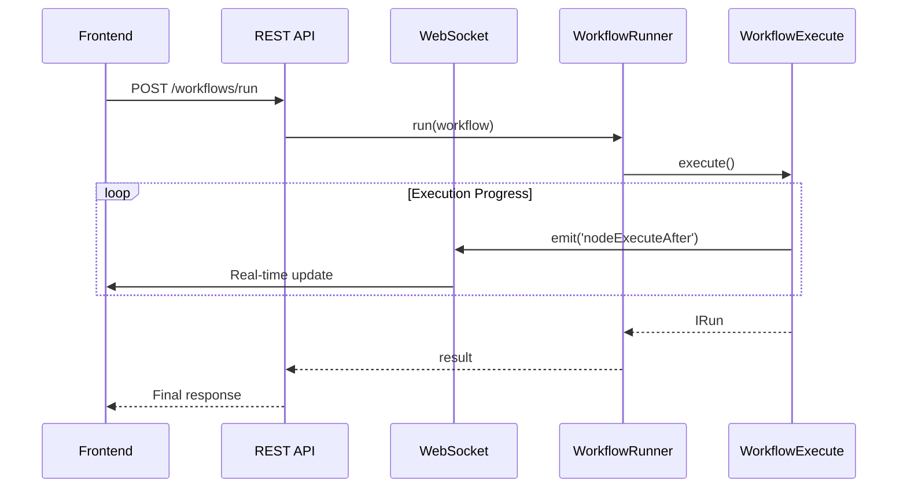

# Entry Points & Main Flows - n8n

## TL;DR
n8n có 5 entry points chính: CLI commands (`start`, `worker`, `webhook`, `execute`, `execute-batch`). Main flow bắt đầu từ `bin/n8n` → khởi tạo DI container → load nodes → start Express server → register webhooks → serve UI. Worker mode tách riêng xử lý job từ queue.

---

## Entry Points Overview



---

## 1. Main Server Entry (`n8n start`)

### Startup Flow



### Code Flow

**File:** `packages/cli/bin/n8n`
```typescript
#!/usr/bin/env node
// Entry point - delegates to oclif CLI framework
require('@oclif/core').run()
```

**File:** `packages/cli/src/commands/start.ts`
```typescript
export class Start extends BaseCommand {
  async run(): Promise<void> {
    // 1. Initialize configuration
    const config = Container.get(GlobalConfig);

    // 2. Load nodes and credentials
    const loader = Container.get(LoadNodesAndCredentials);
    await loader.init();

    // 3. Initialize database
    await Container.get(Init).init();

    // 4. Start server
    const server = Container.get(Server);
    await server.start();

    // 5. Initialize active workflows (triggers, webhooks)
    const activeWorkflowManager = Container.get(ActiveWorkflowManager);
    await activeWorkflowManager.init();

    // 6. Mark ready
    this.logger.info(`n8n ready on port ${config.port}`);
  }
}
```

**File:** `packages/cli/src/server.ts`
```typescript
@Service()
export class Server extends AbstractServer {
  async start(): Promise<void> {
    // 1. Create Express app
    this.app = express();

    // 2. Setup security middlewares
    this.app.use(helmet());
    this.app.use(cors(this.corsOptions));

    // 3. Setup authentication
    await this.setupAuth();

    // 4. Register API controllers
    this.registerControllers();

    // 5. Setup webhook server
    await this.setupWebhookServer();

    // 6. Serve frontend (or proxy in dev)
    this.setupFrontend();

    // 7. Start listening
    await this.listen();
  }

  private registerControllers(): void {
    // Register all REST API controllers
    const controllers = [
      WorkflowsController,
      ExecutionsController,
      CredentialsController,
      NodeTypesController,
      AIController,
      // ... 30+ controllers
    ];

    controllers.forEach(ctrl => {
      Container.get(ctrl).registerRoutes(this.app);
    });
  }
}
```

---

## 2. Worker Entry (`n8n worker`)

### Worker Flow



### Code Flow

**File:** `packages/cli/src/commands/worker.ts`
```typescript
export class Worker extends BaseCommand {
  async run(): Promise<void> {
    // 1. Initialize (same as start)
    await this.initCore();

    // 2. Get job processor
    const jobProcessor = Container.get(JobProcessor);

    // 3. Register job handler
    await jobProcessor.init();

    // 4. Start processing
    this.logger.info('Worker started, waiting for jobs...');
  }
}
```

**File:** `packages/cli/src/scaling/job-processor.ts`
```typescript
@Service()
export class JobProcessor {
  constructor(
    private queue: Queue,
    private workflowRunner: WorkflowRunner,
  ) {}

  async init(): Promise<void> {
    // Register processor for workflow jobs
    this.queue.process('workflow', async (job) => {
      return this.processWorkflowJob(job);
    });
  }

  private async processWorkflowJob(job: Job): Promise<void> {
    const { workflowData, executionId } = job.data;

    // Execute workflow
    const result = await this.workflowRunner.run(
      workflowData,
      undefined,
      executionId,
    );

    return result;
  }
}
```

---

## 3. Webhook Entry (`n8n webhook`)

### Webhook-Only Mode



**File:** `packages/cli/src/commands/webhook.ts`
```typescript
export class Webhook extends BaseCommand {
  async run(): Promise<void> {
    // Start webhook server only (no UI, no API)
    const webhookServer = Container.get(WebhookServer);
    await webhookServer.start();

    // Jobs are queued for workers to process
    this.logger.info('Webhook server ready');
  }
}
```

---

## 4. Execute Entry (`n8n execute`)

### Direct Execution



**File:** `packages/cli/src/commands/execute.ts`
```typescript
export class Execute extends BaseCommand {
  static flags = {
    id: Flags.string({ description: 'Workflow ID to execute' }),
    file: Flags.string({ description: 'Workflow JSON file path' }),
  };

  async run(): Promise<void> {
    const { flags } = await this.parse(Execute);

    // 1. Load workflow
    let workflow: IWorkflowBase;
    if (flags.id) {
      workflow = await this.loadWorkflowFromDb(flags.id);
    } else if (flags.file) {
      workflow = await this.loadWorkflowFromFile(flags.file);
    }

    // 2. Execute directly (no queue)
    const runner = Container.get(WorkflowRunner);
    const result = await runner.run(workflow, LoadMode.direct);

    // 3. Output result
    this.log(JSON.stringify(result, null, 2));

    // 4. Exit with appropriate code
    process.exit(result.finished ? 0 : 1);
  }
}
```

---

## 5. Batch Execute Entry (`n8n execute-batch`)

**File:** `packages/cli/src/commands/execute-batch.ts`
```typescript
export class ExecuteBatch extends BaseCommand {
  async run(): Promise<void> {
    const { flags } = await this.parse(ExecuteBatch);

    // 1. Get workflows to execute
    const workflows = await this.getWorkflows(flags);

    // 2. Execute in parallel with concurrency limit
    const results = await pMap(
      workflows,
      async (workflow) => {
        const runner = Container.get(WorkflowRunner);
        return runner.run(workflow);
      },
      { concurrency: flags.concurrency || 5 }
    );

    // 3. Report results
    this.reportResults(results);
  }
}
```

---

## Main Request Flows

### 1. API Request Flow



### 2. Webhook Execution Flow



### 3. Manual Execution Flow (from UI)



---

## File References

| Entry Point | File Path |
|-------------|-----------|
| CLI Entry | `packages/cli/bin/n8n` |
| Start Command | `packages/cli/src/commands/start.ts` |
| Worker Command | `packages/cli/src/commands/worker.ts` |
| Webhook Command | `packages/cli/src/commands/webhook.ts` |
| Execute Command | `packages/cli/src/commands/execute.ts` |
| Server Class | `packages/cli/src/server.ts` |
| Job Processor | `packages/cli/src/scaling/job-processor.ts` |

---

## Key Takeaways

1. **Multiple Entry Points**: n8n hỗ trợ nhiều chế độ chạy khác nhau cho các use case khác nhau (development, production, CLI tools).

2. **Modular Startup**: Server initialization được chia thành các bước rõ ràng, dễ customize và extend.

3. **Queue-Based Scaling**: Worker mode cho phép tách biệt API server và execution workers, scale independently.

4. **Graceful Handling**: Mỗi entry point đều có proper error handling và cleanup procedures.

5. **DI Container**: Toàn bộ initialization sử dụng Dependency Injection, làm cho code testable và maintainable.
