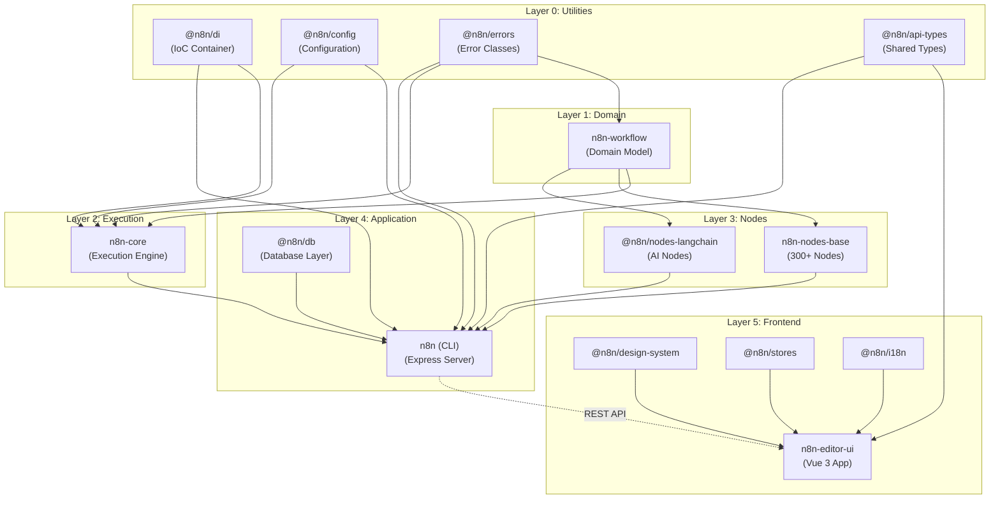
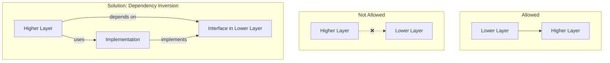
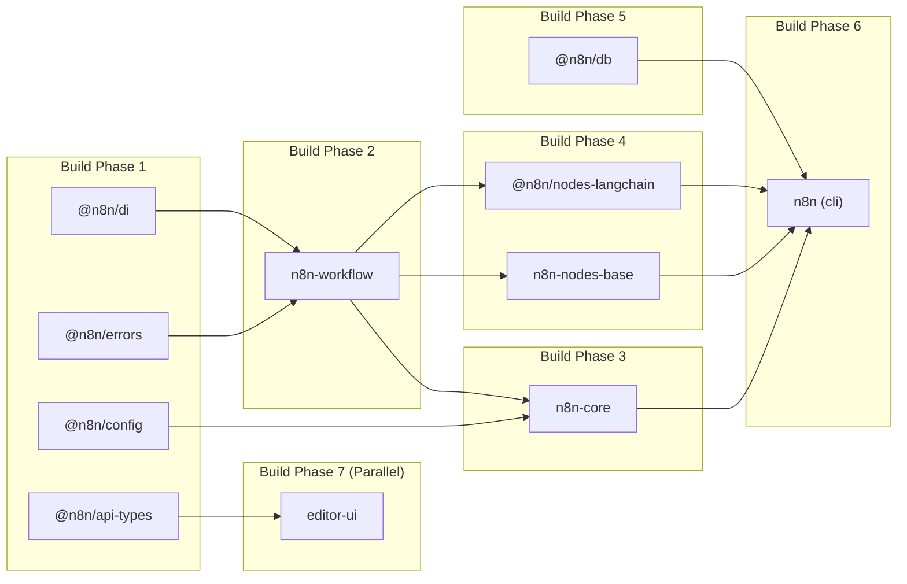

# Module Dependency Graph - n8n

## TL;DR
n8n monorepo có dependency hierarchy rõ ràng: `workflow` (base) → `core` (execution) → `cli` (API layer). Nodes packages phụ thuộc vào `workflow` để implement interfaces. Frontend hoàn toàn tách biệt, chỉ giao tiếp qua REST API. Utility packages (`@n8n/di`, `@n8n/config`) được share across all packages.

---

## Complete Dependency Graph



---

## Package Dependency Details

### Core Packages

#### n8n-workflow
```json
{
  "name": "n8n-workflow",
  "dependencies": {
    "@n8n/errors": "workspace:*"
  },
  "peerDependencies": {}
}
```

**Purpose:** Base package, no internal dependencies
- Defines all workflow interfaces (`INode`, `IWorkflow`, `IConnection`)
- Expression parser
- Graph traversal utilities

#### n8n-core
```json
{
  "name": "n8n-core",
  "dependencies": {
    "n8n-workflow": "workspace:*",
    "@n8n/di": "workspace:*",
    "@n8n/config": "workspace:*",
    "@n8n/errors": "workspace:*"
  }
}
```

**Purpose:** Execution engine
- Uses workflow model để execute
- Provides execution context to nodes
- Manages node lifecycle

#### n8n (CLI)
```json
{
  "name": "n8n",
  "dependencies": {
    "n8n-core": "workspace:*",
    "n8n-workflow": "workspace:*",
    "n8n-nodes-base": "workspace:*",
    "@n8n/nodes-langchain": "workspace:*",
    "@n8n/di": "workspace:*",
    "@n8n/config": "workspace:*",
    "@n8n/db": "workspace:*",
    "@n8n/api-types": "workspace:*"
  }
}
```

**Purpose:** Application entry point
- Depends on ALL core packages
- Orchestrates everything together

---

### Node Packages

#### n8n-nodes-base
```json
{
  "name": "n8n-nodes-base",
  "dependencies": {
    "n8n-workflow": "workspace:*"
  }
}
```

**Key Pattern:** Nodes chỉ depend on `n8n-workflow`
- Implement `INodeType` interface
- Use types từ workflow package
- NO direct dependency on core/cli

#### @n8n/nodes-langchain
```json
{
  "name": "@n8n/nodes-langchain",
  "dependencies": {
    "n8n-workflow": "workspace:*",
    "@langchain/core": "^0.3.0",
    "@langchain/anthropic": "^0.3.0",
    "@langchain/openai": "^0.3.0"
  }
}
```

**Key Pattern:** AI nodes add LangChain ecosystem
- Same interface as regular nodes
- Additional LLM provider dependencies

---

### Frontend Packages

```mermaid
graph LR
    subgraph "Frontend Monorepo"
        EDITOR[editor-ui]
        DESIGN[@n8n/design-system]
        STORES[@n8n/stores]
        I18N[@n8n/i18n]
        CHAT[@n8n/chat]
        REST[@n8n/rest-api-client]
        COMP[@n8n/composables]
    end

    DESIGN --> EDITOR
    STORES --> EDITOR
    I18N --> EDITOR
    CHAT --> EDITOR
    REST --> EDITOR
    COMP --> EDITOR

    subgraph "External"
        VUE[Vue 3]
        PINIA[Pinia]
        VITE[Vite]
    end

    VUE --> EDITOR
    VUE --> DESIGN
    PINIA --> STORES
    VITE --> EDITOR
```

#### n8n-editor-ui
```json
{
  "dependencies": {
    "@n8n/design-system": "workspace:*",
    "@n8n/stores": "workspace:*",
    "@n8n/i18n": "workspace:*",
    "@n8n/api-types": "workspace:*",
    "vue": "^3.4.0",
    "pinia": "^2.1.0"
  }
}
```

**Key Pattern:** Frontend completely decoupled
- Only shares types via `@n8n/api-types`
- Communicates via REST API only
- Can be developed independently

---

## Dependency Matrix

| Package | workflow | core | cli | nodes-base | di | config | api-types |
|---------|:--------:|:----:|:---:|:----------:|:--:|:------:|:---------:|
| **n8n-workflow** | - | | | | | | |
| **n8n-core** | ✓ | - | | | ✓ | ✓ | |
| **n8n-nodes-base** | ✓ | | | - | | | |
| **@n8n/nodes-langchain** | ✓ | | | | | | |
| **n8n (cli)** | ✓ | ✓ | - | ✓ | ✓ | ✓ | ✓ |
| **n8n-editor-ui** | | | | | | | ✓ |

---

## Import Patterns

### Correct Pattern: Layer-by-Layer

```typescript
// In n8n-core (Layer 2)
// ✅ Import from Layer 1 (workflow)
import { Workflow, INodeType } from 'n8n-workflow';

// ❌ Never import from Layer 4 (cli)
// import { Server } from 'n8n'; // WRONG!
```

### Correct Pattern: Node Implementation

```typescript
// In nodes-base
// ✅ Only import from n8n-workflow
import {
  INodeType,
  INodeTypeDescription,
  IExecuteFunctions,
  INodeExecutionData,
} from 'n8n-workflow';

// ❌ Never import from n8n-core
// import { WorkflowExecute } from 'n8n-core'; // WRONG!

export class MyNode implements INodeType {
  description: INodeTypeDescription = { /* ... */ };

  async execute(this: IExecuteFunctions): Promise<INodeExecutionData[][]> {
    // Node logic here
  }
}
```

### Correct Pattern: Service in CLI

```typescript
// In packages/cli/src/services/
// ✅ Can import from all lower layers
import { Workflow } from 'n8n-workflow';
import { WorkflowExecute } from 'n8n-core';
import { Container, Service } from '@n8n/di';
import type { IWorkflowDb } from '@n8n/api-types';

@Service()
export class WorkflowService {
  // ...
}
```

---

## Circular Dependency Prevention



### Example: Node needs CLI Service

```typescript
// ❌ WRONG: Node importing from CLI
// packages/nodes-base/nodes/MyNode.ts
import { SomeService } from 'n8n'; // Creates circular dependency!

// ✅ CORRECT: Use interface injection
// packages/workflow/src/interfaces.ts
export interface INodeSupplies {
  someService: ISomeService;
}

// packages/cli/src/services/
// Implementation registered at startup
Container.set('ISomeService', new SomeService());

// packages/nodes-base/nodes/MyNode.ts
// Access via execution context
const service = this.getNodeParameter('someService');
```

---

## Build Order



**Turbo Configuration:** `turbo.json`
```json
{
  "pipeline": {
    "build": {
      "dependsOn": ["^build"],
      "outputs": ["dist/**"]
    }
  }
}
```

---

## File References

| Package | package.json Location |
|---------|----------------------|
| n8n-workflow | `packages/workflow/package.json` |
| n8n-core | `packages/core/package.json` |
| n8n (cli) | `packages/cli/package.json` |
| n8n-nodes-base | `packages/nodes-base/package.json` |
| editor-ui | `packages/frontend/editor-ui/package.json` |
| Turbo Config | `turbo.json` |

---

## Key Takeaways

1. **Strict Layering**: Dependencies flow one direction - từ lower layer lên higher layer. Never reverse.

2. **Workflow as Base**: Package `n8n-workflow` là foundation, tất cả packages khác build on top.

3. **Nodes Isolation**: Node packages chỉ depend on `n8n-workflow`, giữ cho nodes portable và independent.

4. **Frontend Decoupling**: Frontend package hoàn toàn tách biệt, chỉ share types - không share implementation.

5. **DI Enables Testing**: Sử dụng Dependency Injection cho phép mock bất kỳ dependency nào trong tests.

6. **Turbo Orchestration**: pnpm workspaces + Turbo tự động xác định build order dựa trên dependency graph.
