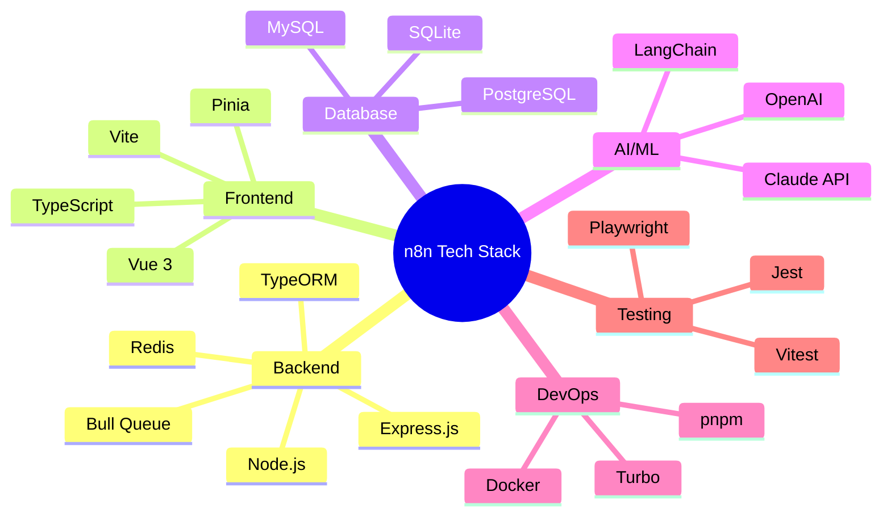

# Tech Stack - n8n

## TL;DR
n8n sử dụng TypeScript full-stack với Express.js backend và Vue 3 frontend. Database layer dùng TypeORM supporting multiple databases (SQLite, PostgreSQL, MySQL). Scaling qua Bull queue + Redis. AI features powered by LangChain ecosystem và Claude API. Build tooling: pnpm + Turbo, testing: Jest + Vitest + Playwright.

---

## Technology Overview



---

## Backend Stack

### Runtime & Framework

| Technology | Version | Purpose |
|------------|---------|---------|
| **Node.js** | 18+ | JavaScript runtime |
| **TypeScript** | 5.x | Type safety |
| **Express.js** | 4.x | HTTP server framework |
| **oclif** | 3.x | CLI framework |

### Core Libraries

```typescript
// packages/cli/package.json - Key dependencies

// Web Framework
"express": "^4.18.0",
"helmet": "^7.0.0",        // Security headers
"cors": "^2.8.5",           // CORS handling
"compression": "^1.7.4",    // Response compression

// Authentication
"passport": "^0.7.0",
"passport-jwt": "^4.0.1",
"jsonwebtoken": "^9.0.0",

// Validation
"class-validator": "^0.14.0",
"class-transformer": "^0.5.1",

// HTTP Client
"axios": "^1.6.0",

// Utilities
"lodash": "^4.17.21",
"luxon": "^3.4.0",          // Date handling
"uuid": "^9.0.0",
```

### Dependency Injection

**Package:** `@n8n/di`
```typescript
// Custom DI container implementation
import { Container, Service } from '@n8n/di';

@Service()
export class MyService {
  constructor(
    private otherService: OtherService,  // Auto-injected
  ) {}
}

// Manual registration
Container.set('IMyInterface', new MyImplementation());

// Resolution
const service = Container.get(MyService);
```

---

## Database Layer

### ORM: TypeORM

```typescript
// packages/@n8n/db/src/entities/workflow-entity.ts
import { Entity, Column, PrimaryColumn, ManyToMany } from 'typeorm';

@Entity('workflow')
export class WorkflowEntity {
  @PrimaryColumn('varchar')
  id: string;

  @Column('varchar')
  name: string;

  @Column('boolean')
  active: boolean;

  @Column('simple-json')
  nodes: INode[];

  @Column('simple-json')
  connections: IConnections;

  @ManyToMany(() => TagEntity)
  tags: TagEntity[];
}
```

### Supported Databases

| Database | Use Case | Configuration |
|----------|----------|---------------|
| **SQLite** | Development, small deployments | Default, no setup needed |
| **PostgreSQL** | Production recommended | Full feature support |
| **MySQL/MariaDB** | Alternative production | Full feature support |

### Database Configuration

```typescript
// Environment-based configuration
DB_TYPE=postgresdb
DB_POSTGRESDB_HOST=localhost
DB_POSTGRESDB_PORT=5432
DB_POSTGRESDB_DATABASE=n8n
DB_POSTGRESDB_USER=n8n
DB_POSTGRESDB_PASSWORD=secret
```

---

## Queue & Scaling

### Bull Queue + Redis

```typescript
// packages/cli/src/scaling/scaling.service.ts
import Bull from 'bull';

@Service()
export class ScalingService {
  private queue: Bull.Queue;

  async init() {
    this.queue = new Bull('n8n-workflow', {
      redis: {
        host: config.redis.host,
        port: config.redis.port,
        password: config.redis.password,
      },
    });
  }

  async addJob(data: IWorkflowExecutionData): Promise<Bull.Job> {
    return this.queue.add('workflow', data, {
      removeOnComplete: true,
      removeOnFail: 100,
    });
  }
}
```

### Redis Usage

| Feature | Redis Purpose |
|---------|---------------|
| **Queue Storage** | Bull job persistence |
| **Pub/Sub** | Real-time event broadcasting |
| **Session Store** | (Optional) User sessions |
| **Cache** | (Optional) Response caching |

---

## Frontend Stack

### Core Technologies

| Technology | Version | Purpose |
|------------|---------|---------|
| **Vue 3** | 3.4.x | UI framework |
| **TypeScript** | 5.x | Type safety |
| **Vite** | 5.x | Build tool |
| **Pinia** | 2.x | State management |

### UI Libraries

```typescript
// packages/frontend/editor-ui/package.json

// Core Vue ecosystem
"vue": "^3.4.0",
"vue-router": "^4.2.0",
"pinia": "^2.1.0",

// UI Components
"element-plus": "^2.4.0",    // Base component library

// Drag & Drop
"@jsplumb/browser-ui": "^6.0.0",  // Workflow canvas

// Charts
"chart.js": "^4.4.0",

// Utilities
"lodash-es": "^4.17.21",
"date-fns": "^2.30.0",
```

### Design System

**Package:** `@n8n/design-system`

```vue
<!-- Reusable component example -->
<template>
  <n8n-button
    :type="type"
    :size="size"
    :loading="loading"
    @click="handleClick"
  >
    <slot />
  </n8n-button>
</template>

<script setup lang="ts">
// CSS Variables for theming
const styles = {
  '--button-color': 'var(--color--primary)',
  '--button-spacing': 'var(--spacing--sm)',
};
</script>
```

### State Management (Pinia)

```typescript
// packages/frontend/@n8n/stores/src/workflows.store.ts
import { defineStore } from 'pinia';

export const useWorkflowsStore = defineStore('workflows', {
  state: () => ({
    workflows: [] as IWorkflowDb[],
    currentWorkflow: null as IWorkflowDb | null,
    isLoading: false,
  }),

  getters: {
    activeWorkflows: (state) => state.workflows.filter(w => w.active),
  },

  actions: {
    async fetchWorkflows() {
      this.isLoading = true;
      try {
        this.workflows = await api.getWorkflows();
      } finally {
        this.isLoading = false;
      }
    },
  },
});
```

---

## AI/LLM Stack

### LangChain Ecosystem

```typescript
// packages/@n8n/nodes-langchain/package.json
{
  "dependencies": {
    // Core LangChain
    "@langchain/core": "^0.3.0",

    // LLM Providers
    "@langchain/anthropic": "^0.3.0",
    "@langchain/openai": "^0.3.0",
    "@langchain/google-genai": "^0.1.0",
    "@langchain/cohere": "^0.3.0",
    "@langchain/groq": "^0.1.0",

    // Vector Stores
    "@langchain/pinecone": "^0.1.0",
    "@langchain/qdrant": "^0.1.0",
    "@langchain/weaviate": "^0.1.0",
    "chromadb": "^1.8.0",

    // Utilities
    "@langchain/textsplitters": "^0.1.0"
  }
}
```

### AI Workflow Builder

```typescript
// packages/@n8n/ai-workflow-builder.ee/src/llm-config.ts
import { ChatAnthropic } from '@langchain/anthropic';

export const createLLM = (config: LLMConfig) => {
  return new ChatAnthropic({
    model: 'claude-sonnet-4-20250514',
    anthropicApiKey: config.apiKey,
    maxTokens: 4096,
    temperature: 0,
  });
};
```

### Supported LLM Providers

| Provider | Models | Use Case |
|----------|--------|----------|
| **Anthropic** | Claude 3, Claude 3.5 | Primary for AI builder |
| **OpenAI** | GPT-4, GPT-3.5 | General purpose |
| **Google** | Gemini Pro, Gemini Flash | Alternative |
| **Groq** | Llama, Mixtral | Fast inference |
| **Ollama** | Local models | Self-hosted |
| **AWS Bedrock** | Multiple | Enterprise |

---

## Build & Development Tools

### Package Management

| Tool | Purpose |
|------|---------|
| **pnpm** | Package manager with workspaces |
| **Turbo** | Monorepo build orchestration |
| **Changesets** | Version management |

### Build Configuration

```json
// turbo.json
{
  "$schema": "https://turbo.build/schema.json",
  "pipeline": {
    "build": {
      "dependsOn": ["^build"],
      "outputs": ["dist/**"]
    },
    "dev": {
      "cache": false,
      "persistent": true
    },
    "test": {
      "dependsOn": ["build"]
    },
    "typecheck": {
      "dependsOn": ["^build"]
    }
  }
}
```

### TypeScript Configuration

```json
// tsconfig.json (base)
{
  "compilerOptions": {
    "target": "ES2022",
    "module": "NodeNext",
    "moduleResolution": "NodeNext",
    "strict": true,
    "esModuleInterop": true,
    "skipLibCheck": true,
    "declaration": true,
    "declarationMap": true,
    "sourceMap": true
  }
}
```

---

## Testing Stack

### Unit Testing

| Layer | Tool | Config |
|-------|------|--------|
| **Backend** | Jest | `jest.config.js` |
| **Frontend** | Vitest | `vitest.config.ts` |

```typescript
// Backend test example (Jest)
// packages/core/test/workflow-execute.test.ts
import { WorkflowExecute } from '../src/execution-engine/workflow-execute';

describe('WorkflowExecute', () => {
  it('should execute simple workflow', async () => {
    const workflow = createTestWorkflow();
    const executor = new WorkflowExecute(additionalData, 'manual');

    const result = await executor.run({ startNodes: [], destinationNode: '' });

    expect(result.finished).toBe(true);
  });
});
```

```typescript
// Frontend test example (Vitest)
// packages/frontend/editor-ui/src/app/components/__tests__/Node.test.ts
import { mount } from '@vue/test-utils';
import { describe, it, expect } from 'vitest';

describe('NodeComponent', () => {
  it('renders node correctly', () => {
    const wrapper = mount(NodeComponent, {
      props: { node: mockNode },
    });

    expect(wrapper.find('.node-name').text()).toBe('Test Node');
  });
});
```

### E2E Testing

**Tool:** Playwright

```typescript
// packages/testing/playwright/tests/workflow.spec.ts
import { test, expect } from '@playwright/test';

test('create and execute workflow', async ({ page }) => {
  await page.goto('/workflows');

  // Create new workflow
  await page.click('[data-test-id="new-workflow"]');

  // Add node
  await page.click('[data-test-id="add-node"]');
  await page.fill('[data-test-id="node-search"]', 'HTTP Request');
  await page.click('[data-test-id="node-HTTP Request"]');

  // Execute
  await page.click('[data-test-id="execute-workflow"]');

  // Verify
  await expect(page.locator('[data-test-id="execution-success"]')).toBeVisible();
});
```

### Mocking

**HTTP Mocking:** nock
```typescript
import nock from 'nock';

beforeEach(() => {
  nock('https://api.example.com')
    .get('/users')
    .reply(200, [{ id: 1, name: 'Test' }]);
});
```

---

## Code Quality

### Linting & Formatting

| Tool | Purpose | Config |
|------|---------|--------|
| **Biome** | Formatting | `biome.json` |
| **ESLint** | Linting | `.eslintrc.js` |
| **Lefthook** | Git hooks | `lefthook.yml` |

```yaml
# lefthook.yml
pre-commit:
  parallel: true
  commands:
    lint:
      glob: "*.{js,ts,vue}"
      run: pnpm lint --fix {staged_files}
    typecheck:
      run: pnpm typecheck
```

### ESLint Configuration

```javascript
// .eslintrc.js
module.exports = {
  extends: [
    '@n8n/eslint-config',
    'plugin:vue/vue3-recommended',
  ],
  rules: {
    '@typescript-eslint/no-explicit-any': 'error',
    '@typescript-eslint/explicit-function-return-type': 'warn',
  },
};
```

---

## DevOps & Deployment

### Docker

```dockerfile
# Dockerfile
FROM node:18-alpine

WORKDIR /app

# Install dependencies
COPY package.json pnpm-lock.yaml ./
RUN corepack enable && pnpm install --frozen-lockfile

# Build
COPY . .
RUN pnpm build

# Run
EXPOSE 5678
CMD ["pnpm", "start"]
```

### Environment Configuration

```bash
# .env.example

# Database
DB_TYPE=postgresdb
DB_POSTGRESDB_HOST=localhost
DB_POSTGRESDB_DATABASE=n8n

# Queue (for scaling)
QUEUE_MODE=redis
REDIS_HOST=localhost

# Execution
EXECUTIONS_MODE=queue  # or 'regular'

# Security
N8N_ENCRYPTION_KEY=your-encryption-key

# AI Features
N8N_AI_ENABLED=true
```

---

## File References

| Technology Area | Key Files |
|-----------------|-----------|
| TypeScript Config | `tsconfig.json`, `packages/*/tsconfig.json` |
| Build Config | `turbo.json`, `pnpm-workspace.yaml` |
| Test Config | `jest.config.js`, `vitest.config.ts` |
| Lint Config | `.eslintrc.js`, `biome.json` |
| Docker | `Dockerfile`, `docker-compose.yml` |
| CI/CD | `.github/workflows/` |

---

## Key Takeaways

1. **TypeScript Everywhere**: Full-stack TypeScript với strict mode, đảm bảo type safety từ database đến frontend.

2. **Modern Stack**: Vue 3 + Vite cho frontend, Express + TypeORM cho backend - stack được cập nhật và maintained tốt.

3. **Flexible Database**: TypeORM abstraction cho phép switch databases dễ dàng - từ SQLite (dev) đến PostgreSQL (production).

4. **Production-Ready Scaling**: Bull + Redis cho queue-based scaling, đã được thiết kế sẵn cho horizontal scaling.

5. **AI-First Design**: LangChain integration built-in, support nhiều LLM providers, ready cho AI-powered features.

6. **Developer Experience**: pnpm + Turbo cho fast builds, comprehensive testing stack, Git hooks for quality.
