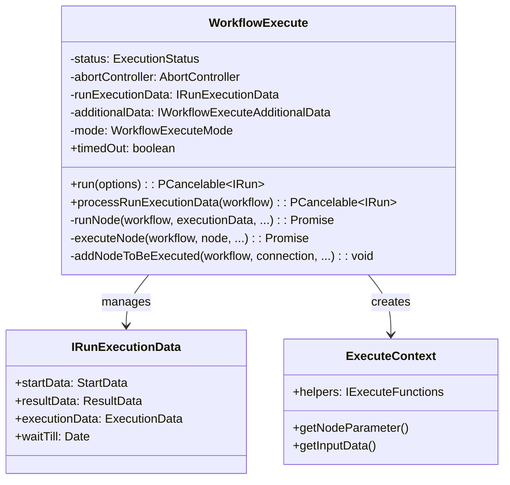
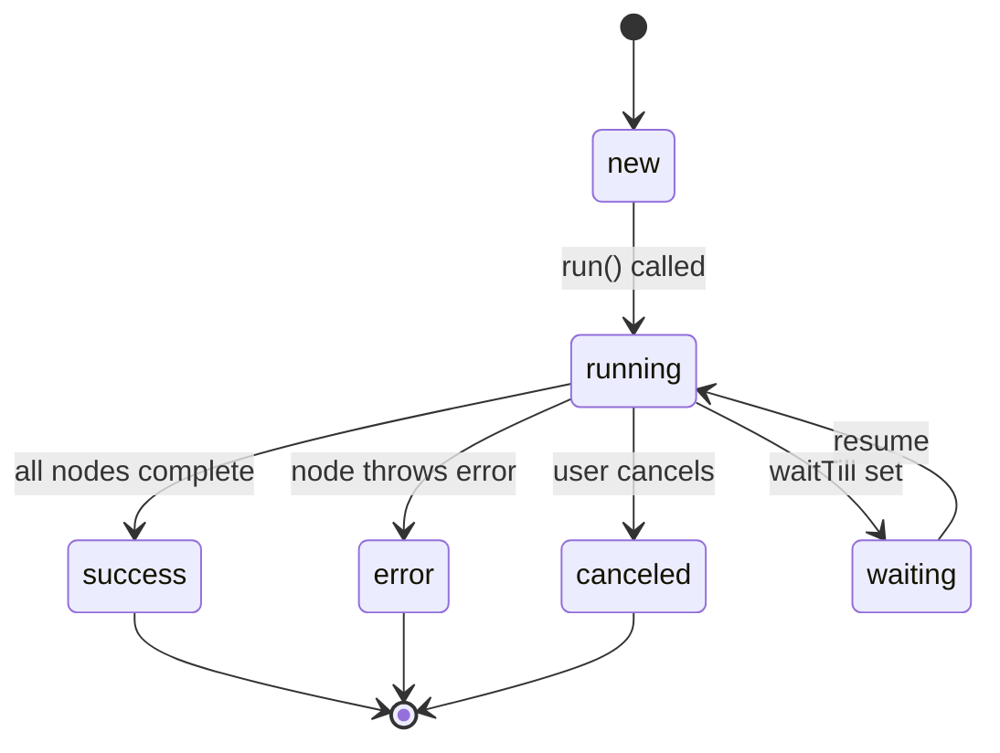
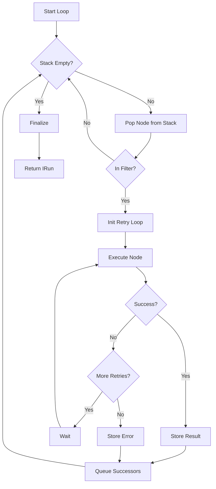
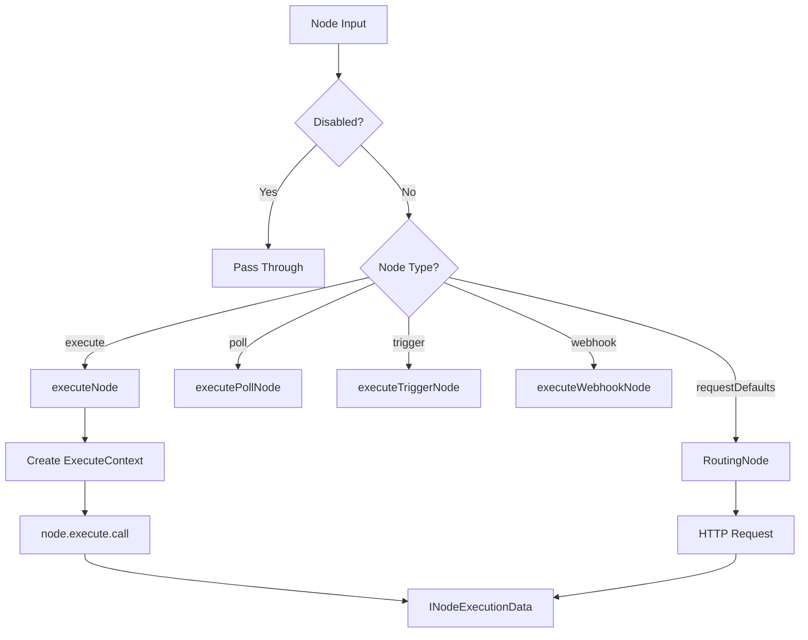
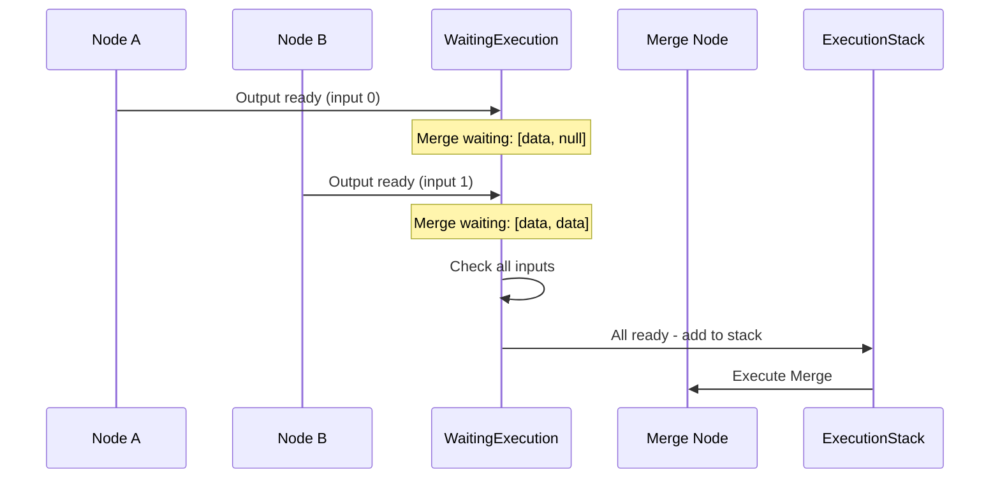

# Agent Class Analysis - WorkflowExecute

## TL;DR
`WorkflowExecute` là class trung tâm điều phối toàn bộ workflow execution trong n8n. Nó quản lý execution stack, xử lý node-by-node theo dependency order, và track state qua `IRunExecutionData`. Class này return `PCancelable` promise cho phép cancel execution bất kỳ lúc nào.

---

## Class Overview



---

## Core Properties

**File:** `packages/core/src/execution-engine/workflow-execute.ts`

```typescript
export class WorkflowExecute {
  // Execution status tracking
  private status: ExecutionStatus = 'new';

  // Cancellation support
  private readonly abortController = new AbortController();

  // Timeout flag
  timedOut: boolean = false;

  constructor(
    // Metadata, hooks, credentials access
    private readonly additionalData: IWorkflowExecuteAdditionalData,

    // Execution mode: 'manual' | 'trigger' | 'internal' | 'retry'
    private readonly mode: WorkflowExecuteMode,

    // All execution state - node results, queue, waiting nodes
    private runExecutionData: IRunExecutionData = createRunExecutionData(),

    // Where to store execution: 'db' | 'filesystem'
    private readonly storedAt: ExecutionStorageLocation = 'db',
  ) {}
}
```

### ExecutionStatus States



---

## Main Entry Point: run()

```typescript
run({
  workflow,
  startNode,
  destinationNode,      // Partial execution target
  pinData,              // Pre-computed data to skip nodes
  triggerToStartFrom,   // Resume from trigger
  additionalRunFilterNodes,
}: RunWorkflowOptions): PCancelable<IRun> {

  this.status = 'running';

  // 1. Determine start node
  // If not specified, find the first executable node
  startNode = startNode || workflow.getStartNode(destinationNode?.nodeName);

  if (startNode === undefined) {
    throw new ApplicationError(
      'No node to start the workflow from could be found'
    );
  }

  // 2. Setup run filter for partial execution
  let runNodeFilter: string[] | undefined;
  if (destinationNode) {
    // Only run parent nodes of destination
    runNodeFilter = workflow.getParentNodes(destinationNode.nodeName);
    if (destinationNode.mode === 'inclusive') {
      runNodeFilter.push(destinationNode.nodeName);
    }
  }

  // 3. Initialize execution stack with start node
  const nodeExecutionStack: IExecuteData[] = [
    {
      node: startNode,
      data: triggerToStartFrom?.data?.data ?? {
        main: [[{ json: {} }]],  // Default empty input
      },
      source: null,
    },
  ];

  // 4. Create fresh execution data
  this.runExecutionData = createRunExecutionData({
    startData: {
      destinationNode,
      runNodeFilter,
    },
    executionData: {
      nodeExecutionStack,
    },
    resultData: {
      pinData,
    },
  });

  // 5. Start processing
  return this.processRunExecutionData(workflow);
}
```

### Key Concepts

| Concept | Description |
|---------|-------------|
| **destinationNode** | Cho phép partial execution - chỉ run nodes cần thiết để đến destination |
| **runNodeFilter** | Whitelist của nodes được phép execute |
| **pinData** | Data đã pin sẵn, bypass node execution |
| **nodeExecutionStack** | Queue của nodes chờ execute |

---

## Execution Loop: processRunExecutionData()

```typescript
processRunExecutionData(workflow: Workflow): PCancelable<IRun> {
  Logger.debug('Workflow execution started', { workflowId: workflow.id });

  const { startedAt, hooks } = this.setupExecution();
  this.checkForWorkflowIssues(workflow);
  this.handleWaitingState(workflow);

  // Return cancellable promise
  return new PCancelable(async (resolve, _reject, onCancel) => {
    // Setup cancellation handler
    onCancel.shouldReject = false;
    onCancel(() => {
      this.status = 'canceled';
      this.updateTaskStatusesToCancelled();
      this.abortController.abort();
    });

    let executionData: IExecuteData;
    let executionNode: INode;

    // ============ MAIN EXECUTION LOOP ============
    executionLoop: while (
      this.runExecutionData.executionData!.nodeExecutionStack.length !== 0
    ) {

      // 1. Check for cancellation/timeout
      if (this.status === 'canceled') {
        return;
      }

      // 2. Pop next node from stack (FIFO)
      executionData = this.runExecutionData
        .executionData!.nodeExecutionStack.shift() as IExecuteData;
      executionNode = executionData.node;

      // 3. Skip if not in filter (partial execution)
      if (!this.shouldNodeExecute(executionNode)) {
        continue executionLoop;
      }

      // 4. Execute the node with retry logic
      let runNodeData: IRunNodeResponse | EngineRequest;
      let executionError: ExecutionBaseError | undefined;

      // Retry configuration
      let maxTries = 1;
      if (executionData.node.retryOnFail === true) {
        maxTries = Math.min(5, Math.max(2, executionData.node.maxTries || 3));
      }

      for (let tryIndex = 0; tryIndex < maxTries; tryIndex++) {
        try {
          runNodeData = await this.runNode(
            workflow,
            executionData,
            this.runExecutionData,
            runIndex,
            this.additionalData,
            this.mode,
            this.abortController.signal,
          );
          break;  // Success - exit retry loop
        } catch (e) {
          executionError = e;
          if (tryIndex !== maxTries - 1) {
            await sleep(waitBetweenTries);
          }
        }
      }

      // 5. Store result in runData
      this.runExecutionData.resultData.runData[executionNode.name] =
        this.runExecutionData.resultData.runData[executionNode.name] || [];
      this.runExecutionData.resultData.runData[executionNode.name].push({
        executionTime,
        executionStatus: executionError ? 'error' : 'success',
        data: runNodeData.data,
        error: executionError,
      });

      // 6. Queue successor nodes
      if (runNodeData.data) {
        this.scheduleSuccessorNodes(
          workflow,
          executionNode,
          runNodeData.data,
          runIndex
        );
      }
    }
    // ============ END EXECUTION LOOP ============

    // Finalize execution
    const fullRunData = await this.processSuccessExecution(
      startedAt,
      workflow,
      executionError,
    );
    resolve(fullRunData);
  });
}
```

### Execution Loop Diagram



---

## Node Execution: runNode()

```typescript
async runNode(
  workflow: Workflow,
  executionData: IExecuteData,
  runExecutionData: IRunExecutionData,
  runIndex: number,
  additionalData: IWorkflowExecuteAdditionalData,
  mode: WorkflowExecuteMode,
  abortSignal?: AbortSignal,
): Promise<IRunNodeResponse | EngineRequest> {

  const { node } = executionData;
  let inputData = executionData.data;

  // Handle disabled nodes - pass through input
  if (node.disabled === true) {
    return this.handleDisabledNode(inputData);
  }

  // Get node type definition
  const nodeType = workflow.nodeTypes.getByNameAndVersion(
    node.type,
    node.typeVersion
  );

  // Route to appropriate executor
  if (nodeType.execute) {
    // Regular programmatic nodes
    return await this.executeNode(
      workflow,
      node,
      nodeType,
      additionalData,
      mode,
      runExecutionData,
      runIndex,
      inputData,
      executionData,
      abortSignal,
    );
  }

  if (nodeType.poll) {
    // Polling trigger nodes
    return await this.executePollNode(...);
  }

  if (nodeType.trigger) {
    // Event trigger nodes
    return await this.executeTriggerNode(...);
  }

  if (nodeType.webhook) {
    // Webhook nodes - already processed
    return await this.executeWebhookNode(...);
  }

  // Declarative HTTP nodes
  if (nodeType.description.requestDefaults) {
    return await this.executeRoutingNode(...);
  }

  throw new UnexpectedError(`Unknown node type: ${node.type}`);
}
```

### Node Type Execution Flow



---

## ExecuteContext Creation

```typescript
private async executeNode(
  workflow: Workflow,
  node: INode,
  nodeType: INodeType,
  additionalData: IWorkflowExecuteAdditionalData,
  mode: WorkflowExecuteMode,
  runExecutionData: IRunExecutionData,
  runIndex: number,
  inputData: ITaskDataConnections,
  executionData: IExecuteData,
  abortSignal?: AbortSignal,
): Promise<IRunNodeResponse | EngineRequest> {

  const closeFunctions: CloseFunction[] = [];

  // Create execution context - provides node API
  const context = new ExecuteContext(
    workflow,
    node,
    additionalData,
    mode,
    runExecutionData,
    runIndex,
    connectionInputData,  // Flattened input
    inputData,            // Full input by connection type
    executionData,
    closeFunctions,
    abortSignal,
  );

  // Execute node with context bound as `this`
  let data: INodeExecutionData[][] | null;

  if (nodeType.execute) {
    data = await nodeType.execute.call(context);
  }

  // Cleanup any open resources
  for (const closeFunction of closeFunctions) {
    await closeFunction();
  }

  return { data, hints: context.hints };
}
```

### ExecuteContext API

```typescript
// What nodes can access via `this` in execute()
interface IExecuteFunctions {
  // Get resolved parameter value
  getNodeParameter(paramName: string, itemIndex: number): any;

  // Get input items
  getInputData(inputIndex?: number): INodeExecutionData[];

  // Get data from specific input connection
  getInputConnectionData(type: string, index: number): any;

  // Persistent storage per node
  getWorkflowStaticData(type: 'node' | 'global'): IDataObject;

  // HTTP helpers
  helpers: {
    request(options: IRequestOptions): Promise<any>;
    requestWithAuthentication(
      credentialsType: string,
      options: IRequestOptions
    ): Promise<any>;
    httpRequest(options: IHttpRequestOptions): Promise<any>;
  };

  // UI communication
  sendMessageToUI(message: any): void;

  // Credentials access
  getCredentials(type: string): Promise<ICredentialDataDecryptedObject>;

  // Continue on fail flag
  continueOnFail(): boolean;
}
```

---

## Successor Node Scheduling

```typescript
addNodeToBeExecuted(
  workflow: Workflow,
  connectionData: IConnection,     // Target connection
  outputIndex: number,             // Which output produced data
  parentNodeName: string,          // Source node
  nodeSuccessData: INodeExecutionData[][],  // Output data
  runIndex: number,
): void {

  const targetNode = connectionData.node;

  // Check if target has multiple inputs
  const numberOfInputs = workflow
    .connectionsByDestinationNode[targetNode]?.main?.length ?? 0;

  if (numberOfInputs > 1) {
    // ===== WAITING LOGIC FOR MULTI-INPUT NODES =====

    // Initialize waiting structure
    if (!this.runExecutionData.executionData!.waitingExecution[targetNode]) {
      this.runExecutionData.executionData!.waitingExecution[targetNode] = {};
    }

    // Store data for this specific input
    const waitingNodeIndex = this.getWaitingNodeIndex(targetNode, runIndex);
    this.runExecutionData.executionData!.waitingExecution[targetNode][
      waitingNodeIndex
    ].main[connectionData.index] = nodeSuccessData[outputIndex];

    // Check if ALL inputs now have data
    let allDataFound = true;
    for (let i = 0; i < numberOfInputs; i++) {
      const inputData = this.runExecutionData.executionData!
        .waitingExecution[targetNode][waitingNodeIndex].main[i];
      if (inputData === null || inputData === undefined) {
        allDataFound = false;
        break;
      }
    }

    if (allDataFound) {
      // All inputs ready - move to execution stack
      const executionStackItem: IExecuteData = {
        node: workflow.nodes[targetNode],
        data: this.runExecutionData.executionData!
          .waitingExecution[targetNode][waitingNodeIndex],
        source: this.runExecutionData.executionData!
          .waitingExecutionSource[targetNode][waitingNodeIndex],
      };

      this.runExecutionData.executionData!.nodeExecutionStack.push(
        executionStackItem
      );

      // Cleanup waiting entry
      delete this.runExecutionData.executionData!
        .waitingExecution[targetNode][waitingNodeIndex];
    }
    // Else: still waiting for more inputs

  } else {
    // ===== SINGLE INPUT - DIRECT QUEUE =====
    this.runExecutionData.executionData!.nodeExecutionStack.push({
      node: workflow.nodes[targetNode],
      data: {
        main: [nodeSuccessData[outputIndex]],
      },
      source: {
        main: [{
          previousNode: parentNodeName,
          previousNodeOutput: outputIndex,
          previousNodeRun: runIndex,
        }],
      },
    });
  }
}
```

### Multi-Input Node Waiting



---

## File References

| Component | File Path |
|-----------|-----------|
| WorkflowExecute | `packages/core/src/execution-engine/workflow-execute.ts` |
| ExecuteContext | `packages/core/src/execution-engine/node-execution-context/execute-context.ts` |
| IRunExecutionData | `packages/workflow/src/run-execution-data/run-execution-data.v1.ts` |
| IExecuteFunctions | `packages/workflow/src/interfaces.ts` |

---

## Key Takeaways

1. **PCancelable Pattern**: Execution có thể cancel bất kỳ lúc nào qua `onCancel` callback, cho phép UI responsive.

2. **Stack-Based Execution**: Sử dụng FIFO stack để quản lý node execution order, đơn giản và predictable.

3. **Multi-Input Waiting**: Nodes với nhiều inputs được giữ trong `waitingExecution` cho đến khi tất cả inputs ready.

4. **Context Injection**: Mỗi node nhận `ExecuteContext` cung cấp tất cả APIs cần thiết (params, input, helpers).

5. **Retry Logic**: Built-in retry với configurable attempts và wait time, xử lý transient failures tự động.

6. **Partial Execution**: Support execute subset của workflow qua `destinationNode` và `runNodeFilter`.
