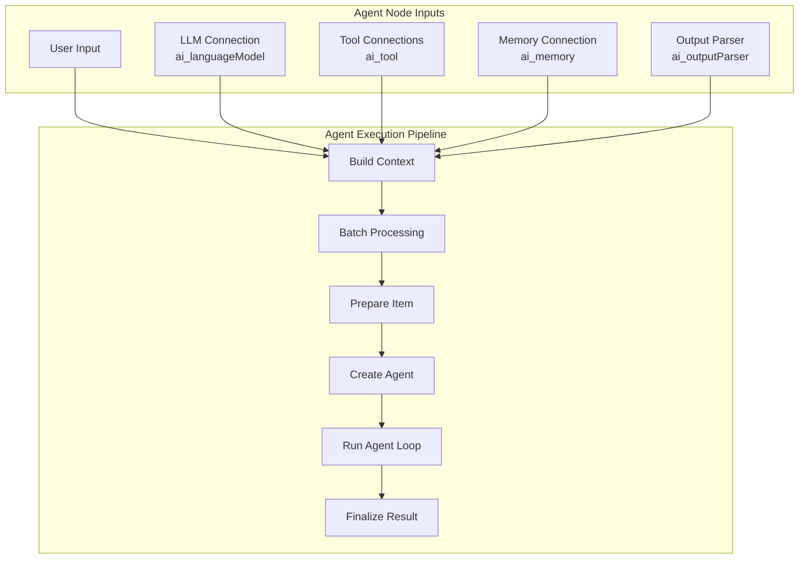
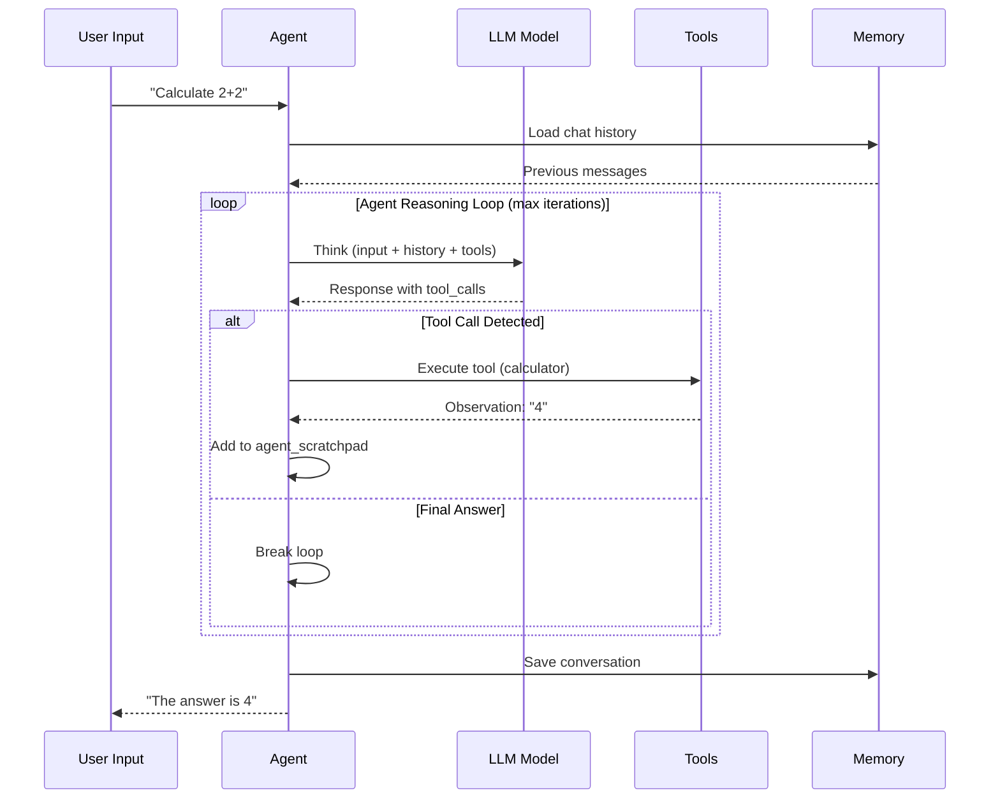

# Agent Class Analysis - ToolsAgent V3

## TL;DR
`ToolsAgent` là AI Agent node chính trong n8n, sử dụng LangChain's `createToolCallingAgent`. Agent thực hiện reasoning loop: nhận input → gọi LLM → detect tool calls → execute tools → observe results → tiếp tục hoặc trả final answer. Hỗ trợ streaming, memory, fallback models, và HITL (Human-in-the-Loop).

---

## Agent Architecture



---

## Agent Types

| Agent Type | Description | Use Case |
|------------|-------------|----------|
| **ToolsAgent (V3)** | Default, modern tool-calling với LangChain | General purpose, streaming |
| **ReActAgent** | Reasoning + Acting pattern | Chain-of-thought reasoning |
| **ConversationalAgent** | Memory-aware chat với tools | Multi-turn conversations |
| **PlanAndExecuteAgent** | Two-phase: planning rồi execution | Complex multi-step tasks |
| **SqlAgent** | Specialized cho database queries | SQL query generation |

---

## Core Class Structure

**File:** `packages/@n8n/nodes-langchain/nodes/agents/Agent/Agent.node.ts`

```typescript
// Versioned node - delegates to version-specific implementations
export class Agent extends VersionedNodeType {
  constructor() {
    const nodeVersions: IVersionedNodeType['nodeVersions'] = {
      1: new AgentV1(baseDescription),   // Legacy
      1.1: new AgentV1(baseDescription),
      // ...
      2: new AgentV2(baseDescription),   // Streaming added
      2.1: new AgentV2(baseDescription),
      // ...
      3: new AgentV3(baseDescription),   // Current default
      3.1: new AgentV3(baseDescription),
    };

    super(nodeVersions, baseDescription);
  }
}

// Default version
const baseDescription: INodeTypeBaseDescription = {
  displayName: 'AI Agent',
  name: 'agent',
  icon: 'fa:robot',
  group: ['transform'],
  defaultVersion: 3.1,  // Latest stable
};
```

---

## Agent V3 Node Definition

**File:** `packages/@n8n/nodes-langchain/nodes/agents/Agent/V3/AgentV3.node.ts`

```typescript
export class AgentV3 implements INodeType {
  description: INodeTypeDescription = {
    // ===== INPUTS =====
    inputs: [
      { type: NodeConnectionTypes.Main, displayName: '' },
      {
        type: NodeConnectionTypes.AiLanguageModel,
        displayName: 'Model',
        required: true,
        maxConnections: 1,
      },
      {
        type: NodeConnectionTypes.AiTool,
        displayName: 'Tools',
        // Multiple tools allowed
      },
      {
        type: NodeConnectionTypes.AiMemory,
        displayName: 'Memory',
        maxConnections: 1,
      },
      {
        type: NodeConnectionTypes.AiOutputParser,
        displayName: 'Output Parser',
        maxConnections: 1,
      },
    ],
    outputs: [NodeConnectionTypes.Main],

    // ===== PROPERTIES =====
    properties: [
      {
        displayName: 'Agent',
        name: 'agent',
        type: 'options',
        options: [
          { name: 'Tools Agent', value: 'toolsAgent' },
          { name: 'ReAct Agent', value: 'reActAgent' },
          { name: 'Conversational Agent', value: 'conversationalAgent' },
        ],
        default: 'toolsAgent',
      },
      {
        displayName: 'System Message',
        name: 'systemMessage',
        type: 'string',
        default: 'You are a helpful assistant',
      },
      {
        displayName: 'Max Iterations',
        name: 'maxIterations',
        type: 'number',
        default: 10,
      },
      {
        displayName: 'Return Intermediate Steps',
        name: 'returnIntermediateSteps',
        type: 'boolean',
        default: false,
      },
    ],
  };

  async execute(this: IExecuteFunctions): Promise<INodeExecutionData[][]> {
    return await toolsAgentExecute.call(this);
  }
}
```

---

## Execution Pipeline

### Phase 1: Build Execution Context

**File:** `packages/@n8n/nodes-langchain/nodes/agents/Agent/agents/ToolsAgent/V3/buildExecutionContext.ts`

```typescript
export async function buildExecutionContext(
  ctx: IExecuteFunctions
): Promise<ExecutionContext> {
  // Get input items
  const items = ctx.getInputData();

  // Get batch configuration
  const batchSize = ctx.getNodeParameter('batchSize', 0, 10) as number;
  const batchDelayMs = ctx.getNodeParameter('batchDelayMs', 0, 0) as number;

  // Get LLM model (required)
  const model = await ctx.getInputConnectionData(
    NodeConnectionTypes.AiLanguageModel,
    0
  ) as BaseChatModel;

  // Get fallback model (optional - for resilience)
  const fallbackModel = await ctx.getInputConnectionData(
    NodeConnectionTypes.AiLanguageModel,
    1
  ) as BaseChatModel | undefined;

  // Get memory (optional)
  const memory = await ctx.getInputConnectionData(
    NodeConnectionTypes.AiMemory,
    0
  ) as BaseChatMemory | undefined;

  return {
    items,
    batchSize,
    batchDelayMs,
    model,
    fallbackModel,
    memory,
    maxIterations: ctx.getNodeParameter('maxIterations', 0, 10) as number,
    enableStreaming: ctx.getNodeParameter('enableStreaming', 0, true) as boolean,
  };
}
```

### Phase 2: Prepare Item Context

**File:** `packages/@n8n/nodes-langchain/nodes/agents/Agent/agents/ToolsAgent/V3/prepareItemContext.ts`

```typescript
export async function prepareItemContext(
  ctx: IExecuteFunctions,
  itemIndex: number,
  executionCtx: ExecutionContext
): Promise<ItemContext> {
  // Extract input text
  const promptType = ctx.getNodeParameter('promptType', itemIndex) as string;
  const input = promptType === 'define'
    ? ctx.getNodeParameter('text', itemIndex) as string
    : ctx.getInputData()[itemIndex].json.input as string;

  // Get output parser if connected
  const outputParser = await ctx.getInputConnectionData(
    NodeConnectionTypes.AiOutputParser,
    0
  ) as N8nOutputParser | undefined;

  // Get all connected tools
  const tools = await getTools(ctx, outputParser);

  // Get system message
  const systemMessage = ctx.getNodeParameter('systemMessage', itemIndex) as string;

  // Handle binary images (auto-attach)
  const binaryMessages = await getBinaryMessages(ctx, itemIndex);

  // Load chat history from memory
  const chatHistory = await loadMemory(
    executionCtx.memory,
    executionCtx.model,
    ctx.getNodeParameter('maxTokensFromMemory', itemIndex, 0) as number
  );

  return {
    input,
    tools,
    systemMessage,
    outputParser,
    binaryMessages,
    chatHistory,
  };
}
```

### Phase 3: Create Agent Sequence

**File:** `packages/@n8n/nodes-langchain/nodes/agents/Agent/agents/ToolsAgent/V3/createAgentSequence.ts`

```typescript
import { createToolCallingAgent } from 'langchain/agents';

export function createAgentSequence(
  model: BaseChatModel,
  tools: Array<DynamicStructuredTool | Tool>,
  prompt: ChatPromptTemplate,
  fallbackModel?: BaseChatModel
): RunnableSequence {
  // Bind tools to model
  const modelWithTools = model.bindTools(tools);

  // Create agent with LangChain's built-in function
  const agent = createToolCallingAgent({
    llm: modelWithTools,
    tools,
    prompt,
    streamRunnable: false,
  });

  // Add fallback agent if provided
  if (fallbackModel) {
    const fallbackModelWithTools = fallbackModel.bindTools(tools);
    const fallbackAgent = createToolCallingAgent({
      llm: fallbackModelWithTools,
      tools,
      prompt,
      streamRunnable: false,
    });

    return agent.withFallbacks({ fallbacks: [fallbackAgent] });
  }

  return agent;
}
```

### Phase 4: Run Agent Loop

**File:** `packages/@n8n/nodes-langchain/nodes/agents/Agent/agents/ToolsAgent/V3/runAgent.ts`

```typescript
export async function runAgent(
  ctx: IExecuteFunctions,
  executor: AgentExecutor,
  itemContext: ItemContext,
  itemIndex: number,
  enableStreaming: boolean,
  previousSteps?: ToolCallData[]
): Promise<AgentResult | EngineRequest> {
  // Build invoke parameters
  const invokeParams = {
    input: itemContext.input,
    system_message: itemContext.systemMessage,
    formatting_instructions: itemContext.outputParser?.getFormatInstructions() ?? '',
    chat_history: itemContext.chatHistory ?? [],
    steps: previousSteps ?? [],  // For continuation after tool calls
  };

  if (enableStreaming) {
    // ===== STREAMING EXECUTION =====
    const eventStream = executor.streamEvents(invokeParams, { version: 'v2' });

    // Process stream events (sends chunks to UI)
    const result = await processEventStream(ctx, eventStream, itemIndex);

    // Check for tool calls in response
    if (result.toolCalls && result.toolCalls.length > 0) {
      // Return engine request for tool execution
      return createEngineRequests(result.toolCalls, itemIndex, itemContext.tools);
    }

    return result;
  } else {
    // ===== NON-STREAMING EXECUTION =====
    const result = await executor.invoke(invokeParams);
    return result;
  }
}
```

---

## Agent Reasoning Loop Diagram



---

## Key Invoke Parameters

```typescript
interface AgentInvokeParams {
  // User's input prompt
  input: string;

  // Agent behavior instructions (system prompt)
  system_message: string;

  // Output format instructions from parser
  formatting_instructions: string;

  // Previous conversation from memory
  chat_history: BaseMessage[];

  // Previous tool calls in this turn (for continuation)
  steps: ToolCallData[];

  // Built internally by LangChain from steps
  agent_scratchpad: BaseMessage[];
}
```

---

## Tool Integration

**File:** `packages/@n8n/nodes-langchain/nodes/agents/Agent/agents/ToolsAgent/common.ts`

```typescript
export async function getTools(
  ctx: IExecuteFunctions,
  outputParser?: N8nOutputParser
): Promise<Array<DynamicStructuredTool | Tool>> {
  // Get all connected tool nodes
  const tools = await getConnectedTools(ctx, true, false);

  // If output parser connected, inject structured output tool
  if (outputParser) {
    const structuredOutputParserTool = new DynamicStructuredTool({
      schema: getOutputParserSchema(outputParser),
      name: 'format_final_json_response',
      description: 'Format final response in structured JSON',
      func: async () => '',  // Parsing handled separately
    });
    tools.push(structuredOutputParserTool);
  }

  return tools;
}
```

---

## File References

| Component | File Path |
|-----------|-----------|
| Agent Node (Versioned) | `packages/@n8n/nodes-langchain/nodes/agents/Agent/Agent.node.ts` |
| Agent V3 | `packages/@n8n/nodes-langchain/nodes/agents/Agent/V3/AgentV3.node.ts` |
| Tools Agent Execute | `packages/@n8n/nodes-langchain/nodes/agents/Agent/agents/ToolsAgent/V3/execute.ts` |
| Build Context | `packages/@n8n/nodes-langchain/nodes/agents/Agent/agents/ToolsAgent/V3/buildExecutionContext.ts` |
| Prepare Item | `packages/@n8n/nodes-langchain/nodes/agents/Agent/agents/ToolsAgent/V3/prepareItemContext.ts` |
| Create Agent | `packages/@n8n/nodes-langchain/nodes/agents/Agent/agents/ToolsAgent/V3/createAgentSequence.ts` |
| Run Agent | `packages/@n8n/nodes-langchain/nodes/agents/Agent/agents/ToolsAgent/V3/runAgent.ts` |
| Common Utils | `packages/@n8n/nodes-langchain/nodes/agents/Agent/agents/ToolsAgent/common.ts` |

---

## Key Takeaways

1. **Versioned Architecture**: Agent node có multiple versions (1-3), cho phép breaking changes mà không ảnh hưởng workflows cũ.

2. **LangChain Integration**: Sử dụng `createToolCallingAgent` từ LangChain, không reinvent agent logic.

3. **Typed Connections**: ai_languageModel, ai_tool, ai_memory, ai_outputParser - ensure type safety.

4. **Streaming Support**: V2+ hỗ trợ streaming responses qua `streamEvents`.

5. **Fallback Models**: Primary model fail → auto-retry với fallback model.

6. **Separation of Concerns**: Mỗi phase có file riêng (buildContext, prepareItem, createAgent, runAgent).
