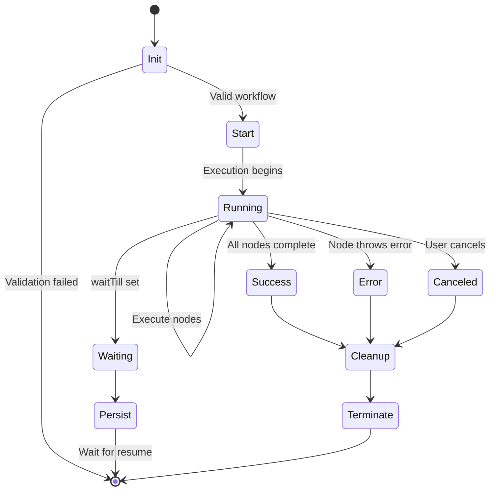
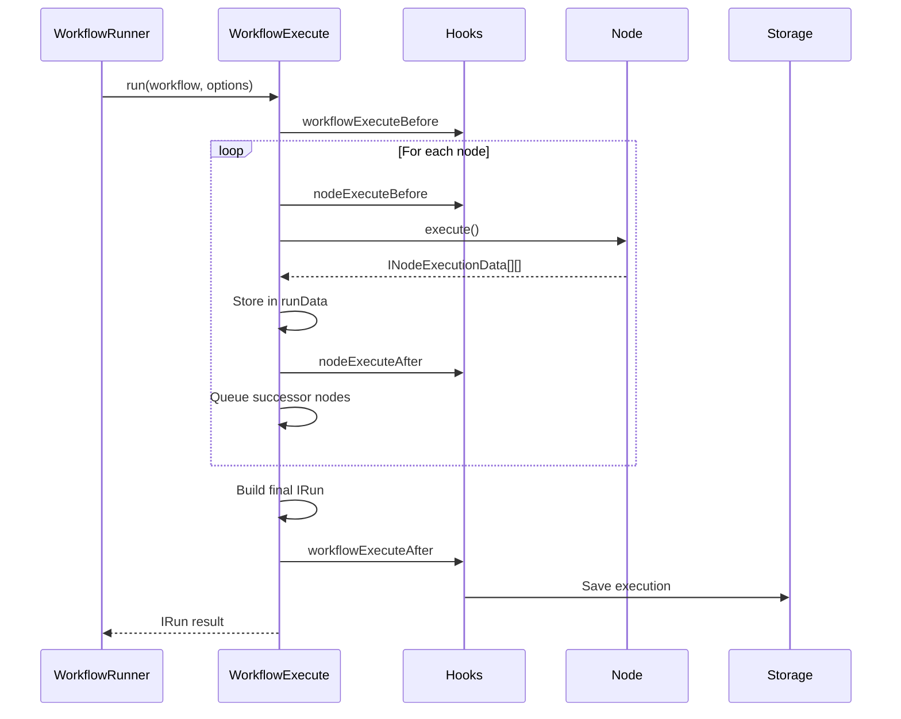
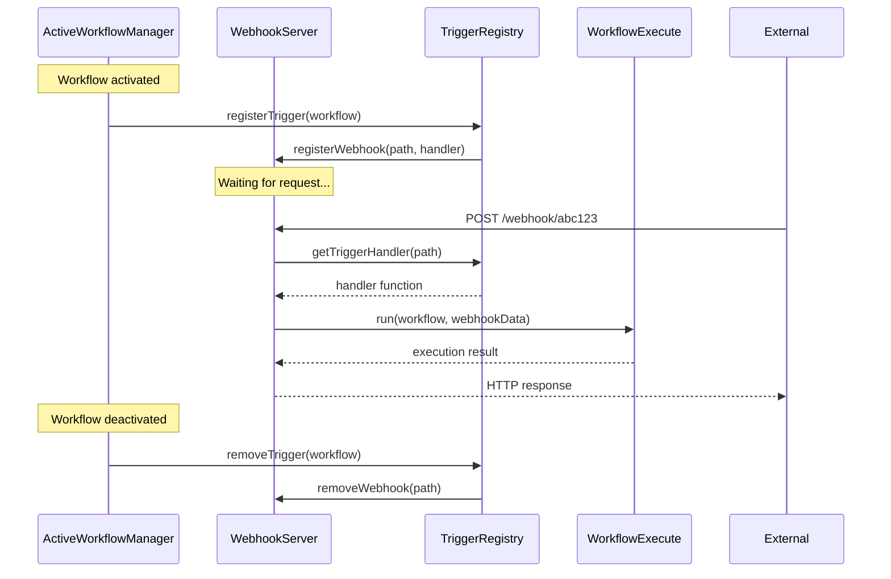

# Workflow Lifecycle - Init → Run → Terminate

## TL;DR
Workflow lifecycle gồm 4 phases: **Init** (load nodes, validate), **Start** (setup hooks, create executor), **Run** (execute nodes, store results), **Terminate** (cleanup, save execution). Triggers có lifecycle riêng: register webhook/poll → wait for event → execute workflow → loop.

---

## Lifecycle Overview



---

## Phase 1: Initialization

### Workflow Loading

```typescript
// packages/cli/src/services/workflow-loader.service.ts

@Service()
export class WorkflowLoaderService {
  constructor(
    private readonly workflowRepository: WorkflowRepository,
    private readonly nodeTypes: NodeTypes,
  ) {}

  async load(workflowId: string): Promise<Workflow> {
    // 1. Load from database
    const workflowData = await this.workflowRepository.findById(workflowId);
    if (!workflowData) {
      throw new NotFoundError(`Workflow ${workflowId} not found`);
    }

    // 2. Create Workflow instance
    const workflow = new Workflow({
      id: workflowData.id,
      name: workflowData.name,
      nodes: workflowData.nodes,
      connections: workflowData.connections,
      active: workflowData.active,
      nodeTypes: this.nodeTypes,
      staticData: workflowData.staticData,
      settings: workflowData.settings,
    });

    // 3. Validate workflow
    this.validateWorkflow(workflow);

    return workflow;
  }

  private validateWorkflow(workflow: Workflow): void {
    // Check all nodes exist
    for (const node of Object.values(workflow.nodes)) {
      const nodeType = this.nodeTypes.getByNameAndVersion(
        node.type,
        node.typeVersion
      );
      if (!nodeType) {
        throw new UnexpectedError(`Unknown node type: ${node.type}`);
      }
    }

    // Check for circular dependencies
    this.checkCircularDependencies(workflow);

    // Validate credentials references
    this.validateCredentials(workflow);
  }
}
```

### Node Types Loading

```typescript
// packages/cli/src/load-nodes-and-credentials.ts

@Service()
export class LoadNodesAndCredentials {
  async init(): Promise<void> {
    // 1. Load built-in nodes
    await this.loadNodesFromPackage('n8n-nodes-base');
    await this.loadNodesFromPackage('@n8n/nodes-langchain');

    // 2. Load community nodes
    const communityPackages = await this.getCommunityPackages();
    for (const pkg of communityPackages) {
      await this.loadNodesFromPackage(pkg.name);
    }

    // 3. Register with NodeTypes service
    for (const [name, nodeType] of this.loadedNodes) {
      Container.get(NodeTypes).addNode(name, nodeType);
    }

    Logger.info(`Loaded ${this.loadedNodes.size} node types`);
  }

  private async loadNodesFromPackage(packageName: string): Promise<void> {
    const packagePath = require.resolve(packageName);
    const packageDir = path.dirname(packagePath);

    // Find all *.node.ts/js files
    const nodeFiles = await glob(`${packageDir}/nodes/**/*.node.{ts,js}`);

    for (const file of nodeFiles) {
      const nodeModule = await import(file);

      // Get default export (the node class)
      const NodeClass = nodeModule.default || Object.values(nodeModule)[0];

      // Instantiate to get description
      const instance = new NodeClass();

      this.loadedNodes.set(
        instance.description.name,
        NodeClass
      );
    }
  }
}
```

---

## Phase 2: Execution Start

### WorkflowRunner Initialization

```typescript
// packages/cli/src/workflow-runner.ts

@Service()
export class WorkflowRunner {
  constructor(
    private readonly workflowExecuteAdditionalData: WorkflowExecuteAdditionalDataService,
    private readonly executionRepository: ExecutionRepository,
    private readonly eventService: EventService,
  ) {}

  async run(
    data: IWorkflowExecutionDataProcess,
    loadStaticData?: boolean,
    realtime?: boolean,
  ): Promise<string> {
    // 1. Create execution record
    const executionId = await this.executionRepository.create({
      data: {},
      workflowId: data.workflowData.id,
      mode: data.executionMode,
      status: 'new',
      startedAt: new Date(),
    });

    // 2. Build additional data (hooks, credentials, etc.)
    const additionalData = await this.workflowExecuteAdditionalData.create(
      data.userId,
      data.workflowData,
    );

    // 3. Setup execution hooks
    additionalData.hooks = this.getWorkflowHooks(
      data.executionMode,
      executionId,
      data.workflowData,
    );

    // 4. Fire execution start event
    this.eventService.emit('workflow.executionStarted', {
      executionId,
      workflowId: data.workflowData.id,
    });

    // 5. Run execution (in-process or queue)
    if (config.executions.mode === 'queue') {
      await this.runInQueue(executionId, data, additionalData);
    } else {
      await this.runInProcess(executionId, data, additionalData);
    }

    return executionId;
  }

  private async runInProcess(
    executionId: string,
    data: IWorkflowExecutionDataProcess,
    additionalData: IWorkflowExecuteAdditionalData,
  ): Promise<void> {
    const workflow = new Workflow({
      id: data.workflowData.id,
      name: data.workflowData.name,
      nodes: data.workflowData.nodes,
      connections: data.workflowData.connections,
      nodeTypes: Container.get(NodeTypes),
    });

    // Create executor
    const workflowExecute = new WorkflowExecute(
      additionalData,
      data.executionMode,
    );

    // Run and handle result
    const execution = workflowExecute.run({
      workflow,
      startNode: data.startNodes?.[0]?.node,
      destinationNode: data.destinationNode,
    });

    // Store promise for tracking
    this.activeExecutions.set(executionId, execution);

    // Wait for completion
    const result = await execution;

    // Cleanup
    this.activeExecutions.delete(executionId);
  }
}
```

### Execution Hooks Setup

```typescript
// packages/cli/src/workflow-runner.ts

getWorkflowHooks(
  mode: WorkflowExecuteMode,
  executionId: string,
  workflow: IWorkflowBase,
): WorkflowHooks {
  return new WorkflowHooks({
    // Called when workflow starts
    workflowExecuteBefore: [
      async () => {
        await this.executionRepository.updateStatus(executionId, 'running');
        this.eventService.emit('workflow.executionStarted', { executionId });
      },
    ],

    // Called when a node starts executing
    nodeExecuteBefore: [
      async (nodeName: string) => {
        this.pushService.send('nodeExecuteBefore', {
          executionId,
          nodeName,
        });
      },
    ],

    // Called when a node finishes
    nodeExecuteAfter: [
      async (nodeName: string, data: ITaskData) => {
        this.pushService.send('nodeExecuteAfter', {
          executionId,
          nodeName,
          data,
        });
      },
    ],

    // Called when workflow completes
    workflowExecuteAfter: [
      async (fullRunData: IRun) => {
        // Save execution data
        await this.executionRepository.updateExecutionData(
          executionId,
          fullRunData,
        );

        // Send completion event
        this.pushService.send('executionFinished', {
          executionId,
          status: fullRunData.status,
        });

        this.eventService.emit('workflow.executionFinished', {
          executionId,
          status: fullRunData.status,
        });
      },
    ],
  });
}
```

---

## Phase 3: Execution Running

### Main Execution Flow



### Execution Loop Details

```typescript
// packages/core/src/execution-engine/workflow-execute.ts

processRunExecutionData(workflow: Workflow): PCancelable<IRun> {
  const { startedAt, hooks } = this.setupExecution();

  return new PCancelable(async (resolve, _reject, onCancel) => {
    // Setup cancellation
    onCancel(() => {
      this.status = 'canceled';
      this.abortController.abort();
    });

    // Fire start hook
    await hooks?.runHook('workflowExecuteBefore', [workflow]);

    // Main loop
    while (this.runExecutionData.executionData!.nodeExecutionStack.length > 0) {
      // Check cancellation
      if (this.status === 'canceled') break;

      // Get next node
      const executionData = this.runExecutionData
        .executionData!.nodeExecutionStack.shift()!;

      // Fire node start hook
      await hooks?.runHook('nodeExecuteBefore', [
        executionData.node.name,
        executionData.data,
      ]);

      // Execute node
      const startTime = Date.now();
      let runNodeData: IRunNodeResponse;
      let executionError: ExecutionBaseError | undefined;

      try {
        runNodeData = await this.runNode(
          workflow,
          executionData,
          this.runExecutionData,
          runIndex,
          this.additionalData,
          this.mode,
          this.abortController.signal,
        );
      } catch (error) {
        executionError = error;
        if (!executionData.node.continueOnFail) {
          throw error;
        }
        runNodeData = { data: [[{ json: { error: error.message } }]] };
      }

      const executionTime = Date.now() - startTime;

      // Store result
      const taskData: ITaskData = {
        startTime,
        executionTime,
        executionStatus: executionError ? 'error' : 'success',
        data: runNodeData.data,
        error: executionError,
      };

      this.runExecutionData.resultData.runData[executionData.node.name] =
        this.runExecutionData.resultData.runData[executionData.node.name] || [];
      this.runExecutionData.resultData.runData[executionData.node.name].push(taskData);

      this.runExecutionData.resultData.lastNodeExecuted = executionData.node.name;

      // Fire node complete hook
      await hooks?.runHook('nodeExecuteAfter', [
        executionData.node.name,
        taskData,
        this.runExecutionData,
      ]);

      // Queue successors
      if (runNodeData.data) {
        this.queueSuccessorNodes(
          workflow,
          executionData.node,
          runNodeData.data,
          runIndex,
        );
      }
    }

    // Finalize
    const fullRunData = await this.processSuccessExecution(
      startedAt,
      workflow,
      executionError,
    );

    resolve(fullRunData);
  });
}
```

---

## Phase 4: Termination & Cleanup

### Success Completion

```typescript
// packages/core/src/execution-engine/workflow-execute.ts

async processSuccessExecution(
  startedAt: Date,
  workflow: Workflow,
  executionError?: ExecutionBaseError,
): Promise<IRun> {
  // 1. Determine final status
  if (executionError !== undefined) {
    this.status = 'error';
  } else if (this.runExecutionData.waitTill) {
    this.status = 'waiting';
  } else {
    this.status = 'success';
  }

  // 2. Move metadata to final location
  this.moveNodeMetadata();

  // 3. Build final run data
  const stoppedAt = new Date();
  const fullRunData: IRun = {
    data: this.runExecutionData,
    finished: this.status === 'success',
    mode: this.mode,
    startedAt,
    stoppedAt,
    status: this.status,
  };

  // 4. Fire completion hooks
  await this.additionalData.hooks?.runHook(
    'workflowExecuteAfter',
    [fullRunData, undefined]
  );

  return fullRunData;
}
```

### Error Handling

```typescript
// packages/core/src/execution-engine/workflow-execute.ts

// In execution loop
try {
  runNodeData = await this.runNode(...);
} catch (error) {
  // Check if should continue on fail
  if (executionData.node.continueOnFail === true) {
    // Convert error to data item
    runNodeData = {
      data: [[{
        json: {
          error: error.message,
          errorCode: error.code,
        },
      }]],
    };
    executionError = undefined;  // Don't fail workflow
  } else {
    // Propagate error
    executionError = error;

    // Stop execution
    this.status = 'error';
    this.runExecutionData.resultData.error = {
      message: error.message,
      stack: error.stack,
      node: executionData.node,
    };

    break;  // Exit loop
  }
}
```

### Cleanup Resources

```typescript
// packages/core/src/execution-engine/workflow-execute.ts

private async cleanupExecution(
  workflow: Workflow,
  closeFunctions: CloseFunction[],
): Promise<void> {
  // 1. Close all open connections
  for (const closeFunction of closeFunctions) {
    try {
      await closeFunction();
    } catch (error) {
      Logger.error('Error closing resource', { error });
    }
  }

  // 2. Cleanup triggers if any
  if (this.mode === 'trigger') {
    const triggersAndPollers = Container.get(TriggersAndPollers);
    await triggersAndPollers.removeWorkflowTriggers(workflow.id);
  }

  // 3. Release any held resources
  this.abortController.abort();
}
```

---

## Trigger Lifecycle

### Webhook Trigger



### Polling Trigger

```typescript
// packages/core/src/execution-engine/triggers-and-pollers.ts

@Service()
export class TriggersAndPollers {
  private pollingIntervals: Map<string, NodeJS.Timer> = new Map();

  async addWorkflowTriggers(workflow: Workflow): Promise<void> {
    for (const node of Object.values(workflow.nodes)) {
      const nodeType = this.nodeTypes.getByNameAndVersion(
        node.type,
        node.typeVersion
      );

      if (nodeType.poll) {
        await this.addPollingTrigger(workflow, node, nodeType);
      }

      if (nodeType.trigger) {
        await this.addEventTrigger(workflow, node, nodeType);
      }
    }
  }

  private async addPollingTrigger(
    workflow: Workflow,
    node: INode,
    nodeType: INodeType,
  ): Promise<void> {
    // Get polling interval from node config
    const pollInterval = this.getPollInterval(node);

    // Create polling function
    const pollFunction = async () => {
      try {
        // Create poll context
        const pollContext = new PollContext(
          workflow,
          node,
          this.additionalData,
        );

        // Execute poll
        const result = await nodeType.poll!.call(pollContext);

        // If data returned, trigger workflow execution
        if (result !== null) {
          await this.runWorkflowForTrigger(workflow, node, result);
        }
      } catch (error) {
        Logger.error(`Poll error for ${node.name}`, { error });
      }
    };

    // Schedule polling
    const intervalId = setInterval(pollFunction, pollInterval);
    this.pollingIntervals.set(`${workflow.id}:${node.name}`, intervalId);

    // Run immediately on activation
    await pollFunction();
  }

  async removeWorkflowTriggers(workflowId: string): Promise<void> {
    // Clear all polling intervals
    for (const [key, intervalId] of this.pollingIntervals) {
      if (key.startsWith(workflowId)) {
        clearInterval(intervalId);
        this.pollingIntervals.delete(key);
      }
    }

    // Deregister webhooks
    await this.webhookService.removeWorkflowWebhooks(workflowId);
  }
}
```

---

## Wait/Resume Lifecycle

```typescript
// packages/core/src/execution-engine/workflow-execute.ts

// Setting wait state
async setWaitTill(waitTill: Date): Promise<void> {
  this.runExecutionData.waitTill = waitTill;
  this.status = 'waiting';

  // Save current state
  await this.additionalData.hooks?.runHook(
    'workflowExecuteAfter',
    [this.getFullRunData(), undefined]
  );
}

// Resume from wait
async resumeExecution(
  executionId: string,
  resumeData: IDataObject,
): Promise<IRun> {
  // 1. Load saved execution data
  const execution = await this.executionRepository.findById(executionId);

  // 2. Create new executor with saved state
  const workflowExecute = new WorkflowExecute(
    this.additionalData,
    'trigger',
    execution.data,  // Resume from saved state
  );

  // 3. Clear wait state
  workflowExecute.runExecutionData.waitTill = undefined;

  // 4. Inject resume data
  // (typically webhook response or user input)
  workflowExecute.injectResumeData(resumeData);

  // 5. Continue execution
  return workflowExecute.processRunExecutionData(this.workflow);
}
```

---

## File References

| Component | File Path |
|-----------|-----------|
| WorkflowRunner | `packages/cli/src/workflow-runner.ts` |
| WorkflowExecute | `packages/core/src/execution-engine/workflow-execute.ts` |
| LoadNodesAndCredentials | `packages/cli/src/load-nodes-and-credentials.ts` |
| TriggersAndPollers | `packages/core/src/execution-engine/triggers-and-pollers.ts` |
| WorkflowHooks | `packages/workflow/src/workflow-hooks.ts` |

---

## Key Takeaways

1. **4-Phase Lifecycle**: Clear separation giữa Init → Start → Run → Terminate phases.

2. **Hook System**: Hooks cho phép external systems (UI, logging, metrics) observe execution.

3. **Graceful Cleanup**: Resources được cleanup properly khi execution ends (success, error, or cancel).

4. **Trigger Management**: Webhooks và polling triggers có lifecycle riêng, managed by `TriggersAndPollers`.

5. **Wait/Resume**: Execution có thể pause (waitTill) và resume later với state preserved.

6. **Error Propagation**: Errors có thể được catch hoặc propagate tuỳ vào `continueOnFail` setting.
