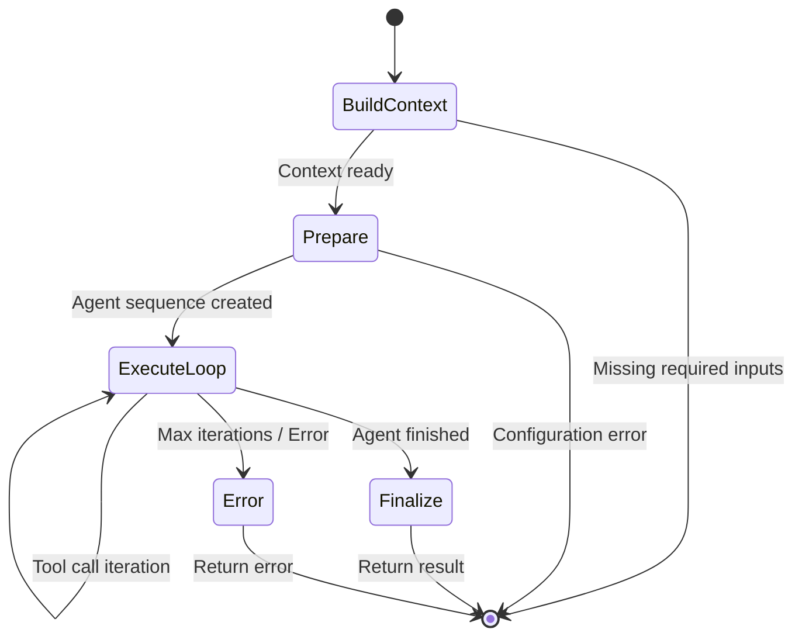
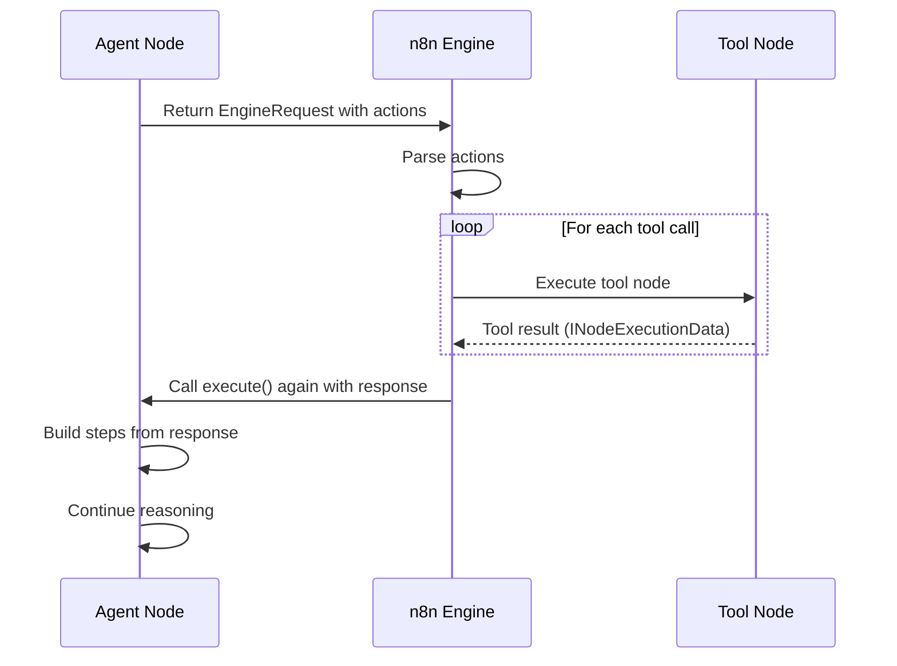

# Agent Lifecycle - Init → Execute → Finalize

## TL;DR
Agent lifecycle gồm 4 phases: **Build Context** (get model, tools, memory), **Prepare** (create agent sequence), **Execute Loop** (reasoning iterations), **Finalize** (save memory, format output). Each phase has specific responsibilities và error handling.

---

## Lifecycle Overview



---

## Phase 1: Build Execution Context

### buildExecutionContext Function

```typescript
// packages/@n8n/nodes-langchain/nodes/agents/Agent/agents/ToolsAgent/V3/buildExecutionContext.ts

export async function buildExecutionContext(
  ctx: IExecuteFunctions | ISupplyDataFunctions,
): Promise<ExecutionContext> {
  // 1. Get primary LLM from connection
  const model = await getConnectedModel(ctx);
  if (!model) {
    throw new NodeOperationError(
      ctx.getNode(),
      'No language model connected. Connect a Chat Model node.',
    );
  }

  // 2. Get optional fallback model
  const fallbackModel = await getFallbackModel(ctx);

  // 3. Get memory if connected
  const memory = await getConnectedMemory(ctx);

  // 4. Get batch configuration
  const batchSize = ctx.getNodeParameter('options.batchSize', 0, 10) as number;

  return {
    model,
    fallbackModel,
    memory,
    batchSize,
  };
}
```

### Getting Connected Resources

```typescript
// packages/@n8n/nodes-langchain/utils/helpers.ts

export async function getConnectedModel(
  ctx: IExecuteFunctions | ISupplyDataFunctions,
): Promise<BaseChatModel | undefined> {
  // Get from ai_languageModel connection
  const connectedData = await ctx.getInputConnectionData(
    NodeConnectionTypes.AiLanguageModel,
    0,  // First connection
  );

  if (!connectedData) {
    return undefined;
  }

  // Validate it's a chat model
  if (!(connectedData instanceof BaseChatModel)) {
    throw new NodeOperationError(
      ctx.getNode(),
      'Connected model is not a chat model',
    );
  }

  return connectedData;
}

export async function getConnectedTools(
  ctx: IExecuteFunctions | ISupplyDataFunctions,
  itemIndex: number,
): Promise<Array<DynamicStructuredTool | Tool>> {
  const tools: Array<DynamicStructuredTool | Tool> = [];

  // Get all connected tools
  const toolConnections = await ctx.getInputConnectionData(
    NodeConnectionTypes.AiTool,
    0,
  );

  if (Array.isArray(toolConnections)) {
    tools.push(...toolConnections);
  } else if (toolConnections) {
    tools.push(toolConnections);
  }

  return tools;
}

export async function getConnectedMemory(
  ctx: IExecuteFunctions | ISupplyDataFunctions,
): Promise<BaseChatMemory | undefined> {
  const memoryData = await ctx.getInputConnectionData(
    NodeConnectionTypes.AiMemory,
    0,
  );

  return memoryData as BaseChatMemory | undefined;
}
```

---

## Phase 2: Prepare Agent Sequence

### createAgentSequence Function

```typescript
// packages/@n8n/nodes-langchain/nodes/agents/Agent/agents/ToolsAgent/V3/helpers/createAgentSequence.ts

export function createAgentSequence(
  model: BaseChatModel,
  tools: Array<DynamicStructuredTool | Tool>,
  prompt: ChatPromptTemplate,
  options: AgentOptions,
  outputParser?: N8nOutputParser,
  memory?: BaseChatMemory,
  fallbackModel?: BaseChatModel | null,
): AgentRunnableSequence {
  // 1. Create primary tool-calling agent
  const agent = createToolCallingAgent({
    llm: model,
    tools: getAllTools(model, tools),
    prompt,
    streamRunnable: false,
  });

  // 2. Create fallback agent if provided
  let fallbackAgent: AgentRunnableSequence | undefined;
  if (fallbackModel) {
    fallbackAgent = createToolCallingAgent({
      llm: fallbackModel,
      tools: getAllTools(fallbackModel, tools),
      prompt,
      streamRunnable: false,
    });
  }

  // 3. Build runnable sequence with parsers
  const runnableAgent = RunnableSequence.from([
    // Agent with optional fallback
    fallbackAgent ? agent.withFallbacks([fallbackAgent]) : agent,

    // Parse and validate output
    getAgentStepsParser(outputParser, memory),

    // Fix empty content messages (Anthropic compatibility)
    fixEmptyContentMessage,
  ]) as AgentRunnableSequence;

  // 4. Configure agent behavior
  runnableAgent.singleAction = true;    // One action per iteration
  runnableAgent.streamRunnable = false;

  return runnableAgent;
}

// Get all tools including model's built-in tools
function getAllTools(
  model: BaseChatModel,
  tools: Array<DynamicStructuredTool | Tool>,
): Array<DynamicStructuredTool | Tool> {
  const allTools = [...tools];

  // Add model's built-in tools (e.g., code interpreter)
  if ('getBuiltinTools' in model) {
    const builtinTools = (model as any).getBuiltinTools();
    allTools.push(...builtinTools);
  }

  return allTools;
}
```

### Building the Prompt

```typescript
// packages/@n8n/nodes-langchain/nodes/agents/Agent/agents/ToolsAgent/V3/helpers/buildPrompt.ts

export function buildAgentPrompt(
  systemMessage: string,
  hasMemory: boolean,
): ChatPromptTemplate {
  const messages: BaseMessagePromptTemplateLike[] = [];

  // 1. System message
  if (systemMessage) {
    messages.push(['system', systemMessage]);
  } else {
    messages.push(['system', SYSTEM_MESSAGE]);
  }

  // 2. Chat history placeholder (if memory connected)
  if (hasMemory) {
    messages.push(new MessagesPlaceholder('chat_history'));
  }

  // 3. User input
  messages.push(['human', '{input}']);

  // 4. Agent scratchpad (accumulated steps)
  messages.push(new MessagesPlaceholder('agent_scratchpad'));

  return ChatPromptTemplate.fromMessages(messages);
}

// Default system message
const SYSTEM_MESSAGE = `You are a helpful assistant. Answer the user's questions to the best of your ability.

When you need to use a tool, make sure to provide all required parameters.
If you don't have enough information to use a tool, ask the user for the missing details.`;
```

---

## Phase 3: Execute Loop

### Main Execution Entry Point

```typescript
// packages/@n8n/nodes-langchain/nodes/agents/Agent/agents/ToolsAgent/V3/execute.ts

export async function execute(
  this: IExecuteFunctions | ISupplyDataFunctions,
  response?: EngineResponse<RequestResponseMetadata>,
): Promise<INodeExecutionData[][] | EngineRequest<RequestResponseMetadata>> {
  // 1. Build execution context
  const { model, fallbackModel, memory, batchSize } = await buildExecutionContext(this);

  // 2. Get input items
  const items = this.getInputData();

  // 3. Process in batches
  const returnData: INodeExecutionData[] = [];
  const requestAggregator = new RequestAggregator();

  for (let startIndex = 0; startIndex < items.length; startIndex += batchSize) {
    const batch = items.slice(startIndex, startIndex + batchSize);

    const batchResult = await executeBatch(
      this,
      batch,
      startIndex,
      model,
      fallbackModel,
      memory,
      response,
    );

    // Check if more iterations needed
    if ('actions' in batchResult) {
      requestAggregator.merge(batchResult);
    } else {
      returnData.push(...batchResult.flat());
    }
  }

  // 4. Return aggregated request or final data
  if (requestAggregator.hasRequests()) {
    return requestAggregator.build();
  }

  return [returnData];
}
```

### Batch Execution Flow

```typescript
// packages/@n8n/nodes-langchain/nodes/agents/Agent/agents/ToolsAgent/V3/helpers/executeBatch.ts

export async function executeBatch(
  ctx: IExecuteFunctions | ISupplyDataFunctions,
  batch: INodeExecutionData[],
  startIndex: number,
  model: BaseChatModel,
  fallbackModel: BaseChatModel | null,
  memory: BaseChatMemory | undefined,
  response?: EngineResponse<RequestResponseMetadata>,
) {
  const returnData: INodeExecutionData[] = [];
  const requestAggregator = new RequestAggregator();

  // 1. Process HITL (Human-in-the-Loop) responses
  const processedResponse = processHitlResponses(response);

  // 2. Get configuration
  const maxIterations = ctx.getNodeParameter('options.maxIterations', 0, 10) as number;
  const systemMessage = ctx.getNodeParameter('systemMessage', 0, '') as string;

  // 3. Build prompt template
  const prompt = buildAgentPrompt(systemMessage, !!memory);

  // 4. Process each item in batch
  const batchPromises = batch.map(async (_item, batchItemIndex) => {
    const itemIndex = startIndex + batchItemIndex;

    try {
      // Check max iterations
      checkMaxIterations(processedResponse, maxIterations, ctx.getNode());

      // Prepare item context
      const itemContext = await prepareItemContext(ctx, itemIndex, processedResponse);

      // Get tools for this item
      const tools = await getConnectedTools(ctx, itemIndex);

      // Get output parser if connected
      const outputParser = await getConnectedOutputParser(ctx);

      // Create agent sequence
      const executor = createAgentSequence(
        model,
        tools,
        prompt,
        { maxIterations },
        outputParser,
        memory,
        fallbackModel,
      );

      // Run agent iteration
      return await runAgent(
        ctx,
        executor,
        itemContext,
        model,
        memory,
        processedResponse,
      );
    } catch (error) {
      // Handle error based on continueOnFail setting
      if (ctx.continueOnFail()) {
        return {
          output: '',
          error: (error as Error).message,
        } as AgentResult;
      }
      throw error;
    }
  });

  // 5. Await all batch results
  const batchResults = await Promise.all(batchPromises);

  // 6. Collect and categorize results
  for (let i = 0; i < batchResults.length; i++) {
    const result = batchResults[i];
    const itemIndex = startIndex + i;

    if ('actions' in result) {
      // More tool calls needed - add to request aggregator
      requestAggregator.addRequest(result);
    } else {
      // Final result - finalize and add to return data
      const finalData = finalizeResult(result, itemIndex);
      returnData.push(finalData);
    }
  }

  // 7. Return based on state
  if (requestAggregator.hasRequests()) {
    return requestAggregator.build();
  }

  return [returnData];
}
```

---

## Phase 4: Finalize Result

### finalizeResult Function

```typescript
// packages/@n8n/nodes-langchain/nodes/agents/Agent/agents/ToolsAgent/V3/helpers/finalizeResult.ts

export function finalizeResult(
  result: AgentResult,
  itemIndex: number,
): INodeExecutionData {
  const { output, intermediateSteps, error } = result;

  // Build output data
  const outputData: IDataObject = {
    output,
  };

  // Add intermediate steps if requested
  if (intermediateSteps && intermediateSteps.length > 0) {
    outputData.steps = intermediateSteps.map(step => ({
      action: {
        tool: step.action.tool,
        input: step.action.toolInput,
      },
      observation: step.observation,
    }));
  }

  // Add error if present
  if (error) {
    outputData.error = error;
  }

  // Return as node execution data
  return {
    json: outputData,
    pairedItem: { item: itemIndex },
  };
}
```

### Saving Memory After Completion

```typescript
// packages/@n8n/nodes-langchain/nodes/agents/Agent/agents/ToolsAgent/V3/helpers/runAgent.ts

// After agent finishes (in runAgent function)
if (!agentResult.toolCalls || agentResult.toolCalls.length === 0) {
  // Agent finished - save to memory
  if (memory) {
    await memory.saveContext(
      { input: itemContext.input },    // Human message
      { output: agentResult.output },   // AI response
    );
  }

  return agentResult;
}
```

---

## Error Handling Throughout Lifecycle

### Error Handling Patterns

```typescript
// packages/@n8n/nodes-langchain/nodes/agents/Agent/agents/ToolsAgent/V3/execute.ts

// Phase 1: Build Context Errors
try {
  const { model } = await buildExecutionContext(this);
} catch (error) {
  throw new NodeOperationError(
    this.getNode(),
    `Failed to build execution context: ${error.message}`,
    { description: 'Check that all required connections are made.' }
  );
}

// Phase 2: Prepare Errors
try {
  const executor = createAgentSequence(model, tools, prompt, options);
} catch (error) {
  throw new NodeOperationError(
    this.getNode(),
    `Failed to create agent: ${error.message}`,
    { description: 'Check model and tool configurations.' }
  );
}

// Phase 3: Execute Loop Errors
try {
  const result = await runAgent(ctx, executor, itemContext, model, memory, response);
} catch (error) {
  if (error instanceof NodeOperationError) {
    throw error;  // Already wrapped
  }

  // Wrap other errors
  throw new NodeOperationError(
    ctx.getNode(),
    error.message,
    {
      itemIndex,
      description: 'Agent execution failed. Check logs for details.',
    }
  );
}

// Phase 4: Finalize Errors
try {
  await memory?.saveContext({ input }, { output });
} catch (error) {
  // Log but don't fail - memory save is not critical
  console.error('Failed to save to memory:', error);
}
```

---

## Lifecycle Flow Diagram

```
┌─────────────────────────────────────────────────────────────────────┐
│                        AGENT LIFECYCLE                               │
└─────────────────────────────────────────────────────────────────────┘

┌─────────────────────────────────────────────────────────────────────┐
│  PHASE 1: BUILD CONTEXT                                              │
│  ─────────────────────                                               │
│                                                                      │
│  ┌──────────────┐   ┌──────────────┐   ┌──────────────┐            │
│  │ Get Model    │   │ Get Fallback │   │ Get Memory   │            │
│  │ (required)   │   │ (optional)   │   │ (optional)   │            │
│  └──────────────┘   └──────────────┘   └──────────────┘            │
│         │                  │                  │                     │
│         └──────────────────┴──────────────────┘                     │
│                            │                                         │
│                            ▼                                         │
│                   ExecutionContext                                   │
└─────────────────────────────────────────────────────────────────────┘
                             │
                             ▼
┌─────────────────────────────────────────────────────────────────────┐
│  PHASE 2: PREPARE                                                    │
│  ───────────────                                                     │
│                                                                      │
│  ┌──────────────┐   ┌──────────────┐   ┌──────────────┐            │
│  │ Build Prompt │   │ Get Tools    │   │ Get Parser   │            │
│  │ Template     │   │ from conn.   │   │ (optional)   │            │
│  └──────────────┘   └──────────────┘   └──────────────┘            │
│         │                  │                  │                     │
│         └──────────────────┴──────────────────┘                     │
│                            │                                         │
│                            ▼                                         │
│               createAgentSequence()                                  │
│                            │                                         │
│                            ▼                                         │
│                   AgentRunnableSequence                              │
└─────────────────────────────────────────────────────────────────────┘
                             │
                             ▼
┌─────────────────────────────────────────────────────────────────────┐
│  PHASE 3: EXECUTE LOOP                                               │
│  ────────────────────                                                │
│                                                                      │
│  ┌────────────────────────────────────────────────────────────┐     │
│  │  FOR EACH BATCH:                                            │     │
│  │  ┌──────────────────────────────────────────────────────┐  │     │
│  │  │  FOR EACH ITEM:                                       │  │     │
│  │  │  ┌────────────┐    ┌────────────┐    ┌────────────┐  │  │     │
│  │  │  │ Prepare    │ -> │ Run Agent  │ -> │ Collect    │  │  │     │
│  │  │  │ Context    │    │ Iteration  │    │ Result     │  │  │     │
│  │  │  └────────────┘    └────────────┘    └────────────┘  │  │     │
│  │  │                           │                           │  │     │
│  │  │                           ▼                           │  │     │
│  │  │                    ┌────────────┐                    │  │     │
│  │  │                    │ Tool Call? │                    │  │     │
│  │  │                    └────────────┘                    │  │     │
│  │  │                     /          \                     │  │     │
│  │  │                   YES          NO                    │  │     │
│  │  │                   /              \                   │  │     │
│  │  │    ┌──────────────┐      ┌──────────────┐           │  │     │
│  │  │    │ Return       │      │ Item         │           │  │     │
│  │  │    │ EngineRequest│      │ Finished     │           │  │     │
│  │  │    └──────────────┘      └──────────────┘           │  │     │
│  │  └──────────────────────────────────────────────────────┘  │     │
│  └────────────────────────────────────────────────────────────┘     │
│                                                                      │
│  ┌────────────────────────────────────────────────────────────┐     │
│  │  Aggregate Results:                                         │     │
│  │  - If any EngineRequest → Continue loop (execute tools)     │     │
│  │  - If all finished → Proceed to Phase 4                     │     │
│  └────────────────────────────────────────────────────────────┘     │
└─────────────────────────────────────────────────────────────────────┘
                             │
                             ▼
┌─────────────────────────────────────────────────────────────────────┐
│  PHASE 4: FINALIZE                                                   │
│  ───────────────                                                     │
│                                                                      │
│  ┌──────────────┐   ┌──────────────┐   ┌──────────────┐            │
│  │ Save to      │   │ Format       │   │ Build        │            │
│  │ Memory       │   │ Output       │   │ Node Result  │            │
│  └──────────────┘   └──────────────┘   └──────────────┘            │
│         │                  │                  │                     │
│         └──────────────────┴──────────────────┘                     │
│                            │                                         │
│                            ▼                                         │
│                   INodeExecutionData[][]                             │
└─────────────────────────────────────────────────────────────────────┘
```

---

## Tool Execution Sub-Lifecycle

When agent returns tool calls, n8n workflow engine handles execution:



---

## File References

| Component | File Path |
|-----------|-----------|
| Main Execute | `packages/@n8n/nodes-langchain/.../ToolsAgent/V3/execute.ts` |
| Build Context | `packages/@n8n/nodes-langchain/.../ToolsAgent/V3/buildExecutionContext.ts` |
| Create Sequence | `packages/@n8n/nodes-langchain/.../ToolsAgent/V3/helpers/createAgentSequence.ts` |
| Execute Batch | `packages/@n8n/nodes-langchain/.../ToolsAgent/V3/helpers/executeBatch.ts` |
| Run Agent | `packages/@n8n/nodes-langchain/.../ToolsAgent/V3/helpers/runAgent.ts` |
| Finalize Result | `packages/@n8n/nodes-langchain/.../ToolsAgent/V3/helpers/finalizeResult.ts` |
| Build Prompt | `packages/@n8n/nodes-langchain/.../ToolsAgent/V3/helpers/buildPrompt.ts` |

---

## Key Takeaways

1. **4-Phase Lifecycle**: Build Context → Prepare → Execute Loop → Finalize. Each phase isolated với clear responsibilities.

2. **Connection-Based Resources**: Model, tools, memory obtained via typed connections (`ai_languageModel`, `ai_tool`, `ai_memory`).

3. **Batch Processing**: Items processed in configurable batch sizes, allowing parallel execution.

4. **Loop Integration**: Execute phase returns `EngineRequest` to continue loop, `INodeExecutionData` when done.

5. **Memory Persistence**: Chat history saved to memory only after agent completes (not during iterations).

6. **Graceful Degradation**: Fallback model support và `continueOnFail` option cho resilient execution.
