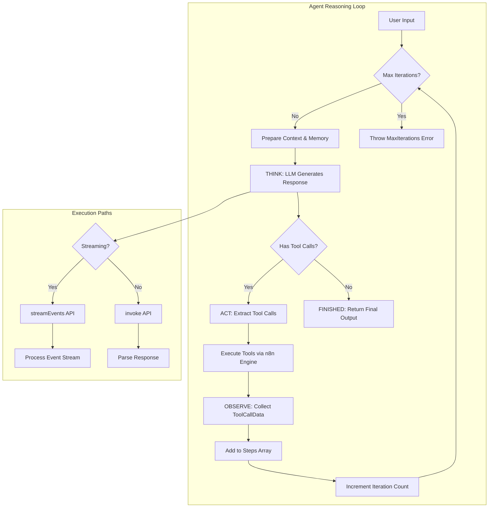
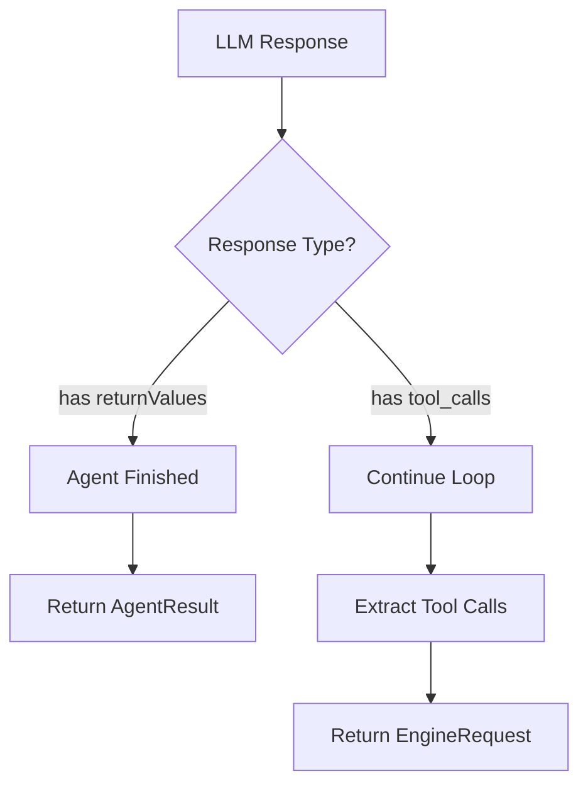

# Reasoning Loop - Agent Think → Act → Observe Cycle

## TL;DR
AI Agent trong n8n implement reasoning loop theo pattern **Think → Act → Observe**. Agent sử dụng LangChain's `AgentRunnableSequence` với streaming support. Loop continues until agent decides to finish hoặc max iterations reached. Steps được accumulate qua `ToolCallData[]` array và passed as context cho mỗi iteration.

---

## Reasoning Loop Architecture



---

## 1. Single Iteration Execution (runAgent.ts)

### Core Function Signature

```typescript
// packages/@n8n/nodes-langchain/nodes/agents/Agent/agents/ToolsAgent/V3/helpers/runAgent.ts

export async function runAgent(
  ctx: IExecuteFunctions | ISupplyDataFunctions,
  executor: AgentRunnableSequence,     // LangChain agent sequence
  itemContext: ItemContext,             // Current item context
  model: BaseChatModel,                 // Primary LLM
  memory: BaseChatMemory | undefined,   // Conversation memory
  response?: EngineResponse<RequestResponseMetadata>,  // Previous iteration data
): Promise<RunAgentResult>
```

**Line-by-line Explanation:**
- `executor`: Pre-built agent sequence với tools bound
- `itemContext`: Contains input, steps, options cho current item
- `response`: Metadata từ previous iteration (iteration count, previous steps)
- Returns either `AgentResult` (finished) hoặc `EngineRequest` (need more tool calls)

---

## 2. Streaming vs Non-Streaming Execution

### Path A: Streaming Mode

```typescript
// runAgent.ts - Streaming execution path

// Check if streaming is enabled
if (ctx.isStreaming?.() && enableStreaming) {
  // 1. Load memory with token limit
  const chatHistory = await loadMemory(memory, model, options.maxTokensFromMemory);

  // 2. Build invocation parameters
  const invokeParams = {
    steps,                                    // Previous steps as context
    input,                                    // User input
    system_message: options.systemMessage,    // System prompt
    chat_history: chatHistory,                // Memory messages
  };

  // 3. Start event stream
  const eventStream = executor.streamEvents(invokeParams, {
    version: 'v2',
    configurable: { sessionId: options.sessionId },
  });

  // 4. Process events (tokens + tool calls)
  const agentResult = await processEventStream(ctx, eventStream, itemIndex);

  // 5. Check result type
  if (agentResult.toolCalls && agentResult.toolCalls.length > 0) {
    // Need to execute tools - return request
    return {
      actions: createEngineRequests(agentResult.toolCalls, itemIndex, tools),
      metadata: buildResponseMetadata(response, itemIndex),
    };
  }

  // Agent finished - save to memory and return
  await saveToMemory(memory, input, agentResult.output);
  return agentResult;
}
```

### Path B: Non-Streaming Mode

```typescript
// runAgent.ts - Non-streaming execution path

// Direct invocation
const modelResponse = await executor.invoke(invokeParams);

// Check response type
if ('returnValues' in modelResponse) {
  // Agent finished - has final answer
  await saveToMemory(memory, input, modelResponse.returnValues.output);
  return { ...modelResponse.returnValues };  // AgentResult
}

// Has tool calls - extract and return request
const actions = createEngineRequests(modelResponse.toolCalls, itemIndex, tools);
return {
  actions,  // EngineRequest - continue loop
  metadata: buildResponseMetadata(response, itemIndex),
};
```

---

## 3. Event Stream Processing

### processEventStream Function

```typescript
// packages/@n8n/nodes-langchain/utils/agent-execution/processEventStream.ts

export async function processEventStream(
  ctx: IExecuteFunctions,
  eventStream: IterableReadableStream<StreamEvent>,
  itemIndex: number,
): Promise<AgentResult> {
  const agentResult: AgentResult = { output: '' };
  const toolCalls: ToolCallRequest[] = [];

  // Signal stream start
  ctx.sendChunk('begin', itemIndex);

  for await (const event of eventStream) {
    switch (event.event) {
      // Text tokens - stream to UI
      case 'on_chat_model_stream':
        const chunk = event.data?.chunk as AIMessageChunk;
        if (chunk?.content) {
          let chunkText = '';

          // Handle array content (Claude format)
          if (Array.isArray(chunk.content)) {
            for (const message of chunk.content) {
              if (message?.type === 'text') {
                chunkText += message.text;
              }
            }
          } else {
            chunkText = String(chunk.content);
          }

          // Stream text back to UI
          ctx.sendChunk('item', itemIndex, chunkText);
          agentResult.output += chunkText;
        }
        break;

      // LLM completion - extract tool calls
      case 'on_chat_model_end':
        const output = event.data?.output;
        if (output?.tool_calls?.length > 0) {
          for (const toolCall of output.tool_calls) {
            toolCalls.push({
              tool: toolCall.name,
              toolInput: toolCall.args,
              toolCallId: toolCall.id || 'unknown',
              type: toolCall.type || 'tool_call',
              log: output.content || `Calling ${toolCall.name}...`,
              messageLog: [output],
              additionalKwargs: output.additional_kwargs,  // Gemini signatures
            });
          }
        }
        break;
    }
  }

  // Signal stream end
  ctx.sendChunk('end', itemIndex);

  // Attach tool calls if any
  if (toolCalls.length > 0) {
    agentResult.toolCalls = toolCalls;
  }

  return agentResult;
}
```

**Key Events:**
- `on_chat_model_stream`: Text tokens được stream real-time
- `on_chat_model_end`: Full response với tool_calls array

---

## 4. Steps Accumulation (ToolCallData[])

### Building Steps Array

```typescript
// packages/@n8n/nodes-langchain/utils/agent-execution/buildSteps.ts

export function buildSteps(
  response: EngineResponse<RequestResponseMetadata> | undefined,
  itemIndex: number,
): ToolCallData[] {
  const steps: ToolCallData[] = [];

  // 1. Carry forward ALL previous steps
  if (response?.metadata?.previousRequests) {
    steps.push(...response.metadata.previousRequests);
  }

  // 2. Add new tool responses from current iteration
  const responses = response?.actions || [];

  for (const tool of responses) {
    // Filter by item index
    if (tool.action?.metadata?.itemIndex !== itemIndex) continue;

    const toolInput = {
      ...tool.action.input,
      id: tool.action.id,  // Tool call ID for tracking
    };

    // Build step entry
    steps.push({
      action: {
        tool: resolveToolName(tool),
        toolInput: toolInput,
        log: toolInput.log || `Calling ${tool.action.nodeName}`,
        messageLog: extractMessageLog(tool),  // AIMessage array
        toolCallId: tool.action.id,
        type: 'tool_call',
      },
      observation: buildObservation(tool.data),  // Tool execution result
    });
  }

  return steps;
}
```

### ToolCallData Structure

```typescript
// packages/@n8n/nodes-langchain/utils/agent-execution/types.ts

export type ToolCallData = {
  action: {
    tool: string;                           // Tool name
    toolInput: Record<string, unknown>;     // Tool parameters
    log: string | number | true | object;   // Action description
    messageLog?: AIMessage[];               // For Anthropic thinking blocks
    toolCallId: string;                     // Unique ID
    type: string;                           // 'tool_call'
  };
  observation: string;  // Tool execution result
};
```

---

## 5. Max Iterations Handling

### Iteration Check

```typescript
// packages/@n8n/nodes-langchain/nodes/agents/Agent/agents/ToolsAgent/V3/helpers/checkMaxIterations.ts

export function checkMaxIterations(
  response: EngineResponse<RequestResponseMetadata> | undefined,
  maxIterations: number,
  node: INode,
): void {
  // Skip check on first iteration
  if (response?.metadata?.iterationCount === undefined) {
    return;
  }

  // Throw error if limit reached
  if (response.metadata.iterationCount >= maxIterations) {
    throw new NodeOperationError(
      node,
      `Max iterations (${maxIterations}) reached. ` +
      `The agent could not complete the task within the allowed number of iterations.`,
    );
  }
}
```

### Iteration Count Increment

```typescript
// packages/@n8n/nodes-langchain/utils/agent-execution/buildResponseMetadata.ts

export function buildResponseMetadata(
  response: EngineResponse<RequestResponseMetadata> | undefined,
  itemIndex: number,
): RequestResponseMetadata {
  const currentIterationCount = response?.metadata?.iterationCount ?? 0;

  return {
    previousRequests: buildSteps(response, itemIndex),  // All steps so far
    itemIndex,
    iterationCount: currentIterationCount + 1,          // Increment
  };
}
```

### Iteration Flow Example

```
Iteration 1: iterationCount = undefined → skip check → set to 1
Iteration 2: iterationCount = 1 → (1 < 10) pass → increment to 2
Iteration 3: iterationCount = 2 → (2 < 10) pass → increment to 3
...
Iteration 10: iterationCount = 9 → (9 < 10) pass → increment to 10
Iteration 11: iterationCount = 10 → (10 >= 10) → THROW ERROR
```

---

## 6. Finish Condition Detection

### How Agent Decides to Stop



### Detection Logic

```typescript
// runAgent.ts - Finish condition check

// Non-streaming mode
if ('returnValues' in modelResponse) {
  // Agent returned final answer - FINISHED
  return {
    output: modelResponse.returnValues.output,
    intermediateSteps: steps,
  };
}

// Streaming mode
if (!agentResult.toolCalls || agentResult.toolCalls.length === 0) {
  // No tool calls - FINISHED
  return {
    output: agentResult.output,
    intermediateSteps: steps,
  };
}

// Has tool calls - NOT finished, continue loop
```

---

## 7. Tool Call to Engine Request Conversion

### createEngineRequests Function

```typescript
// packages/@n8n/nodes-langchain/utils/agent-execution/createEngineRequests.ts

export function createEngineRequests(
  toolCalls: ToolCallRequest[],
  itemIndex: number,
  tools: Array<DynamicStructuredTool | Tool>,
): EngineRequest<RequestResponseMetadata>['actions'] {

  return toolCalls
    .map((toolCall) => {
      // Find corresponding tool
      const foundTool = tools.find((tool) => tool.name === toolCall.tool);
      if (!foundTool) return undefined;

      // Get node name from tool metadata
      const nodeName = foundTool.metadata?.sourceNodeName;
      if (typeof nodeName !== 'string') return undefined;

      const metadata = foundTool.metadata ?? {};
      const toolInput = toolCall.toolInput as IDataObject;

      // Extract HITL (Human-in-the-Loop) metadata if present
      const hitlMetadata = extractHitlMetadata(metadata, toolCall.tool, toolInput);

      // Build input object
      let input: IDataObject = toolInput;
      if (metadata.isFromToolkit) {
        input = { ...input, tool: toolCall.tool };  // Add tool name for toolkits
      }

      // Build engine request
      return {
        actionType: 'ExecutionNodeAction' as const,
        nodeName,                              // n8n node to execute
        input,                                 // Tool parameters
        type: NodeConnectionTypes.AiTool,      // Connection type
        id: toolCall.toolCallId,               // For tracking
        metadata: {
          itemIndex,
          hitl: hitlMetadata,
          // Extended thinking metadata (Anthropic/Gemini)
          ...extractThinkingMetadata(toolCall),
        },
      };
    })
    .filter(Boolean);
}
```

---

## 8. Batch Execution Orchestration

### executeBatch Flow

```typescript
// packages/@n8n/nodes-langchain/nodes/agents/Agent/agents/ToolsAgent/V3/helpers/executeBatch.ts

export async function executeBatch(
  ctx: IExecuteFunctions | ISupplyDataFunctions,
  batch: INodeExecutionData[],
  startIndex: number,
  model: BaseChatModel,
  fallbackModel: BaseChatModel | null,
  memory: BaseChatMemory | undefined,
  response?: EngineResponse<RequestResponseMetadata>,
) {
  const returnData: INodeExecutionData[] = [];
  const requestAggregator = new RequestAggregator();

  // 1. Process HITL responses if any
  const processedResponse = processHitlResponses(response);

  // 2. Parallel processing of batch items
  const batchPromises = batch.map(async (_item, batchItemIndex) => {
    const itemIndex = startIndex + batchItemIndex;

    // Check max iterations for each item
    checkMaxIterations(processedResponse, maxIterations, ctx.getNode());

    // Prepare context for this item
    const itemContext = await prepareItemContext(ctx, itemIndex, processedResponse);

    // Create agent sequence
    const executor = createAgentSequence(
      model, tools, prompt, options, outputParser, memory, fallbackModel
    );

    // Run single iteration
    return await runAgent(ctx, executor, itemContext, model, memory, processedResponse);
  });

  // 3. Await all batch results
  const batchResults = await Promise.all(batchPromises);

  // 4. Collect results
  for (const result of batchResults) {
    if ('actions' in result) {
      // Has more tool calls - add to aggregator
      requestAggregator.addRequest(result);
    } else {
      // Final result - add to return data
      returnData.push(finalizeResult(result));
    }
  }

  // 5. Return aggregated requests or final data
  if (requestAggregator.hasRequests()) {
    return requestAggregator.build();  // Continue loop
  }

  return [returnData];  // Finished
}
```

---

## 9. Complete Loop Visualization

```
┌─────────────────────────────────────────────────────────────────┐
│                    AGENT REASONING LOOP                          │
└─────────────────────────────────────────────────────────────────┘
                              │
                              ▼
                    ┌──────────────────┐
                    │  ITERATION N     │
                    │  (iterationCount)│
                    └──────────────────┘
                              │
            ┌─────────────────┼─────────────────┐
            │                 │                 │
            ▼                 ▼                 ▼
      ┌──────────┐    ┌──────────────┐   ┌──────────┐
      │ Check    │    │  Load Memory │   │  Build   │
      │ Max Iter │    │  (token      │   │  Steps   │
      │ Limit    │    │   limited)   │   │  Array   │
      └──────────┘    └──────────────┘   └──────────┘
            │                 │                 │
            └─────────────────┼─────────────────┘
                              ▼
                    ┌──────────────────┐
                    │      THINK       │
                    │  ─────────────── │
                    │  LLM processes:  │
                    │  - User input    │
                    │  - System prompt │
                    │  - Chat history  │
                    │  - Previous steps│
                    └──────────────────┘
                              │
                              ▼
                    ┌──────────────────────────┐
                    │  Response Analysis       │
                    │  ────────────────────    │
                    │  Has tool_calls?         │
                    │  Or returnValues?        │
                    └──────────────────────────┘
                         /         \
                    YES /           \ NO
                   (ACT)            (FINISH)
                       /             \
                      ▼               ▼
            ┌──────────────────┐   ┌─────────────┐
            │       ACT        │   │   FINISHED  │
            │  ─────────────── │   │  ────────── │
            │  Extract calls:  │   │  Save to    │
            │  - tool name     │   │  memory     │
            │  - toolInput     │   │             │
            │  - toolCallId    │   │  Return     │
            │                  │   │  AgentResult│
            │  Convert to      │   │             │
            │  EngineRequests  │   │             │
            └──────────────────┘   └─────────────┘
                      │                   │
                      ▼                   │
            ┌──────────────────┐          │
            │  Tool Execution  │          │
            │  ─────────────── │          │
            │  n8n workflow    │          │
            │  engine executes │          │
            │  the tool nodes  │          │
            └──────────────────┘          │
                      │                   │
                      ▼                   │
            ┌──────────────────┐          │
            │     OBSERVE      │          │
            │  ─────────────── │          │
            │  Collect results:│          │
            │  - action        │          │
            │  - observation   │          │
            │                  │          │
            │  Build           │          │
            │  ToolCallData    │          │
            └──────────────────┘          │
                      │                   │
                      ▼                   │
            ┌──────────────────┐          │
            │  Update Metadata │          │
            │  ─────────────── │          │
            │  - Increment     │          │
            │    iterationCount│          │
            │  - Add steps to  │          │
            │    previousReqs  │          │
            └──────────────────┘          │
                      │                   │
                      └───────────┬───────┘
                                  ▼
                          ┌──────────────────┐
                          │  Next Iteration  │
                          │  (N + 1)         │
                          └──────────────────┘
```

---

## File References

| Component | File Path |
|-----------|-----------|
| Single Iteration | `packages/@n8n/nodes-langchain/.../ToolsAgent/V3/helpers/runAgent.ts` |
| Batch Execution | `packages/@n8n/nodes-langchain/.../ToolsAgent/V3/helpers/executeBatch.ts` |
| Event Stream | `packages/@n8n/nodes-langchain/utils/agent-execution/processEventStream.ts` |
| Build Steps | `packages/@n8n/nodes-langchain/utils/agent-execution/buildSteps.ts` |
| Max Iterations | `packages/@n8n/nodes-langchain/.../ToolsAgent/V3/helpers/checkMaxIterations.ts` |
| Engine Requests | `packages/@n8n/nodes-langchain/utils/agent-execution/createEngineRequests.ts` |
| Response Metadata | `packages/@n8n/nodes-langchain/utils/agent-execution/buildResponseMetadata.ts` |
| Type Definitions | `packages/@n8n/nodes-langchain/utils/agent-execution/types.ts` |

---

## Key Takeaways

1. **Think → Act → Observe Cycle**: Agent loop follows ReAct pattern - LLM reasons, calls tools, observes results, and repeats until finished.

2. **Streaming Support**: Two execution paths - streaming (real-time tokens) và non-streaming (batch response). Streaming uses `streamEvents` API.

3. **Steps Accumulation**: All previous steps carried forward via `metadata.previousRequests`, providing full context to LLM at each iteration.

4. **Finish Detection**: Agent finishes when LLM returns `returnValues` instead of `tool_calls`. No explicit stop signal needed.

5. **Max Iterations Guard**: Prevents infinite loops với configurable limit (default 10). Check happens at start of each iteration.

6. **Engine Integration**: Tool calls converted to `EngineRequest` format, executed by n8n's workflow engine, results collected as observations.
