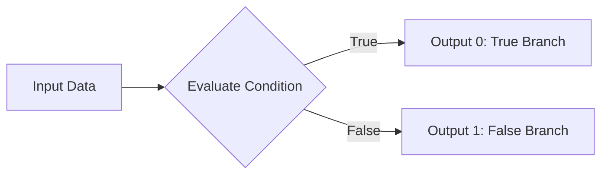
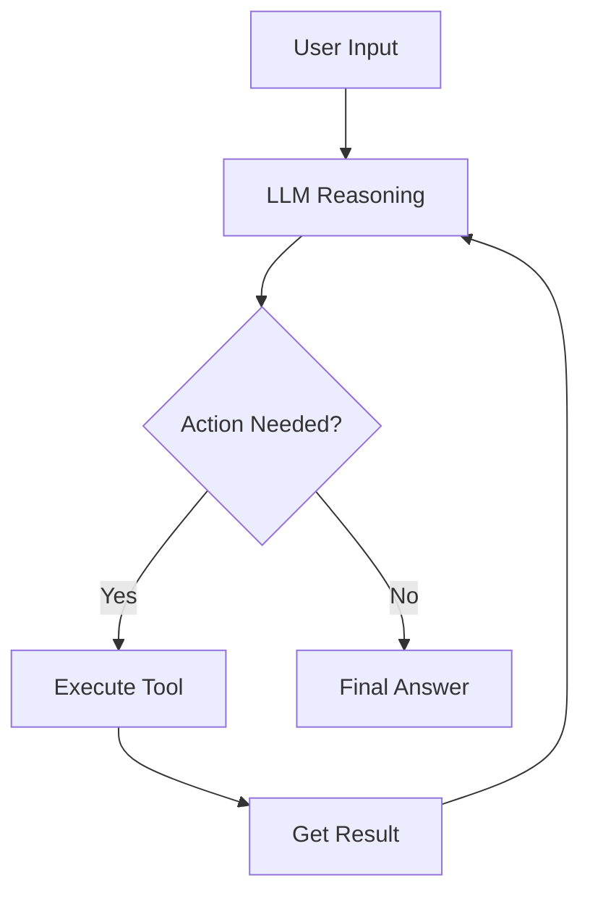
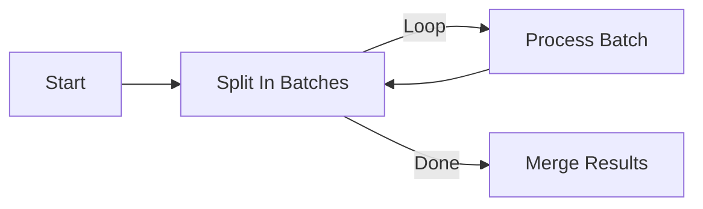

# Reasoning Loop - Node Execution & Routing Logic

## TL;DR
n8n sử dụng loop-based execution với stack queue thay vì recursive calls. Logic routing được xử lý bởi `RoutingNode` class cho declarative HTTP nodes và built-in If/Switch nodes cho conditional branching. AI nodes trong LangChain package implement ReAct pattern với tool calling loop.

---

## Execution Loop Architecture

```mermaid
flowchart TB
    subgraph "Main Execution Loop"
        INIT[Initialize Stack] --> LOOP{Stack Empty?}
        LOOP -->|No| POP[Pop Node]
        POP --> EXEC[Execute Node]
        EXEC --> STORE[Store Result]
        STORE --> BRANCH{Has Outputs?}
        BRANCH -->|Yes| QUEUE[Queue Successors]
        BRANCH -->|No| LOOP
        QUEUE --> LOOP
        LOOP -->|Yes| DONE[Finalize]
    end

    subgraph "Node Execution"
        EXEC --> TYPE{Node Type}
        TYPE -->|Programmatic| CODE[execute()]
        TYPE -->|Declarative| ROUTING[RoutingNode]
        TYPE -->|Conditional| COND[Evaluate Condition]
        TYPE -->|AI Agent| REACT[ReAct Loop]
    end
```

---

## 1. Basic Execution Loop

### Stack-Based Processing

```typescript
// packages/core/src/execution-engine/workflow-execute.ts

// Main loop - runs until stack is empty
executionLoop: while (
  this.runExecutionData.executionData!.nodeExecutionStack.length !== 0
) {
  // Dequeue next node (FIFO order)
  executionData = this.runExecutionData
    .executionData!.nodeExecutionStack.shift() as IExecuteData;

  const executionNode = executionData.node;

  // Execute node
  const runNodeData = await this.runNode(
    workflow,
    executionData,
    this.runExecutionData,
    runIndex,
    this.additionalData,
    this.mode,
    this.abortController.signal,
  );

  // Store result
  this.storeNodeExecutionData(executionNode.name, runNodeData);

  // Queue all successor nodes
  if (runNodeData.data) {
    for (let outputIndex = 0; outputIndex < runNodeData.data.length; outputIndex++) {
      const outputData = runNodeData.data[outputIndex];
      if (outputData === null || outputData.length === 0) {
        continue;  // Empty output - don't queue successors
      }

      // Get connections from this output
      const connections = workflow.connectionsBySourceNode[executionNode.name]
        ?.main?.[outputIndex] ?? [];

      for (const connection of connections) {
        this.addNodeToBeExecuted(
          workflow,
          connection,
          outputIndex,
          executionNode.name,
          runNodeData.data,
          runIndex,
        );
      }
    }
  }
}
```

### Execution Order Strategy

```typescript
// packages/core/src/execution-engine/workflow-execute.ts

// V1 execution order: top-left nodes execute first
if (workflow.settings.executionOrder === 'v1') {
  // Sort nodes by visual position
  nodesToAdd.sort((a, b) => {
    // Higher Y (lower on canvas) = execute first
    if (a.position[1] < b.position[1]) return 1;
    if (a.position[1] > b.position[1]) return -1;

    // Same Y - higher X (more right) = execute first
    if (a.position[0] > b.position[0]) return -1;
    return 0;
  });
}

// Enqueue in sorted order
for (const nodeData of nodesToAdd) {
  this.addNodeToBeExecuted(
    workflow,
    nodeData.connection,
    nodeData.outputIndex,
    parentNodeName,
    nodeSuccessData,
    runIndex,
  );
}
```

---

## 2. Conditional Routing

### If Node Logic



```typescript
// packages/nodes-base/nodes/If/If.node.ts

export class If implements INodeType {
  description: INodeTypeDescription = {
    displayName: 'If',
    name: 'if',
    outputs: [
      NodeConnectionTypes.Main,  // True branch
      NodeConnectionTypes.Main,  // False branch
    ],
  };

  async execute(this: IExecuteFunctions): Promise<INodeExecutionData[][]> {
    const items = this.getInputData();
    const trueItems: INodeExecutionData[] = [];
    const falseItems: INodeExecutionData[] = [];

    for (let itemIndex = 0; itemIndex < items.length; itemIndex++) {
      // Get condition configuration
      const conditions = this.getNodeParameter('conditions', itemIndex) as IConditions;

      // Evaluate all condition rules
      const result = this.evaluateConditions(conditions, itemIndex);

      if (result) {
        trueItems.push(items[itemIndex]);
      } else {
        falseItems.push(items[itemIndex]);
      }
    }

    // Return array of arrays - one per output
    return [trueItems, falseItems];
  }

  private evaluateConditions(conditions: IConditions, itemIndex: number): boolean {
    const { combinator, rules } = conditions;

    const results = rules.map(rule => {
      const value1 = this.getNodeParameter(
        `conditions.rules.${rule.id}.value1`,
        itemIndex
      );
      const value2 = this.getNodeParameter(
        `conditions.rules.${rule.id}.value2`,
        itemIndex
      );
      const operator = rule.operator;

      return this.compareValues(value1, value2, operator);
    });

    // Apply combinator (AND/OR)
    if (combinator === 'and') {
      return results.every(r => r);
    } else {
      return results.some(r => r);
    }
  }
}
```

### Switch Node Logic

```typescript
// packages/nodes-base/nodes/Switch/Switch.node.ts

export class Switch implements INodeType {
  async execute(this: IExecuteFunctions): Promise<INodeExecutionData[][]> {
    const items = this.getInputData();

    // Get number of outputs (dynamic based on config)
    const outputCount = this.getNodeParameter('rules.values', 0, []).length + 1;

    // Initialize output arrays
    const outputs: INodeExecutionData[][] = Array(outputCount)
      .fill(null)
      .map(() => []);

    for (let itemIndex = 0; itemIndex < items.length; itemIndex++) {
      const rules = this.getNodeParameter('rules.values', itemIndex, []);
      const fallbackOutput = this.getNodeParameter('fallbackOutput', itemIndex);

      let matched = false;

      // Check each rule in order
      for (let ruleIndex = 0; ruleIndex < rules.length; ruleIndex++) {
        const rule = rules[ruleIndex];
        const value = this.getNodeParameter(
          `rules.values.${ruleIndex}.value`,
          itemIndex
        );

        if (this.evaluateRule(rule, value, itemIndex)) {
          outputs[ruleIndex].push(items[itemIndex]);
          matched = true;

          // Stop on first match unless configured otherwise
          if (!rule.continueOnMatch) break;
        }
      }

      // If no match, send to fallback output
      if (!matched && fallbackOutput !== 'none') {
        outputs[outputs.length - 1].push(items[itemIndex]);
      }
    }

    return outputs;
  }
}
```

---

## 3. RoutingNode - Declarative HTTP

```typescript
// packages/core/src/execution-engine/routing-node.ts

export class RoutingNode {
  constructor(
    private readonly context: ExecuteContext,
    private readonly nodeType: INodeType,
  ) {}

  async runNode(): Promise<INodeExecutionData[][] | undefined> {
    const items = this.context.getInputData();
    const returnData: INodeExecutionData[] = [];

    // Process each input item
    for (let itemIndex = 0; itemIndex < items.length; itemIndex++) {
      // 1. Build request from node parameters
      const requestData = this.buildRequestFromParameters(itemIndex);

      // 2. Apply pre-send hooks
      const modifiedRequest = await this.applyPreSendHooks(requestData, itemIndex);

      // 3. Execute HTTP request
      const response = await this.makeRequest(modifiedRequest);

      // 4. Apply post-receive hooks
      const processedData = await this.applyPostReceiveHooks(response, itemIndex);

      // 5. Handle pagination if configured
      if (this.hasPagination()) {
        const allPages = await this.handlePagination(
          modifiedRequest,
          processedData,
          itemIndex
        );
        returnData.push(...allPages);
      } else {
        returnData.push(...processedData);
      }
    }

    return [returnData];
  }

  private buildRequestFromParameters(itemIndex: number): IHttpRequestOptions {
    const { requestDefaults } = this.nodeType.description;

    // Start with defaults
    const request: IHttpRequestOptions = {
      method: requestDefaults?.method || 'GET',
      url: requestDefaults?.baseURL || '',
      headers: {},
      qs: {},
      body: {},
    };

    // Apply each property from node description
    for (const property of this.nodeType.description.properties) {
      const value = this.context.getNodeParameter(property.name, itemIndex);

      // Handle routing config
      if (property.routing) {
        this.applyRouting(request, property.routing, value);
      }
    }

    return request;
  }

  private applyRouting(
    request: IHttpRequestOptions,
    routing: INodePropertyRouting,
    value: any
  ): void {
    // Send as query string
    if (routing.send?.type === 'query') {
      request.qs[routing.send.property] = value;
    }

    // Send in body
    if (routing.send?.type === 'body') {
      set(request.body, routing.send.property, value);
    }

    // Send in headers
    if (routing.send?.type === 'header') {
      request.headers[routing.send.property] = value;
    }

    // Modify URL path
    if (routing.request?.url) {
      request.url = routing.request.url.replace('={{$value}}', value);
    }
  }
}
```

### Declarative Node Example

```typescript
// Declarative HTTP node definition
export const SlackApi: INodeTypeDescription = {
  name: 'slackApi',
  displayName: 'Slack',

  // Default request configuration
  requestDefaults: {
    baseURL: 'https://slack.com/api',
    headers: {
      'Content-Type': 'application/json',
    },
  },

  properties: [
    {
      displayName: 'Resource',
      name: 'resource',
      type: 'options',
      options: [
        { name: 'Channel', value: 'channel' },
        { name: 'Message', value: 'message' },
      ],
    },
    {
      displayName: 'Operation',
      name: 'operation',
      type: 'options',
      options: [
        {
          name: 'Send Message',
          value: 'sendMessage',
          // Routing configuration
          routing: {
            request: {
              method: 'POST',
              url: '/chat.postMessage',
            },
          },
        },
      ],
    },
    {
      displayName: 'Channel',
      name: 'channel',
      type: 'string',
      routing: {
        send: {
          type: 'body',
          property: 'channel',
        },
      },
    },
    {
      displayName: 'Text',
      name: 'text',
      type: 'string',
      routing: {
        send: {
          type: 'body',
          property: 'text',
        },
      },
    },
  ],
};
```

---

## 4. AI Agent ReAct Loop

### ReAct Pattern Implementation



```typescript
// packages/@n8n/nodes-langchain/nodes/agents/Agent/Agent.node.ts

export class Agent implements INodeType {
  async execute(this: IExecuteFunctions): Promise<INodeExecutionData[][]> {
    const items = this.getInputData();
    const returnData: INodeExecutionData[] = [];

    // Get connected LLM
    const llm = await this.getInputConnectionData('ai_languageModel', 0);

    // Get connected tools
    const tools = await this.getInputConnectionData('ai_tool', 0) as Tool[];

    // Get memory if connected
    const memory = await this.getInputConnectionData('ai_memory', 0);

    for (let itemIndex = 0; itemIndex < items.length; itemIndex++) {
      const input = this.getNodeParameter('text', itemIndex) as string;

      // Create agent executor
      const agent = await createReactAgent({
        llm,
        tools,
        prompt: this.getAgentPrompt(),
      });

      const executor = new AgentExecutor({
        agent,
        tools,
        memory,
        maxIterations: this.getNodeParameter('maxIterations', itemIndex, 10),
        returnIntermediateSteps: true,
      });

      // Run agent loop
      const result = await executor.invoke({
        input,
        chat_history: memory?.chatHistory || [],
      });

      returnData.push({
        json: {
          output: result.output,
          intermediateSteps: result.intermediateSteps,
        },
      });
    }

    return [returnData];
  }

  private getAgentPrompt(): ChatPromptTemplate {
    return ChatPromptTemplate.fromMessages([
      ['system', `You are a helpful assistant. You have access to the following tools:
{tools}

Use the following format:
Question: the input question
Thought: think about what to do
Action: the action to take (one of {tool_names})
Action Input: the input to the action
Observation: the result of the action
... (repeat Thought/Action/Observation as needed)
Thought: I now know the final answer
Final Answer: the final answer`],
      ['human', '{input}'],
      new MessagesPlaceholder('agent_scratchpad'),
    ]);
  }
}
```

### Tool Execution in Agent Loop

```typescript
// Simplified agent execution loop
async invoke(input: AgentInput): Promise<AgentOutput> {
  let iterations = 0;
  const intermediateSteps: AgentStep[] = [];

  while (iterations < this.maxIterations) {
    iterations++;

    // 1. Ask LLM what to do
    const action = await this.agent.plan(input, intermediateSteps);

    // 2. Check if finished
    if (action.type === 'finish') {
      return {
        output: action.returnValues.output,
        intermediateSteps,
      };
    }

    // 3. Execute tool
    const tool = this.tools.find(t => t.name === action.tool);
    if (!tool) {
      throw new Error(`Tool not found: ${action.tool}`);
    }

    const observation = await tool.invoke(action.toolInput);

    // 4. Record step
    intermediateSteps.push({
      action,
      observation,
    });
  }

  throw new Error('Max iterations reached');
}
```

---

## 5. Loop Constructs

### Loop Over Items Node

```typescript
// packages/nodes-base/nodes/SplitInBatches/SplitInBatches.node.ts

export class SplitInBatches implements INodeType {
  description: INodeTypeDescription = {
    outputs: [
      NodeConnectionTypes.Main,  // Loop output (batch)
      NodeConnectionTypes.Main,  // Done output
    ],
  };

  async execute(this: IExecuteFunctions): Promise<INodeExecutionData[][]> {
    const items = this.getInputData();
    const batchSize = this.getNodeParameter('batchSize', 0) as number;

    // Get static data to track progress
    const staticData = this.getWorkflowStaticData('node');
    const iteration = (staticData.iteration as number) || 0;

    // Calculate current batch
    const startIndex = iteration * batchSize;
    const endIndex = Math.min(startIndex + batchSize, items.length);

    if (startIndex >= items.length) {
      // All batches processed - clear and output done
      staticData.iteration = 0;
      return [[], items];  // Empty loop, full done
    }

    // Get current batch
    const batch = items.slice(startIndex, endIndex);

    // Increment for next iteration
    staticData.iteration = iteration + 1;

    // Output batch for processing
    return [batch, []];  // Batch to loop, empty done
  }
}
```

### Loop Workflow Pattern



---

## 6. Error Handling & Retry

```typescript
// Retry logic in execution loop
let maxTries = 1;
if (executionData.node.retryOnFail === true) {
  maxTries = Math.min(5, Math.max(2, executionData.node.maxTries || 3));
}

let waitBetweenTries = executionData.node.waitBetweenTries || 1000;
waitBetweenTries = Math.min(5000, Math.max(0, waitBetweenTries));

for (let tryIndex = 0; tryIndex < maxTries; tryIndex++) {
  try {
    runNodeData = await this.runNode(...);
    break;  // Success
  } catch (error) {
    executionError = error;

    // Log retry attempt
    Logger.warn(`Node "${executionNode.name}" retry ${tryIndex + 1}/${maxTries}`);

    if (tryIndex !== maxTries - 1) {
      await sleep(waitBetweenTries);
    }
  }
}

// Handle final error
if (executionError) {
  if (executionData.node.continueOnFail === true) {
    // Continue with error data
    runNodeData = {
      data: [[{ json: { error: executionError.message } }]],
    };
  } else {
    // Stop execution
    throw executionError;
  }
}
```

---

## File References

| Component | File Path |
|-----------|-----------|
| Main Execution Loop | `packages/core/src/execution-engine/workflow-execute.ts:1433` |
| RoutingNode | `packages/core/src/execution-engine/routing-node.ts` |
| If Node | `packages/nodes-base/nodes/If/If.node.ts` |
| Switch Node | `packages/nodes-base/nodes/Switch/Switch.node.ts` |
| AI Agent Node | `packages/@n8n/nodes-langchain/nodes/agents/Agent/Agent.node.ts` |
| SplitInBatches | `packages/nodes-base/nodes/SplitInBatches/SplitInBatches.node.ts` |

---

## Key Takeaways

1. **Stack-Based Loop**: Sử dụng FIFO stack thay vì recursion, tránh stack overflow với workflows lớn.

2. **Output-Based Routing**: Mỗi node có thể có nhiều outputs, data chỉ flow qua outputs có data.

3. **Declarative HTTP**: `RoutingNode` transform node config thành HTTP requests, giảm boilerplate code.

4. **ReAct Pattern**: AI nodes implement standard ReAct loop với tool calling và observation feedback.

5. **Static Data**: Loop nodes sử dụng `getWorkflowStaticData()` để track iteration state across executions.

6. **Graceful Error Handling**: Retry logic và `continueOnFail` cho phép workflows resilient với failures.
