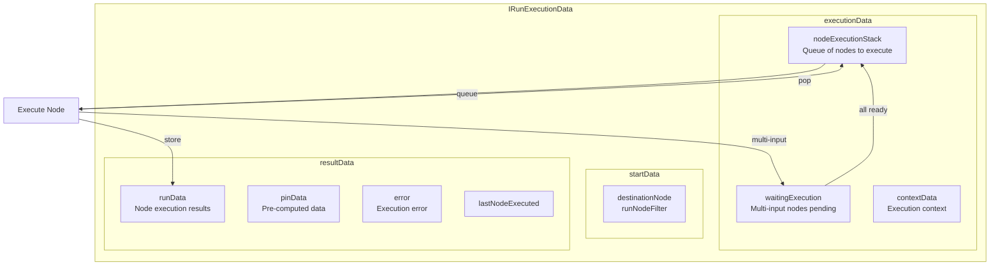
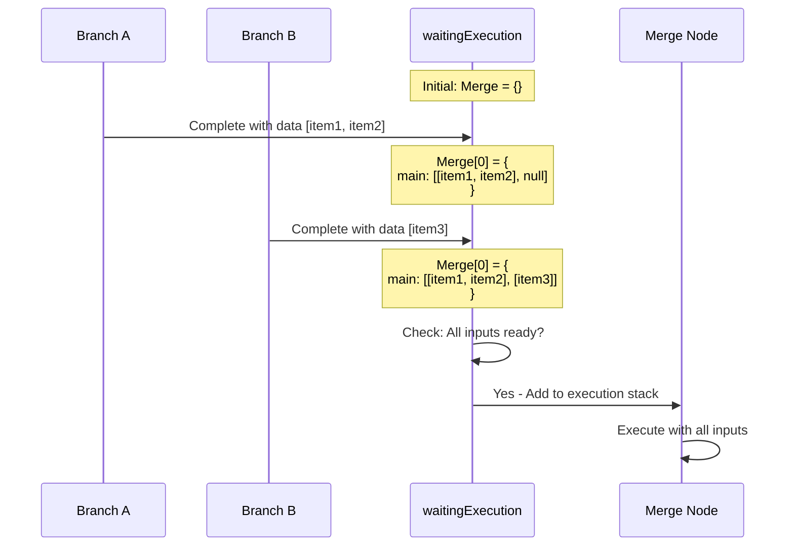

# State Management - Execution Data Flow

## TL;DR
n8n quản lý execution state qua `IRunExecutionData` struct chứa: execution stack (nodes chờ execute), waiting execution (multi-input nodes), và run data (kết quả đã execute). Data flow giữa nodes qua `INodeExecutionData` array, với `pairedItem` tracking data lineage.

---

## State Architecture



---

## Core Data Structures

### IRunExecutionData

```typescript
// packages/workflow/src/run-execution-data/run-execution-data.v1.ts

export interface IRunExecutionDataV1 {
  version: 1;

  // ===== START DATA =====
  startData?: {
    // Partial execution target
    destinationNode?: IDestinationNode;
    originalDestinationNode?: IDestinationNode;

    // Whitelist of nodes allowed to execute
    runNodeFilter?: string[];

    // Start nodes for execution
    startNodes?: StartNodeData[];
  };

  // ===== EXECUTION DATA =====
  executionData?: {
    // Queue of nodes waiting to execute
    nodeExecutionStack: IExecuteData[];

    // Multi-input nodes waiting for all inputs
    waitingExecution: IWaitingForExecution;
    waitingExecutionSource: IWaitingForExecutionSource | null;

    // Execution context (variables, etc.)
    contextData: IExecuteContextData;

    // Runtime data (task runner state)
    runtimeData?: IExecutionContext;

    // Metadata indexed by node name
    metadata: {
      [nodeName: string]: ITaskMetadata[];
    };
  };

  // ===== RESULT DATA =====
  resultData: {
    // All node execution results
    runData: IRunData;

    // Pre-computed pinned data
    pinData?: IPinData;

    // Execution error if failed
    error?: ExecutionError;

    // Last executed node name
    lastNodeExecuted?: string;
  };

  // Wait until date for scheduled workflows
  waitTill?: Date;

  // Push notification reference
  pushRef?: string;

  // Parent execution for sub-workflows
  parentExecution?: RelatedExecution;
}
```

### Node Execution Stack Item

```typescript
// packages/workflow/src/interfaces.ts

export interface IExecuteData {
  // Node to execute
  node: INode;

  // Input data by connection type
  data: ITaskDataConnections;

  // Where the input came from
  source: ITaskDataConnectionsSource | null;

  // Which run iteration
  runIndex?: number;

  // Additional metadata
  metadata?: ITaskMetadata;
}

// Connection type -> array of outputs -> array of items
export interface ITaskDataConnections {
  [connectionType: string]: Array<INodeExecutionData[] | null>;
}

// Example:
// {
//   main: [
//     [{ json: { id: 1 } }, { json: { id: 2 } }],  // Output 0
//     [{ json: { id: 3 } }],                        // Output 1
//   ]
// }
```

### Node Execution Data (Single Item)

```typescript
// packages/workflow/src/interfaces.ts

export interface INodeExecutionData {
  // Main JSON payload
  json: IDataObject;

  // Binary data (files, images)
  binary?: IBinaryKeyData;

  // Data lineage tracking
  pairedItem?: IPairedItemData | IPairedItemData[];

  // Error info if this item failed
  error?: NodeError;

  // Execution index for debugging
  index?: number;
}

// Example item:
// {
//   json: {
//     name: "John",
//     email: "john@example.com"
//   },
//   binary: {
//     photo: {
//       data: "base64...",
//       mimeType: "image/png",
//       fileName: "photo.png"
//     }
//   },
//   pairedItem: { item: 0 }  // Came from input item 0
// }
```

---

## Run Data Structure

### IRunData

```typescript
// packages/workflow/src/interfaces.ts

// Node name -> array of task data (one per run)
export interface IRunData {
  [nodeName: string]: ITaskData[];
}

export interface ITaskData extends ITaskStartedData {
  // Execution timing
  startTime: number;
  executionTime: number;

  // Result status
  executionStatus?: ExecutionStatus;

  // Output data by connection type
  data?: ITaskDataConnections;

  // Input override (for debugging)
  inputOverride?: ITaskDataConnections;

  // Error if failed
  error?: ExecutionError;

  // Task metadata
  metadata?: ITaskMetadata;

  // Hints for UI
  hints?: NodeExecutionHint[];
}

// Example runData:
// {
//   "HTTP Request": [{
//     startTime: 1699999999999,
//     executionTime: 150,
//     executionStatus: "success",
//     data: {
//       main: [[
//         { json: { status: 200, data: {...} } }
//       ]]
//     }
//   }],
//   "If": [{
//     executionTime: 5,
//     executionStatus: "success",
//     data: {
//       main: [
//         [{ json: {...} }],  // True branch
//         []                   // False branch (empty)
//       ]
//     }
//   }]
// }
```

---

## Waiting Execution (Multi-Input Nodes)

```typescript
// packages/workflow/src/interfaces.ts

// Node name -> run index -> data
export interface IWaitingForExecution {
  [nodeName: string]: {
    [runIndex: number]: ITaskDataConnections;
  };
}

export interface IWaitingForExecutionSource {
  [nodeName: string]: {
    [runIndex: number]: ITaskDataConnectionsSource;
  };
}
```

### Multi-Input Flow Example



### Code Implementation

```typescript
// packages/core/src/execution-engine/workflow-execute.ts

addNodeToBeExecuted(
  workflow: Workflow,
  connectionData: IConnection,
  outputIndex: number,
  parentNodeName: string,
  nodeSuccessData: INodeExecutionData[][],
  runIndex: number,
): void {
  const targetNode = connectionData.node;
  const inputIndex = connectionData.index;

  // Count inputs for target node
  const numberOfInputs = workflow
    .connectionsByDestinationNode[targetNode]?.main?.length ?? 0;

  if (numberOfInputs > 1) {
    // Multi-input node - use waiting mechanism

    // Initialize waiting structure
    if (!this.runExecutionData.executionData!.waitingExecution[targetNode]) {
      this.runExecutionData.executionData!.waitingExecution[targetNode] = {};
      this.runExecutionData.executionData!.waitingExecutionSource[targetNode] = {};
    }

    const waitingNodeIndex = this.getWaitingNodeIndex(targetNode, runIndex);

    // Initialize this run's waiting data
    if (!this.runExecutionData.executionData!.waitingExecution[targetNode][waitingNodeIndex]) {
      this.runExecutionData.executionData!.waitingExecution[targetNode][waitingNodeIndex] = {
        main: Array(numberOfInputs).fill(null),
      };
    }

    // Store data for this input
    this.runExecutionData.executionData!.waitingExecution[targetNode][waitingNodeIndex]
      .main[inputIndex] = nodeSuccessData[outputIndex];

    // Store source info
    this.runExecutionData.executionData!.waitingExecutionSource[targetNode][waitingNodeIndex]
      .main[inputIndex] = [{
        previousNode: parentNodeName,
        previousNodeOutput: outputIndex,
        previousNodeRun: runIndex,
      }];

    // Check if all inputs are ready
    let allDataFound = true;
    for (let i = 0; i < numberOfInputs; i++) {
      if (this.runExecutionData.executionData!.waitingExecution[targetNode][waitingNodeIndex]
          .main[i] === null) {
        allDataFound = false;
        break;
      }
    }

    if (allDataFound) {
      // All inputs ready - add to execution stack
      this.runExecutionData.executionData!.nodeExecutionStack.push({
        node: workflow.nodes[targetNode],
        data: this.runExecutionData.executionData!.waitingExecution[targetNode][waitingNodeIndex],
        source: this.runExecutionData.executionData!.waitingExecutionSource[targetNode][waitingNodeIndex],
      });

      // Cleanup waiting entry
      delete this.runExecutionData.executionData!.waitingExecution[targetNode][waitingNodeIndex];
      delete this.runExecutionData.executionData!.waitingExecutionSource[targetNode][waitingNodeIndex];
    }
  } else {
    // Single input - add directly to stack
    this.runExecutionData.executionData!.nodeExecutionStack.push({
      node: workflow.nodes[targetNode],
      data: {
        main: [nodeSuccessData[outputIndex]],
      },
      source: {
        main: [{
          previousNode: parentNodeName,
          previousNodeOutput: outputIndex,
          previousNodeRun: runIndex,
        }],
      },
    });
  }
}
```

---

## Static Data (Persistent Node State)

```typescript
// packages/workflow/src/interfaces.ts

export interface IWorkflowBase {
  // ...
  staticData?: IDataObject;  // Workflow-level static data
}

// Access in node:
// packages/core/src/execution-engine/node-execution-context/execute-context.ts

class ExecuteContext {
  getWorkflowStaticData(type: 'node' | 'global'): IDataObject {
    if (type === 'global') {
      // Shared across all nodes
      return this.workflow.staticData;
    }

    // Node-specific static data
    const nodeName = this.node.name;
    if (!this.workflow.staticData[nodeName]) {
      this.workflow.staticData[nodeName] = {};
    }
    return this.workflow.staticData[nodeName];
  }
}
```

### Static Data Use Case

```typescript
// Example: Polling node tracking last poll time
export class EmailTrigger implements INodeType {
  async poll(this: IPollFunctions): Promise<INodeExecutionData[][] | null> {
    const staticData = this.getWorkflowStaticData('node');

    // Get last processed timestamp
    const lastPollTime = staticData.lastPollTime as number || 0;

    // Fetch new emails since last poll
    const emails = await this.helpers.request({
      url: '/api/emails',
      qs: { since: lastPollTime },
    });

    // Update last poll time
    staticData.lastPollTime = Date.now();

    if (emails.length === 0) {
      return null;  // No new data
    }

    return [[emails.map(e => ({ json: e }))]];
  }
}
```

---

## Data Lineage (Paired Items)

```typescript
// packages/workflow/src/interfaces.ts

export interface IPairedItemData {
  // Index of source item
  item: number;

  // Input connection index (for multi-input nodes)
  input?: number;

  // Source node name (for cross-node tracking)
  sourceOverwrite?: string;
}
```

### Automatic Pairing

```typescript
// packages/core/src/execution-engine/workflow-execute.ts

assignPairedItems(
  nodeSuccessData: INodeExecutionData[][] | null | undefined,
  executionData: IExecuteData,
): void {
  if (!nodeSuccessData) return;

  // Check if 1:1 mapping is possible
  const isSingleInputAndOutput =
    executionData.data.main.length === 1 &&
    executionData.data.main[0]?.length === 1;

  const isSameNumberOfItems =
    nodeSuccessData.length === 1 &&
    executionData.data.main.length === 1 &&
    executionData.data.main[0]?.length === nodeSuccessData[0].length;

  for (const outputData of nodeSuccessData) {
    for (const [index, item] of outputData.entries()) {
      if (item.pairedItem === undefined) {
        if (isSingleInputAndOutput) {
          // All outputs came from single input
          item.pairedItem = { item: 0 };
        } else if (isSameNumberOfItems) {
          // 1:1 mapping by index
          item.pairedItem = { item: index };
        }
        // Else: Cannot determine pairing automatically
      }
    }
  }
}
```

### Manual Pairing in Node

```typescript
// Explicit pairing in node code
async execute(this: IExecuteFunctions): Promise<INodeExecutionData[][]> {
  const items = this.getInputData();
  const returnData: INodeExecutionData[] = [];

  for (let i = 0; i < items.length; i++) {
    const item = items[i];

    // Process and create multiple outputs
    const results = await processItem(item.json);

    for (const result of results) {
      returnData.push({
        json: result,
        // Explicitly track which input this came from
        pairedItem: { item: i },
      });
    }
  }

  return [returnData];
}
```

---

## Pin Data (Testing Feature)

```typescript
// packages/workflow/src/interfaces.ts

export interface IPinData {
  [nodeName: string]: INodeExecutionData[];
}

// Usage in execution
// packages/core/src/execution-engine/workflow-execute.ts

processRunExecutionData(workflow: Workflow): PCancelable<IRun> {
  // ...

  // Check for pinned data
  const pinData = this.runExecutionData.resultData.pinData;

  // In execution loop
  if (pinData && pinData[executionNode.name]) {
    // Use pinned data instead of executing node
    const pinnedData = pinData[executionNode.name];
    runNodeData = {
      data: { main: [pinnedData] },
    };

    // Skip actual execution
    skipExecution = true;
  }
}
```

---

## State Persistence

### Database Storage

```typescript
// packages/cli/src/databases/entities/execution-entity.ts

@Entity('execution_entity')
export class ExecutionEntity {
  @PrimaryColumn()
  id: string;

  @Column('simple-json')
  data: IRunExecutionData;

  @Column()
  finished: boolean;

  @Column()
  mode: WorkflowExecuteMode;

  @Column()
  status: ExecutionStatus;

  @Column({ type: 'timestamp' })
  startedAt: Date;

  @Column({ type: 'timestamp', nullable: true })
  stoppedAt: Date;

  @ManyToOne(() => WorkflowEntity)
  workflow: WorkflowEntity;
}
```

### Saving Execution State

```typescript
// packages/core/src/execution-engine/workflow-execute.ts

async processSuccessExecution(
  startedAt: Date,
  workflow: Workflow,
  executionError?: ExecutionBaseError,
): Promise<IRun> {
  const stoppedAt = new Date();

  // Build final run data
  const fullRunData: IRun = {
    data: this.runExecutionData,
    finished: !executionError && !this.runExecutionData.waitTill,
    mode: this.mode,
    startedAt,
    stoppedAt,
    status: this.status,
  };

  // Save via hooks (to database)
  await this.additionalData.hooks?.runHook(
    'workflowExecuteAfter',
    [fullRunData, undefined]
  );

  return fullRunData;
}
```

---

## File References

| Component | File Path |
|-----------|-----------|
| IRunExecutionData | `packages/workflow/src/run-execution-data/run-execution-data.v1.ts` |
| INodeExecutionData | `packages/workflow/src/interfaces.ts` |
| IRunData | `packages/workflow/src/interfaces.ts` |
| State Management | `packages/core/src/execution-engine/workflow-execute.ts` |
| ExecutionEntity | `packages/cli/src/databases/entities/execution-entity.ts` |

---

## Key Takeaways

1. **Centralized State**: Tất cả execution state trong `IRunExecutionData`, dễ serialize/persist.

2. **Queue + Waiting**: Execution stack cho single-input nodes, waiting map cho multi-input nodes.

3. **Data Lineage**: `pairedItem` tracks input-output relationship cho debugging và error tracing.

4. **Static Data**: Persistent state per-node cho polling triggers và iteration tracking.

5. **Pin Data**: Testing feature bypass node execution với pre-defined data.

6. **Immutable Results**: `runData` chỉ append, never modify - safe for concurrent access.
