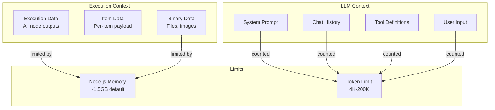

# Context Window Management

## TL;DR
n8n xử lý context limits ở 2 levels: **Execution Context** (data giữa nodes, limited by memory) và **LLM Context** (token limits cho AI nodes). LLM context management dùng LangChain strategies: window buffer, summary, và token counting. Large data được chunk hoặc stream.

---

## Context Types



---

## 1. Execution Context Management

### Memory Limits

```typescript
// packages/cli/src/config/schema.ts

export const schema = {
  executions: {
    // Maximum items per node output
    maxItemsPerOutput: {
      env: 'N8N_MAX_ITEMS_PER_OUTPUT',
      default: 10000,
    },

    // Memory threshold for execution
    memoryThreshold: {
      env: 'N8N_EXECUTIONS_MEMORY_THRESHOLD',
      default: 0.8,  // 80% of available memory
    },
  },
};
```

### Large Data Handling

```typescript
// packages/core/src/execution-engine/workflow-execute.ts

// Check data size before storing
private storeNodeExecutionData(
  nodeName: string,
  runNodeData: IRunNodeResponse,
): void {
  const data = runNodeData.data;

  // Count items
  let totalItems = 0;
  for (const output of data?.main ?? []) {
    totalItems += output?.length ?? 0;
  }

  // Warn if exceeding threshold
  if (totalItems > this.config.maxItemsPerOutput) {
    Logger.warn(
      `Node "${nodeName}" produced ${totalItems} items, ` +
      `exceeding recommended limit of ${this.config.maxItemsPerOutput}`
    );
  }

  // Check memory usage
  const memUsage = process.memoryUsage();
  const memPercent = memUsage.heapUsed / memUsage.heapTotal;

  if (memPercent > this.config.memoryThreshold) {
    Logger.error('Memory threshold exceeded, execution may fail');
    // Could trigger pagination or early termination
  }

  // Store data
  this.runExecutionData.resultData.runData[nodeName].push({
    data,
    executionTime: Date.now() - startTime,
    // ...
  });
}
```

### Pagination for Large Datasets

```typescript
// packages/nodes-base/nodes/SplitInBatches/SplitInBatches.node.ts

// Split large data into manageable batches
export class SplitInBatches implements INodeType {
  async execute(this: IExecuteFunctions): Promise<INodeExecutionData[][]> {
    const items = this.getInputData();
    const batchSize = this.getNodeParameter('batchSize', 0) as number;

    const staticData = this.getWorkflowStaticData('node');
    const iteration = (staticData.iteration as number) || 0;

    const startIndex = iteration * batchSize;
    const endIndex = Math.min(startIndex + batchSize, items.length);

    if (startIndex >= items.length) {
      // All processed
      staticData.iteration = 0;
      return [[], items];  // Loop done
    }

    const batch = items.slice(startIndex, endIndex);
    staticData.iteration = iteration + 1;

    return [batch, []];  // Continue loop
  }
}
```

---

## 2. LLM Context Management

### Token Counting

```typescript
// packages/@n8n/nodes-langchain/utils/token-counter.ts

import { encodingForModel } from 'js-tiktoken';

export function countTokens(
  text: string,
  model: string = 'gpt-4',
): number {
  const encoding = encodingForModel(model);
  const tokens = encoding.encode(text);
  return tokens.length;
}

export function estimateTokens(messages: BaseMessage[]): number {
  let total = 0;

  for (const message of messages) {
    // Message overhead
    total += 4;  // <|im_start|>role\n...content<|im_end|>

    // Content tokens
    total += countTokens(message.content);

    // Name overhead if present
    if (message.name) {
      total += countTokens(message.name) + 1;
    }
  }

  // Reply priming
  total += 3;

  return total;
}
```

### Window Buffer Memory

```typescript
// packages/@n8n/nodes-langchain/nodes/memory/MemoryBufferWindow/

import { BufferWindowMemory } from 'langchain/memory';

export class MemoryBufferWindow implements INodeType {
  description: INodeTypeDescription = {
    properties: [
      {
        displayName: 'Context Window Messages',
        name: 'k',
        type: 'number',
        default: 5,
        description: 'Number of message pairs to keep in context',
      },
    ],
  };

  async supplyData(this: ISupplyDataFunctions): Promise<SupplyData> {
    const k = this.getNodeParameter('k', 0) as number;

    // Only keep last K exchanges
    const memory = new BufferWindowMemory({
      k,
      memoryKey: 'chat_history',
      returnMessages: true,
      inputKey: 'input',
      outputKey: 'output',
    });

    return { response: memory };
  }
}

// How it works:
// Total messages = 20
// k = 5
// Kept = last 10 messages (5 human + 5 AI)
```

### Token Buffer Memory

```typescript
// packages/@n8n/nodes-langchain/nodes/memory/MemoryTokenBuffer/

import { ConversationTokenBufferMemory } from 'langchain/memory';

export class MemoryTokenBuffer implements INodeType {
  description: INodeTypeDescription = {
    properties: [
      {
        displayName: 'Max Token Limit',
        name: 'maxTokenLimit',
        type: 'number',
        default: 2000,
        description: 'Maximum tokens to keep in memory',
      },
    ],
  };

  async supplyData(this: ISupplyDataFunctions): Promise<SupplyData> {
    const maxTokenLimit = this.getNodeParameter('maxTokenLimit', 0) as number;

    const llm = await this.getInputConnectionData(
      NodeConnectionTypes.AiLanguageModel,
      0,
    );

    // Keep messages up to token limit
    const memory = new ConversationTokenBufferMemory({
      llm,  // Uses LLM's tokenizer
      maxTokenLimit,
      memoryKey: 'chat_history',
      returnMessages: true,
    });

    return { response: memory };
  }
}
```

### Summary Memory (Compression)

```typescript
// packages/@n8n/nodes-langchain/nodes/memory/MemorySummary/

import { ConversationSummaryMemory } from 'langchain/memory';

export class MemorySummary implements INodeType {
  async supplyData(this: ISupplyDataFunctions): Promise<SupplyData> {
    const llm = await this.getInputConnectionData(
      NodeConnectionTypes.AiLanguageModel,
      0,
    );

    // Summarizes conversation to fit context
    const memory = new ConversationSummaryMemory({
      llm,
      memoryKey: 'conversation_summary',
      humanPrefix: 'User',
      aiPrefix: 'Assistant',
    });

    return { response: memory };
  }
}

// How it works:
// 1. Store full conversation
// 2. When context limit approached, summarize older messages
// 3. Keep: [Summary of old] + [Recent messages]
```

### Summary Buffer Memory (Hybrid)

```typescript
// packages/@n8n/nodes-langchain/nodes/memory/MemorySummaryBuffer/

import { ConversationSummaryBufferMemory } from 'langchain/memory';

export class MemorySummaryBuffer implements INodeType {
  description: INodeTypeDescription = {
    properties: [
      {
        displayName: 'Max Token Limit',
        name: 'maxTokenLimit',
        type: 'number',
        default: 2000,
      },
    ],
  };

  async supplyData(this: ISupplyDataFunctions): Promise<SupplyData> {
    const maxTokenLimit = this.getNodeParameter('maxTokenLimit', 0) as number;

    const llm = await this.getInputConnectionData(
      NodeConnectionTypes.AiLanguageModel,
      0,
    );

    // Best of both worlds:
    // - Summarizes old messages
    // - Keeps recent messages in full
    const memory = new ConversationSummaryBufferMemory({
      llm,
      maxTokenLimit,
      memoryKey: 'chat_history',
      returnMessages: true,
    });

    return { response: memory };
  }
}

// Structure:
// [Summary: "User discussed project requirements..."]
// [Recent Human: "What about the API rate limits?"]
// [Recent AI: "The API allows 100 requests per minute..."]
// [Recent Human: "Can we increase that?"]
```

---

## 3. Chunking Strategies

### Document Chunking

```typescript
// packages/@n8n/nodes-langchain/nodes/text_splitters/

import { RecursiveCharacterTextSplitter } from 'langchain/text_splitter';

export class TextSplitterRecursive implements INodeType {
  description: INodeTypeDescription = {
    properties: [
      {
        displayName: 'Chunk Size',
        name: 'chunkSize',
        type: 'number',
        default: 1000,
        description: 'Maximum characters per chunk',
      },
      {
        displayName: 'Chunk Overlap',
        name: 'chunkOverlap',
        type: 'number',
        default: 200,
        description: 'Characters to overlap between chunks',
      },
    ],
  };

  async supplyData(this: ISupplyDataFunctions): Promise<SupplyData> {
    const chunkSize = this.getNodeParameter('chunkSize', 0) as number;
    const chunkOverlap = this.getNodeParameter('chunkOverlap', 0) as number;

    const splitter = new RecursiveCharacterTextSplitter({
      chunkSize,
      chunkOverlap,
      separators: ['\n\n', '\n', ' ', ''],  // Priority order
    });

    return { response: splitter };
  }
}
```

### Token-Based Chunking

```typescript
// packages/@n8n/nodes-langchain/nodes/text_splitters/TokenTextSplitter/

import { TokenTextSplitter } from 'langchain/text_splitter';

export class TextSplitterToken implements INodeType {
  async supplyData(this: ISupplyDataFunctions): Promise<SupplyData> {
    const chunkSize = this.getNodeParameter('chunkSize', 0) as number;
    const chunkOverlap = this.getNodeParameter('chunkOverlap', 0) as number;

    // Split by token count, not character count
    const splitter = new TokenTextSplitter({
      chunkSize,
      chunkOverlap,
      encodingName: 'cl100k_base',  // GPT-4 tokenizer
    });

    return { response: splitter };
  }
}
```

---

## 4. Streaming for Large Outputs

```typescript
// packages/@n8n/nodes-langchain/nodes/llms/LLMOpenAI/LLMOpenAI.node.ts

export class LLMOpenAI implements INodeType {
  async execute(this: IExecuteFunctions): Promise<INodeExecutionData[][]> {
    const items = this.getInputData();
    const streaming = this.getNodeParameter('options.streaming', 0, false);

    if (streaming) {
      // Stream response to avoid timeout
      const stream = await llm.stream(prompt);

      let fullResponse = '';
      for await (const chunk of stream) {
        fullResponse += chunk.content;

        // Send progress to UI
        this.sendMessageToUI({
          type: 'stream',
          content: chunk.content,
        });
      }

      return [[{ json: { response: fullResponse } }]];
    } else {
      // Normal execution
      const response = await llm.invoke(prompt);
      return [[{ json: { response: response.content } }]];
    }
  }
}
```

---

## Context Limits by Model

| Model | Context Window | Recommended Max Input |
|-------|---------------|----------------------|
| GPT-3.5 | 4,096 tokens | ~3,000 tokens |
| GPT-3.5-16k | 16,384 tokens | ~12,000 tokens |
| GPT-4 | 8,192 tokens | ~6,000 tokens |
| GPT-4-32k | 32,768 tokens | ~28,000 tokens |
| GPT-4-Turbo | 128,000 tokens | ~100,000 tokens |
| Claude 3 | 200,000 tokens | ~180,000 tokens |

---

## File References

| Component | File Path |
|-----------|-----------|
| Memory Nodes | `packages/@n8n/nodes-langchain/nodes/memory/` |
| Text Splitters | `packages/@n8n/nodes-langchain/nodes/text_splitters/` |
| Config Schema | `packages/cli/src/config/schema.ts` |
| SplitInBatches | `packages/nodes-base/nodes/SplitInBatches/` |

---

## Key Takeaways

1. **Two Context Types**: Execution context (node memory) và LLM context (tokens) có limits khác nhau.

2. **Window Strategy**: Simplest approach - keep N most recent messages, discard older.

3. **Token Counting**: Critical cho LLM calls - count tokens before sending để avoid errors.

4. **Summary Compression**: Trade-off giữa information loss và context efficiency.

5. **Chunking for RAG**: Large documents split thành chunks cho vector store indexing.

6. **Streaming**: Cho large outputs, stream để avoid timeout và improve UX.
