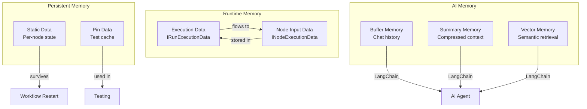
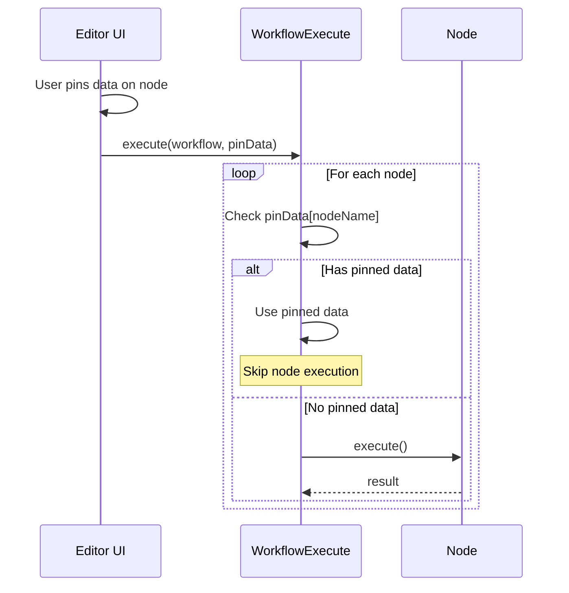
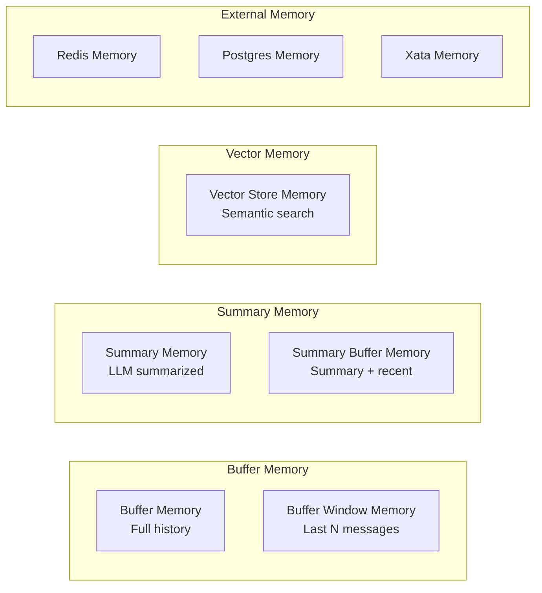

# Memory Types in n8n

## TL;DR
n8n có 4 loại memory chính: **Execution Data** (runtime data giữa nodes), **Static Data** (persistent state per-node), **Pin Data** (cached test data), và **AI Memory** (conversation history cho LLM agents). Mỗi loại có scope và lifecycle khác nhau.

---

## Memory Types Overview



---

## 1. Execution Data (Runtime)

### IRunExecutionData Structure

```typescript
// packages/workflow/src/run-execution-data/run-execution-data.v1.ts

export interface IRunExecutionDataV1 {
  version: 1;

  // Results from executed nodes
  resultData: {
    runData: IRunData;        // All node outputs
    pinData?: IPinData;       // Cached test data
    error?: ExecutionError;
    lastNodeExecuted?: string;
  };

  // Current execution state
  executionData?: {
    nodeExecutionStack: IExecuteData[];      // Pending nodes
    waitingExecution: IWaitingForExecution;  // Multi-input waiting
    contextData: IExecuteContextData;        // Variables
    metadata: Record<string, ITaskMetadata[]>;
  };
}
```

### Node Output Storage

```typescript
// packages/workflow/src/interfaces.ts

// Node name -> array of runs
export interface IRunData {
  [nodeName: string]: ITaskData[];
}

// Single execution result
export interface ITaskData {
  startTime: number;
  executionTime: number;
  executionStatus?: ExecutionStatus;

  // Output data by connection type
  data?: ITaskDataConnections;

  error?: ExecutionError;
  metadata?: ITaskMetadata;
}

// Connection type -> outputs -> items
export interface ITaskDataConnections {
  [connectionType: string]: Array<INodeExecutionData[] | null>;
}

// Example:
const runData: IRunData = {
  "HTTP Request": [{
    executionTime: 150,
    executionStatus: "success",
    data: {
      main: [[
        { json: { id: 1, name: "Alice" } },
        { json: { id: 2, name: "Bob" } },
      ]]
    }
  }],
  "Filter": [{
    executionTime: 5,
    data: {
      main: [[
        { json: { id: 1, name: "Alice" } }  // Only Alice passed filter
      ]]
    }
  }]
};
```

### Accessing Previous Node Data

```typescript
// In node execute function
async execute(this: IExecuteFunctions): Promise<INodeExecutionData[][]> {
  // Get input from previous node
  const items = this.getInputData();
  // Returns: INodeExecutionData[]

  // Get specific input connection
  const input0 = this.getInputData(0);  // First input
  const input1 = this.getInputData(1);  // Second input (for multi-input nodes)

  // Access JSON data
  for (const item of items) {
    const data = item.json;  // The actual payload
    const binary = item.binary;  // Binary attachments
  }

  return [processedItems];
}
```

---

## 2. Static Data (Persistent)

### Per-Node Persistent State

```typescript
// packages/workflow/src/interfaces.ts

export interface IWorkflowBase {
  staticData?: IDataObject;  // Persisted across executions
}

// Structure:
// {
//   "NodeName1": { lastProcessedId: 123, cursor: "abc" },
//   "NodeName2": { counter: 5 },
//   "__global": { sharedValue: "xyz" }
// }
```

### Accessing Static Data

```typescript
// packages/core/src/execution-engine/node-execution-context/execute-context.ts

class ExecuteContext implements IExecuteFunctions {
  // Get node-specific static data
  getWorkflowStaticData(type: 'node' | 'global'): IDataObject {
    const workflow = this.workflow;

    if (type === 'global') {
      // Shared across all nodes
      if (!workflow.staticData.__global) {
        workflow.staticData.__global = {};
      }
      return workflow.staticData.__global as IDataObject;
    }

    // Node-specific
    const nodeName = this.node.name;
    if (!workflow.staticData[nodeName]) {
      workflow.staticData[nodeName] = {};
    }
    return workflow.staticData[nodeName] as IDataObject;
  }
}
```

### Use Cases

```typescript
// Example 1: Polling trigger tracking last poll
export class EmailTrigger implements INodeType {
  async poll(this: IPollFunctions): Promise<INodeExecutionData[][] | null> {
    const staticData = this.getWorkflowStaticData('node');

    // Get last processed ID
    const lastId = staticData.lastProcessedId as number || 0;

    // Fetch new items
    const newEmails = await fetchEmailsSince(lastId);

    if (newEmails.length > 0) {
      // Update last processed ID
      staticData.lastProcessedId = newEmails[newEmails.length - 1].id;

      return [[newEmails.map(e => ({ json: e }))]];
    }

    return null;  // No new data
  }
}

// Example 2: Rate limiting with counter
export class ApiNode implements INodeType {
  async execute(this: IExecuteFunctions): Promise<INodeExecutionData[][]> {
    const staticData = this.getWorkflowStaticData('node');

    // Check rate limit
    const requestCount = staticData.requestCount as number || 0;
    const resetTime = staticData.resetTime as number || 0;

    if (requestCount >= 100 && Date.now() < resetTime) {
      throw new Error('Rate limit exceeded');
    }

    // Reset if window expired
    if (Date.now() >= resetTime) {
      staticData.requestCount = 0;
      staticData.resetTime = Date.now() + 3600000;  // 1 hour
    }

    // Make request
    const result = await this.helpers.request(options);

    // Increment counter
    staticData.requestCount = (staticData.requestCount as number || 0) + 1;

    return [[{ json: result }]];
  }
}
```

---

## 3. Pin Data (Test Cache)

### Purpose

```typescript
// packages/workflow/src/interfaces.ts

// Pre-computed data that bypasses node execution
export interface IPinData {
  [nodeName: string]: INodeExecutionData[];
}
```

### How Pin Data Works



### Implementation

```typescript
// packages/core/src/execution-engine/workflow-execute.ts

processRunExecutionData(workflow: Workflow): PCancelable<IRun> {
  const pinData = this.runExecutionData.resultData.pinData;

  // In execution loop
  while (nodeExecutionStack.length > 0) {
    const executionData = nodeExecutionStack.shift()!;
    const nodeName = executionData.node.name;

    // Check for pinned data
    if (pinData && pinData[nodeName]) {
      // Use pinned data instead of executing
      const pinnedResult: IRunNodeResponse = {
        data: { main: [pinData[nodeName]] },
      };

      // Store as if node executed
      this.storeNodeExecutionData(nodeName, pinnedResult);

      // Queue successors normally
      this.queueSuccessorNodes(workflow, executionData.node, pinnedResult.data);

      continue;  // Skip actual execution
    }

    // Normal execution
    const result = await this.runNode(...);
    // ...
  }
}
```

### Frontend Pin Data Management

```typescript
// packages/frontend/editor-ui/src/app/stores/workflows.store.ts

export const useWorkflowsStore = defineStore('workflows', {
  state: () => ({
    pinData: {} as IPinData,
  }),

  actions: {
    // Pin current output of a node
    pinNodeOutput(nodeName: string, data: INodeExecutionData[]): void {
      this.pinData[nodeName] = data;
    },

    // Unpin node
    unpinNode(nodeName: string): void {
      delete this.pinData[nodeName];
    },

    // Clear all pins
    clearAllPins(): void {
      this.pinData = {};
    },

    // Execute with pin data
    async executeWorkflow(): Promise<void> {
      await api.executeWorkflow({
        workflowData: this.currentWorkflow,
        pinData: this.pinData,
      });
    },
  },
});
```

---

## 4. AI Memory (LangChain)

### Memory Node Types



### Buffer Memory Implementation

```typescript
// packages/@n8n/nodes-langchain/nodes/memory/MemoryBufferWindow/MemoryBufferWindow.node.ts

import { BufferWindowMemory } from 'langchain/memory';

export class MemoryBufferWindow implements INodeType {
  description: INodeTypeDescription = {
    displayName: 'Window Buffer Memory',
    name: 'memoryBufferWindow',
    group: ['memory'],
    outputs: [NodeConnectionTypes.AiMemory],
    properties: [
      {
        displayName: 'Session ID',
        name: 'sessionId',
        type: 'string',
        default: '={{ $json.sessionId }}',
      },
      {
        displayName: 'Window Size',
        name: 'windowSize',
        type: 'number',
        default: 5,
        description: 'Number of messages to keep',
      },
    ],
  };

  async supplyData(
    this: ISupplyDataFunctions,
    itemIndex: number,
  ): Promise<SupplyData> {
    const sessionId = this.getNodeParameter('sessionId', itemIndex) as string;
    const windowSize = this.getNodeParameter('windowSize', itemIndex) as number;

    // Create LangChain memory instance
    const memory = new BufferWindowMemory({
      k: windowSize,
      memoryKey: 'chat_history',
      returnMessages: true,
      inputKey: 'input',
      outputKey: 'output',
    });

    // Load existing history for session
    const existingHistory = await this.getSessionHistory(sessionId);
    if (existingHistory) {
      await memory.chatHistory.addMessages(existingHistory);
    }

    return {
      response: memory,
    };
  }
}
```

### Vector Store Memory

```typescript
// packages/@n8n/nodes-langchain/nodes/memory/MemoryVectorStore/MemoryVectorStore.node.ts

import { VectorStoreRetrieverMemory } from 'langchain/memory';

export class MemoryVectorStore implements INodeType {
  description: INodeTypeDescription = {
    displayName: 'Vector Store Memory',
    name: 'memoryVectorStore',
    inputs: [
      NodeConnectionTypes.Main,
      { type: NodeConnectionTypes.AiVectorStore, displayName: 'Vector Store' },
      { type: NodeConnectionTypes.AiEmbedding, displayName: 'Embedding' },
    ],
    outputs: [NodeConnectionTypes.AiMemory],
    properties: [
      {
        displayName: 'Top K',
        name: 'topK',
        type: 'number',
        default: 4,
        description: 'Number of relevant memories to retrieve',
      },
    ],
  };

  async supplyData(
    this: ISupplyDataFunctions,
    itemIndex: number,
  ): Promise<SupplyData> {
    // Get connected vector store
    const vectorStore = await this.getInputConnectionData(
      NodeConnectionTypes.AiVectorStore,
      0,
    );

    const topK = this.getNodeParameter('topK', itemIndex) as number;

    // Create retriever from vector store
    const retriever = vectorStore.asRetriever(topK);

    // Create memory that uses semantic search
    const memory = new VectorStoreRetrieverMemory({
      vectorStoreRetriever: retriever,
      memoryKey: 'relevant_history',
      returnDocs: true,
    });

    return {
      response: memory,
    };
  }
}
```

### Memory in AI Agent

```typescript
// packages/@n8n/nodes-langchain/nodes/agents/Agent/Agent.node.ts

export class Agent implements INodeType {
  async execute(this: IExecuteFunctions): Promise<INodeExecutionData[][]> {
    // Get connected memory (if any)
    const memory = await this.getInputConnectionData(
      NodeConnectionTypes.AiMemory,
      0,
    );

    const llm = await this.getInputConnectionData(
      NodeConnectionTypes.AiLanguageModel,
      0,
    );

    const tools = await this.getInputConnectionData(
      NodeConnectionTypes.AiTool,
      0,
    );

    const items = this.getInputData();
    const returnData: INodeExecutionData[] = [];

    for (let i = 0; i < items.length; i++) {
      const input = this.getNodeParameter('text', i) as string;
      const sessionId = this.getNodeParameter('sessionId', i) as string;

      // Create agent executor with memory
      const executor = await initializeAgentExecutorWithOptions(
        tools,
        llm,
        {
          agentType: 'openai-functions',
          memory,  // Memory is optional
          verbose: true,
        },
      );

      // Execute with memory context
      const result = await executor.invoke({
        input,
        // Memory automatically injects chat_history
      });

      // Memory is automatically updated with this interaction

      returnData.push({
        json: {
          output: result.output,
          sessionId,
        },
      });
    }

    return [returnData];
  }
}
```

---

## Memory Lifecycle Comparison

| Memory Type | Scope | Persistence | Use Case |
|-------------|-------|-------------|----------|
| **Execution Data** | Single execution | Until execution ends | Pass data between nodes |
| **Static Data** | Per workflow | Survives restarts | Polling cursors, counters |
| **Pin Data** | Per workflow | Editor session | Testing/debugging |
| **AI Buffer Memory** | Per session | Configurable | Chat history |
| **AI Vector Memory** | Global | Vector DB | Long-term recall |

---

## File References

| Component | File Path |
|-----------|-----------|
| IRunExecutionData | `packages/workflow/src/run-execution-data/run-execution-data.v1.ts` |
| Static Data Access | `packages/core/src/execution-engine/node-execution-context/execute-context.ts` |
| Buffer Memory | `packages/@n8n/nodes-langchain/nodes/memory/MemoryBufferWindow/` |
| Vector Memory | `packages/@n8n/nodes-langchain/nodes/memory/MemoryVectorStore/` |
| Summary Memory | `packages/@n8n/nodes-langchain/nodes/memory/MemorySummary/` |

---

## Key Takeaways

1. **Layered Memory**: n8n có multiple memory layers cho different use cases - runtime, persistent, và AI-specific.

2. **Static Data Simplicity**: Simple key-value store per-node, auto-persisted with workflow.

3. **Pin Data Testing**: Powerful feature cho testing - bypass expensive API calls với cached data.

4. **LangChain Integration**: Full support cho LangChain memory types - buffer, summary, vector.

5. **Session-Based**: AI memory tied to session IDs, cho phép multiple concurrent conversations.
