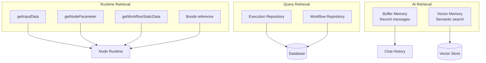
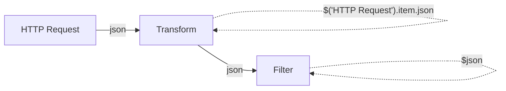

# Memory Retrieval Mechanisms

## TL;DR
n8n retrieves execution data theo 2 cách: **Direct Access** (qua node parameter/expression) và **Query-Based** (database queries cho execution history). AI memory retrieval dùng LangChain với buffer (recent history) hoặc vector search (semantic similarity).

---

## Retrieval Methods Overview



---

## 1. Runtime Data Access

### Input Data from Previous Nodes

```typescript
// Access input from connected nodes
async execute(this: IExecuteFunctions): Promise<INodeExecutionData[][]> {
  // Get all input items from first input connection
  const items = this.getInputData();

  // Get from specific input index (for multi-input nodes)
  const input0 = this.getInputData(0);  // First input
  const input1 = this.getInputData(1);  // Second input

  // Access JSON payload
  for (let i = 0; i < items.length; i++) {
    const json = items[i].json;          // Main data
    const binary = items[i].binary;      // Binary attachments
    const pairedItem = items[i].pairedItem;  // Lineage
  }

  return [processedItems];
}
```

### Node Parameter Retrieval

```typescript
// Get configured parameters
async execute(this: IExecuteFunctions): Promise<INodeExecutionData[][]> {
  const items = this.getInputData();

  for (let i = 0; i < items.length; i++) {
    // Get parameter value for this item
    // Expressions are evaluated per-item
    const url = this.getNodeParameter('url', i) as string;
    const method = this.getNodeParameter('method', i) as string;

    // Get with default value
    const timeout = this.getNodeParameter('timeout', i, 30000) as number;

    // Get nested parameters
    const headers = this.getNodeParameter('options.headers', i, {}) as IDataObject;

    // Get raw (unevaluated) expression
    const rawExpression = this.getNodeParameter('url', i, '', {
      extractValue: false,
    });
  }
}
```

### Expression-Based Retrieval

```typescript
// packages/workflow/src/expression.ts

// In n8n expressions, you can reference:
// 1. Current item: $json, $binary
// 2. Previous node: $('NodeName').item.json
// 3. All items from node: $('NodeName').all()
// 4. First item: $('NodeName').first()
// 5. Last item: $('NodeName').last()

// Examples:
// {{ $json.name }}                    - Current item's name
// {{ $('HTTP Request').item.json }}   - Previous node's output
// {{ $('Webhook').first().json }}     - First item from Webhook node
// {{ $node['Code'].json.result }}     - Alternative syntax

export class Expression {
  evaluateExpression(
    expression: string,
    itemIndex: number,
  ): NodeParameterValue {
    // Build context with all accessible data
    const context = {
      $json: this.getJsonForItem(itemIndex),
      $binary: this.getBinaryForItem(itemIndex),
      $item: (index: number) => this.getItemAtIndex(index),
      $: (nodeName: string) => new NodeReference(nodeName, this),
      $node: this.createNodeProxy(),
      $input: this.createInputProxy(),
      $execution: this.executionData,
      $workflow: this.workflowData,
      // ... more context
    };

    // Evaluate using sandbox
    return this.sandbox.evaluate(expression, context);
  }
}
```

### Static Data Retrieval

```typescript
// Access persistent node state
async execute(this: IExecuteFunctions): Promise<INodeExecutionData[][]> {
  // Node-specific storage
  const nodeStatic = this.getWorkflowStaticData('node');
  const lastProcessedId = nodeStatic.lastId as number || 0;

  // Global workflow storage
  const globalStatic = this.getWorkflowStaticData('global');
  const sharedCounter = globalStatic.counter as number || 0;

  // Update (auto-persisted)
  nodeStatic.lastId = newLastId;
  globalStatic.counter = sharedCounter + 1;

  return [items];
}
```

---

## 2. Database Query Retrieval

### Execution History Query

```typescript
// packages/@n8n/db/src/repositories/execution.repository.ts

@Service()
export class ExecutionRepository {
  // Find executions with filters
  async findMany(options: {
    workflowId?: string;
    status?: ExecutionStatus[];
    startedAfter?: Date;
    startedBefore?: Date;
    limit?: number;
    offset?: number;
  }): Promise<ExecutionEntity[]> {
    const query = this.repository
      .createQueryBuilder('execution')
      .select([
        'execution.id',
        'execution.status',
        'execution.startedAt',
        'execution.stoppedAt',
        'execution.mode',
      ]);

    if (options.workflowId) {
      query.where('execution.workflowId = :workflowId', {
        workflowId: options.workflowId,
      });
    }

    if (options.status?.length) {
      query.andWhere('execution.status IN (:...status)', {
        status: options.status,
      });
    }

    if (options.startedAfter) {
      query.andWhere('execution.startedAt > :after', {
        after: options.startedAfter,
      });
    }

    return query
      .orderBy('execution.startedAt', 'DESC')
      .skip(options.offset ?? 0)
      .take(options.limit ?? 100)
      .getMany();
  }

  // Get full execution data
  async getExecutionWithData(id: string): Promise<ExecutionEntity | null> {
    return this.repository.findOne({
      where: { id },
      select: ['id', 'data', 'status', 'startedAt', 'stoppedAt'],
    });
  }

  // Get specific node's output
  async getNodeOutput(
    executionId: string,
    nodeName: string,
  ): Promise<ITaskData[] | null> {
    const execution = await this.getExecutionWithData(executionId);
    if (!execution) return null;

    return execution.data.resultData.runData[nodeName] ?? null;
  }
}
```

### Workflow Data Query

```typescript
// packages/@n8n/db/src/repositories/workflow.repository.ts

@Service()
export class WorkflowRepository {
  async findById(id: string): Promise<WorkflowEntity | null> {
    return this.repository.findOne({
      where: { id },
      relations: ['tags'],
    });
  }

  async findActive(): Promise<WorkflowEntity[]> {
    return this.repository.find({
      where: { active: true },
    });
  }

  // Get workflow with static data
  async getWithStaticData(id: string): Promise<WorkflowEntity | null> {
    return this.repository.findOne({
      where: { id },
      select: ['id', 'name', 'nodes', 'connections', 'staticData'],
    });
  }

  // Update static data
  async updateStaticData(
    id: string,
    staticData: IDataObject,
  ): Promise<void> {
    await this.repository.update(id, { staticData });
  }
}
```

---

## 3. AI Memory Retrieval

### Buffer Memory (Recent History)

```typescript
// LangChain Buffer Memory retrieval
import { BufferMemory } from 'langchain/memory';

const memory = new BufferMemory({
  memoryKey: 'chat_history',
  returnMessages: true,
});

// Retrieve recent messages
const history = await memory.loadMemoryVariables({});
// Returns: { chat_history: [HumanMessage, AIMessage, ...] }

// In agent execution
const response = await executor.invoke({
  input: userMessage,
  // chat_history automatically injected by memory
});
```

### Window Buffer (Limited History)

```typescript
// packages/@n8n/nodes-langchain/nodes/memory/MemoryBufferWindow/

import { BufferWindowMemory } from 'langchain/memory';

// Only keep last K messages
const memory = new BufferWindowMemory({
  k: 5,  // Last 5 exchanges (10 messages)
  memoryKey: 'chat_history',
  returnMessages: true,
});

// Automatically truncates older messages
```

### Vector Memory (Semantic Search)

```typescript
// packages/@n8n/nodes-langchain/nodes/memory/MemoryVectorStore/

import { VectorStoreRetrieverMemory } from 'langchain/memory';

// Create memory that retrieves relevant context
const memory = new VectorStoreRetrieverMemory({
  vectorStoreRetriever: vectorStore.asRetriever(4),  // Top 4 results
  memoryKey: 'relevant_history',
  returnDocs: true,
});

// Retrieval process:
// 1. Get current input
// 2. Embed input text
// 3. Search vector store for similar past interactions
// 4. Return most relevant memories as context

const relevantContext = await memory.loadMemoryVariables({
  input: 'What did we discuss about the API?',
});
// Returns semantically similar past conversations
```

### Summary Memory (Compressed History)

```typescript
// packages/@n8n/nodes-langchain/nodes/memory/MemorySummary/

import { ConversationSummaryMemory } from 'langchain/memory';

// Memory that summarizes conversation
const memory = new ConversationSummaryMemory({
  llm: chatModel,  // LLM to generate summaries
  memoryKey: 'conversation_summary',
});

// Instead of full history, retrieves summary:
// "The user asked about API integration. We discussed
//  authentication methods and rate limits. User decided
//  to use OAuth2..."
```

---

## Retrieval Patterns

### Pattern 1: Chained Node Data



### Pattern 2: Aggregation

```typescript
// Access all items from previous node
const allItems = $('Webhook').all();

// Process
const total = allItems.reduce((sum, item) =>
  sum + item.json.amount, 0
);
```

### Pattern 3: Cross-Execution Lookup

```typescript
// In a node, lookup previous execution
async execute(this: IExecuteFunctions): Promise<INodeExecutionData[][]> {
  const executionId = this.getNodeParameter('executionId', 0) as string;

  // Query via API
  const previousExecution = await this.helpers.request({
    method: 'GET',
    url: `/executions/${executionId}`,
  });

  // Use data from previous run
  const previousOutput = previousExecution.data.resultData.runData['NodeName'];

  return [[{ json: { previousData: previousOutput } }]];
}
```

---

## File References

| Component | File Path |
|-----------|-----------|
| Expression Parser | `packages/workflow/src/expression.ts` |
| Execute Context | `packages/core/src/execution-engine/node-execution-context/execute-context.ts` |
| Execution Repository | `packages/@n8n/db/src/repositories/execution.repository.ts` |
| Buffer Memory | `packages/@n8n/nodes-langchain/nodes/memory/MemoryBufferWindow/` |
| Vector Memory | `packages/@n8n/nodes-langchain/nodes/memory/MemoryVectorStore/` |

---

## Key Takeaways

1. **Expression System**: Powerful expression language cho phép access data từ any node trong workflow.

2. **Index-Based Access**: Input data accessed by item index, cho phép per-item parameter evaluation.

3. **Query Flexibility**: Repository pattern cho phép flexible database queries cho execution history.

4. **AI Memory Strategies**: Multiple retrieval strategies - buffer (recency), vector (relevance), summary (compression).

5. **Cross-Node References**: `$('NodeName')` syntax cho phép reference output của any previous node.
