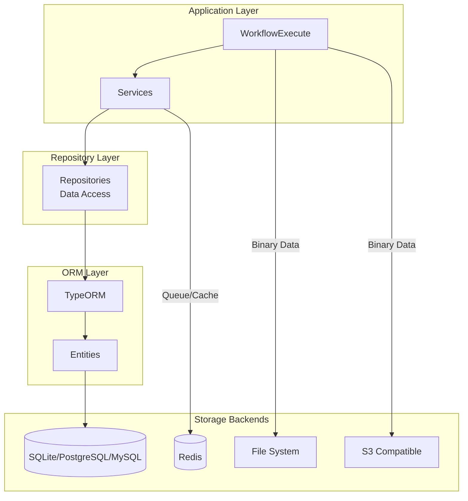

# Storage Backend - Data Persistence

## TL;DR
n8n sử dụng TypeORM làm database abstraction layer, hỗ trợ SQLite (dev), PostgreSQL, MySQL (production). Execution data được lưu trong `execution_entity` table với JSON serialization. Binary data có thể lưu filesystem hoặc S3. Redis dùng cho queue và caching.

---

## Storage Architecture



---

## Database Layer

### TypeORM Configuration

```typescript
// packages/@n8n/db/src/config.ts

import { DataSource, DataSourceOptions } from 'typeorm';

export function createDataSourceOptions(): DataSourceOptions {
  const dbType = config.database.type;

  const baseOptions = {
    entities: [
      WorkflowEntity,
      ExecutionEntity,
      CredentialsEntity,
      UserEntity,
      // ... other entities
    ],
    migrations: [`migrations/${dbType}/*.ts`],
    synchronize: false,
    logging: config.database.logging,
  };

  switch (dbType) {
    case 'sqlite':
      return {
        ...baseOptions,
        type: 'better-sqlite3',
        database: config.database.sqlite.database,
      };

    case 'postgresdb':
      return {
        ...baseOptions,
        type: 'postgres',
        host: config.database.postgresdb.host,
        port: config.database.postgresdb.port,
        database: config.database.postgresdb.database,
        username: config.database.postgresdb.user,
        password: config.database.postgresdb.password,
        ssl: config.database.postgresdb.ssl,
      };

    case 'mysqldb':
      return {
        ...baseOptions,
        type: 'mysql',
        host: config.database.mysqldb.host,
        port: config.database.mysqldb.port,
        database: config.database.mysqldb.database,
        username: config.database.mysqldb.user,
        password: config.database.mysqldb.password,
      };

    default:
      throw new Error(`Unsupported database type: ${dbType}`);
  }
}
```

### Core Entities

```typescript
// packages/@n8n/db/src/entities/workflow-entity.ts

@Entity('workflow_entity')
export class WorkflowEntity {
  @PrimaryColumn('varchar', { length: 36 })
  id: string;

  @Column('varchar', { length: 128 })
  name: string;

  @Column('boolean')
  active: boolean;

  // JSON stored as text
  @Column('simple-json')
  nodes: INode[];

  @Column('simple-json')
  connections: IConnections;

  // Static data for persistent node state
  @Column('simple-json', { nullable: true })
  staticData: IDataObject;

  @Column('simple-json', { nullable: true })
  settings: IWorkflowSettings;

  @Column('simple-json', { nullable: true })
  pinData: IPinData;

  @CreateDateColumn()
  createdAt: Date;

  @UpdateDateColumn()
  updatedAt: Date;

  @ManyToMany(() => TagEntity)
  @JoinTable()
  tags: TagEntity[];
}
```

```typescript
// packages/@n8n/db/src/entities/execution-entity.ts

@Entity('execution_entity')
export class ExecutionEntity {
  @PrimaryColumn('varchar', { length: 36 })
  id: string;

  // Full execution data as JSON
  @Column('simple-json')
  data: IRunExecutionData;

  @Column('boolean')
  finished: boolean;

  @Column('varchar', { length: 64 })
  mode: WorkflowExecuteMode;

  @Column('varchar', { length: 64 })
  status: ExecutionStatus;

  @Column('timestamp')
  startedAt: Date;

  @Column('timestamp', { nullable: true })
  stoppedAt: Date;

  @Column('int', { nullable: true })
  executionTime: number;  // milliseconds

  // Foreign key to workflow
  @Column('varchar', { length: 36 })
  workflowId: string;

  @ManyToOne(() => WorkflowEntity, { onDelete: 'CASCADE' })
  @JoinColumn({ name: 'workflowId' })
  workflow: WorkflowEntity;

  // Denormalized for quick filtering
  @Column('boolean', { default: false })
  waitTill: boolean;

  // Retention policy tracking
  @Column('timestamp', { nullable: true })
  deletedAt: Date;
}
```

---

## Repository Pattern

```typescript
// packages/@n8n/db/src/repositories/execution.repository.ts

@Service()
export class ExecutionRepository {
  constructor(
    @InjectRepository(ExecutionEntity)
    private readonly repository: Repository<ExecutionEntity>,
  ) {}

  async create(data: Partial<ExecutionEntity>): Promise<string> {
    const execution = this.repository.create({
      id: uuid(),
      ...data,
      startedAt: new Date(),
    });
    await this.repository.save(execution);
    return execution.id;
  }

  async findById(id: string): Promise<ExecutionEntity | null> {
    return this.repository.findOne({
      where: { id },
      relations: ['workflow'],
    });
  }

  async updateStatus(
    id: string,
    status: ExecutionStatus,
  ): Promise<void> {
    await this.repository.update(id, { status });
  }

  async updateExecutionData(
    id: string,
    runData: IRun,
  ): Promise<void> {
    await this.repository.update(id, {
      data: runData.data,
      finished: runData.finished,
      status: runData.status,
      stoppedAt: runData.stoppedAt,
      executionTime: runData.stoppedAt
        ? runData.stoppedAt.getTime() - runData.startedAt.getTime()
        : null,
    });
  }

  async findMany(options: FindExecutionsOptions): Promise<ExecutionEntity[]> {
    const query = this.repository.createQueryBuilder('execution');

    if (options.workflowId) {
      query.where('execution.workflowId = :workflowId', {
        workflowId: options.workflowId,
      });
    }

    if (options.status) {
      query.andWhere('execution.status IN (:...status)', {
        status: options.status,
      });
    }

    if (options.startedAfter) {
      query.andWhere('execution.startedAt > :startedAfter', {
        startedAfter: options.startedAfter,
      });
    }

    return query
      .orderBy('execution.startedAt', 'DESC')
      .limit(options.limit ?? 100)
      .getMany();
  }

  async pruneOld(olderThan: Date): Promise<number> {
    const result = await this.repository
      .createQueryBuilder()
      .delete()
      .where('startedAt < :olderThan', { olderThan })
      .andWhere('finished = true')
      .execute();

    return result.affected ?? 0;
  }
}
```

---

## Binary Data Storage

### Storage Modes

```typescript
// packages/core/src/binary-data/binary-data.service.ts

export type BinaryDataMode = 'filesystem' | 's3' | 'default';

@Service()
export class BinaryDataService {
  private manager: BinaryDataManager;

  async init(mode: BinaryDataMode): Promise<void> {
    switch (mode) {
      case 'filesystem':
        this.manager = new FileSystemBinaryDataManager(
          config.binaryData.filesystem.path
        );
        break;

      case 's3':
        this.manager = new S3BinaryDataManager({
          bucket: config.binaryData.s3.bucket,
          region: config.binaryData.s3.region,
          accessKeyId: config.binaryData.s3.accessKeyId,
          secretAccessKey: config.binaryData.s3.secretAccessKey,
        });
        break;

      case 'default':
      default:
        // Store in database as base64 (not recommended for large files)
        this.manager = new DefaultBinaryDataManager();
        break;
    }

    await this.manager.init();
  }

  async store(
    executionId: string,
    data: Buffer,
    metadata: BinaryMetadata,
  ): Promise<string> {
    return this.manager.store(executionId, data, metadata);
  }

  async retrieve(binaryDataId: string): Promise<Buffer> {
    return this.manager.retrieve(binaryDataId);
  }

  async delete(executionId: string): Promise<void> {
    return this.manager.deleteExecutionData(executionId);
  }
}
```

### Filesystem Storage

```typescript
// packages/core/src/binary-data/filesystem.binary-data-manager.ts

export class FileSystemBinaryDataManager implements BinaryDataManager {
  constructor(private readonly basePath: string) {}

  async init(): Promise<void> {
    await fs.mkdir(this.basePath, { recursive: true });
  }

  async store(
    executionId: string,
    data: Buffer,
    metadata: BinaryMetadata,
  ): Promise<string> {
    // Create directory structure: basePath/executionId/
    const executionDir = path.join(this.basePath, executionId);
    await fs.mkdir(executionDir, { recursive: true });

    // Generate unique filename
    const fileId = uuid();
    const filePath = path.join(executionDir, fileId);

    // Write data
    await fs.writeFile(filePath, data);

    // Write metadata
    await fs.writeFile(
      `${filePath}.metadata.json`,
      JSON.stringify(metadata),
    );

    return `filesystem:${executionId}/${fileId}`;
  }

  async retrieve(binaryDataId: string): Promise<Buffer> {
    // Parse ID: filesystem:executionId/fileId
    const [, pathPart] = binaryDataId.split(':');
    const filePath = path.join(this.basePath, pathPart);

    return fs.readFile(filePath);
  }

  async deleteExecutionData(executionId: string): Promise<void> {
    const executionDir = path.join(this.basePath, executionId);
    await fs.rm(executionDir, { recursive: true, force: true });
  }
}
```

### S3 Storage

```typescript
// packages/core/src/binary-data/s3.binary-data-manager.ts

import { S3Client, PutObjectCommand, GetObjectCommand } from '@aws-sdk/client-s3';

export class S3BinaryDataManager implements BinaryDataManager {
  private client: S3Client;

  constructor(private readonly config: S3Config) {
    this.client = new S3Client({
      region: config.region,
      credentials: {
        accessKeyId: config.accessKeyId,
        secretAccessKey: config.secretAccessKey,
      },
    });
  }

  async store(
    executionId: string,
    data: Buffer,
    metadata: BinaryMetadata,
  ): Promise<string> {
    const key = `${executionId}/${uuid()}`;

    await this.client.send(new PutObjectCommand({
      Bucket: this.config.bucket,
      Key: key,
      Body: data,
      ContentType: metadata.mimeType,
      Metadata: {
        fileName: metadata.fileName,
        fileSize: String(metadata.fileSize),
      },
    }));

    return `s3:${key}`;
  }

  async retrieve(binaryDataId: string): Promise<Buffer> {
    const [, key] = binaryDataId.split(':');

    const response = await this.client.send(new GetObjectCommand({
      Bucket: this.config.bucket,
      Key: key,
    }));

    return Buffer.from(await response.Body!.transformToByteArray());
  }
}
```

---

## Redis Storage

### Queue Storage

```typescript
// packages/cli/src/scaling/scaling.service.ts

import Bull from 'bull';

@Service()
export class ScalingService {
  private queue: Bull.Queue;

  async init(): Promise<void> {
    this.queue = new Bull('n8n-workflow', {
      redis: {
        host: config.queue.redis.host,
        port: config.queue.redis.port,
        password: config.queue.redis.password,
        db: config.queue.redis.db,
      },
      defaultJobOptions: {
        removeOnComplete: config.queue.removeOnComplete,
        removeOnFail: config.queue.removeOnFail,
      },
    });
  }

  async addJob(data: IWorkflowExecutionData): Promise<Bull.Job> {
    return this.queue.add('workflow', data, {
      jobId: data.executionId,
      priority: data.priority ?? 100,
    });
  }
}
```

### Pub/Sub for Events

```typescript
// packages/cli/src/scaling/pubsub/redis-pubsub.ts

import Redis from 'ioredis';

@Service()
export class RedisPubSubService {
  private publisher: Redis;
  private subscriber: Redis;
  private handlers: Map<string, Function[]> = new Map();

  async init(): Promise<void> {
    const redisConfig = {
      host: config.redis.host,
      port: config.redis.port,
      password: config.redis.password,
    };

    this.publisher = new Redis(redisConfig);
    this.subscriber = new Redis(redisConfig);

    // Setup message handling
    this.subscriber.on('message', (channel, message) => {
      const handlers = this.handlers.get(channel) || [];
      const data = JSON.parse(message);
      handlers.forEach(handler => handler(data));
    });
  }

  async publish(channel: string, data: unknown): Promise<void> {
    await this.publisher.publish(channel, JSON.stringify(data));
  }

  async subscribe(channel: string, handler: Function): Promise<void> {
    if (!this.handlers.has(channel)) {
      this.handlers.set(channel, []);
      await this.subscriber.subscribe(channel);
    }
    this.handlers.get(channel)!.push(handler);
  }
}
```

---

## Vector Store Backends (AI)

### Pinecone

```typescript
// packages/@n8n/nodes-langchain/nodes/vector_store/VectorStorePinecone/VectorStorePinecone.node.ts

import { PineconeStore } from '@langchain/pinecone';
import { Pinecone } from '@pinecone-database/pinecone';

export class VectorStorePinecone implements INodeType {
  async supplyData(
    this: ISupplyDataFunctions,
    itemIndex: number,
  ): Promise<SupplyData> {
    const credentials = await this.getCredentials('pineconeApi');

    const pinecone = new Pinecone({
      apiKey: credentials.apiKey as string,
    });

    const indexName = this.getNodeParameter('indexName', itemIndex) as string;
    const namespace = this.getNodeParameter('namespace', itemIndex) as string;

    const index = pinecone.index(indexName);

    // Get connected embeddings
    const embeddings = await this.getInputConnectionData(
      NodeConnectionTypes.AiEmbedding,
      0,
    );

    const vectorStore = await PineconeStore.fromExistingIndex(embeddings, {
      pineconeIndex: index,
      namespace,
    });

    return { response: vectorStore };
  }
}
```

### Qdrant

```typescript
// packages/@n8n/nodes-langchain/nodes/vector_store/VectorStoreQdrant/VectorStoreQdrant.node.ts

import { QdrantVectorStore } from '@langchain/qdrant';
import { QdrantClient } from '@qdrant/js-client-rest';

export class VectorStoreQdrant implements INodeType {
  async supplyData(
    this: ISupplyDataFunctions,
    itemIndex: number,
  ): Promise<SupplyData> {
    const credentials = await this.getCredentials('qdrantApi');

    const client = new QdrantClient({
      url: credentials.url as string,
      apiKey: credentials.apiKey as string,
    });

    const collectionName = this.getNodeParameter(
      'collectionName',
      itemIndex,
    ) as string;

    const embeddings = await this.getInputConnectionData(
      NodeConnectionTypes.AiEmbedding,
      0,
    );

    const vectorStore = await QdrantVectorStore.fromExistingCollection(
      embeddings,
      {
        client,
        collectionName,
      },
    );

    return { response: vectorStore };
  }
}
```

---

## Storage Configuration

```bash
# Database
DB_TYPE=postgresdb
DB_POSTGRESDB_HOST=localhost
DB_POSTGRESDB_PORT=5432
DB_POSTGRESDB_DATABASE=n8n
DB_POSTGRESDB_USER=n8n
DB_POSTGRESDB_PASSWORD=secret

# Binary Data
N8N_BINARY_DATA_MODE=s3
N8N_BINARY_DATA_S3_BUCKET=n8n-binary
N8N_BINARY_DATA_S3_REGION=us-east-1
N8N_BINARY_DATA_S3_ACCESS_KEY=AKIA...
N8N_BINARY_DATA_S3_SECRET_KEY=secret

# Redis (for queue mode)
QUEUE_BULL_REDIS_HOST=localhost
QUEUE_BULL_REDIS_PORT=6379
QUEUE_BULL_REDIS_PASSWORD=secret

# Execution Retention
EXECUTIONS_DATA_PRUNE=true
EXECUTIONS_DATA_MAX_AGE=168  # hours
```

---

## File References

| Component | File Path |
|-----------|-----------|
| DB Config | `packages/@n8n/db/src/config.ts` |
| Workflow Entity | `packages/@n8n/db/src/entities/workflow-entity.ts` |
| Execution Entity | `packages/@n8n/db/src/entities/execution-entity.ts` |
| Binary Data Service | `packages/core/src/binary-data/binary-data.service.ts` |
| Scaling Service | `packages/cli/src/scaling/scaling.service.ts` |
| Redis PubSub | `packages/cli/src/scaling/pubsub/redis-pubsub.ts` |

---

## Key Takeaways

1. **TypeORM Abstraction**: Database-agnostic code, dễ switch từ SQLite (dev) sang PostgreSQL (prod).

2. **JSON Serialization**: Execution data stored as JSON - flexible nhưng cần index cho queries.

3. **Binary Separation**: Binary data tách riêng khỏi database, scalable với S3.

4. **Redis Multi-Purpose**: Dùng cho cả queue (Bull) và pub/sub (real-time events).

5. **Vector Store Options**: Multiple vector DB backends cho AI features - Pinecone, Qdrant, Chroma.

6. **Retention Policies**: Built-in pruning để quản lý database size.
