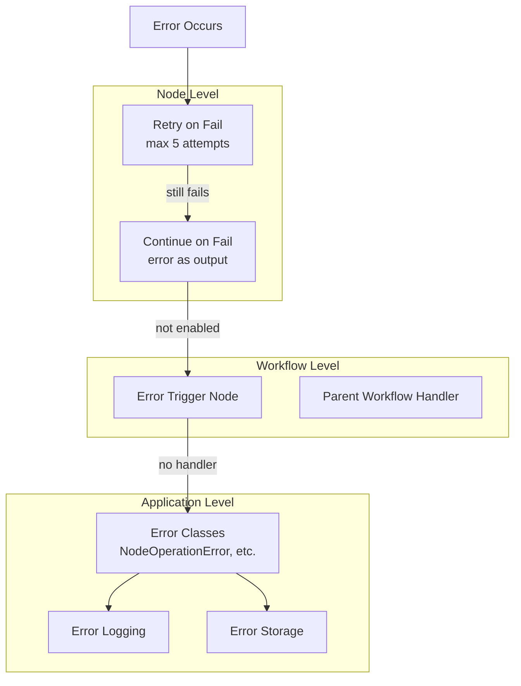

# Error Handling in n8n

## TL;DR
n8n có multi-layer error handling: **Node-level** (continueOnFail, retry), **Workflow-level** (error trigger), và **Application-level** (error classes). Errors được wrap trong typed classes (NodeOperationError, NodeApiError) với context. UI hiển thị errors với stack trace và node reference.

---

## Error Handling Layers



---

## Error Classes

```typescript
// packages/workflow/src/errors/

// Base error for node operations
export class NodeOperationError extends ExecutionBaseError {
  constructor(
    node: INode,
    error: Error | string,
    options?: NodeOperationErrorOptions,
  ) {
    super(typeof error === 'string' ? error : error.message, {
      level: 'error',
      ...options,
    });

    this.context.node = node;
    this.context.itemIndex = options?.itemIndex;

    if (error instanceof Error) {
      this.cause = error;
      this.stack = error.stack;
    }
  }
}

// For API call failures
export class NodeApiError extends NodeOperationError {
  httpCode?: number;

  constructor(
    node: INode,
    error: JsonObject | Error,
    options?: NodeApiErrorOptions,
  ) {
    const message = extractErrorMessage(error);
    super(node, message, options);

    this.httpCode = options?.httpCode ?? extractHttpCode(error);
    this.description = options?.description ?? extractDescription(error);
  }
}

// For operational issues (expected errors)
export class OperationalError extends ExecutionBaseError {
  constructor(message: string, options?: ErrorOptions) {
    super(message, { level: 'warning', ...options });
  }
}

// For user input errors
export class UserError extends ExecutionBaseError {
  constructor(message: string, options?: ErrorOptions) {
    super(message, { level: 'error', ...options });
  }
}

// For unexpected system errors
export class UnexpectedError extends ExecutionBaseError {
  constructor(message: string, options?: ErrorOptions) {
    super(message, { level: 'error', ...options });
  }
}
```

---

## Node-Level Error Handling

### Retry Logic

```typescript
// packages/core/src/execution-engine/workflow-execute.ts

// In execution loop
let maxTries = 1;
if (executionData.node.retryOnFail === true) {
  maxTries = Math.min(5, Math.max(2, executionData.node.maxTries || 3));
}

let waitBetweenTries = 0;
if (executionData.node.retryOnFail === true) {
  waitBetweenTries = Math.min(
    5000,
    Math.max(0, executionData.node.waitBetweenTries || 1000)
  );
}

let executionError: ExecutionBaseError | undefined;

for (let tryIndex = 0; tryIndex < maxTries; tryIndex++) {
  try {
    runNodeData = await this.runNode(workflow, executionData, ...);
    executionError = undefined;
    break;  // Success
  } catch (e) {
    executionError = e as ExecutionBaseError;
    Logger.warn(`Node "${nodeName}" failed, attempt ${tryIndex + 1}/${maxTries}`);

    if (tryIndex < maxTries - 1) {
      await sleep(waitBetweenTries);
    }
  }
}
```

### Continue on Fail

```typescript
// After retry exhausted
if (executionError) {
  if (executionData.node.continueOnFail === true) {
    // Convert error to output data
    runNodeData = {
      data: [[{
        json: {
          error: executionError.message,
          errorCode: executionError.httpCode,
          errorDescription: executionError.description,
        },
        pairedItem: { item: 0 },
      }]],
    };
    executionError = undefined;  // Clear - workflow continues
  } else {
    // Propagate error - workflow stops
    throw executionError;
  }
}
```

---

## Workflow-Level Error Handling

### Error Trigger Node

```typescript
// packages/nodes-base/nodes/ErrorTrigger/ErrorTrigger.node.ts

export class ErrorTrigger implements INodeType {
  description: INodeTypeDescription = {
    displayName: 'Error Trigger',
    name: 'errorTrigger',
    group: ['trigger'],
    description: 'Triggers when another workflow fails',
  };

  async execute(this: IExecuteFunctions): Promise<INodeExecutionData[][]> {
    const items = this.getInputData();
    // items contain error information from failed workflow
    return [items];
  }
}
```

### Error Workflow Configuration

```typescript
// packages/cli/src/services/workflow-execute-additional-data.ts

async function executeErrorWorkflow(
  workflowId: string,
  errorData: IWorkflowErrorData,
): Promise<void> {
  // Get error workflow
  const errorWorkflow = await workflowRepository.findById(workflowId);

  if (!errorWorkflow) {
    Logger.error(`Error workflow ${workflowId} not found`);
    return;
  }

  // Find Error Trigger node
  const errorTrigger = Object.values(errorWorkflow.nodes).find(
    node => node.type === 'n8n-nodes-base.errorTrigger'
  );

  if (!errorTrigger) {
    Logger.error('Error workflow has no Error Trigger node');
    return;
  }

  // Execute error workflow with error data
  const runner = Container.get(WorkflowRunner);
  await runner.run({
    workflowData: errorWorkflow,
    triggerToStartFrom: {
      name: errorTrigger.name,
      data: {
        main: [[{ json: errorData }]],
      },
    },
    executionMode: 'error',
  });
}
```

---

## Error Output Structure

```typescript
// Error data passed to Error Trigger
interface IWorkflowErrorData {
  execution: {
    id: string;
    url: string;
    mode: WorkflowExecuteMode;
    retryOf?: string;
    error: {
      message: string;
      stack?: string;
      name: string;
    };
    lastNodeExecuted?: string;
  };
  workflow: {
    id: string;
    name: string;
  };
}
```

---

## In-Node Error Handling

```typescript
// Best practices for node implementation
async execute(this: IExecuteFunctions): Promise<INodeExecutionData[][]> {
  const items = this.getInputData();
  const returnData: INodeExecutionData[] = [];

  for (let i = 0; i < items.length; i++) {
    try {
      const url = this.getNodeParameter('url', i) as string;

      const response = await this.helpers.httpRequest({
        method: 'GET',
        url,
      });

      returnData.push({ json: response });

    } catch (error) {
      // Check if should continue on fail
      if (this.continueOnFail()) {
        returnData.push({
          json: {
            error: error.message,
          },
          pairedItem: { item: i },
        });
        continue;
      }

      // Wrap in typed error with context
      throw new NodeApiError(this.getNode(), error, {
        itemIndex: i,
        description: `Failed to fetch URL`,
      });
    }
  }

  return [returnData];
}
```

---

## File References

| Component | File Path |
|-----------|-----------|
| Error Classes | `packages/workflow/src/errors/` |
| Retry Logic | `packages/core/src/execution-engine/workflow-execute.ts` |
| Error Trigger | `packages/nodes-base/nodes/ErrorTrigger/ErrorTrigger.node.ts` |
| Error Workflow Execution | `packages/cli/src/services/workflow-execute-additional-data.ts` |

---

## Key Takeaways

1. **Typed Errors**: NodeOperationError, NodeApiError wrap errors với context (node, itemIndex).

2. **Retry Built-In**: Configurable retry với exponential backoff at node level.

3. **Graceful Degradation**: continueOnFail converts error thành output item.

4. **Error Workflows**: Dedicated workflow triggered on failures cho notification/logging.

5. **Item-Level Errors**: Errors tracked per-item, allowing partial success.
