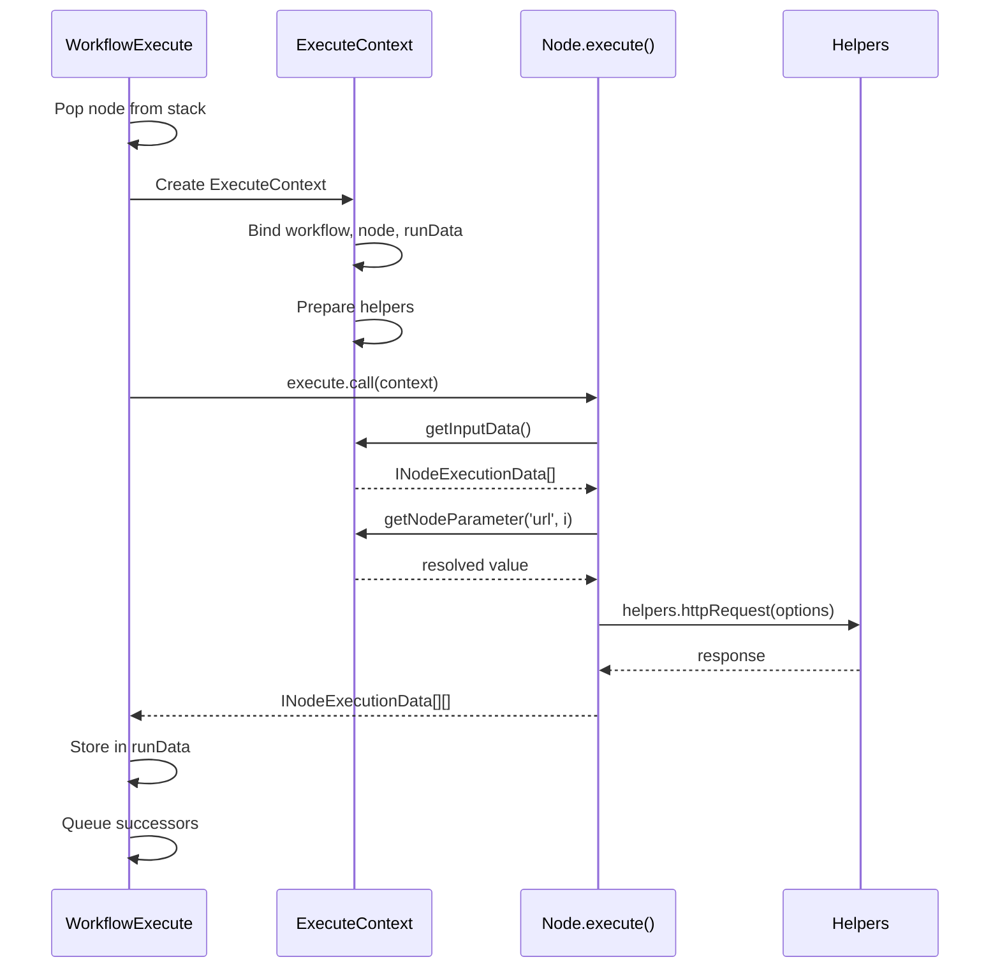

# Tool Execution Flow

## TL;DR
Node execution flow: WorkflowExecute pop node từ stack → runNode() determine node type → create ExecuteContext → call node.execute() với context bound as `this` → collect results → queue successors. Context provides APIs: getNodeParameter(), getInputData(), helpers.request().

---

## Execution Flow Diagram



---

## ExecuteContext Implementation

```typescript
// packages/core/src/execution-engine/node-execution-context/execute-context.ts

export class ExecuteContext implements IExecuteFunctions {
  readonly helpers: IExecuteFunctions['helpers'];
  readonly hints: NodeExecutionHint[] = [];

  constructor(
    private readonly workflow: Workflow,
    private readonly node: INode,
    private readonly additionalData: IWorkflowExecuteAdditionalData,
    private readonly mode: WorkflowExecuteMode,
    private readonly runExecutionData: IRunExecutionData,
    private readonly runIndex: number,
    private readonly connectionInputData: INodeExecutionData[],
    private readonly inputData: ITaskDataConnections,
    private readonly executeData: IExecuteData,
    private readonly closeFunctions: CloseFunction[],
    private readonly abortSignal?: AbortSignal,
  ) {
    // Initialize helpers
    this.helpers = {
      httpRequest: this.httpRequest.bind(this),
      request: this.request.bind(this),
      requestWithAuthentication: this.requestWithAuthentication.bind(this),
      getBinaryDataBuffer: this.getBinaryDataBuffer.bind(this),
      // ... more helpers
    };
  }

  // ===== INPUT DATA =====

  getInputData(inputIndex = 0): INodeExecutionData[] {
    if (!this.inputData.main?.[inputIndex]) {
      return [];
    }
    return this.inputData.main[inputIndex] as INodeExecutionData[];
  }

  // ===== PARAMETERS =====

  getNodeParameter(
    parameterName: string,
    itemIndex: number,
    fallbackValue?: any,
    options?: IGetNodeParameterOptions,
  ): NodeParameterValueType {
    return getNodeParameter(
      this.workflow,
      this.runExecutionData,
      this.runIndex,
      this.connectionInputData,
      this.node,
      parameterName,
      itemIndex,
      this.mode,
      fallbackValue,
      options,
    );
  }

  // ===== HTTP HELPERS =====

  async httpRequest(
    requestOptions: IHttpRequestOptions,
  ): Promise<any> {
    // Merge with node's retry settings
    const options = {
      ...requestOptions,
      timeout: requestOptions.timeout ?? 300000,
    };

    // Add abort signal
    if (this.abortSignal) {
      options.signal = this.abortSignal;
    }

    return await proxyRequestToAxios(options);
  }

  async requestWithAuthentication(
    credentialType: string,
    requestOptions: IHttpRequestOptions,
    additionalCredentialOptions?: IAdditionalCredentialOptions,
  ): Promise<any> {
    // Get credentials
    const credentials = await this.getCredentials(credentialType);

    // Apply authentication
    const authenticatedOptions = await applyAuthentication(
      credentialType,
      credentials,
      requestOptions,
      additionalCredentialOptions,
    );

    return this.httpRequest(authenticatedOptions);
  }

  // ===== CREDENTIALS =====

  async getCredentials(
    type: string,
    itemIndex?: number,
  ): Promise<ICredentialDataDecryptedObject> {
    return getCredentials(
      this.workflow,
      this.node,
      type,
      this.additionalData,
      this.mode,
      this.runExecutionData,
      this.runIndex,
      this.connectionInputData,
      itemIndex,
    );
  }

  // ===== STATIC DATA =====

  getWorkflowStaticData(type: 'node' | 'global'): IDataObject {
    if (type === 'global') {
      return this.workflow.staticData;
    }
    const nodeName = this.node.name;
    if (!this.workflow.staticData[nodeName]) {
      this.workflow.staticData[nodeName] = {};
    }
    return this.workflow.staticData[nodeName] as IDataObject;
  }

  // ===== BINARY DATA =====

  async getBinaryDataBuffer(
    itemIndex: number,
    propertyName: string,
  ): Promise<Buffer> {
    const binaryData = this.getInputData()[itemIndex]?.binary?.[propertyName];
    if (!binaryData) {
      throw new Error(`No binary data found for "${propertyName}"`);
    }
    return this.additionalData.binaryDataService.retrieve(binaryData.id);
  }

  async setBinaryDataBuffer(
    data: IBinaryData,
    buffer: Buffer,
  ): Promise<IBinaryData> {
    const id = await this.additionalData.binaryDataService.store(
      this.additionalData.executionId,
      buffer,
      { mimeType: data.mimeType, fileName: data.fileName },
    );
    return { ...data, id };
  }

  // ===== UI COMMUNICATION =====

  sendMessageToUI(message: any): void {
    if (this.mode !== 'manual') return;

    this.additionalData.sendMessageToUI?.(
      this.node.name,
      message,
    );
  }

  // ===== EXECUTION CONTROL =====

  continueOnFail(): boolean {
    return this.node.continueOnFail ?? false;
  }

  getExecutionId(): string {
    return this.additionalData.executionId;
  }
}
```

---

## Parameter Resolution

```typescript
// packages/workflow/src/node-helpers.ts

export function getNodeParameter(
  workflow: Workflow,
  runExecutionData: IRunExecutionData,
  runIndex: number,
  connectionInputData: INodeExecutionData[],
  node: INode,
  parameterName: string,
  itemIndex: number,
  mode: WorkflowExecuteMode,
  fallbackValue?: any,
  options?: IGetNodeParameterOptions,
): NodeParameterValueType {
  // Get raw value from node parameters
  const rawValue = get(node.parameters, parameterName, fallbackValue);

  // Check if value contains expression
  if (typeof rawValue === 'string' && rawValue.includes('{{')) {
    // Resolve expression
    const expression = new Expression(workflow);
    return expression.resolveSimpleParameterValue(
      rawValue,
      {},
      runExecutionData,
      runIndex,
      itemIndex,
      node.name,
      connectionInputData,
      mode,
    );
  }

  // Handle nested expressions in objects/arrays
  if (typeof rawValue === 'object') {
    return resolveParameterExpressions(
      rawValue,
      workflow,
      runExecutionData,
      runIndex,
      itemIndex,
      node.name,
      connectionInputData,
      mode,
    );
  }

  return rawValue;
}
```

---

## Node Execution in WorkflowExecute

```typescript
// packages/core/src/execution-engine/workflow-execute.ts

private async executeNode(
  workflow: Workflow,
  node: INode,
  nodeType: INodeType,
  additionalData: IWorkflowExecuteAdditionalData,
  mode: WorkflowExecuteMode,
  runExecutionData: IRunExecutionData,
  runIndex: number,
  inputData: ITaskDataConnections,
  executionData: IExecuteData,
  abortSignal?: AbortSignal,
): Promise<IRunNodeResponse> {
  const closeFunctions: CloseFunction[] = [];

  // Flatten input for convenience
  const connectionInputData = inputData.main?.[0] ?? [];

  // Create context
  const context = new ExecuteContext(
    workflow,
    node,
    additionalData,
    mode,
    runExecutionData,
    runIndex,
    connectionInputData,
    inputData,
    executionData,
    closeFunctions,
    abortSignal,
  );

  let data: INodeExecutionData[][] | null;

  try {
    // Execute node with context bound as `this`
    if (nodeType.execute) {
      data = await nodeType.execute.call(context);
    } else {
      throw new UnexpectedError(`Node ${node.name} has no execute method`);
    }
  } finally {
    // Cleanup resources
    for (const closeFunction of closeFunctions) {
      await closeFunction();
    }
  }

  return {
    data,
    hints: context.hints,
  };
}
```

---

## Result Collection

```typescript
// After node execution
const result = await this.runNode(workflow, executionData, ...);

// Assign paired items for data lineage
this.assignPairedItems(result.data, executionData);

// Store in runData
const taskData: ITaskData = {
  startTime,
  executionTime: Date.now() - startTime,
  executionStatus: 'success',
  data: result.data ? { main: result.data } : undefined,
  hints: result.hints,
};

this.runExecutionData.resultData.runData[nodeName] =
  this.runExecutionData.resultData.runData[nodeName] || [];
this.runExecutionData.resultData.runData[nodeName].push(taskData);

// Update last executed
this.runExecutionData.resultData.lastNodeExecuted = nodeName;

// Queue successor nodes
if (result.data) {
  this.scheduleSuccessorNodes(workflow, node, result.data, runIndex);
}
```

---

## File References

| Component | File Path |
|-----------|-----------|
| ExecuteContext | `packages/core/src/execution-engine/node-execution-context/execute-context.ts` |
| WorkflowExecute.executeNode | `packages/core/src/execution-engine/workflow-execute.ts:1032` |
| getNodeParameter | `packages/workflow/src/node-helpers.ts` |
| Expression Resolution | `packages/workflow/src/expression.ts` |

---

## Key Takeaways

1. **Context Binding**: `this` trong execute() là ExecuteContext, not node instance.

2. **Per-Item Parameters**: Parameters resolved per-item, expressions can reference $json.

3. **Helper Methods**: httpRequest, credentials, binary data - all via context.helpers.

4. **Resource Cleanup**: closeFunctions called after execution, cleanup connections.

5. **Data Lineage**: pairedItem assigned automatically cho simple cases.
