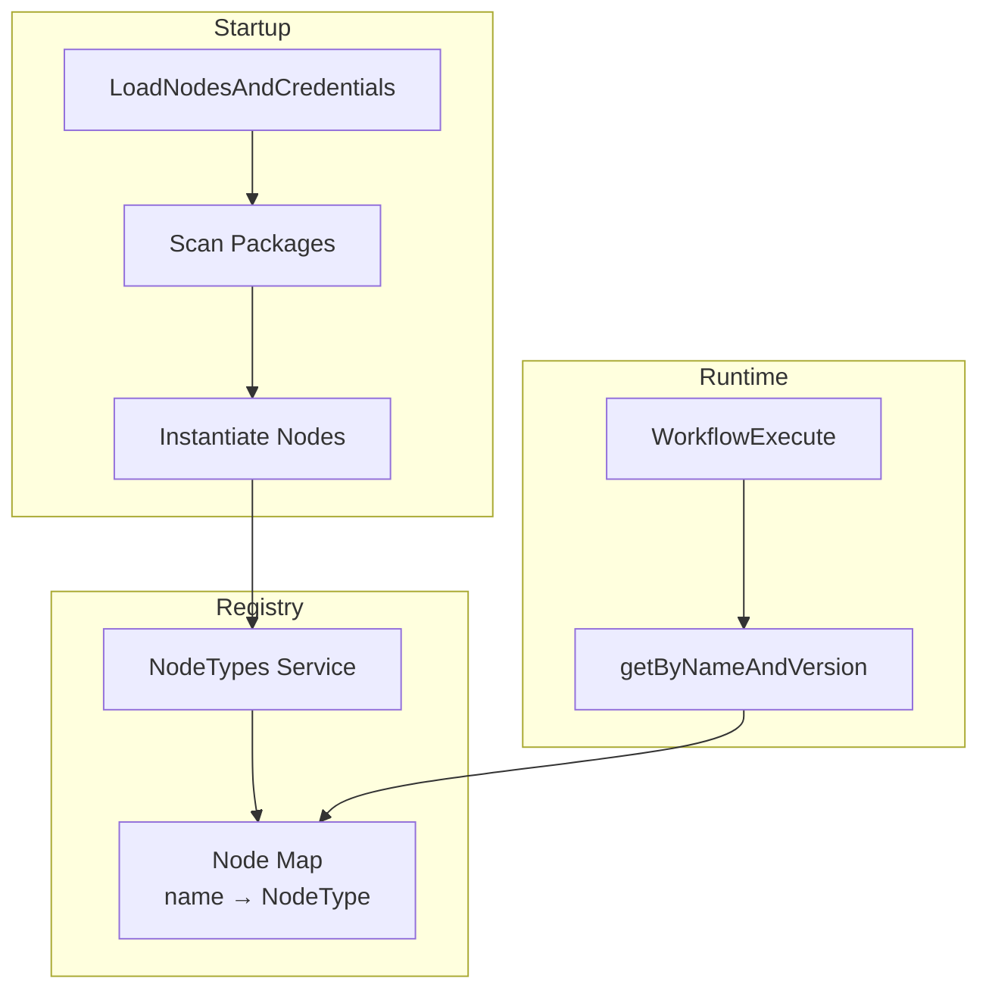

# Tool Registry - Node Discovery & Registration

## TL;DR
n8n load nodes qua `LoadNodesAndCredentials` service, scan packages cho `*.node.ts` files, instantiate để get description, register vào `NodeTypes` service. Runtime lookup qua `getByNameAndVersion()`. Community nodes loaded từ npm packages.

---

## Registration Architecture



---

## Node Loading

```typescript
// packages/cli/src/load-nodes-and-credentials.ts

@Service()
export class LoadNodesAndCredentials {
  private loadedNodes: Map<string, INodeType> = new Map();
  private loadedCredentials: Map<string, ICredentialType> = new Map();

  async init(): Promise<void> {
    // 1. Load built-in packages
    await this.loadNodesFromPackage('n8n-nodes-base');
    await this.loadNodesFromPackage('@n8n/nodes-langchain');

    // 2. Load community packages
    const communityPackages = await this.getCommunityPackages();
    for (const pkg of communityPackages) {
      try {
        await this.loadNodesFromPackage(pkg.name);
      } catch (error) {
        Logger.error(`Failed to load package ${pkg.name}`, { error });
      }
    }

    // 3. Register with NodeTypes service
    const nodeTypes = Container.get(NodeTypes);
    for (const [name, nodeType] of this.loadedNodes) {
      nodeTypes.addNode(name, nodeType);
    }

    Logger.info(`Loaded ${this.loadedNodes.size} node types`);
  }

  private async loadNodesFromPackage(packageName: string): Promise<void> {
    // Resolve package path
    const packagePath = require.resolve(`${packageName}/package.json`);
    const packageDir = path.dirname(packagePath);
    const packageJson = require(packagePath);

    // Get nodes directory from package.json or default
    const nodesDir = packageJson.n8n?.nodes
      ? path.join(packageDir, packageJson.n8n.nodes)
      : path.join(packageDir, 'nodes');

    // Find all node files
    const nodeFiles = await glob(`${nodesDir}/**/*.node.{ts,js}`);

    for (const file of nodeFiles) {
      await this.loadNode(file);
    }
  }

  private async loadNode(filePath: string): Promise<void> {
    try {
      const nodeModule = await import(filePath);

      // Get the node class (default export or named)
      const NodeClass = nodeModule.default ??
        Object.values(nodeModule).find(
          v => typeof v === 'function' && v.prototype?.description
        );

      if (!NodeClass) {
        Logger.warn(`No node class found in ${filePath}`);
        return;
      }

      // Instantiate to get description
      const instance = new NodeClass() as INodeType;
      const { name, version } = instance.description;

      // Handle versioned nodes
      const versions = Array.isArray(version) ? version : [version];

      for (const v of versions) {
        const key = `${name}:${v}`;
        this.loadedNodes.set(key, instance);
      }

      // Also register without version for latest
      this.loadedNodes.set(name, instance);

    } catch (error) {
      Logger.error(`Failed to load node from ${filePath}`, { error });
    }
  }
}
```

---

## NodeTypes Service

```typescript
// packages/cli/src/node-types.ts

@Service()
export class NodeTypes implements INodeTypes {
  private nodeTypes: Map<string, INodeType> = new Map();

  addNode(name: string, nodeType: INodeType): void {
    this.nodeTypes.set(name, nodeType);
  }

  getByNameAndVersion(
    nodeType: string,
    version?: number,
  ): INodeType | undefined {
    // Try with version first
    if (version !== undefined) {
      const key = `${nodeType}:${version}`;
      if (this.nodeTypes.has(key)) {
        return this.nodeTypes.get(key);
      }
    }

    // Fall back to latest (no version suffix)
    return this.nodeTypes.get(nodeType);
  }

  getAll(): INodeType[] {
    return Array.from(this.nodeTypes.values());
  }

  getByName(nodeType: string): INodeType | undefined {
    return this.nodeTypes.get(nodeType);
  }

  // Get node types for UI (with metadata)
  getNodeTypeDescriptions(): INodeTypeDescription[] {
    const seen = new Set<string>();
    const descriptions: INodeTypeDescription[] = [];

    for (const [key, nodeType] of this.nodeTypes) {
      // Skip versioned duplicates
      if (seen.has(nodeType.description.name)) continue;
      seen.add(nodeType.description.name);

      descriptions.push(nodeType.description);
    }

    return descriptions;
  }
}
```

---

## Community Package Loading

```typescript
// packages/cli/src/community-packages.service.ts

@Service()
export class CommunityPackagesService {
  async getInstalledPackages(): Promise<InstalledPackage[]> {
    // Read from database
    return this.installedPackageRepository.find();
  }

  async installPackage(packageName: string): Promise<void> {
    // 1. Verify package exists on npm
    const packageInfo = await this.getPackageInfo(packageName);

    // 2. Check if n8n compatible
    if (!packageInfo.n8n) {
      throw new Error('Package is not an n8n community package');
    }

    // 3. Install via npm
    await execAsync(`npm install ${packageName}`);

    // 4. Record in database
    await this.installedPackageRepository.save({
      packageName,
      installedVersion: packageInfo.version,
    });

    // 5. Load nodes from package
    const loader = Container.get(LoadNodesAndCredentials);
    await loader.loadNodesFromPackage(packageName);

    Logger.info(`Installed community package: ${packageName}`);
  }

  async uninstallPackage(packageName: string): Promise<void> {
    // 1. Unload nodes
    const nodeTypes = Container.get(NodeTypes);
    // ... remove nodes

    // 2. Uninstall via npm
    await execAsync(`npm uninstall ${packageName}`);

    // 3. Remove from database
    await this.installedPackageRepository.delete({ packageName });
  }
}
```

---

## Versioned Node Pattern

```typescript
// packages/nodes-base/nodes/Set/Set.node.ts

import { SetV1 } from './v1/SetV1.node';
import { SetV2 } from './v2/SetV2.node';
import { SetV3 } from './v3/SetV3.node';

export class Set extends VersionedNodeType {
  constructor() {
    const nodeVersions: IVersionedNodeType['nodeVersions'] = {
      1: new SetV1(),
      2: new SetV2(),
      3: new SetV3(),
    };

    super(nodeVersions, {
      displayName: 'Set',
      name: 'set',
      group: ['input'],
      description: 'Set values on items',
      defaultVersion: 3,
    });
  }
}

// VersionedNodeType delegates to correct version
export class VersionedNodeType implements INodeType {
  nodeVersions: { [key: number]: INodeType };
  baseDescription: INodeTypeDescription;

  constructor(
    nodeVersions: { [key: number]: INodeType },
    baseDescription: Partial<INodeTypeDescription>,
  ) {
    this.nodeVersions = nodeVersions;
    this.baseDescription = this.createDescription(baseDescription);
  }

  get description(): INodeTypeDescription {
    return this.baseDescription;
  }

  async execute(this: IExecuteFunctions): Promise<INodeExecutionData[][]> {
    const version = this.getNode().typeVersion;
    const nodeVersion = this.nodeVersions[version];
    return nodeVersion.execute.call(this);
  }
}
```

---

## File References

| Component | File Path |
|-----------|-----------|
| LoadNodesAndCredentials | `packages/cli/src/load-nodes-and-credentials.ts` |
| NodeTypes Service | `packages/cli/src/node-types.ts` |
| CommunityPackagesService | `packages/cli/src/community-packages.service.ts` |
| VersionedNodeType | `packages/workflow/src/versioned-node-type.ts` |

---

## Key Takeaways

1. **Package-Based Loading**: Nodes organized by package, loaded via file glob.

2. **Lazy Instantiation**: Nodes instantiated at startup to extract description.

3. **Version Support**: Same node can have multiple versions, lookup by name:version.

4. **Community Packages**: npm packages with n8n metadata, installed at runtime.

5. **Hot Reload**: Community packages can be added without restart (with caveats).
