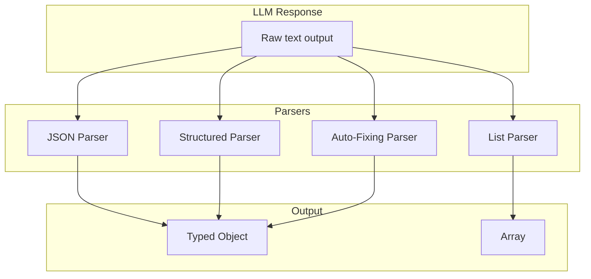

# Output Parser - Structured LLM Output

## TL;DR
n8n dùng LangChain output parsers để extract structured data từ LLM responses. Support: JSON parser, structured parser (schema-based), auto-fixing parser. Parsers inject format instructions vào prompt và parse response thành typed objects.

---

## Parser Types



---

## Structured Output Parser Node

```typescript
// packages/@n8n/nodes-langchain/nodes/output_parsers/OutputParserStructured/

import { StructuredOutputParser } from 'langchain/output_parsers';
import { z } from 'zod';

export class OutputParserStructured implements INodeType {
  description: INodeTypeDescription = {
    displayName: 'Structured Output Parser',
    name: 'outputParserStructured',
    outputs: [NodeConnectionTypes.AiOutputParser],
    properties: [
      {
        displayName: 'Schema Type',
        name: 'schemaType',
        type: 'options',
        options: [
          { name: 'From Schema', value: 'fromSchema' },
          { name: 'From JSON Example', value: 'fromJsonExample' },
        ],
      },
      {
        displayName: 'JSON Schema',
        name: 'jsonSchema',
        type: 'json',
        displayOptions: { show: { schemaType: ['fromSchema'] } },
        default: `{
  "type": "object",
  "properties": {
    "name": { "type": "string" },
    "age": { "type": "number" }
  }
}`,
      },
    ],
  };

  async supplyData(this: ISupplyDataFunctions): Promise<SupplyData> {
    const schemaType = this.getNodeParameter('schemaType', 0) as string;

    let parser: StructuredOutputParser<any>;

    if (schemaType === 'fromSchema') {
      const schema = this.getNodeParameter('jsonSchema', 0) as string;
      const zodSchema = jsonSchemaToZod(JSON.parse(schema));
      parser = StructuredOutputParser.fromZodSchema(zodSchema);
    } else {
      const example = this.getNodeParameter('jsonExample', 0) as string;
      parser = StructuredOutputParser.fromNamesAndDescriptions(
        JSON.parse(example)
      );
    }

    return { response: parser };
  }
}

// Convert JSON Schema to Zod
function jsonSchemaToZod(schema: JsonSchema): z.ZodType {
  if (schema.type === 'string') return z.string();
  if (schema.type === 'number') return z.number();
  if (schema.type === 'boolean') return z.boolean();
  if (schema.type === 'array') {
    return z.array(jsonSchemaToZod(schema.items));
  }
  if (schema.type === 'object') {
    const shape: Record<string, z.ZodType> = {};
    for (const [key, prop] of Object.entries(schema.properties ?? {})) {
      shape[key] = jsonSchemaToZod(prop);
    }
    return z.object(shape);
  }
  return z.any();
}
```

---

## Using Parser with LLM Chain

```typescript
// packages/@n8n/nodes-langchain/nodes/chains/ChainLLM/ChainLLM.node.ts

async execute(this: IExecuteFunctions): Promise<INodeExecutionData[][]> {
  const llm = await this.getInputConnectionData(
    NodeConnectionTypes.AiLanguageModel, 0
  ) as BaseChatModel;

  // Get optional output parser
  const outputParser = await this.getInputConnectionData(
    NodeConnectionTypes.AiOutputParser, 0
  ) as BaseOutputParser | undefined;

  const prompt = this.getNodeParameter('prompt', 0) as string;

  // Create chain with parser
  let chain;
  if (outputParser) {
    // Inject format instructions into prompt
    const formatInstructions = outputParser.getFormatInstructions();
    const fullPrompt = `${prompt}\n\n${formatInstructions}`;

    chain = RunnableSequence.from([
      PromptTemplate.fromTemplate(fullPrompt),
      llm,
      outputParser,  // Parse response
    ]);
  } else {
    chain = RunnableSequence.from([
      PromptTemplate.fromTemplate(prompt),
      llm,
    ]);
  }

  const items = this.getInputData();
  const returnData: INodeExecutionData[] = [];

  for (let i = 0; i < items.length; i++) {
    const result = await chain.invoke(items[i].json);
    returnData.push({ json: result });  // Parsed object
  }

  return [returnData];
}
```

---

## Auto-Fixing Parser

```typescript
// packages/@n8n/nodes-langchain/nodes/output_parsers/OutputParserAutofixing/

import { OutputFixingParser } from 'langchain/output_parsers';

export class OutputParserAutofixing implements INodeType {
  async supplyData(this: ISupplyDataFunctions): Promise<SupplyData> {
    // Get base parser
    const baseParser = await this.getInputConnectionData(
      NodeConnectionTypes.AiOutputParser, 0
    ) as BaseOutputParser;

    // Get LLM for fixing
    const llm = await this.getInputConnectionData(
      NodeConnectionTypes.AiLanguageModel, 0
    ) as BaseChatModel;

    // Wrap with auto-fixing
    const parser = OutputFixingParser.fromLLM(llm, baseParser);

    return { response: parser };
  }
}

// When parsing fails:
// 1. Auto-fixing parser catches error
// 2. Sends malformed output + error to LLM
// 3. LLM attempts to fix the format
// 4. Re-parses the fixed output
```

---

## File References

| Component | File Path |
|-----------|-----------|
| Structured Parser | `packages/@n8n/nodes-langchain/nodes/output_parsers/OutputParserStructured/` |
| Auto-Fixing Parser | `packages/@n8n/nodes-langchain/nodes/output_parsers/OutputParserAutofixing/` |
| Chain LLM | `packages/@n8n/nodes-langchain/nodes/chains/ChainLLM/` |

---

## Key Takeaways

1. **Format Instructions**: Parsers generate instructions appended to prompts.

2. **Zod Integration**: Schema validation using Zod for type safety.

3. **Auto-Fixing**: Failed parses can be retried with LLM correction.

4. **Connection-Based**: Parsers connected via `AiOutputParser` connection type.

5. **Typed Output**: Parsed results are typed objects, not raw strings.
