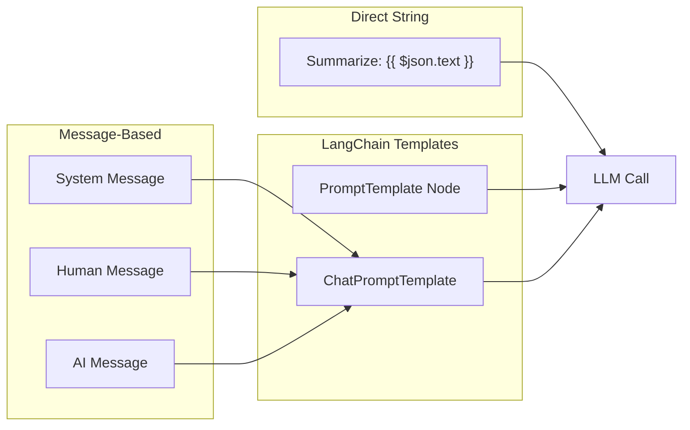

# Prompt Template System

## TL;DR
n8n hỗ trợ prompts qua 2 cách: **Direct Input** (string with expressions) và **LangChain PromptTemplate** nodes. Expressions `{{ $json.field }}` resolved at runtime. AI nodes có built-in system prompts. Chat models dùng message-based prompts với roles.

---

## Prompt Patterns



---

## Expression-Based Prompts

```typescript
// In any AI node, expressions are evaluated per-item
{
  displayName: 'Prompt',
  name: 'prompt',
  type: 'string',
  typeOptions: { rows: 4 },
  default: 'Summarize the following text:\n\n{{ $json.content }}',
}

// Runtime evaluation
const prompt = this.getNodeParameter('prompt', itemIndex) as string;
// If $json.content = "Hello world", prompt becomes:
// "Summarize the following text:\n\nHello world"
```

---

## LangChain PromptTemplate

```typescript
// packages/@n8n/nodes-langchain/nodes/chains/ChainLLM/ChainLLM.node.ts

import { PromptTemplate } from '@langchain/core/prompts';

export class ChainLLM implements INodeType {
  async execute(this: IExecuteFunctions): Promise<INodeExecutionData[][]> {
    const promptTemplate = this.getNodeParameter('prompt', 0) as string;
    const items = this.getInputData();

    // Create LangChain prompt template
    const prompt = PromptTemplate.fromTemplate(promptTemplate);

    // Get input variables from template
    const inputVariables = prompt.inputVariables;
    // e.g., ["text", "language"] from "Translate {text} to {language}"

    for (let i = 0; i < items.length; i++) {
      const item = items[i].json;

      // Build input object from item data
      const inputs: Record<string, string> = {};
      for (const varName of inputVariables) {
        inputs[varName] = item[varName] as string ?? '';
      }

      // Format prompt with variables
      const formattedPrompt = await prompt.format(inputs);

      // Call LLM
      const response = await llm.invoke(formattedPrompt);
    }
  }
}
```

---

## Chat Message Templates

```typescript
// packages/@n8n/nodes-langchain/nodes/agents/Agent/Agent.node.ts

import {
  ChatPromptTemplate,
  HumanMessagePromptTemplate,
  SystemMessagePromptTemplate,
  MessagesPlaceholder,
} from '@langchain/core/prompts';

function createAgentPrompt(systemPrompt: string): ChatPromptTemplate {
  return ChatPromptTemplate.fromMessages([
    // System message - agent instructions
    SystemMessagePromptTemplate.fromTemplate(systemPrompt),

    // Placeholder for chat history (from memory)
    new MessagesPlaceholder('chat_history'),

    // Human input
    HumanMessagePromptTemplate.fromTemplate('{input}'),

    // Placeholder for agent scratchpad (tool calls)
    new MessagesPlaceholder('agent_scratchpad'),
  ]);
}

// Default agent system prompt
const DEFAULT_SYSTEM_PROMPT = `You are a helpful assistant.
You have access to the following tools:
{tools}

To use a tool, respond with:
Action: tool_name
Action Input: input_for_tool

When you have the final answer:
Final Answer: your_answer`;
```

---

## Structured Output Prompts

```typescript
// For JSON output
const structuredPrompt = `Extract the following information from the text.
Return ONLY valid JSON in this exact format:
{
  "name": "extracted name",
  "email": "extracted email",
  "company": "extracted company"
}

Text: {text}

JSON:`;

// With output parser
import { StructuredOutputParser } from 'langchain/output_parsers';

const parser = StructuredOutputParser.fromNamesAndDescriptions({
  name: 'The person\'s full name',
  email: 'The email address',
  company: 'The company name',
});

const prompt = PromptTemplate.fromTemplate(`
${parser.getFormatInstructions()}

Extract from: {text}
`);
```

---

## AI Workflow Builder Prompts

```typescript
// packages/@n8n/ai-workflow-builder.ee/src/prompts/

export const WORKFLOW_BUILDER_SYSTEM = `You are an expert n8n workflow builder.
Your task is to create workflows based on user descriptions.

Available node types:
{nodeTypes}

Rules:
1. Use only the provided node types
2. Connect nodes logically
3. Include error handling
4. Keep workflows simple and efficient

Output Format:
Return a JSON workflow with nodes and connections.`;

export function buildPrompt(
  userRequest: string,
  availableNodes: INodeTypeDescription[],
): string {
  return WORKFLOW_BUILDER_SYSTEM
    .replace('{nodeTypes}', formatNodeTypes(availableNodes))
    + `\n\nUser Request: ${userRequest}`;
}
```

---

## File References

| Component | File Path |
|-----------|-----------|
| Chain LLM | `packages/@n8n/nodes-langchain/nodes/chains/ChainLLM/` |
| Agent Prompts | `packages/@n8n/nodes-langchain/nodes/agents/Agent/` |
| AI Builder Prompts | `packages/@n8n/ai-workflow-builder.ee/src/prompts/` |

---

## Key Takeaways

1. **Expression Integration**: n8n expressions `{{ }}` work in prompts, resolved per-item.

2. **LangChain Templates**: Full support for PromptTemplate with {variable} syntax.

3. **Chat Messages**: Role-based messages (system, human, AI) for chat models.

4. **Placeholders**: MessagesPlaceholder for dynamic content (history, scratchpad).

5. **Output Instructions**: Parser format instructions included in prompts for structured output.
