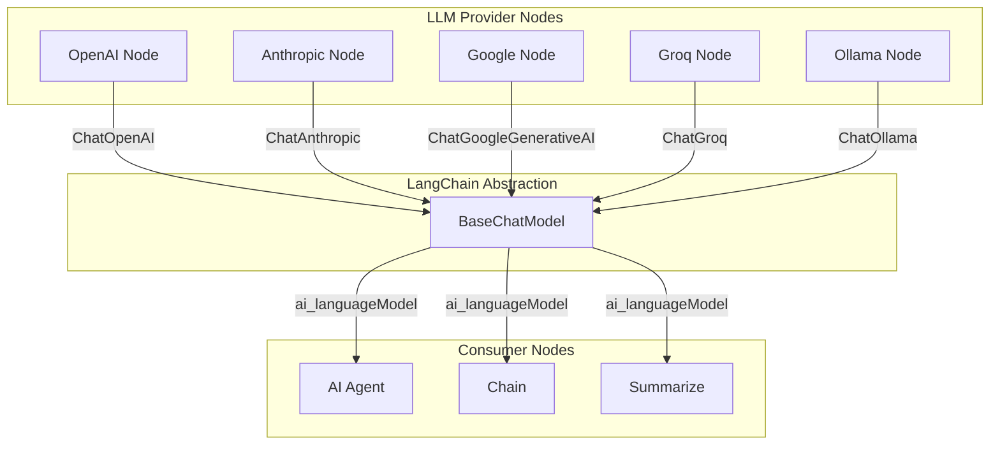

# LLM Provider Abstraction

## TL;DR
n8n dùng LangChain làm abstraction layer cho LLM providers. Mỗi provider implement `BaseChatModel` interface. Nodes output LLM instance qua `ai_languageModel` connection type. AI Agent/Chain nodes consume LLM via `getInputConnectionData()`. Support: OpenAI, Anthropic, Google, Groq, Ollama, Bedrock.

---

## Provider Architecture



---

## LLM Node Implementation

```typescript
// packages/@n8n/nodes-langchain/nodes/llms/LLMOpenAi/LLMOpenAi.node.ts

import { ChatOpenAI } from '@langchain/openai';

export class LLMOpenAI implements INodeType {
  description: INodeTypeDescription = {
    displayName: 'OpenAI Chat Model',
    name: 'lmChatOpenAi',
    icon: 'file:openai.svg',
    group: ['transform'],

    // Output is LLM, not regular data
    inputs: [],
    outputs: [NodeConnectionTypes.AiLanguageModel],

    credentials: [{ name: 'openAiApi', required: true }],

    properties: [
      {
        displayName: 'Model',
        name: 'model',
        type: 'options',
        options: [
          { name: 'GPT-4o', value: 'gpt-4o' },
          { name: 'GPT-4o Mini', value: 'gpt-4o-mini' },
          { name: 'GPT-4 Turbo', value: 'gpt-4-turbo' },
          { name: 'GPT-3.5 Turbo', value: 'gpt-3.5-turbo' },
        ],
        default: 'gpt-4o-mini',
      },
      {
        displayName: 'Temperature',
        name: 'temperature',
        type: 'number',
        default: 0.7,
        typeOptions: { minValue: 0, maxValue: 2 },
      },
      {
        displayName: 'Max Tokens',
        name: 'maxTokens',
        type: 'number',
        default: 1024,
      },
    ],
  };

  // supplyData instead of execute for resource nodes
  async supplyData(
    this: ISupplyDataFunctions,
    itemIndex: number,
  ): Promise<SupplyData> {
    const credentials = await this.getCredentials('openAiApi');

    const model = this.getNodeParameter('model', itemIndex) as string;
    const temperature = this.getNodeParameter('temperature', itemIndex) as number;
    const maxTokens = this.getNodeParameter('maxTokens', itemIndex) as number;

    // Create LangChain model instance
    const llm = new ChatOpenAI({
      openAIApiKey: credentials.apiKey as string,
      modelName: model,
      temperature,
      maxTokens,
    });

    return {
      response: llm,  // Return LLM instance
    };
  }
}
```

---

## Consuming LLM in Agent

```typescript
// packages/@n8n/nodes-langchain/nodes/agents/Agent/Agent.node.ts

export class Agent implements INodeType {
  description: INodeTypeDescription = {
    inputs: [
      NodeConnectionTypes.Main,
      { type: NodeConnectionTypes.AiLanguageModel, displayName: 'Model' },
      { type: NodeConnectionTypes.AiTool, displayName: 'Tools' },
      { type: NodeConnectionTypes.AiMemory, displayName: 'Memory' },
    ],
    outputs: [NodeConnectionTypes.Main],
  };

  async execute(this: IExecuteFunctions): Promise<INodeExecutionData[][]> {
    // Get LLM from connected node
    const llm = await this.getInputConnectionData(
      NodeConnectionTypes.AiLanguageModel,
      0,
    ) as BaseChatModel;

    // Get tools
    const tools = await this.getInputConnectionData(
      NodeConnectionTypes.AiTool,
      0,
    ) as Tool[];

    // Get memory (optional)
    const memory = await this.getInputConnectionData(
      NodeConnectionTypes.AiMemory,
      0,
    ) as BaseMemory | undefined;

    const items = this.getInputData();
    const returnData: INodeExecutionData[] = [];

    for (let i = 0; i < items.length; i++) {
      const input = this.getNodeParameter('text', i) as string;

      // Create agent with LLM
      const executor = await initializeAgentExecutorWithOptions(
        tools,
        llm,
        {
          agentType: 'openai-functions',
          memory,
          verbose: true,
        },
      );

      const result = await executor.invoke({ input });

      returnData.push({
        json: { output: result.output },
      });
    }

    return [returnData];
  }
}
```

---

## Supported Providers

| Provider | Package | Model Class |
|----------|---------|-------------|
| OpenAI | `@langchain/openai` | ChatOpenAI |
| Anthropic | `@langchain/anthropic` | ChatAnthropic |
| Google | `@langchain/google-genai` | ChatGoogleGenerativeAI |
| Groq | `@langchain/groq` | ChatGroq |
| Ollama | `@langchain/community` | ChatOllama |
| AWS Bedrock | `@langchain/aws` | BedrockChat |
| Azure OpenAI | `@langchain/openai` | AzureChatOpenAI |
| Mistral | `@langchain/mistralai` | ChatMistralAI |

---

## AI Workflow Builder (Internal)

```typescript
// packages/@n8n/ai-workflow-builder.ee/src/llm-config.ts

import { ChatAnthropic } from '@langchain/anthropic';

export function createLLM(config: LLMConfig): BaseChatModel {
  return new ChatAnthropic({
    model: 'claude-sonnet-4-20250514',
    anthropicApiKey: config.apiKey,
    maxTokens: 4096,
    temperature: 0,
    // Prompt caching for efficiency
    clientOptions: {
      defaultHeaders: {
        'anthropic-beta': 'prompt-caching-2024-07-31',
      },
    },
  });
}
```

---

## File References

| Component | File Path |
|-----------|-----------|
| LLM Nodes | `packages/@n8n/nodes-langchain/nodes/llms/` |
| Agent Node | `packages/@n8n/nodes-langchain/nodes/agents/Agent/` |
| AI Builder | `packages/@n8n/ai-workflow-builder.ee/src/` |

---

## Key Takeaways

1. **LangChain Abstraction**: Unified interface qua `BaseChatModel`, switch providers without code changes.

2. **supplyData Pattern**: Resource nodes use supplyData() instead of execute() to provide instances.

3. **Connection Types**: `AiLanguageModel` connection type ensures type-safe LLM connections.

4. **Credential Separation**: Each provider has own credential type, securely stored.

5. **Configurable Models**: Model selection, temperature, tokens configurable per-node.
