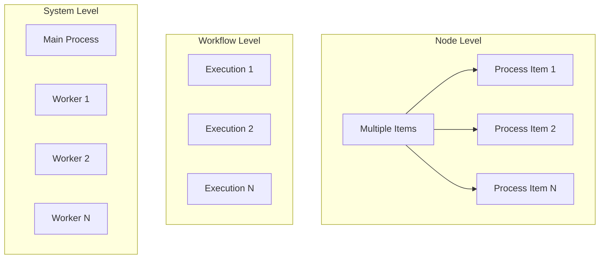

# Concurrency & Async Processing

## TL;DR
n8n xử lý concurrency ở 2 levels: **Node Level** (parallel item processing) và **Workflow Level** (queue mode với workers). Node execution là async, parallel branches execute concurrently. Scaling qua Bull queue + Redis với multiple worker processes.

---

## Concurrency Levels



---

## Parallel Item Processing

```typescript
// packages/nodes-base/nodes/HttpRequest/HttpRequest.node.ts

async execute(this: IExecuteFunctions): Promise<INodeExecutionData[][]> {
  const items = this.getInputData();
  const returnData: INodeExecutionData[] = [];

  // Process all items concurrently
  const promises = items.map(async (item, index) => {
    const url = this.getNodeParameter('url', index) as string;
    const response = await this.helpers.httpRequest({ url });
    return { json: response };
  });

  // Wait for all to complete
  const results = await Promise.all(promises);
  returnData.push(...results);

  return [returnData];
}

// With concurrency limit
import pLimit from 'p-limit';

async execute(this: IExecuteFunctions): Promise<INodeExecutionData[][]> {
  const items = this.getInputData();
  const concurrency = this.getNodeParameter('concurrency', 0, 10) as number;

  const limit = pLimit(concurrency);

  const promises = items.map((item, index) =>
    limit(async () => {
      const response = await processItem(item);
      return { json: response };
    })
  );

  const results = await Promise.all(promises);
  return [results];
}
```

---

## Parallel Branch Execution

```typescript
// packages/core/src/execution-engine/workflow-execute.ts

// When a node has multiple outputs, all branches start simultaneously
// But execution is single-threaded - nodes are queued

private scheduleSuccessorNodes(
  workflow: Workflow,
  node: INode,
  outputData: INodeExecutionData[][],
  runIndex: number,
): void {
  const connections = workflow.connectionsBySourceNode[node.name]?.main ?? [];

  // Each output can have multiple connections
  for (let outputIndex = 0; outputIndex < outputData.length; outputIndex++) {
    const output = outputData[outputIndex];
    if (!output || output.length === 0) continue;

    const outputConnections = connections[outputIndex] ?? [];

    // Queue all connected nodes
    for (const connection of outputConnections) {
      this.addNodeToBeExecuted(
        workflow,
        connection,
        outputIndex,
        node.name,
        outputData,
        runIndex,
      );
    }
  }
}
```

---

## Queue Mode (Scaling)

```typescript
// packages/cli/src/scaling/scaling.service.ts

@Service()
export class ScalingService {
  private queue: Bull.Queue;

  async init(): Promise<void> {
    this.queue = new Bull('n8n-workflow', {
      redis: {
        host: config.queue.redis.host,
        port: config.queue.redis.port,
      },
      settings: {
        // Concurrency per worker
        maxStalledCount: 1,
        stalledInterval: 30000,
      },
    });
  }

  async addJob(data: IWorkflowExecutionData): Promise<Bull.Job> {
    return this.queue.add('workflow', data, {
      jobId: data.executionId,
      attempts: 3,
      backoff: {
        type: 'exponential',
        delay: 1000,
      },
    });
  }
}

// Worker process
// packages/cli/src/commands/worker.ts

@Service()
export class WorkerCommand {
  async run(): Promise<void> {
    const queue = Container.get(ScalingService).getQueue();

    // Process jobs with concurrency
    queue.process('workflow', concurrency, async (job) => {
      const { workflowData, executionId } = job.data;

      const workflowExecute = new WorkflowExecute(
        additionalData,
        'trigger',
      );

      return workflowExecute.run({ workflow: workflowData });
    });
  }
}
```

---

## Webhook Concurrency

```typescript
// packages/cli/src/webhooks/webhook-server.ts

// Webhooks handled concurrently by Express
app.post('/webhook/:path', async (req, res) => {
  // Each request spawns new execution
  const executionId = await workflowRunner.run({
    workflowData: workflow,
    triggerData: req.body,
    executionMode: 'webhook',
  });

  // Response can be immediate or wait
  if (workflow.settings.waitForWebhook) {
    const result = await waitForExecution(executionId);
    res.json(result);
  } else {
    res.json({ executionId });
  }
});
```

---

## Async Patterns

```typescript
// Await in loop (sequential)
for (const item of items) {
  const result = await processItem(item);  // Waits each time
  results.push(result);
}

// Promise.all (parallel)
const results = await Promise.all(
  items.map(item => processItem(item))
);

// Promise.allSettled (parallel, handle failures)
const results = await Promise.allSettled(
  items.map(item => processItem(item))
);

// p-limit (controlled concurrency)
const limit = pLimit(5);  // Max 5 concurrent
const results = await Promise.all(
  items.map(item => limit(() => processItem(item)))
);
```

---

## File References

| Component | File Path |
|-----------|-----------|
| Scaling Service | `packages/cli/src/scaling/scaling.service.ts` |
| Worker Command | `packages/cli/src/commands/worker.ts` |
| Job Processor | `packages/cli/src/scaling/job-processor.ts` |
| Webhook Server | `packages/cli/src/webhooks/` |

---

## Key Takeaways

1. **Single-Threaded Execution**: Node.js event loop, but async operations run parallel.

2. **Item Parallelism**: Nodes can process items concurrently với Promise.all.

3. **Branch Parallelism**: Multiple outputs queue branches, execute in order.

4. **Queue Scaling**: Bull + Redis for horizontal scaling với workers.

5. **Controlled Concurrency**: p-limit for rate-limited external APIs.
