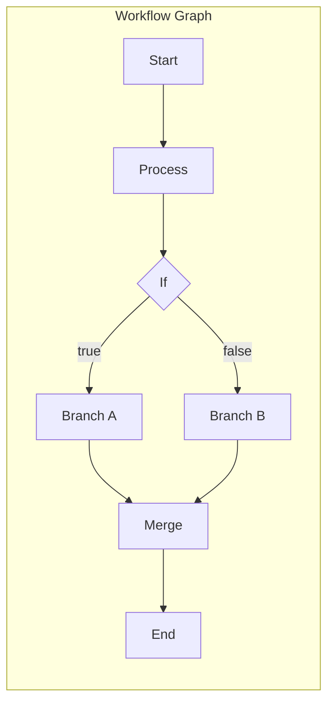
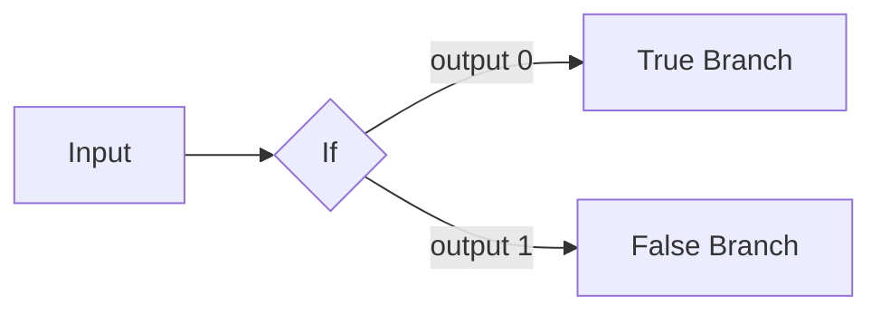
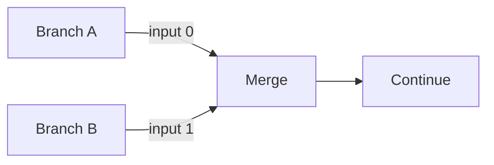
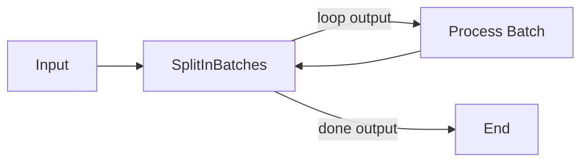

# Execution Graph Pattern

## TL;DR
n8n workflows là directed graphs với nodes và connections. Execution engine traverse graph theo dependency order (topological sort). Connections indexed by source node, inverted cho parent lookup. Special patterns: branching (If/Switch), merging (Merge node), loops (SplitInBatches).

---

## Graph Structure



---

## Connection Data Structure

```typescript
// packages/workflow/src/interfaces.ts

// Connections indexed by SOURCE node
interface IConnections {
  [sourceNodeName: string]: {
    [connectionType: string]: Array<IConnection[]>;
    // connectionType: 'main' | 'error'
    // Array index = output index
  };
}

interface IConnection {
  node: string;      // Target node name
  type: string;      // Connection type ('main')
  index: number;     // Target input index
}

// Example
const connections: IConnections = {
  "Start": {
    "main": [[
      { node: "Process", type: "main", index: 0 }
    ]]
  },
  "If": {
    "main": [
      [{ node: "Branch A", type: "main", index: 0 }],  // Output 0 (true)
      [{ node: "Branch B", type: "main", index: 0 }]   // Output 1 (false)
    ]
  }
};
```

---

## Graph Traversal

```typescript
// packages/workflow/src/common/get-parent-nodes.ts

// Find predecessors (requires inverted connections)
export function getParentNodes(
  connectionsByDestination: IConnections,
  nodeName: string,
  type: string = 'main',
  depth: number = -1,  // -1 = unlimited
): string[] {
  const parents: Set<string> = new Set();
  const visited: Set<string> = new Set();

  function traverse(node: string, currentDepth: number): void {
    if (visited.has(node)) return;
    if (depth !== -1 && currentDepth > depth) return;
    visited.add(node);

    const connections = connectionsByDestination[node]?.[type] ?? [];
    for (const inputConnections of connections) {
      for (const conn of inputConnections ?? []) {
        parents.add(conn.node);
        traverse(conn.node, currentDepth + 1);
      }
    }
  }

  traverse(nodeName, 0);
  return Array.from(parents);
}

// Find successors (direct from connections)
export function getChildNodes(
  connections: IConnections,
  nodeName: string,
  type: string = 'main',
  depth: number = -1,
): string[] {
  const children: Set<string> = new Set();
  const visited: Set<string> = new Set();

  function traverse(node: string, currentDepth: number): void {
    if (visited.has(node)) return;
    if (depth !== -1 && currentDepth > depth) return;
    visited.add(node);

    const outputs = connections[node]?.[type] ?? [];
    for (const output of outputs) {
      for (const conn of output ?? []) {
        children.add(conn.node);
        traverse(conn.node, currentDepth + 1);
      }
    }
  }

  traverse(nodeName, 0);
  return Array.from(children);
}

// Invert connections for parent lookup
export function mapConnectionsByDestination(
  connections: IConnections,
): IConnections {
  const result: IConnections = {};

  for (const [sourceName, sourceConnections] of Object.entries(connections)) {
    for (const [type, outputs] of Object.entries(sourceConnections)) {
      for (let outputIndex = 0; outputIndex < outputs.length; outputIndex++) {
        for (const conn of outputs[outputIndex] ?? []) {
          if (!result[conn.node]) {
            result[conn.node] = {};
          }
          if (!result[conn.node][type]) {
            result[conn.node][type] = [];
          }
          // Ensure array for input index
          while (result[conn.node][type].length <= conn.index) {
            result[conn.node][type].push([]);
          }
          result[conn.node][type][conn.index].push({
            node: sourceName,
            type,
            index: outputIndex,
          });
        }
      }
    }
  }

  return result;
}
```

---

## Execution Order

```typescript
// packages/core/src/execution-engine/workflow-execute.ts

// Execution order v1: Visual position based
if (workflow.settings.executionOrder === 'v1') {
  // Sort by Y position (top to bottom), then X (left to right)
  nodesToExecute.sort((a, b) => {
    if (a.position[1] < b.position[1]) return -1;  // Higher Y first
    if (a.position[1] > b.position[1]) return 1;
    if (a.position[0] < b.position[0]) return -1;  // Lower X first
    return 0;
  });
}

// Execution order v0: Dependency based (topological)
// Nodes execute when all inputs are ready
```

---

## Special Graph Patterns

### Branching (If/Switch)



### Merging (Merge Node)



### Loops (SplitInBatches)



---

## File References

| Component | File Path |
|-----------|-----------|
| Connection Types | `packages/workflow/src/interfaces.ts` |
| Graph Traversal | `packages/workflow/src/common/` |
| Workflow Class | `packages/workflow/src/workflow.ts` |

---

## Key Takeaways

1. **Source-Indexed**: Connections indexed by source, invert for parent lookup.

2. **Multi-Output**: Nodes can have multiple outputs (If, Switch, SplitInBatches).

3. **Multi-Input**: Merge node waits for all inputs before executing.

4. **Visual Order**: v1 execution order based on canvas position.

5. **Loop Support**: SplitInBatches enables iteration patterns.
