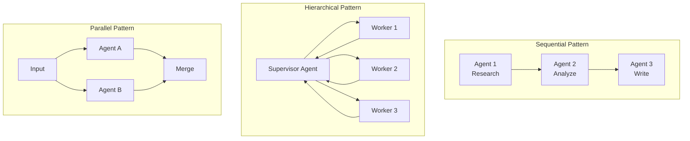
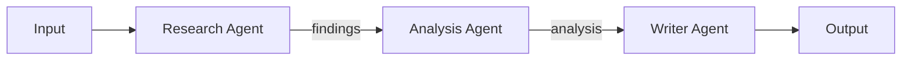
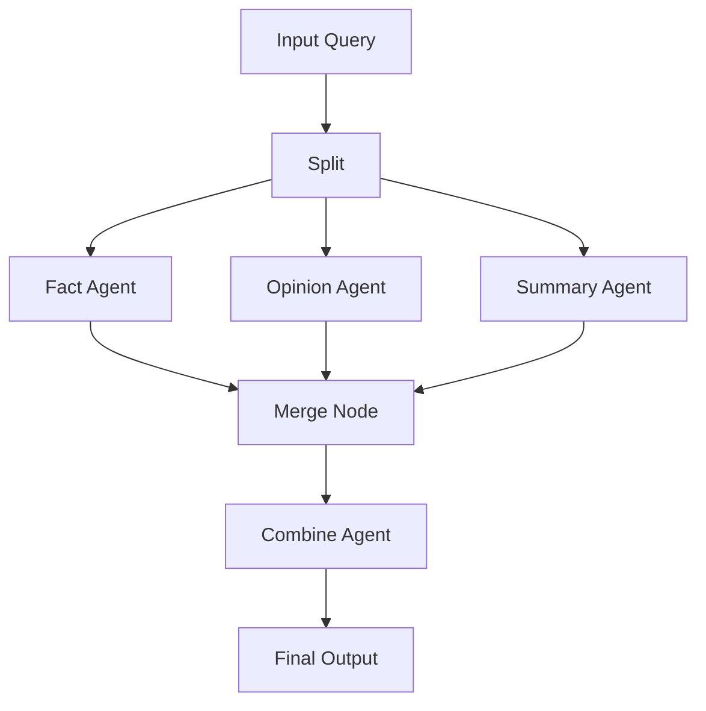

# Multi-Agent Orchestration

## TL;DR
n8n support multi-agent qua 2 patterns: **Sequential** (agents chain trong workflow) và **Hierarchical** (supervisor agent điều phối sub-agents). Communication qua workflow connections. AI Workflow Builder dùng supervisor pattern với specialized agents cho different tasks.

---

## Multi-Agent Patterns



---

## Sequential Agents



```json
{
  "nodes": [
    {
      "name": "Research Agent",
      "type": "agent",
      "parameters": {
        "systemPrompt": "You are a research specialist..."
      }
    },
    {
      "name": "Analysis Agent",
      "type": "agent",
      "parameters": {
        "systemPrompt": "You analyze research findings..."
      }
    },
    {
      "name": "Writer Agent",
      "type": "agent",
      "parameters": {
        "systemPrompt": "You write reports based on analysis..."
      }
    }
  ],
  "connections": {
    "Research Agent": { "main": [[{ "node": "Analysis Agent" }]] },
    "Analysis Agent": { "main": [[{ "node": "Writer Agent" }]] }
  }
}
```

---

## Supervisor Pattern (AI Workflow Builder)

```typescript
// packages/@n8n/ai-workflow-builder.ee/src/agents/supervisor.agent.ts

export class SupervisorAgent {
  private llm: BaseChatModel;
  private workers: Map<string, WorkerAgent> = new Map();

  constructor(llm: BaseChatModel) {
    this.llm = llm;

    // Register worker agents
    this.workers.set('workflow_generator', new WorkflowGeneratorAgent(llm));
    this.workers.set('node_configurer', new NodeConfigurerAgent(llm));
    this.workers.set('connection_builder', new ConnectionBuilderAgent(llm));
    this.workers.set('validator', new ValidatorAgent(llm));
  }

  async run(userRequest: string): Promise<WorkflowResult> {
    // 1. Analyze request and plan
    const plan = await this.planExecution(userRequest);

    // 2. Execute plan with workers
    let result: any = { request: userRequest };

    for (const step of plan.steps) {
      const worker = this.workers.get(step.worker);
      if (!worker) {
        throw new Error(`Unknown worker: ${step.worker}`);
      }

      // Execute worker with context
      result = await worker.execute({
        ...result,
        task: step.task,
        context: step.context,
      });

      // Check if need to replan
      if (result.needsReplan) {
        const newPlan = await this.replan(result);
        plan.steps.push(...newPlan.steps);
      }
    }

    // 3. Validate final result
    const validation = await this.workers.get('validator')!.execute(result);

    return {
      workflow: result.workflow,
      valid: validation.valid,
      errors: validation.errors,
    };
  }

  private async planExecution(request: string): Promise<ExecutionPlan> {
    const response = await this.llm.invoke([
      new SystemMessage(SUPERVISOR_PROMPT),
      new HumanMessage(`Plan execution for: ${request}`),
    ]);

    return parseExecutionPlan(response.content);
  }
}
```

---

## Worker Agent Example

```typescript
// packages/@n8n/ai-workflow-builder.ee/src/agents/responder.agent.ts

export class ResponderAgent {
  private llm: BaseChatModel;

  async execute(input: AgentInput): Promise<AgentOutput> {
    const { userMessage, workflowContext, previousResponse } = input;

    const response = await this.llm.invoke([
      new SystemMessage(RESPONDER_PROMPT),
      new HumanMessage(`
        User: ${userMessage}
        Current Workflow: ${JSON.stringify(workflowContext)}
        Previous: ${previousResponse ?? 'None'}

        Generate appropriate response.
      `),
    ]);

    return {
      message: response.content,
      suggestedActions: this.extractActions(response.content),
    };
  }
}
```

---

## Parallel Agents with Merge



```typescript
// Workflow with parallel branches
{
  "nodes": [
    { "name": "Split", "type": "n8n-nodes-base.noOp" },
    { "name": "Fact Agent", "type": "agent" },
    { "name": "Opinion Agent", "type": "agent" },
    { "name": "Summary Agent", "type": "agent" },
    { "name": "Merge", "type": "n8n-nodes-base.merge" },
    { "name": "Combine Agent", "type": "agent" }
  ],
  "connections": {
    "Split": {
      "main": [
        [{ "node": "Fact Agent" }],
        [{ "node": "Opinion Agent" }],
        [{ "node": "Summary Agent" }]
      ]
    },
    "Fact Agent": { "main": [[{ "node": "Merge", "index": 0 }]] },
    "Opinion Agent": { "main": [[{ "node": "Merge", "index": 1 }]] },
    "Summary Agent": { "main": [[{ "node": "Merge", "index": 2 }]] },
    "Merge": { "main": [[{ "node": "Combine Agent" }]] }
  }
}
```

---

## Communication Between Agents

```typescript
// Agent output becomes next agent's input
// Via regular n8n data flow

// Agent 1 output
{
  json: {
    output: "Research findings...",
    metadata: { sources: [...] }
  }
}

// Agent 2 receives via $json
const previousOutput = $json.output;
const prompt = `Analyze this: ${previousOutput}`;
```

---

## File References

| Component | File Path |
|-----------|-----------|
| AI Workflow Builder | `packages/@n8n/ai-workflow-builder.ee/src/` |
| Supervisor Agent | `packages/@n8n/ai-workflow-builder.ee/src/agents/supervisor.agent.ts` |
| Agent Node | `packages/@n8n/nodes-langchain/nodes/agents/Agent/` |
| Merge Node | `packages/nodes-base/nodes/Merge/` |

---

## Key Takeaways

1. **Workflow = Orchestration**: n8n workflow itself is the orchestration layer.

2. **Sequential Simple**: Chain agents với output → input connections.

3. **Supervisor Complex**: Central agent delegates to specialized workers.

4. **Parallel Execution**: Split → Agents → Merge pattern for parallelism.

5. **Data Passing**: Standard n8n data flow for agent communication.
