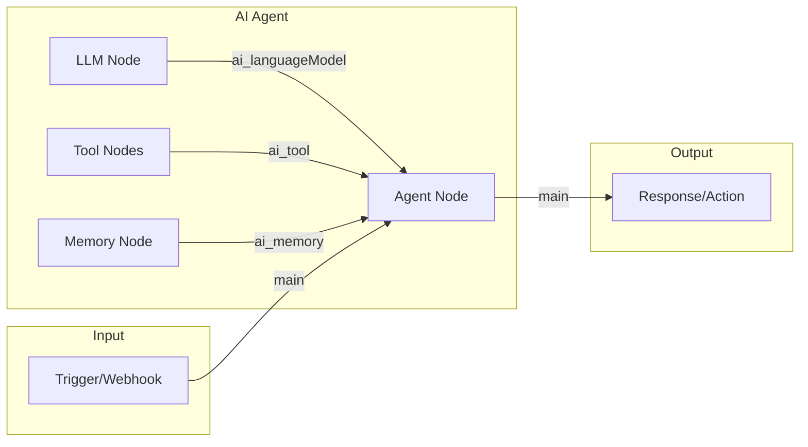
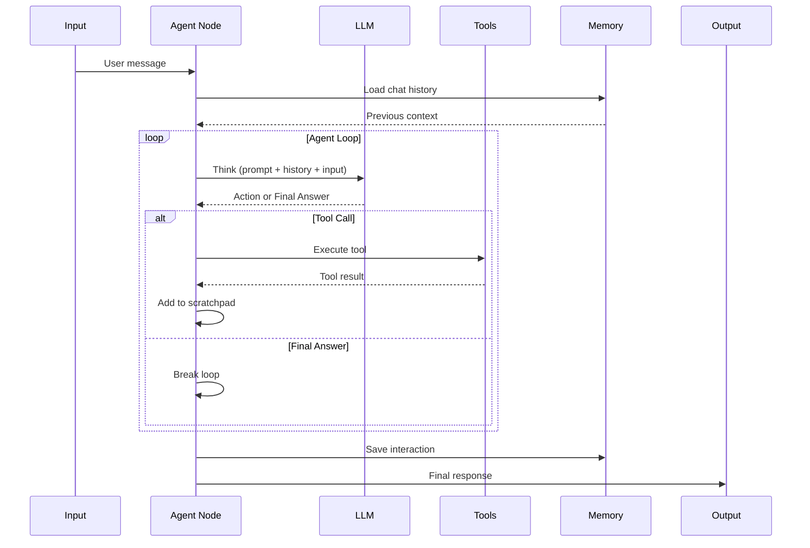

# Single Agent Flow

## TL;DR
Single agent flow trong n8n là một workflow với AI Agent node ở trung tâm. Agent nhận input, reasoning qua LLM, sử dụng tools, và output result. Flow: Input → Agent (LLM + Tools + Memory) → Output. Agent node kết nối với LLM, Tools, Memory qua typed connections.

---

## Architecture



---

## Agent Execution Flow



---

## Agent Node Implementation

```typescript
// packages/@n8n/nodes-langchain/nodes/agents/Agent/Agent.node.ts

export class Agent implements INodeType {
  description: INodeTypeDescription = {
    displayName: 'AI Agent',
    name: 'agent',
    inputs: [
      NodeConnectionTypes.Main,
      { type: NodeConnectionTypes.AiLanguageModel, displayName: 'Model', required: true },
      { type: NodeConnectionTypes.AiTool, displayName: 'Tools' },
      { type: NodeConnectionTypes.AiMemory, displayName: 'Memory' },
    ],
    outputs: [NodeConnectionTypes.Main],
  };

  async execute(this: IExecuteFunctions): Promise<INodeExecutionData[][]> {
    // 1. Get connected components
    const llm = await this.getInputConnectionData(
      NodeConnectionTypes.AiLanguageModel, 0
    ) as BaseChatModel;

    const tools = await this.getInputConnectionData(
      NodeConnectionTypes.AiTool, 0
    ) as Tool[] ?? [];

    const memory = await this.getInputConnectionData(
      NodeConnectionTypes.AiMemory, 0
    ) as BaseMemory | undefined;

    // 2. Get configuration
    const agentType = this.getNodeParameter('agentType', 0) as string;
    const maxIterations = this.getNodeParameter('maxIterations', 0, 10) as number;
    const systemPrompt = this.getNodeParameter('systemPrompt', 0, '') as string;

    // 3. Process each input item
    const items = this.getInputData();
    const returnData: INodeExecutionData[] = [];

    for (let i = 0; i < items.length; i++) {
      const input = this.getNodeParameter('text', i) as string;
      const sessionId = this.getNodeParameter('sessionId', i, '') as string;

      // 4. Create agent executor
      const executor = await initializeAgentExecutorWithOptions(
        tools,
        llm,
        {
          agentType: agentType as AgentType,
          memory,
          maxIterations,
          returnIntermediateSteps: true,
          agentArgs: {
            prefix: systemPrompt,
          },
        }
      );

      // 5. Execute agent
      const result = await executor.invoke({
        input,
        sessionId,
      });

      // 6. Return result
      returnData.push({
        json: {
          output: result.output,
          intermediateSteps: result.intermediateSteps,
          sessionId,
        },
      });
    }

    return [returnData];
  }
}
```

---

## Tool Connection

```typescript
// Tool nodes output via ai_tool connection
// packages/@n8n/nodes-langchain/nodes/tools/ToolCalculator/

export class ToolCalculator implements INodeType {
  description: INodeTypeDescription = {
    outputs: [NodeConnectionTypes.AiTool],
  };

  async supplyData(this: ISupplyDataFunctions): Promise<SupplyData> {
    const calculator = new Calculator();
    return { response: calculator };
  }
}

// Agent receives tool via connection
const tools = await this.getInputConnectionData(
  NodeConnectionTypes.AiTool, 0
);
// tools = [Calculator, WebSearch, ...]
```

---

## Example Workflow JSON

```json
{
  "nodes": [
    {
      "name": "Webhook",
      "type": "n8n-nodes-base.webhook",
      "position": [0, 0]
    },
    {
      "name": "OpenAI",
      "type": "@n8n/n8n-nodes-langchain.lmChatOpenAi",
      "position": [200, 100]
    },
    {
      "name": "Calculator",
      "type": "@n8n/n8n-nodes-langchain.toolCalculator",
      "position": [200, 200]
    },
    {
      "name": "Agent",
      "type": "@n8n/n8n-nodes-langchain.agent",
      "position": [400, 0],
      "parameters": {
        "agentType": "openai-functions",
        "maxIterations": 10
      }
    },
    {
      "name": "Respond",
      "type": "n8n-nodes-base.respondToWebhook",
      "position": [600, 0]
    }
  ],
  "connections": {
    "Webhook": { "main": [[{ "node": "Agent", "type": "main", "index": 0 }]] },
    "OpenAI": { "ai_languageModel": [[{ "node": "Agent", "type": "ai_languageModel", "index": 0 }]] },
    "Calculator": { "ai_tool": [[{ "node": "Agent", "type": "ai_tool", "index": 0 }]] },
    "Agent": { "main": [[{ "node": "Respond", "type": "main", "index": 0 }]] }
  }
}
```

---

## Key Takeaways

1. **Single Entry Point**: Một Agent node orchestrate LLM, tools, memory.

2. **Typed Connections**: ai_languageModel, ai_tool, ai_memory ensure correct wiring.

3. **ReAct Loop**: Agent internally runs think-act-observe loop.

4. **Session Management**: sessionId enables conversation continuity.

5. **Intermediate Steps**: Expose tool calls for debugging/logging.
