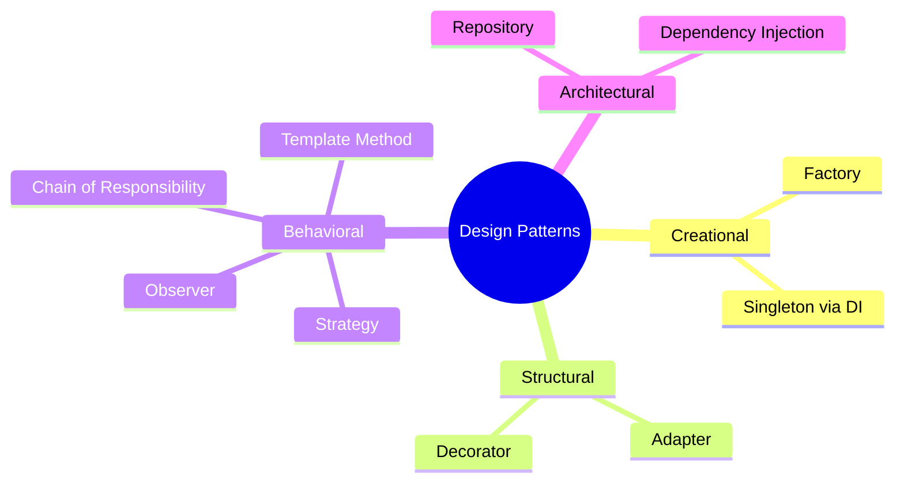

# Design Patterns in n8n

## TL;DR
n8n sử dụng nhiều design patterns: **Dependency Injection** (IoC container), **Repository** (data access), **Factory** (node creation), **Observer** (event bus), **Strategy** (execution modes), **Chain of Responsibility** (middleware), **Template Method** (node execution).

---

## Pattern Overview



---

## 1. Dependency Injection

```typescript
// packages/@n8n/di/src/container.ts

// Singleton container
class Container {
  private instances: Map<string, any> = new Map();
  private factories: Map<string, () => any> = new Map();

  get<T>(token: string | Constructor<T>): T {
    const key = typeof token === 'string' ? token : token.name;

    if (this.instances.has(key)) {
      return this.instances.get(key);
    }

    if (this.factories.has(key)) {
      const instance = this.factories.get(key)!();
      this.instances.set(key, instance);
      return instance;
    }

    // Auto-resolve constructor dependencies
    if (typeof token === 'function') {
      const instance = this.resolve(token);
      this.instances.set(key, instance);
      return instance;
    }

    throw new Error(`No provider for ${key}`);
  }

  set(token: string, instance: any): void {
    this.instances.set(token, instance);
  }
}

// Usage with decorator
@Service()
export class WorkflowService {
  constructor(
    private readonly repository: WorkflowRepository,  // Auto-injected
    private readonly nodeTypes: NodeTypes,
  ) {}
}

// Manual resolution
const service = Container.get(WorkflowService);
```

---

## 2. Repository Pattern

```typescript
// packages/@n8n/db/src/repositories/workflow.repository.ts

@Service()
export class WorkflowRepository {
  constructor(
    @InjectRepository(WorkflowEntity)
    private readonly repository: Repository<WorkflowEntity>,
  ) {}

  async findById(id: string): Promise<WorkflowEntity | null> {
    return this.repository.findOne({ where: { id } });
  }

  async findAll(): Promise<WorkflowEntity[]> {
    return this.repository.find();
  }

  async create(data: Partial<WorkflowEntity>): Promise<WorkflowEntity> {
    const entity = this.repository.create(data);
    return this.repository.save(entity);
  }

  async update(id: string, data: Partial<WorkflowEntity>): Promise<void> {
    await this.repository.update(id, data);
  }

  async delete(id: string): Promise<void> {
    await this.repository.delete(id);
  }
}

// Usage in service
@Service()
export class WorkflowService {
  constructor(private readonly repo: WorkflowRepository) {}

  async getWorkflow(id: string): Promise<IWorkflowDb> {
    const entity = await this.repo.findById(id);
    return this.toDto(entity);
  }
}
```

---

## 3. Factory Pattern

```typescript
// packages/core/src/execution-engine/node-execution-context/

// Factory for creating appropriate context
export function createNodeExecutionContext(
  contextType: ContextType,
  workflow: Workflow,
  node: INode,
  additionalData: IWorkflowExecuteAdditionalData,
  mode: WorkflowExecuteMode,
): IExecuteFunctions | IPollFunctions | ITriggerFunctions {
  switch (contextType) {
    case 'execute':
      return new ExecuteContext(workflow, node, additionalData, mode);

    case 'poll':
      return new PollContext(workflow, node, additionalData);

    case 'trigger':
      return new TriggerContext(workflow, node, additionalData);

    case 'webhook':
      return new WebhookContext(workflow, node, additionalData);

    default:
      throw new Error(`Unknown context type: ${contextType}`);
  }
}
```

---

## 4. Observer Pattern (Event Bus)

```typescript
// packages/cli/src/events/event.service.ts

@Service()
export class EventService {
  private emitter = new EventEmitter();

  emit<T extends EventName>(event: T, data: EventData[T]): void {
    this.emitter.emit(event, data);
  }

  on<T extends EventName>(
    event: T,
    handler: (data: EventData[T]) => void,
  ): void {
    this.emitter.on(event, handler);
  }

  off<T extends EventName>(
    event: T,
    handler: (data: EventData[T]) => void,
  ): void {
    this.emitter.off(event, handler);
  }
}

// Usage
eventService.on('workflow.executionStarted', ({ executionId }) => {
  console.log(`Execution ${executionId} started`);
});

eventService.emit('workflow.executionStarted', { executionId: '123' });
```

---

## 5. Strategy Pattern

```typescript
// packages/core/src/binary-data/

// Strategy interface
interface BinaryDataManager {
  store(executionId: string, data: Buffer): Promise<string>;
  retrieve(id: string): Promise<Buffer>;
  delete(executionId: string): Promise<void>;
}

// Strategies
class FileSystemManager implements BinaryDataManager { /* ... */ }
class S3Manager implements BinaryDataManager { /* ... */ }
class DefaultManager implements BinaryDataManager { /* ... */ }

// Context
@Service()
export class BinaryDataService {
  private manager: BinaryDataManager;

  init(mode: BinaryDataMode): void {
    switch (mode) {
      case 'filesystem':
        this.manager = new FileSystemManager();
        break;
      case 's3':
        this.manager = new S3Manager();
        break;
      default:
        this.manager = new DefaultManager();
    }
  }

  async store(executionId: string, data: Buffer): Promise<string> {
    return this.manager.store(executionId, data);
  }
}
```

---

## 6. Chain of Responsibility (Middleware)

```typescript
// packages/cli/src/server.ts

// Express middleware chain
class Server {
  setupMiddleware(): void {
    // Security
    this.app.use(helmet());

    // CORS
    this.app.use(cors(this.corsOptions));

    // Body parsing
    this.app.use(express.json({ limit: '16mb' }));

    // Authentication
    this.app.use(authMiddleware);

    // Rate limiting
    this.app.use(rateLimitMiddleware);

    // Request logging
    this.app.use(requestLoggerMiddleware);

    // Error handling (last)
    this.app.use(errorHandlerMiddleware);
  }
}

// Each middleware can:
// 1. Process request
// 2. Pass to next middleware
// 3. Short-circuit and respond
```

---

## 7. Template Method

```typescript
// packages/nodes-base/nodes/

// Abstract node with template method
abstract class AbstractHttpNode implements INodeType {
  // Template method defining execution flow
  async execute(this: IExecuteFunctions): Promise<INodeExecutionData[][]> {
    const items = this.getInputData();
    const results: INodeExecutionData[] = [];

    for (let i = 0; i < items.length; i++) {
      // 1. Build request (abstract - implement in subclass)
      const request = await this.buildRequest(i);

      // 2. Send request (concrete)
      const response = await this.helpers.httpRequest(request);

      // 3. Process response (abstract)
      const processed = await this.processResponse(response, i);

      results.push(processed);
    }

    return [results];
  }

  // Abstract methods - subclasses implement
  abstract buildRequest(itemIndex: number): Promise<IHttpRequestOptions>;
  abstract processResponse(response: any, itemIndex: number): Promise<INodeExecutionData>;
}
```

---

## File References

| Pattern | Location |
|---------|----------|
| DI Container | `packages/@n8n/di/` |
| Repositories | `packages/@n8n/db/src/repositories/` |
| Event Service | `packages/cli/src/events/event.service.ts` |
| Binary Data Strategies | `packages/core/src/binary-data/` |
| Middleware | `packages/cli/src/server.ts` |

---

## Key Takeaways

1. **DI Everywhere**: Consistent use of dependency injection for testability.

2. **Repository Abstraction**: Database access decoupled from business logic.

3. **Strategy for Flexibility**: Binary storage, execution modes use strategy.

4. **Events for Decoupling**: Loose coupling via event bus.

5. **Middleware for Cross-Cutting**: Security, logging, auth as middleware.
