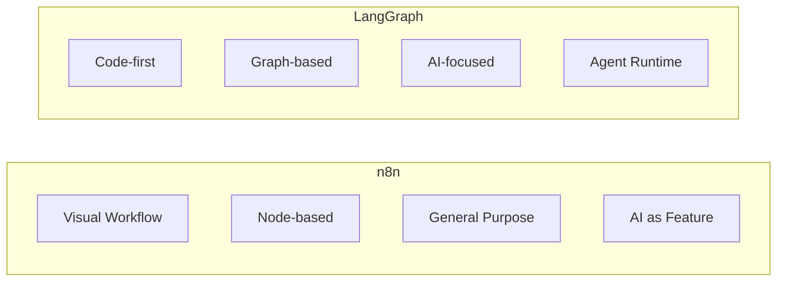
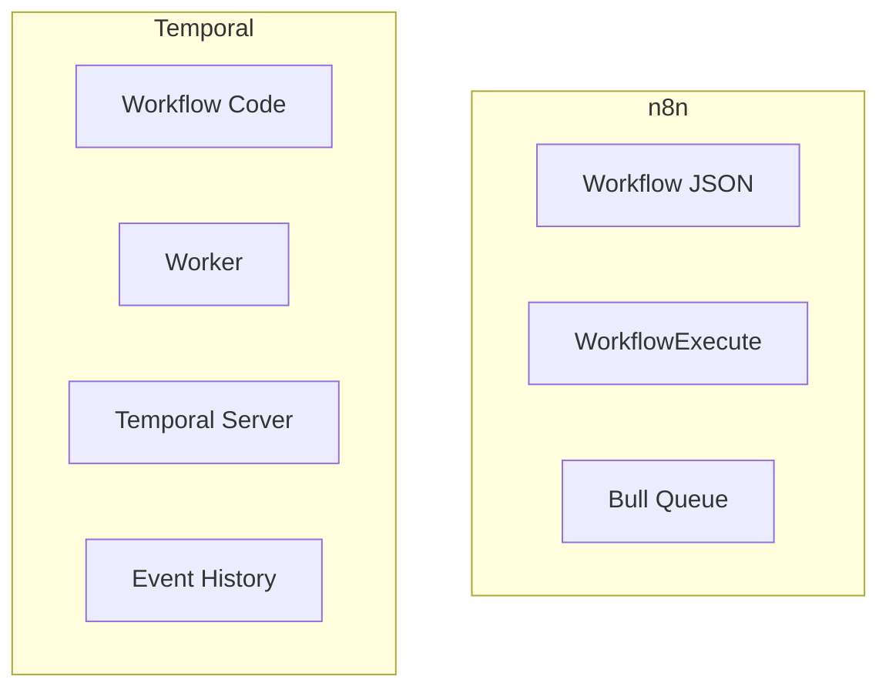

# Comparison với các Framework khác

## TL;DR
n8n so sánh với các workflow/agent frameworks khác: **Zapier** (SaaS competitor), **LangGraph** (AI agent framework), **Temporal** (workflow engine), **Airflow** (data pipelines). n8n unique ở visual programming + self-hosted + AI integration combination.

---

## Feature Comparison Matrix

| Feature | n8n | Zapier | LangGraph | Temporal | Airflow |
|---------|-----|--------|-----------|----------|---------|
| **Self-hosted** | ✅ | ❌ | ✅ | ✅ | ✅ |
| **Visual Editor** | ✅ | ✅ | ❌ | ❌ | ✅ |
| **AI/LLM Native** | ✅ | Limited | ✅ | ❌ | ❌ |
| **Code Nodes** | ✅ | Limited | ✅ | ✅ | ✅ |
| **Enterprise** | ✅ | ✅ | ❌ | ✅ | ✅ |
| **Open Source** | ✅ | ❌ | ✅ | ✅ | ✅ |
| **Horizontal Scale** | ✅ | ✅ | ❌ | ✅ | ✅ |
| **TypeScript** | ✅ | ❌ | ❌ (Python) | ✅ (Go) | ❌ (Python) |

---

## n8n vs Zapier

### Similarities
- Visual workflow builder
- Trigger-based execution
- 300+ integrations

### n8n Advantages
```
✅ Self-hosted (data privacy)
✅ Unlimited executions (no per-task pricing)
✅ Code nodes for custom logic
✅ AI/LangChain integration
✅ Open source, customizable
```

### Zapier Advantages
```
✅ More polished UX
✅ More pre-built integrations (5000+)
✅ No infrastructure management
✅ Better non-technical user experience
```

---

## n8n vs LangGraph

### Architecture Comparison



### Code Comparison

```python
# LangGraph - Python, code-centric
from langgraph.graph import StateGraph

graph = StateGraph(AgentState)
graph.add_node("research", research_node)
graph.add_node("write", write_node)
graph.add_edge("research", "write")

app = graph.compile()
result = app.invoke({"query": "..."})
```

```json
// n8n - Visual, JSON workflow
{
  "nodes": [
    { "name": "Research Agent", "type": "agent" },
    { "name": "Write Agent", "type": "agent" }
  ],
  "connections": {
    "Research Agent": { "main": [[{ "node": "Write Agent" }]] }
  }
}
```

### Use Case Fit

| Use Case | n8n | LangGraph |
|----------|-----|-----------|
| Business automation | ✅ Best | ❌ Overkill |
| Complex AI agents | ⚠️ Good | ✅ Best |
| Non-technical users | ✅ Best | ❌ Requires code |
| Custom AI research | ⚠️ Limited | ✅ Best |

---

## n8n vs Temporal

### Architecture Comparison



### Key Differences

| Aspect | n8n | Temporal |
|--------|-----|----------|
| **Definition** | JSON/Visual | Code (Go/Java/TS) |
| **State** | In-memory/DB | Event sourced |
| **Durability** | Basic retry | Strong guarantees |
| **Use Case** | Integration | Long-running processes |

### Temporal Code Example

```typescript
// Temporal - Code-defined workflows with strong durability
@workflow()
export async function orderWorkflow(orderId: string): Promise<void> {
  // Durable execution - survives crashes
  const payment = await activities.processPayment(orderId);

  // Waiting built-in
  await workflow.sleep('3 days');

  await activities.shipOrder(orderId);
}
```

---

## n8n vs Airflow

### Focus Comparison

```
n8n:     Integration & Automation workflows
Airflow: Data pipeline orchestration (ETL/ELT)
```

### DAG Comparison

```python
# Airflow - Python DAG
from airflow import DAG
from airflow.operators.python import PythonOperator

with DAG('etl_pipeline', schedule_interval='@daily') as dag:
    extract = PythonOperator(task_id='extract', python_callable=extract_data)
    transform = PythonOperator(task_id='transform', python_callable=transform_data)
    load = PythonOperator(task_id='load', python_callable=load_data)

    extract >> transform >> load
```

### Use Case Fit

| Use Case | n8n | Airflow |
|----------|-----|---------|
| API integrations | ✅ Best | ⚠️ Possible |
| Data pipelines | ⚠️ Possible | ✅ Best |
| Real-time triggers | ✅ Best | ❌ Batch-focused |
| ML workflows | ⚠️ Basic | ✅ With MLflow |

---

## When to Choose n8n

### Best For
1. **Business automation** - Connect apps, automate tasks
2. **AI-powered workflows** - LangChain integration built-in
3. **Self-hosted requirement** - Data privacy, compliance
4. **Mixed technical team** - Visual for some, code for others
5. **Rapid prototyping** - Quick to build and iterate

### Not Ideal For
1. **Pure data pipelines** - Use Airflow/Prefect
2. **Complex AI research** - Use LangGraph/DSPy
3. **Mission-critical durability** - Use Temporal
4. **Non-technical only teams** - Consider Zapier

---

## Architecture Insights from Comparison

| Learning | From | Apply To n8n-like Systems |
|----------|------|--------------------------|
| Event sourcing | Temporal | Better execution recovery |
| Graph compilation | LangGraph | Optimize execution paths |
| Operator abstraction | Airflow | Plugin standardization |
| Visual UX | Zapier | Better non-tech experience |

---

## Key Takeaways

1. **n8n's Sweet Spot**: Self-hosted, visual, AI-ready automation platform.

2. **Trade-offs**: Visual simplicity vs code flexibility, ease vs power.

3. **Complementary Tools**: n8n + Temporal for durability, n8n + Airflow for data.

4. **AI Differentiation**: n8n's LangChain integration unique among workflow tools.

5. **Open Source Advantage**: Customization và community ecosystem.
