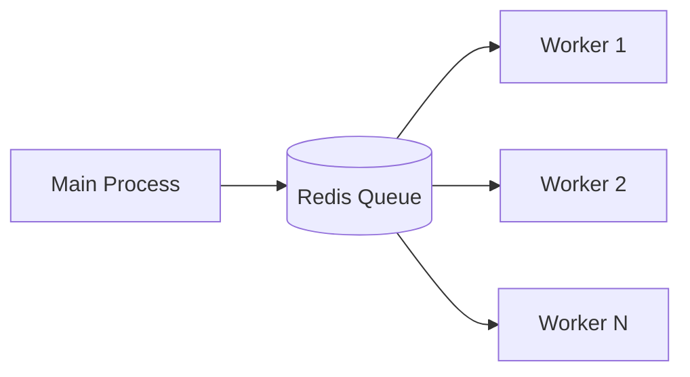

# Key Insights - n8n Architecture Analysis

## TL;DR
n8n là một workflow automation platform xuất sắc với kiến trúc monorepo clean, execution engine mạnh mẽ, và extensible node system. Key strengths: TypeScript full-stack, LangChain AI integration, horizontal scaling via queues. Lessons applicable cho building similar automation/agent systems.

---

## Top 10 Insights

### 1. Monorepo Done Right

```
packages/
├── workflow/     # Domain model (no deps)
├── core/         # Execution engine (deps: workflow)
├── cli/          # Server (deps: core, workflow, nodes)
├── nodes-base/   # Integrations (deps: workflow only)
└── frontend/     # UI (deps: api-types only)
```

**Lesson**: Clear dependency hierarchy prevents circular dependencies và enables independent development.

---

### 2. Node System = Plugin Architecture

```typescript
interface INodeType {
  description: INodeTypeDescription;  // Metadata
  execute?(this: IExecuteFunctions): Promise<INodeExecutionData[][]>;  // Logic
}
```

**Lesson**: Separating description from execution cho phép:
- UI generation từ metadata
- Version management
- Lazy loading
- Community extensions

---

### 3. Connection Types for AI

```typescript
// Beyond just 'main' connections
NodeConnectionTypes.AiLanguageModel
NodeConnectionTypes.AiTool
NodeConnectionTypes.AiMemory
NodeConnectionTypes.AiOutputParser
NodeConnectionTypes.AiVectorStore
```

**Lesson**: Typed connections ensure proper wiring và enable visual programming cho AI workflows.

---

### 4. Expression System Power

```typescript
// Expressions in any parameter
"{{ $json.name }}"
"{{ $('HTTP Request').item.json.data }}"
"{{ $now.toFormat('yyyy-MM-dd') }}"
```

**Lesson**: Powerful expression language makes workflows flexible without custom code nodes.

---

### 5. Multi-Input Node Handling

```typescript
// waitingExecution pattern
if (allInputsReady) {
  nodeExecutionStack.push(node);
  delete waitingExecution[node];
} else {
  waitingExecution[node][inputIndex] = data;
}
```

**Lesson**: Smart waiting mechanism cho phép Merge nodes và complex data flows.

---

### 6. Execution Context Injection

```typescript
// Node receives context as `this`
async execute(this: IExecuteFunctions) {
  const input = this.getInputData();
  const param = this.getNodeParameter('url', 0);
  const creds = await this.getCredentials('apiKey');
  await this.helpers.httpRequest({ /* ... */ });
}
```

**Lesson**: Context injection cho phép nodes access everything they need without global state.

---

### 7. Queue-Based Scaling



**Lesson**: Bull queue + Redis enables horizontal scaling với minimal code changes.

---

### 8. Declarative HTTP Nodes

```typescript
// No code needed - just config
{
  routing: {
    request: { method: 'POST', url: '/api/send' },
    send: { type: 'body', property: 'message' },
  }
}
```

**Lesson**: Declarative approach reduces boilerplate và errors for common patterns.

---

### 9. LangChain Integration Strategy

```typescript
// Wrap LangChain classes in nodes
// supplyData returns LangChain instance
async supplyData(): Promise<SupplyData> {
  const llm = new ChatOpenAI({ /* ... */ });
  return { response: llm };
}
```

**Lesson**: Thin wrapper over established library, không reinvent the wheel.

---

### 10. Error Handling Layers

```
Node Level: retry, continueOnFail
↓
Workflow Level: Error Trigger workflow
↓
Application Level: Error logging, metrics
```

**Lesson**: Multiple layers of error handling ensure resilience at every level.

---

## Architecture Principles

| Principle | n8n Implementation |
|-----------|-------------------|
| **Separation of Concerns** | workflow/core/cli layers |
| **Dependency Inversion** | DI container throughout |
| **Open/Closed** | Node plugin system |
| **Single Responsibility** | One node = one operation |
| **Interface Segregation** | IExecuteFunctions vs IPollFunctions |

---

## What n8n Does Well

1. **TypeScript Everywhere**: Full-stack type safety
2. **Visual Programming**: Drag-drop with code fallback
3. **Extensibility**: 300+ nodes, community packages
4. **AI-Ready**: First-class LangChain support
5. **Production-Ready**: Queue mode, error handling

---

## What Could Be Better

1. **Large Files**: Some files too monolithic
2. **Type Looseness**: IDataObject = any
3. **Storage**: JSON blobs limit querying
4. **Testing**: Some implicit dependencies

---

## File References

| Topic | Documentation |
|-------|---------------|
| Architecture | `01_overview/architecture.md` |
| Execution Engine | `02_agent_core/agent_class.md` |
| Memory System | `03_memory/memory_types.md` |
| Node System | `04_tool_system/tool_schema.md` |
| LLM Integration | `05_llm_integration/provider_abstraction.md` |
| Design Patterns | `07_patterns/design_patterns.md` |

---

## Key Takeaways

1. **Modular Architecture Wins**: Clear package boundaries enable team scaling.

2. **Plugin Systems Work**: Node architecture proves extensibility value.

3. **AI Integration Natural**: Typed connections make AI workflows intuitive.

4. **Expression Power**: Rich expression language reduces need for code.

5. **Scale-Ready Design**: Queue mode shows forethought for production needs.
