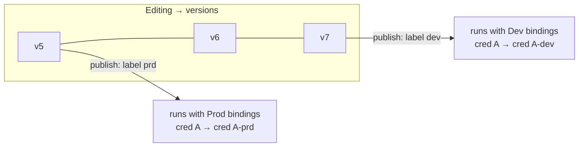

# Plan: Workflow Environments

## Context

Workflow teams need to promote the same workflow definition across dev/staging/prod environments without duplicating nodes. Only credentials differ per environment. Today n8n has a single active version per workflow globally; there is no concept of environment-scoped publication. This feature adds environments as a first-class project concept, lets each environment carry its own credential bindings, and lets each environment independently track which workflow version is published.

When a project has no environments the entire existing publication path is untouched.

---

## Example Flow



- The workflow is one definition shared across all environments — nodes are identical
- Versions are created as users edit (as today), then promoted to an environment by publishing
- Each environment tracks its own published version independently
- Credential bindings are configured per environment; publishing validates all bindings are in place

---

## Phase 1 — DB Schema

### New table: `project_environment`

```
id          varchar(36)  PK
projectId   varchar(36)  FK → project.id CASCADE
label       varchar(128) NOT NULL
color       varchar(32)  NOT NULL
sortOrder   int          DEFAULT 0
createdAt   datetime
updatedAt   datetime

UNIQUE (projectId, label)
INDEX  (projectId, sortOrder)
```

### New table: `environment_credential_binding`

```
id                 varchar(36)  PK
environmentId      varchar(36)  FK → project_environment.id CASCADE
sourceCredentialId varchar(36)  FK → credentials_entity.id CASCADE
targetCredentialId varchar(36)  FK → credentials_entity.id CASCADE
createdAt          datetime
updatedAt          datetime

UNIQUE (environmentId, sourceCredentialId)
INDEX  (environmentId)
```

The "source" credential is the canonical ID stored on the node (the credential used during development). The "target" credential is the env-specific concrete credential. At execution time the runtime swaps source → target transparently.

### New table: `workflow_environment_publication`

```
id                 int          PK autoincrement
workflowId         varchar(36)  FK → workflow_entity.id CASCADE
environmentId      varchar(36)  FK → project_environment.id CASCADE
publishedVersionId varchar(36)  FK → workflow_history.versionId RESTRICT
createdAt          datetime
updatedAt          datetime

UNIQUE (workflowId, environmentId)
```

Sits alongside (not replacing) the existing `workflow_published_version` table. The legacy single-slot table continues to serve the no-environments case.

### Modified table: `workflow_publication_outbox`

Add `environmentId varchar(36) nullable` — so the async publication applier knows which per-environment slot to advance.

**Migration files** (use pattern from `1764167920585-CreateWorkflowPublishHistoryTable.ts`):

- `packages/@n8n/db/src/migrations/common/1790000000001-CreateProjectEnvironmentTable.ts`
- `packages/@n8n/db/src/migrations/common/1790000000002-CreateEnvironmentCredentialBindingTable.ts`
- `packages/@n8n/db/src/migrations/common/1790000000003-CreateWorkflowEnvironmentPublicationTable.ts`
- `packages/@n8n/db/src/migrations/common/1790000000004-AddEnvironmentIdToWorkflowPublicationOutbox.ts`

Register each in `packages/@n8n/db/src/migrations/postgresdb/index.ts` and `sqlite/index.ts`.

---

## Phase 2 — TypeORM Entities

New files in `packages/@n8n/db/src/entities/`:

- `project-environment.ts` — extends `WithTimestampsAndStringId`; `@ManyToOne` → `Project`; `@OneToMany` → `EnvironmentCredentialBinding` and `WorkflowEnvironmentPublication`
- `environment-credential-binding.ts` — three `@ManyToOne` relations (environment, sourceCredential, targetCredential)
- `workflow-environment-publication.ts` — `PrimaryGeneratedColumn`; `@ManyToOne` → `WorkflowEntity`, `ProjectEnvironment`, `WorkflowHistory` (via `versionId`)

Export all from `packages/@n8n/db/src/entities/index.ts`.

---

## Phase 3 — Repositories

New files in `packages/@n8n/db/src/repositories/`:

**`project-environment.repository.ts`**
- `findAllByProject(projectId)` — ordered by `sortOrder`
- `reorder(projectId, orderedIds)` — batch update `sortOrder`

**`environment-credential-binding.repository.ts`**
- `upsertBinding(environmentId, sourceCredentialId, targetCredentialId)`
- `resolveTargetCredentialId(environmentId, sourceCredentialId): Promise<string | null>` — hot-path lookup used in execution
- `findAllByEnvironment(environmentId)`
- `deleteBinding(environmentId, sourceCredentialId)`

**`workflow-environment-publication.repository.ts`**
- `getPublishedVersionId(workflowId, environmentId)`
- `setPublishedVersion(workflowId, environmentId, versionId)` — upsert on `(workflowId, environmentId)`
- `removePublishedVersion(workflowId, environmentId)`
- `getPublishedVersionsForWorkflow(workflowId)` — for history panel display

---

## Phase 4 — Backend Services

### New: `ProjectEnvironmentService`
**File:** `packages/cli/src/services/project-environment.service.ts`

- CRUD on environments (guards: user must have `project:update` scope)
- Credential binding management — validates both source and target credentials belong to the same project before creating a binding
- Key method:
  ```ts
  validateEnvironmentBindingsForPublish(
    workflowId: string,
    environmentId: string,
    nodes: INode[],
  ): Promise<{ valid: boolean; missingBindings: Array<{ credentialId: string; credentialName: string }> }>
  ```
  Extracts all credential IDs from connected, enabled nodes and checks each has a binding in the target environment.

### Modified: `WorkflowService.activateWorkflow`
**File:** `packages/cli/src/workflows/workflow.service.ts`

Add optional `environmentId` param. When present:
1. Call `ProjectEnvironmentService.validateEnvironmentBindingsForPublish` — throw if any credential unmapped
2. Enqueue to outbox with `environmentId` set
3. Write to `workflow_environment_publication` (not `activeVersionId`)

Legacy path (no `environmentId`) is unchanged.

### Modified: `WorkflowPublicationApplier`
**File:** `packages/cli/src/workflows/publication/workflow-publication-applier.ts`

When outbox record has `environmentId`:
- Look up the old published version from `WorkflowEnvironmentPublicationRepository` instead of `WorkflowPublishedVersionRepository`
- After trigger reconciliation, advance `workflow_environment_publication` (not `workflow_published_version`)

### Modified: `CredentialsHelper.getCredentialsEntity`
**File:** `packages/cli/src/credentials-helper.ts`

After loading the canonical `CredentialsEntity` by node credential ID:

```ts
if (additionalData.environmentId) {
  const targetId = await environmentCredentialBindingRepository
    .resolveTargetCredentialId(additionalData.environmentId, credentialsEntity.id);
  if (targetId) {
    credentialsEntity = await this.credentialsRepository.findOneByOrFail({ id: targetId });
  }
}
```

All downstream decryption, overwrite, and dynamic-proxy layers operate on the target credential — no other changes needed in those layers.

### Modified: `IWorkflowExecuteAdditionalData`
**File:** `packages/workflow/src/interfaces.ts` (~line 3320)

Add `environmentId?: string`. Populated by `getBase()` in `workflow-execute-additional-data.ts`, which receives it from:
- The trigger activator (reads `environmentId` from the publication outbox row) for trigger-based executions
- The manual execution API request query param for test runs

---

## Phase 5 — REST API

### New controller: `ProjectEnvironmentController`
**File:** `packages/cli/src/controllers/project-environment.controller.ts`

`@RestController('/projects/:projectId/environments')`

| Method | Path | Auth | Purpose |
|--------|------|------|---------|
| GET | `/` | project:read | List environments (ordered) |
| POST | `/` | project:update | Create environment |
| PATCH | `/:envId` | project:update | Update label / color / sortOrder |
| DELETE | `/:envId` | project:update | Delete environment |
| GET | `/:envId/credential-bindings` | project:read | List bindings for environment |
| PUT | `/:envId/credential-bindings` | project:update | Full-replace bindings for environment |

### Modified: `ActivateWorkflowDto`
**File:** `packages/@n8n/api-types/src/dto/workflows/activate-workflow.dto.ts`

Add `environmentId: z.string().optional()`

### New endpoint
`GET /workflows/:id/environments` — returns all environments for the workflow's project, each enriched with `publishedVersionId` and `credentialBindingStatus: 'complete' | 'incomplete' | 'not-configured'`. Consumed by the frontend publish modal.

### New DTO / schema types in `packages/@n8n/api-types`
- `src/dto/environments/create-environment.dto.ts`
- `src/dto/environments/update-environment.dto.ts`
- `src/schemas/project-environment.schema.ts`

---

## Phase 6 — Frontend

### New API module
**File:** `packages/frontend/@n8n/rest-api-client/src/api/projectEnvironments.ts`

Wrappers for all environment endpoints above.

### New Pinia store
**File:** `packages/frontend/editor-ui/src/features/environments/environments.store.ts`

- State: `environments: ProjectEnvironment[]`, `credentialBindings: Record<string, EnvironmentCredentialBinding[]>`
- Actions: fetch/create/update/delete environments, fetch/save bindings

### New settings components
**Dir:** `packages/frontend/editor-ui/src/features/environments/components/`

- `EnvironmentList.vue` — CRUD list with drag-to-reorder per project
- `EnvironmentCredentialBindings.vue` — maps canonical credential → env-specific credential (select from project credential list)
- `EnvironmentColorPicker.vue` — color chip selector

Entry point: new "Environments" tab in the existing project settings page.

### Modified: `WorkflowPublishModal.vue`
**File:** `packages/frontend/editor-ui/src/app/components/MainHeader/WorkflowPublishModal.vue`

When the project has environments, render an environment picker with per-environment status indicators:
- **Green** — published, up-to-date with current version
- **Yellow** — published, but a newer version exists
- **Orange** — credential bindings missing; publish button disabled, deep-link to project settings shown
- **Grey** — never published to this environment

When no environments exist, the modal renders exactly as today.

### Modified: `WorkflowHeaderDraftPublishActions.vue`
**File:** `packages/frontend/editor-ui/src/app/components/MainHeader/WorkflowHeaderDraftPublishActions.vue`

When environments exist, the header badge aggregates multi-environment state (e.g., "2/3 environments current").

### New: Manual execution environment selector
A small dropdown before the "Execute" button on the canvas. Lets users choose which environment's credential bindings apply to a manual test run. Defaults to no environment (uses canonical credentials). Only shown when the project has environments.

---

## Credential Resolution — Full Execution Trace

For a trigger-fired execution in environment "prod":

```
1. Trigger fires → WorkflowTriggerActivator.activate
   └─ has environmentId from workflow_environment_publication row

2. getBase({ workflowId, projectId, environmentId: 'prod-env-id' })
   └─ IWorkflowExecuteAdditionalData.environmentId = 'prod-env-id'

3. For each node: CredentialsHelper.getDecrypted(additionalData, nodeCredentials, type)
   └─ loads canonical CredentialsEntity by nodeCredentials.id

4. NEW: if (additionalData.environmentId)
   └─ resolveTargetCredentialId('prod-env-id', canonicalCredId) → 'prod-cred-id'
   └─ reloads CredentialsEntity for 'prod-cred-id'

5. Decryption, applyOverwrite, dynamicCredentialsProxy — unchanged, operate on target

6. Decrypted prod-specific credential data returned to node
```

If a credential has no environment binding, the canonical credential is used as fallback — this is safe for manual testing without a selected environment.

---

## Backward Compatibility

**Invariant:** when `project_environment` has zero rows for a project, every existing code path is unchanged.

| Touchpoint | No-env behaviour |
|-----------|-----------------|
| `activateWorkflow(workflowId, versionId)` | No `environmentId` → legacy path, writes `activeVersionId`, advances `workflow_published_version` |
| `CredentialsHelper.getCredentialsEntity` | No `additionalData.environmentId` → skips binding lookup (zero extra DB calls) |
| Frontend publish modal | `environments.length === 0` → today's layout exactly |
| DB migrations | Three new tables are additive; no existing columns altered |

---

## Verification

### Unit tests

| File | Covers |
|------|--------|
| `project-environment.repository.test.ts` | CRUD, ordering, unique constraint on (projectId, label) |
| `environment-credential-binding.repository.test.ts` | upsert, resolveTargetCredentialId (hit and miss) |
| `workflow-environment-publication.repository.test.ts` | upsert, getPublishedVersionsForWorkflow |
| `project-environment.service.test.ts` | validateEnvironmentBindingsForPublish — missing / complete bindings |
| `credentials-helper.environment.test.ts` | getCredentialsEntity with / without environmentId |

### Integration tests

| File | Covers |
|------|--------|
| `activate-with-environment.test.ts` | publish → execution → credential swap full cycle (sqlite) |
| `project-environment.controller.test.ts` | create env, bind, attempt publish with missing binding (expect 400), complete binding, publish succeeds |

### Manual checklist

1. Create project → add "dev" and "prod" environments
2. Add workflow with a node using credential A
3. Bind A → A-dev in dev env; bind A → A-prd in prod env
4. Publish to dev → verify dev trigger registers; prod trigger absent
5. Publish to prod → both triggers active independently
6. Execute in prod → confirm A-prd's values appear in execution log
7. Unpublish from prod → prod trigger removed; dev trigger still active
8. Delete prod environment → `workflow_environment_publication` row cascade-deleted; no orphaned trigger
9. Attempt publish with unbound credential → 400 with list of missing bindings
10. Open existing project (no environments) → publish modal, header button, and execution flow all unchanged
