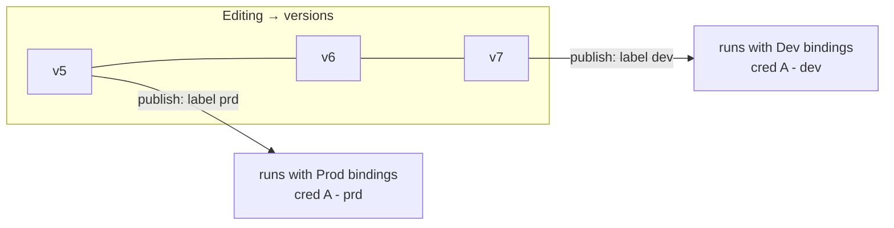

In n8n, a workflow can either be published or not published.
It's always one version of a workflow that is published.
n8n users have the need to have different published versions per environment.
The "nodes of a workflow" remain the same per environment, only credentials change per environment.
Which environments exist, is always defined per project (a project is a collection of workflows and has a set of assigned users).

An environment can have an ID and a label (and a colour).

Users hould be able to switch to an environment they are currently editing at the top of the canvas

Come up with a plan to build this new feature.

**Aims**

- A project should have “environments” built in - environments enable different credentials to be bound to a single workflow
- The workflow is the same (each node is identical) no matter  which environment you are in “one workflow to rule them all”
- A workflow has many versions and you select a version to “promote to another environment”. When you are developing locally new versions are “created”
- When there are no environments defined in a project, keep the publishing logic that exists today.
- When you publish a version in an environment n8n checks if all required (because referenced in nodes) credentials are defined for that version in that environment before publishing it.

**Example flow chart:**

**A good output here would be**

- A project with two or three environments (dev/stg/prd), each carrying its own credentials.
- Editing the workflow produces versions (as is today), publishing a version to an environment labels it, and it then runs with that environment's bindings.
- A credential that differs per environment.
- The labels moving independently — dev published at a later version than prd and publish blocked if the target environment's bindings don't resolve a node's credential.
- How might you configure a credential with multiple envs