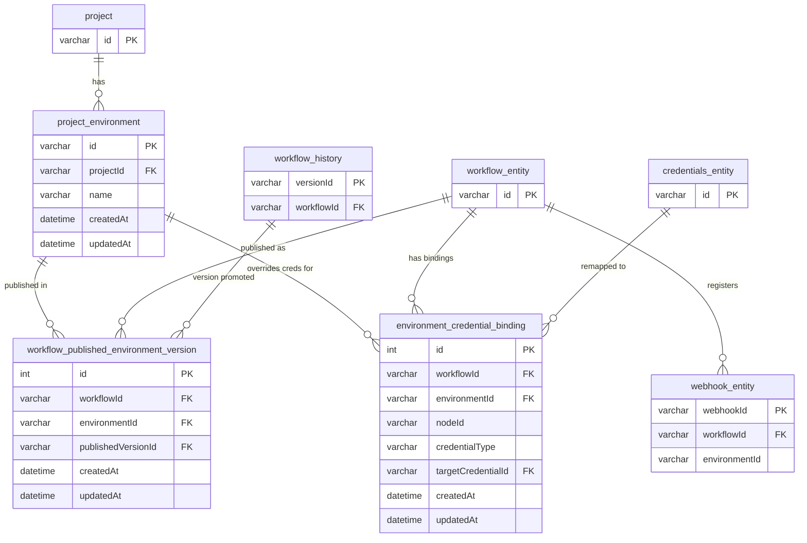

# Single-Instance Promotion — Prototype

## Webhook URL Behaviour

### Globally activated workflow (no environment publishing)

Webhooks use the standard n8n path with no prefix:

```
POST /webhook/{path}
POST /webhook/{uuid}/{path}        # dynamic paths
```

The workflow's `activeVersionId` snapshot is loaded on each call.

### Environment-published workflow

When a workflow is published to a named environment (e.g. **"Production"**, **"Staging"**), its webhooks are registered under an environment slug prefix:

```
POST /webhook/{env-slug}/{path}
```

The slug is derived from the environment name: lowercased, spaces replaced by hyphens.

| Environment name | Slug     | Webhook URL                        |
|------------------|----------|------------------------------------|
| Production       | production | `/webhook/production/{path}`     |
| Staging Env      | staging-env | `/webhook/staging-env/{path}`   |

The `WorkflowHistory` snapshot pinned for that environment is loaded on each call, so credential bindings are always environment-specific.

### Coexistence

A workflow can be globally activated **and** env-published simultaneously:

- `POST /webhook/{path}` → runs the global `activeVersion` snapshot
- `POST /webhook/production/{path}` → runs the environment-pinned snapshot

If a workflow has env-published versions, the global webhook path is **suppressed** and only the env-prefixed URLs are registered.

### Known limitations

- Dynamic webhook paths (`:param` segments) are not yet supported for env-published webhooks — the path-segment routing assumes a flat `{env-slug}/{static-path}` structure.
- Multi-main: env webhook activation bypasses the leader-only PubSub path; multi-main compatibility is a follow-up.
- Deactivation cleanup: `clearWebhooks()` removes all webhooks for a workflow regardless of prefix; scoped cleanup on unpublish is a follow-up.

## Database schema

### Changes introduced by the prototype

#### `project_environment`

A new table scoped to a project that models a named deployment environment (e.g. "development", "staging", "production").

| Column | Type | Notes |
|---|---|---|
| `id` | varchar(36) | PK |
| `projectId` | varchar(36) | FK → `project.id` (CASCADE DELETE) |
| `name` | varchar(255) | e.g. "production" |
| `createdAt` / `updatedAt` | timestamps | |

Index on `projectId`. Deleting a project cascades and removes all its environments.

---

#### `workflow_published_environment_version`

Tracks which **workflow history version** is currently active (promoted) in a given environment. A workflow can be published to multiple environments, but only one version per environment at a time (unique constraint on `workflowId + environmentId`).

| Column | Type | Notes |
|---|---|---|
| `id` | int (auto) | PK |
| `workflowId` | varchar(36) | FK → `workflow_entity.id` (CASCADE DELETE) |
| `environmentId` | varchar(36) | FK → `project_environment.id` (CASCADE DELETE) |
| `publishedVersionId` | varchar(36) | FK → `workflow_history.versionId` (**RESTRICT** DELETE) |
| `createdAt` / `updatedAt` | timestamps | |

The `RESTRICT` on `publishedVersionId` prevents deleting a workflow history version that is actively published to an environment — a safety guard against orphaned promotions.

---

#### `environment_credential_binding`

Allows a specific workflow node's credential slot to be **remapped per environment**. Instead of a workflow always using the same credential, this table says "in environment X, node Y should use credential Z". A unique index on `(workflowId, environmentId, nodeId, credentialType)` enforces one binding per slot per environment.

| Column | Type | Notes |
|---|---|---|
| `id` | int (auto) | PK |
| `workflowId` | varchar(36) | FK → `workflow_entity.id` (CASCADE DELETE) |
| `environmentId` | varchar(36) | FK → `project_environment.id` (CASCADE DELETE) |
| `nodeId` | varchar(36) | Identifies the node within the workflow |
| `credentialType` | varchar(255) | The credential type slot on the node |
| `targetCredentialId` | varchar(36) | FK → `credentials_entity.id` (CASCADE DELETE) |
| `createdAt` / `updatedAt` | timestamps | |

---

#### `environmentId` on `webhook_entity`

Adds a nullable `environmentId` (varchar 36) column to the existing `webhook_entity` table. This associates a registered webhook with a specific environment, so the same workflow's webhooks can be active independently per environment.

---

### Entity-Relationship Diagram



### Summary of the design intent
The prototype introduces a lightweight promotion model within a single n8n instance:

1. A project can have multiple named environments.
2. A specific version of a workflow (from workflow_history) can be promoted/published into an environment. Theoretically independent of the "live" workflow version, but our service logic will prevent publishing environment-scoped versions and non-environment versions.
3. Each environment can override which credentials individual workflow nodes use, enabling e.g. dev credentials in staging and prod credentials in production without duplicating workflows.
4. Webhooks are stamped with an environmentId so the same workflow's webhooks can be independently active per environment.