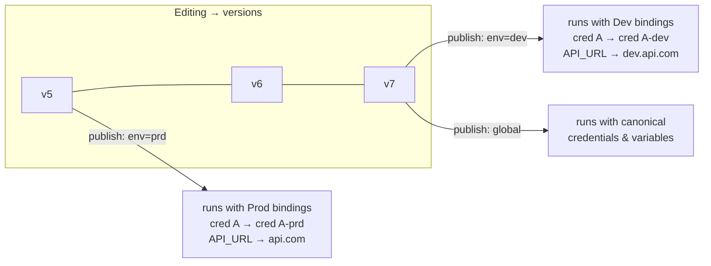

# Plan: Workflow Environments — Credentials, Variables & Data Tables

## Context

n8n teams today deploy separate n8n instances for dev/staging/prod. This feature replaces multi-instance deployments with a single n8n instance where each project can define named **environments** (e.g. dev, stg, prd). Each environment carries its own credential bindings, variable value overrides, and data table bindings — so the same workflow definition runs with different resource sets depending on which environment's publication triggered it.

**Key decisions:**
- Environments are **opt-in per workflow** — even in a project with environments, a workflow can be published globally (no environment) using the existing publish path
- License gate: **Enterprise only**
- Scope: **prototype** — validate UX and data model, not full production-ready
- Data tables: **deferred** pending confirmation that `packages/cli/src/modules/data-table/` is stable
- Webhook URL disambiguation: **environment-scoped path prefix**

**Correction from earlier planning:** `Variables` entity (`packages/@n8n/db/src/entities/variables.ts`) has `project: Project | null` — null = global variable, non-null = project-scoped variable. Variables ARE project-scopeable. The FK `variableId → variables.id` and "variable must belong to the same project" guard in `ProjectEnvironmentService` are both valid and enforceable.



---

## Publication Model

| Scenario | What happens |
|---|---|
| Project has no environments | Publish flow unchanged — writes `activeVersionId` / `workflow_published_version` |
| Project has environments, workflow published globally | Same legacy path — no resource swapping |
| Project has environments, workflow published to env X | New env path — swaps credentials, applies variable overrides, remaps data tables for env X |

A workflow can have a global publication AND per-environment publications simultaneously. Each slot registers independent triggers.

---

## Phase 1 — DB Schema

### New table: `project_environment`

```
id          varchar(36)  PK
projectId   varchar(36)  FK → project.id CASCADE
label       varchar(128) NOT NULL
color       varchar(32)  NOT NULL
sortOrder   int          DEFAULT 0
createdAt   datetime
updatedAt   datetime

UNIQUE (projectId, label)
INDEX  (projectId, sortOrder)
```

### New table: `environment_credential_binding`

Maps a canonical (dev) credential to an env-specific credential. At execution time the runtime transparently swaps source → target.

```
id                 varchar(36)  PK
environmentId      varchar(36)  FK → project_environment.id CASCADE
sourceCredentialId varchar(36)  FK → credentials_entity.id CASCADE
targetCredentialId varchar(36)  FK → credentials_entity.id CASCADE
createdAt          datetime
updatedAt          datetime

UNIQUE (environmentId, sourceCredentialId)
INDEX  (environmentId)
```

### New table: `environment_variable_override`

Overrides the value of a project-scoped variable for a specific environment. The key stays the same in expressions (`$vars.API_URL`); only the resolved value changes.

```
id             varchar(36)   PK
environmentId  varchar(36)   FK → project_environment.id CASCADE
variableId     varchar(36)   FK → variables.id CASCADE
overrideValue  text          NOT NULL
createdAt      datetime
updatedAt      datetime

UNIQUE (environmentId, variableId)
INDEX  (environmentId)
```

> **Variable scoping rule:** Only project-scoped variables (`variables.project.id === environment.project.id`) may be overridden. Global variables (`project = null`) are instance-wide defaults and cannot be environment-overridden per project.

### New table: `workflow_environment_publication`

Tracks which workflow version is published per (workflow × environment) slot. Sits alongside (not replacing) `workflow_published_version`.

```
id                 int          PK autoincrement
workflowId         varchar(36)  FK → workflow_entity.id CASCADE
environmentId      varchar(36)  FK → project_environment.id CASCADE
publishedVersionId varchar(36)  (FK to workflow_history.versionId enforced via RESTRICT in migration)
createdAt          datetime
updatedAt          datetime

UNIQUE (workflowId, environmentId)
```

### Modified table: `workflow_publication_outbox`

Add `environmentId varchar(36) nullable` so the async publication applier knows which per-environment slot to advance.

### Migration files

Pattern: `1764167920585-CreateWorkflowPublishHistoryTable.ts`

```
packages/@n8n/db/src/migrations/common/
  1790000000001-CreateProjectEnvironmentTable.ts
  1790000000002-CreateEnvironmentCredentialBindingTable.ts
  1790000000003-CreateEnvironmentVariableOverrideTable.ts
  1790000000004-CreateWorkflowEnvironmentPublicationTable.ts
  1790000000005-AddEnvironmentIdToWorkflowPublicationOutbox.ts
```

Register each in `postgresdb/index.ts` and `sqlite/index.ts`.

---

## Phase 2 — TypeORM Entities

New files in `packages/@n8n/db/src/entities/`:

- **`project-environment.ts`** — extends `WithTimestampsAndStringId`; `@ManyToOne` → `Project`; `@OneToMany` → `EnvironmentCredentialBinding`, `EnvironmentVariableOverride`, `WorkflowEnvironmentPublication`
- **`environment-credential-binding.ts`** — `@ManyToOne` → `ProjectEnvironment`, `sourceCredential: CredentialsEntity`, `targetCredential: CredentialsEntity`
- **`environment-variable-override.ts`** — `@ManyToOne` → `ProjectEnvironment`, `variable: Variables`
- **`workflow-environment-publication.ts`** — `PrimaryGeneratedColumn`; `@ManyToOne` → `WorkflowEntity`, `ProjectEnvironment`; `publishedVersionId` as a plain `varchar` column (RESTRICT FK via migration, not TypeORM decorator)

Export all from `packages/@n8n/db/src/entities/index.ts`.

---

## Phase 3 — Repositories

**`project-environment.repository.ts`**
- `findAllByProject(projectId)` — ordered by `sortOrder`
- `reorder(projectId, orderedIds)` — batch update `sortOrder`

**`environment-credential-binding.repository.ts`**
- `upsertBinding(environmentId, sourceCredentialId, targetCredentialId)`
- `resolveTargetCredentialId(environmentId, sourceCredentialId): Promise<string | null>` — hot-path
- `findAllByEnvironment(environmentId)`
- `deleteBinding(environmentId, sourceCredentialId)`

**`environment-variable-override.repository.ts`**
- `upsertOverride(environmentId, variableId, overrideValue)`
- `resolveOverridesForExecution(environmentId): Promise<Record<string, string>>` — returns `{ [key]: overrideValue }` map
- `findAllByEnvironment(environmentId)`
- `deleteOverride(environmentId, variableId)`

**`workflow-environment-publication.repository.ts`**
- `getPublishedVersionId(workflowId, environmentId)`
- `setPublishedVersion(workflowId, environmentId, versionId)` — upsert on `(workflowId, environmentId)`
- `removePublishedVersion(workflowId, environmentId)`
- `getPublishedVersionsForWorkflow(workflowId)` — for history panel display

---

## Phase 4 — Backend Services

### New: `ProjectEnvironmentService`
**File:** `packages/cli/src/services/project-environment.service.ts`

- CRUD on environments (requires `project:update` scope + Enterprise license check)
- Credential binding management — validates both credentials belong to the same project
- Variable override management — validates `variable.project?.id === environment.project.id`
- Key publish-gate method:
  ```ts
  validateEnvironmentBindingsForPublish(
    workflowId: string,
    environmentId: string,
    nodes: INode[],
  ): Promise<{ valid: boolean; missingBindings: Array<{ credentialId: string; credentialName: string }> }>
  ```
  Extracts all credential IDs from connected, enabled nodes; checks each has a binding in the target environment.

### Modified: `WorkflowService.activateWorkflow`
**File:** `packages/cli/src/workflows/workflow.service.ts`

Add optional `environmentId` param. When present:
1. Call `validateEnvironmentBindingsForPublish` — throw 400 if any credential unmapped
2. Enqueue to outbox with `environmentId` set
3. Write to `workflow_environment_publication`

Legacy path (no `environmentId`) is unchanged.

### Modified: `WorkflowPublicationApplier`
**File:** `packages/cli/src/workflows/publication/workflow-publication-applier.ts`

When outbox record has `environmentId`:
- Look up old published version from `WorkflowEnvironmentPublicationRepository` (not `WorkflowPublishedVersionRepository`)
- After trigger reconciliation, advance `workflow_environment_publication`

**Trigger identity note:** `ActiveWorkflowManager` currently uses `workflowId` as the tracking key. With per-environment publications the same workflow can have multiple active trigger registrations. Needs a `(workflowId, environmentId)` composite key to support per-environment deactivation without touching global publications.

### Modified: `CredentialsHelper.getCredentialsEntity`
**File:** `packages/cli/src/credentials-helper.ts`

```ts
if (additionalData.environmentId) {
  const targetId = await environmentCredentialBindingRepository
    .resolveTargetCredentialId(additionalData.environmentId, credentialsEntity.id);
  if (targetId) {
    credentialsEntity = await this.credentialsRepository.findOneByOrFail({ id: targetId });
  }
}
```

All downstream decryption and overwrite layers operate on the target credential unchanged.

### Modified: `WorkflowHelpers.getVariables`
**File:** `packages/cli/src/workflow-helpers.ts`

Add optional `environmentId` param. When provided, merge variable overrides on top of resolved project variables:

```ts
const variables = await getVariables(workflowId, projectId); // existing
if (environmentId) {
  const overrides = await environmentVariableOverrideRepository
    .resolveOverridesForExecution(environmentId);
  Object.assign(variables, overrides); // override values by key
}
```

### Modified: `IWorkflowExecuteAdditionalData`
**File:** `packages/workflow/src/interfaces.ts`

Add `environmentId?: string`. Populated by `getBase()` in `workflow-execute-additional-data.ts`, which receives it from:
- The trigger activator (reads `environmentId` from the publication row) for trigger-based executions
- The inbound webhook path (parsed from URL segment) for webhook-triggered executions
- The manual execution API request query param for test runs

### Webhook URL disambiguation

**Design (confirmed):** Environment-scoped path prefix.

```
Global:   POST /webhook/{webhook-path}
Dev env:  POST /webhook/{dev-env-id}/{webhook-path}
Prod env: POST /webhook/{prod-env-id}/{webhook-path}
```

**Changes in `WebhookService`:**
- When activating a per-environment publication, register the webhook with `/{environmentId}/{path}` as the path key
- On inbound requests: if the path starts with a segment matching a known `environmentId`, extract it and resolve the remaining path to find the registered webhook
- Pass the resolved `environmentId` into `getBase()`

**Frontend:** When displaying a webhook node's URL in an environment context, show the env-prefixed URL. Global publication shows the unmodified URL as today.

### Environment deletion → trigger deregistration

When an environment is deleted:
1. Before cascade, look up all `workflow_environment_publication` rows for that environment
2. For each, call trigger deactivation (equivalent to `ActiveWorkflowManager.remove(workflowId, environmentId)`) to stop webhook registrations and polling timers
3. Let the DB cascade remove the rows

---

## Phase 5 — REST API

### New controller: `ProjectEnvironmentController`
**File:** `packages/cli/src/controllers/project-environment.controller.ts`

`@RestController('/projects/:projectId/environments')`  
All endpoints require Enterprise license check.

| Method | Path | Auth | Purpose |
|--------|------|------|---------|
| GET | `/` | project:read | List environments ordered by sortOrder |
| POST | `/` | project:update | Create environment |
| PATCH | `/:envId` | project:update | Update label / color / sortOrder |
| DELETE | `/:envId` | project:update | Delete environment + deactivate its triggers |
| GET | `/:envId/credential-bindings` | project:read | List credential bindings |
| PUT | `/:envId/credential-bindings` | project:update | Full-replace credential bindings |
| GET | `/:envId/variable-overrides` | project:read | List variable overrides |
| PUT | `/:envId/variable-overrides` | project:update | Full-replace variable overrides |

### Modified: `ActivateWorkflowDto`
**File:** `packages/@n8n/api-types/src/dto/workflows/activate-workflow.dto.ts`

Add `environmentId: z.string().optional()`

### New endpoint: workflow environment status
`GET /workflows/:id/environments`

Returns all environments for the workflow's project, enriched per slot:
- `publishedVersionId: string | null`
- `credentialBindingStatus: 'complete' | 'incomplete' | 'not-configured'`
- `variableOverrideCount: number` (informational — never blocks publish)
- `globalPublication: { publishedVersionId: string; publishedAt: string } | null`

### New DTO / schema types in `packages/@n8n/api-types`
- `src/dto/environments/create-environment.dto.ts`
- `src/dto/environments/update-environment.dto.ts`
- `src/dto/environments/upsert-credential-bindings.dto.ts`
- `src/dto/environments/upsert-variable-overrides.dto.ts`
- `src/schemas/project-environment.schema.ts`

---

## Phase 6 — Frontend

### New API module
**File:** `packages/frontend/@n8n/rest-api-client/src/api/projectEnvironments.ts`

Wrappers for all environment endpoints above.

### New Pinia store
**File:** `packages/frontend/editor-ui/src/features/environments/environments.store.ts`

State: `environments: ProjectEnvironment[]`, `credentialBindings: Record<envId, EnvironmentCredentialBinding[]>`, `variableOverrides: Record<envId, VariableOverride[]>`

### New project settings components
**Dir:** `packages/frontend/editor-ui/src/features/environments/components/`

- **`EnvironmentList.vue`** — CRUD list with drag-to-reorder; hidden for non-Enterprise
- **`EnvironmentBindings.vue`** — three sections: credential bindings (source → target select), variable overrides (inline value override field per project variable; empty = use project default), data table bindings (deferred)
- **`EnvironmentColorPicker.vue`** — color chip selector

Entry point: new "Environments" tab in project settings. Tab hidden for non-Enterprise.

### Modified: Publish modal

When the project has environments and the user is on an Enterprise plan:

1. **"Publish globally"** — always present, uses existing publish behaviour
2. **Per-environment slots** — each shows:
   - Credential binding status (orange badge = missing, blocks the publish button for that env)
   - Variable override count (info badge — never blocks)
   - Currently published version + freshness (green = current, yellow = stale, grey = never published)

When no environments exist or on a non-Enterprise plan: modal renders exactly as today.

### Modified: Workflow header badge
**File:** `packages/frontend/editor-ui/src/app/components/MainHeader/WorkflowHeaderDraftPublishActions.vue`

When environments exist, aggregates state: e.g. "Global + 2/3 envs current"

### Canvas manual execution environment selector

Small dropdown before the "Execute" button. Options: "No environment (global)" as default + each configured environment. Only shown for Enterprise projects that have environments. Defaults to "No environment" (canonical credentials and variables).

---

## Execution Trace — Trigger-Fired in Env "prod"

```
1. Trigger fires → WorkflowTriggerActivator.activate
   └─ environmentId from workflow_environment_publication row

2. getBase({ workflowId, projectId, environmentId: 'prod-env-id' })

3a. getVariables(workflowId, projectId, 'prod-env-id')
    └─ project variables → merge prod overrides by key → freeze
    └─ additionalData.variables = { API_URL: 'api.com', ... }

3b. CredentialsHelper.getCredentialsEntity
    └─ resolveTargetCredentialId('prod-env-id', canonicalCredId) → 'prod-cred-id'
    └─ loads prod-specific credential

4. Execution runs with prod credentials and prod variable values
```

## Execution Trace — Inbound Webhook in Env "prod"

```
1. POST /webhook/{prod-env-id}/my-path arrives
2. WebhookService parses {prod-env-id} prefix → resolves remaining path 'my-path'
3. Finds registered webhook for (workflowId, path='my-path', environmentId='prod-env-id')
4. getBase({ workflowId, projectId, environmentId: 'prod-env-id' })
5. Same credential/variable resolution as trigger-fired path above
```

---

## Backward Compatibility

| Touchpoint | No-env / non-Enterprise behaviour |
|---|---|
| `activateWorkflow` without `environmentId` | Legacy path, writes `activeVersionId` / `workflow_published_version` |
| `CredentialsHelper.getCredentialsEntity` | No `environmentId` → zero extra DB calls |
| `getVariables` | No `environmentId` → no override lookup, zero extra DB calls |
| Webhook dispatch | No env prefix in path → existing lookup unchanged |
| Frontend publish modal | No environments or non-Enterprise → today's layout exactly |
| DB migrations | All new tables are additive; no existing columns altered |

---

## Open Items (resolve during implementation)

1. **`ActiveWorkflowManager` identity model** — confirm how to extend tracking to `(workflowId, environmentId)` pairs without breaking the existing `workflowId`-only global path
2. **Outbox concurrency** — confirm the publication applier can process concurrent outbox rows for the same `workflowId` but different `environmentId` values safely
3. **Global variable overrides** — decide whether environment overrides apply only to project-scoped variables or also to global (`project = null`) variables
4. **Version selection UX** — prototype publishes "current latest version"; a version-history picker can be deferred to a later iteration
5. **Data tables** — verify `packages/cli/src/modules/data-table/` stability, then add `environment_data_table_binding` table and bindings following the same credential binding pattern

---

## Verification Checklist

1. Create project → add "dev" and "prod" environments (Enterprise instance only)
2. Add workflow with a node using credential A and variable `API_URL`
3. Bind A → A-dev; override `API_URL` → `dev.api.com` in dev env
4. Bind A → A-prd; override `API_URL` → `api.com` in prod env
5. Publish to dev → verify dev trigger registers at `/webhook/{dev-env-id}/path`
6. Publish to prod → verify prod trigger registers at `/webhook/{prod-env-id}/path`
7. POST to `/webhook/{prod-env-id}/path` → execution uses A-prd credential and `api.com` variable value
8. Publish globally → third trigger at `/webhook/path` uses canonical credentials and variables
9. Delete prod env → prod trigger deregistered; dev and global still active
10. Attempt publish to dev with unbound credential → 400 with list of missing bindings
11. Open project on non-Enterprise instance → environments tab hidden, publish modal unchanged
12. Open existing project with no environments → publish modal and header unchanged
