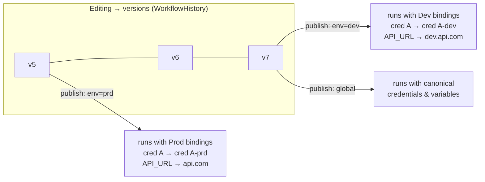

# Plan: Workflow Environments — Credentials, Variables & Data Tables

## Context

n8n teams today deploy separate n8n instances for dev/staging/prod. This feature replaces multi-instance deployments with a single n8n instance where each project can define named **environments** (e.g. dev, stg, prd). Each environment carries its own credential bindings and variable value overrides — so the same workflow definition runs with different resource sets depending on which environment's publication triggered it.

**Key decisions:**
- Environments are **opt-in per workflow** — even in a project with environments, a workflow can be published globally (no environment) using the existing publish path
- License gate: **Enterprise only**
- Scope: **prototype** — validate UX and data model, not full production-ready
- Data tables: **deferred** pending confirmation that `packages/cli/src/modules/data-table/` is stable

**Note on publishing setup:** `N8N_USE_WORKFLOW_PUBLICATION_SERVICE` is **not enabled**. The active publishing path is the direct one:
- Activation sets `workflow_entity.activeVersionId` (+ `active = true`) directly
- `ActiveWorkflowManager.add()` reads `workflow_entity.activeVersion` (a join to `WorkflowHistory`) to get the nodes/connections to register
- `workflow_published_version` table does **not exist** in this setup — it is only created/used when the outbox service flag is on

**Note:** `Variables` entity (`packages/@n8n/db/src/entities/variables.ts`) has `project: Project | null` — null = global variable, non-null = project-scoped variable. Variables ARE project-scopeable; only project-scoped variables are meaningful targets for per-environment value overrides.



---

## Publication Model

| Scenario | What happens |
|---|---|
| Project has no environments | Publish flow unchanged — sets `workflow_entity.activeVersionId`, calls `ActiveWorkflowManager.add()` |
| Project has environments, workflow published globally | Same legacy path — no resource swapping |
| Project has environments, workflow published to env X | New env path — additionally writes `workflow_published_environment_version` row; swaps credentials and applies variable overrides for env X at execution time |

A workflow can have a global publication AND per-environment publications simultaneously. In Phase 1 (prototype), `ActiveWorkflowManager` does not distinguish environments — full multi-env trigger isolation is Phase 2.

---

## Phase 1 — DB Schema

### New table: `project_environment`

```
id          varchar(36)  PK
projectId   varchar(36)  FK → project.id CASCADE
label       varchar(128) NOT NULL
createdAt   datetime
updatedAt   datetime

UNIQUE (projectId, label)
```

### New table: `environment_credential_binding`

Maps a canonical (dev) credential to an env-specific credential. At execution time the runtime transparently swaps source → target.

```
id                 varchar(36)  PK
environmentId      varchar(36)  FK → project_environment.id CASCADE
sourceCredentialId varchar(36)  FK → credentials_entity.id CASCADE
targetCredentialId varchar(36)  FK → credentials_entity.id CASCADE
createdAt          datetime
updatedAt          datetime

UNIQUE (environmentId, sourceCredentialId)
INDEX  (environmentId)
```

### New table: `environment_variable_override`

Overrides the value of a project-scoped variable for a specific environment. The key stays the same in expressions (`$vars.API_URL`); only the resolved value changes.

```
id             varchar(36)   PK
environmentId  varchar(36)   FK → project_environment.id CASCADE
variableId     varchar(36)   FK → variables.id CASCADE
overrideValue  text          NOT NULL
createdAt      datetime
updatedAt      datetime

UNIQUE (environmentId, variableId)
INDEX  (environmentId)
```

### New table: `workflow_published_environment_version`

Tracks which `WorkflowHistory` version is published per (workflow × environment) slot.
`publishedVersionId` is a varchar that references `workflow_history.versionId` — the FK is enforced as RESTRICT via raw SQL in the migration (not via TypeORM decorator) to match how the existing codebase references WorkflowHistory snapshots.

```
id                 int          PK autoincrement
workflowId         varchar(36)  FK → workflow_entity.id CASCADE
environmentId      varchar(36)  FK → project_environment.id CASCADE
publishedVersionId varchar(36)  (RESTRICT FK → workflow_history.versionId)
createdAt          datetime
updatedAt          datetime

UNIQUE (workflowId, environmentId)
```

### Migration files

Pattern: `1764167920585-CreateWorkflowPublishHistoryTable.ts`

```
packages/@n8n/db/src/migrations/common/
  1790000000001-CreateEnvironmentTables.ts
```

One file, one transaction — all four `CREATE TABLE` statements. Register in `postgresdb/index.ts` and `sqlite/index.ts`.

---

## Phase 2 — TypeORM Entities

New files in `packages/@n8n/db/src/entities/`:

- **`project-environment.ts`** — extends `WithTimestampsAndStringId`; `@ManyToOne` → `Project`; no eager `@OneToMany` relations
- **`environment-credential-binding.ts`** — `@ManyToOne` → `ProjectEnvironment`, `sourceCredential: CredentialsEntity`, `targetCredential: CredentialsEntity`
- **`environment-variable-override.ts`** — `@ManyToOne` → `ProjectEnvironment`, `variable: Variables`
- **`workflow-published-environment-version.ts`** — `PrimaryGeneratedColumn`; `@ManyToOne` → `WorkflowEntity`, `ProjectEnvironment`; `publishedVersionId` as a plain `varchar` column (RESTRICT FK via migration, not TypeORM decorator)

Export all from `packages/@n8n/db/src/entities/index.ts`.

---

## Phase 3 — Repositories

**`project-environment.repository.ts`**
- `findAllByProject(projectId)` — ordered by label

**`environment-credential-binding.repository.ts`**
- `upsertBinding(environmentId, sourceCredentialId, targetCredentialId)`
- `resolveTargetCredentialId(environmentId, sourceCredentialId): Promise<string | null>` — hot-path
- `findAllByEnvironment(environmentId)`
- `deleteBinding(environmentId, sourceCredentialId)`

**`environment-variable-override.repository.ts`**
- `upsertOverride(environmentId, variableId, overrideValue)`
- `resolveOverridesForExecution(environmentId): Promise<Record<string, string>>` — returns `{ [key]: overrideValue }` map
- `findAllByEnvironment(environmentId)`
- `deleteOverride(environmentId, variableId)`

**`workflow-published-environment-version.repository.ts`**
- `getPublishedVersionId(workflowId, environmentId): Promise<string | null>` — returns `workflow_history.versionId`
- `setPublishedVersion(workflowId, environmentId, versionId)` — upsert on `(workflowId, environmentId)`
- `removePublishedVersion(workflowId, environmentId)`

---

## Phase 4 — Backend Services

### New: `ProjectEnvironmentService`
**File:** `packages/cli/src/services/project-environment.service.ts`

- CRUD on environments (requires `project:update` scope + Enterprise license check)
- Credential binding management — validates both credentials belong to the same project
- Variable override management
- Key publish-gate method:
  ```ts
  validateEnvironmentBindingsForPublish(
    workflowId: string,
    environmentId: string,
    nodes: INode[],
  ): Promise<{ valid: boolean; missingBindings: Array<{ credentialId: string; credentialName: string }> }>
  ```
  Extracts all credential IDs from connected, enabled nodes; checks each has a binding in the target environment.

### `workflow_entity.activeVersionId` in a multi-env world

`activeVersionId` retains its **original semantics: it tracks the globally published version only**.

A workflow can be published to N environments simultaneously with different version IDs per environment — `workflow_published_environment_version` holds those. `activeVersionId` (a single field) cannot represent that multi-slot state without a breaking schema change, so it doesn't try to. The two publication paths are orthogonal:

| Path | Writes to |
|---|---|
| Global publish | `workflow_entity.activeVersionId`, `workflow_entity.active = true` |
| Env publish | `workflow_published_environment_version` row only — **no change to `workflow_entity`** |

Consequence for Phase 1: env-specific trigger registration is not supported yet — triggers only fire for the globally published version. Env-aware trigger registration (`ActiveWorkflowManager` keyed by `(workflowId, environmentId)`, loading version data from `workflow_published_environment_version` + `WorkflowHistory` directly) is Phase 2.

What Phase 1 does give you: **manual execution with an env selector** — the frontend passes `environmentId` as a query param, `getBase()` propagates it through `additionalData`, and credential swapping + variable overrides apply.

### Modified: `WorkflowService.activateWorkflow`
**File:** `packages/cli/src/workflows/workflow.service.ts`

Add optional `environmentId` param. When present, run the env publication path:

1. Call `validateEnvironmentBindingsForPublish` — throw 400 if any credential unmapped
2. Upsert `workflow_published_environment_version` row: `(workflowId, environmentId, publishedVersionId = workflow_entity.versionId)`
3. Do **not** touch `workflow_entity.activeVersionId` or `active` — leave the global publication state untouched
4. Do **not** call `ActiveWorkflowManager.add()` — env-specific trigger registration is Phase 2

The `publishedVersionId` stored is `workflow_entity.versionId` (current working version). This version must already exist in `WorkflowHistory` (guaranteed by the save flow that calls `workflowHistoryService.saveVersion()` before activation).

Legacy path (no `environmentId`) is unchanged.

### Modified: `CredentialsHelper.getCredentialsEntity`
**File:** `packages/cli/src/credentials-helper.ts`

```ts
if (additionalData.environmentId) {
  const targetId = await environmentCredentialBindingRepository
    .resolveTargetCredentialId(additionalData.environmentId, credentialsEntity.id);
  if (targetId) {
    credentialsEntity = await this.credentialsRepository.findOneByOrFail({ id: targetId });
  }
}
```

All downstream decryption and overwrite layers operate on the target credential unchanged.

### Modified: `WorkflowHelpers.getVariables`
**File:** `packages/cli/src/workflow-helpers.ts`

Add optional `environmentId` param. When provided, merge variable overrides on top of resolved project variables:

```ts
const variables = await getVariables(workflowId, projectId); // existing
if (environmentId) {
  const overrides = await environmentVariableOverrideRepository
    .resolveOverridesForExecution(environmentId);
  Object.assign(variables, overrides); // override values by key
}
```

### Modified: `IWorkflowExecuteAdditionalData`
**File:** `packages/workflow/src/interfaces.ts`

Add `environmentId?: string`. Populated by `getBase()` in `workflow-execute-additional-data.ts`, which receives it from:
- The trigger activator (reads `environmentId` from the `workflow_published_environment_version` row at activation time — **Phase 2**; in Phase 1 this is undefined for trigger-fired executions)
- The manual execution API request query param for test runs (Phase 1)

### Environment deletion

When an environment is deleted: let the DB cascade remove `workflow_published_environment_version`, `environment_credential_binding`, and `environment_variable_override` rows. Because Phase 1 shares `workflow_entity.active` / `activeVersionId` with the global publish path, no trigger cleanup is needed beyond what already happens when a workflow is globally deactivated.

---

## Phase 5 — REST API

### New controller: `ProjectEnvironmentController`
**File:** `packages/cli/src/controllers/project-environment.controller.ts`

`@RestController('/projects/:projectId/environments')`  
All endpoints require Enterprise license check.

| Method | Path | Auth | Purpose |
|--------|------|------|---------|
| GET | `/` | project:read | List environments |
| POST | `/` | project:update | Create environment |
| PATCH | `/:envId` | project:update | Update label |
| DELETE | `/:envId` | project:update | Delete environment |
| GET | `/:envId/credential-bindings` | project:read | List credential bindings |
| PUT | `/:envId/credential-bindings` | project:update | Full-replace credential bindings |
| GET | `/:envId/variable-overrides` | project:read | List variable overrides |
| PUT | `/:envId/variable-overrides` | project:update | Full-replace variable overrides |

### Modified: `ActivateWorkflowDto`
**File:** `packages/@n8n/api-types/src/dto/workflows/activate-workflow.dto.ts`

Add `environmentId: z.string().optional()`

### New DTO / schema types in `packages/@n8n/api-types`

```
src/dto/environments/environment.dto.ts          (create + update DTOs)
src/dto/environments/environment-bindings.dto.ts (upsert credential bindings + variable overrides DTOs)
```

---

## Phase 6 — Frontend

### New API module
**File:** `packages/frontend/@n8n/rest-api-client/src/api/projectEnvironments.ts`

Wrappers for all environment endpoints above.

### New Pinia store
**File:** `packages/frontend/editor-ui/src/features/environments/environments.store.ts`

State: `environments: ProjectEnvironment[]`, `credentialBindings: Record<envId, EnvironmentCredentialBinding[]>`, `variableOverrides: Record<envId, VariableOverride[]>`

### New project settings components
**Dir:** `packages/frontend/editor-ui/src/features/environments/components/`

- **`EnvironmentList.vue`** — CRUD list; hidden for non-Enterprise
- **`EnvironmentBindings.vue`** — two sections: credential bindings (source → target select), variable overrides (inline value override field per project variable; empty = use project default)

Entry point: new "Environments" tab in project settings. Tab hidden for non-Enterprise.

### Modified: Publish modal

When the project has environments and the user is on an Enterprise plan:

1. **"Publish globally"** — always present, uses existing publish behaviour
2. **Per-environment slots** — each shows:
   - Credential binding status (orange badge = missing, blocks the publish button for that env)
   - Variable override count (info badge — never blocks)
   - Currently published version + freshness (green = current, yellow = stale, grey = never published)

When no environments exist or on a non-Enterprise plan: modal renders exactly as today.

### Canvas manual execution environment selector

Small dropdown before the "Execute" button. Options: "No environment (global)" as default + each configured environment. Only shown for Enterprise projects that have environments. Defaults to "No environment" (canonical credentials and variables).

---

## Execution Traces

### Phase 1 — Manual execution in env "prod"

```
1. User selects "prod" in execution dropdown → sends environmentId as query param

2. getBase({ workflowId, projectId, environmentId: 'prod-env-id' })
   └─ workflow nodes/connections loaded from workflow_entity (current working copy)

3a. getVariables(workflowId, projectId, 'prod-env-id')
    └─ project variables → merge prod overrides by key
    └─ additionalData.variables = { API_URL: 'api.com', ... }

3b. CredentialsHelper.getCredentialsEntity
    └─ resolveTargetCredentialId('prod-env-id', canonicalCredId) → 'prod-cred-id'
    └─ loads prod-specific credential

4. Execution runs with prod credentials and prod variable values
```

### Phase 2 — Trigger-fired in env "prod"

```
1. ActiveWorkflowManager registers trigger for (workflowId, environmentId='prod-env-id')
   └─ looks up workflow_published_environment_version → publishedVersionId
   └─ loads nodes/connections from WorkflowHistory at that versionId

2. Trigger fires → WorkflowTriggerActivator.activate
   └─ environmentId='prod-env-id' stored alongside trigger registration

3. getBase({ workflowId, projectId, environmentId: 'prod-env-id' })
   └─ same credential swap + variable override path as manual execution
```

Phase 2 requires `ActiveWorkflowManager` to be keyed by `(workflowId, environmentId)` instead of `workflowId` alone.

---

## Backward Compatibility

| Touchpoint | No-env / non-Enterprise behaviour |
|---|---|
| `activateWorkflow` without `environmentId` | Unchanged: sets `workflow_entity.activeVersionId`, calls `ActiveWorkflowManager.add()` |
| `CredentialsHelper.getCredentialsEntity` | No `environmentId` → zero extra DB calls |
| `getVariables` | No `environmentId` → no override lookup, zero extra DB calls |
| Frontend publish modal | No environments or non-Enterprise → today's layout exactly |
| DB migrations | All new tables are additive; no existing columns altered |

---

## Open Items (resolve during implementation)

1. **Global variable overrides** — decide whether environment overrides apply only to project-scoped variables or also to global (`project = null`) variables
2. **Version selection UX** — prototype publishes "current latest version" (`workflow_entity.versionId`); a version-history picker can be deferred
3. **Phase 2: multi-env trigger isolation** — `ActiveWorkflowManager` currently keyed by `workflowId` only; env-specific trigger registration requires a `(workflowId, environmentId)` key, loading nodes/connections from `WorkflowHistory` via `workflow_published_environment_version.publishedVersionId`, and threading `environmentId` through the trigger activation so it is available in `getBase()` at execution time
4. **Data tables** — verify `packages/cli/src/modules/data-table/` stability, then add `environment_data_table_binding` table following the same credential binding pattern

---

## Verification Checklist

1. Create project → add "dev" and "prod" environments (Enterprise instance only)
2. Add workflow with a node using credential A and variable `API_URL`
3. Bind A → A-dev; override `API_URL` → `dev.api.com` in dev env
4. Bind A → A-prd; override `API_URL` → `api.com` in prod env
5. Publish to dev → `workflow_published_environment_version` row created; `workflow_entity.activeVersionId` and `active` are **not** changed
6. Publish to prod → second `workflow_published_environment_version` row with a different `publishedVersionId` if desired; still no change to `workflow_entity`
7. Select "prod" in manual execution dropdown → execution uses A-prd credential and `api.com` variable value
8. Select "dev" → execution uses A-dev credential and `dev.api.com` variable value
9. Publish globally → sets `workflow_entity.activeVersionId`, canonical credentials and variables apply (standard path unchanged); env publications continue to exist independently
10. Delete prod env → DB rows cascade; dev and global publications unaffected
11. Attempt publish to dev with unbound credential → 400 with list of missing bindings
12. Open project on non-Enterprise instance → environments tab hidden, publish modal unchanged
13. Open existing project with no environments → publish modal and header unchanged
