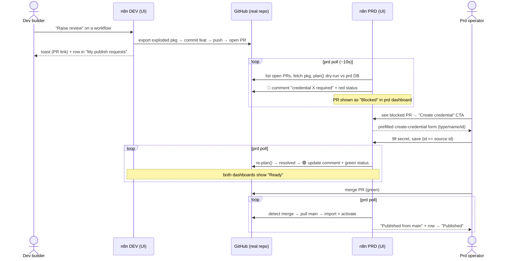
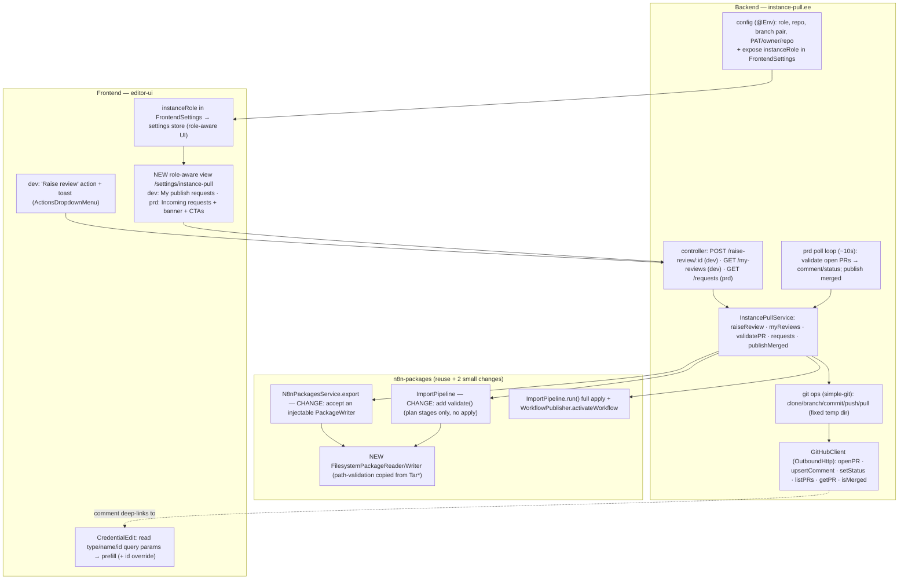

# Prototype Plan: Instance-Pull — "Review = Pull Request, Merge = Publish"

> **Throwaway-quality POC to demonstrate the user journey** across **two
> instances, each with its own role-aware UI** — not production code. Shortcuts
> are taken wherever they don't degrade what's shown. Production build is a
> separate, later effort (see `## Not in the prototype`).
>
> Setup: two local n8n instances — `role=dev` and `role=prd` — pointed at **one
> real GitHub repo** (the PR, the bot comment, and the status check are real,
> visible artifacts), `N8N_INSTANCE_PULL_DEMO=true`. Module placeholder:
> `instance-pull.ee`.

## The journey (demonstrated largely *inside n8n*, on both instances)

**The five money shots** (each now has an in-app surface on the relevant instance):
1. Click → real PR appears (and a row in dev's **My publish requests**).
2. prd dashboard shows the PR **Blocked**; GitHub gets a red check + "credential X required".
3. Operator clicks **Create credential** → prefilled form → save → **everything goes green**.
4. Merge.
5. Workflow **live on prd**; both dashboards show **Published**.

## Decisions

**Locked with James:** n8n owns the GitHub API (PAT) · n8n-packages exploded
format · GitHub-only · credential match **by id** + workflow **`idPolicy:'source'`**.

**Prototype-specific calls:** workflow-menu "Raise review" entry point · **prd
poll loop (~10s), no webhooks** · GitHub via `OutboundHttp`, git via `simple-git`
(no octokit) · credential id-override + deep-linked prefilled create form
(demo-gated) · `credentialMissingMode:'must-preexist'` throughout · env config ·
**a role-aware `instance-pull` settings view on each instance** (the user's "UI
for each instance" requirement).

## Architecture

**Data-flow note (resolves the "ping-pong" unknown):** GitHub is the single
source of truth. **prd** computes validation (plan-only) and *writes* the comment
+ commit status. **Both** instances *read* PR state from GitHub via their backend:
dev's `GET /my-reviews` and prd's `GET /requests` each return PR list + status, so
both dashboards reflect the same truth and auto-refresh on their own poll. After
the operator saves the credential, the next prd poll (≤10s) flips status green; no
cross-instance call is needed.

**Poll-loop tracking (resolves the "which PRs" unknown):** each cycle prd calls
`listPRs(state=open)` filtered to instance-pull PRs (branch-name prefix or label)
→ validates each → upserts comment + status. It also checks tracked PRs for
`merged:true`; a merged PR not in an in-memory `publishedPrNumbers` set triggers
`publishMerged()`, then is added to the set. No DB, no webhooks.

**Reuse as-is:** the importers' `plan()` (already side-effect-free),
`WorkflowPublisher`/`activateWorkflow`, the `BlockingIssue` `credential-unresolved`
type, `IdBasedCredentialMatcher` (note: it **already** classifies wrong-type as a
blocking `type_mismatch`, so no id-collision work is needed). Module scaffold
copies `modules/instance-version-history`. UI view scaffolds from the
`features/settings/apiKeys` + `sourceControl.ee` settings-view patterns
(`N8nDataTableServer`, `N8nBadge`, `Banner`/`N8nCallout`, `useSettingsItems`).

---

## Task List (sliced by journey step — each phase ends in a demoable state)

### Phase A — Foundations (backend + shared UI shell + the 2 n8n-packages changes)

#### A1 — Module skeleton + config + role exposed to the frontend
Scaffold `instance-pull.ee` (module/service/controller/config, copy `instance-version-history`). Env: role (`dev`/`prd`), repo URL, feat/main branches, GitHub owner/repo, PAT. Add `instanceRole` to `FrontendSettings` so the UI is role-aware. Inert unless `N8N_INSTANCE_PULL_DEMO=true`.
- [ ] Booting with role+repo+PAT env loads the module; `instanceRole` is visible to the frontend settings store; no-op without the demo flag.
- **Verify:** boot both roles; FE settings payload shows the role. **Deps:** none. **Size:** M.

#### A2 — Git ops over a fixed working dir
`simple-git` wrapper: clone once into `/tmp/n8n-instance-pull-<role>`, branch/checkout, stage, commit, push, fetch, hard-reset/pull (HTTPS-token).
- [ ] Clone the repo; create a feat branch, commit, push; fetch + reset a branch to remote.
- **Verify:** branch→commit→push a file; confirm on GitHub. **Deps:** A1. **Size:** M.

#### A3 — Filesystem PackageWriter/Reader + writer-injectable export  *(fixes blocker: export returns tar)*
Implement the n8n-packages `PackageWriter`/`PackageReader` over a directory (copy `TarPackageReader` path validation). **Change `N8nPackagesService` export to accept an injectable `PackageWriter`** so the exploded tree can be written straight into the working dir (not a tar stream).
- [ ] Export a workflow with the filesystem writer → produces `manifest.json` + `workflows/<slug>/workflow.json` + `credentials/<slug>/credential.json`; reading it back via the parser round-trips.
- [ ] Filesystem reader rejects path traversal (`../`) like the tar reader.
- **Verify:** unit round-trip + a path-traversal rejection test. **Deps:** none (parallel). **Size:** M.

#### A4 — Shared role-aware `instance-pull` settings view (the UI shell for both instances)
New `features/instance-pull.ee/`: route `/settings/instance-pull`, nav item via `useSettingsItems` (label/content by role), thin Pinia store + API client, empty states. Dev shell = "My publish requests"; prd shell = "Incoming publish requests". (Populated in B4/C4.)
- [ ] On a dev instance the settings sidebar shows "My publish requests"; on prd it shows "Incoming publish requests"; each renders an empty-state list.
- **Verify:** boot both roles; see the correct labelled empty view. **Deps:** A1. **Size:** M.

### ✅ Checkpoint A: both instances show their role-appropriate (empty) Publishing view; a workflow exports to an exploded tree in git.

---

### Phase B — Dev "Raise review" (🎯 #1: click → PR appears, tracked in-app)

#### B1 — GitHub client: open PR
`GitHubClient.openPullRequest({head, base, title, body})` via `OutboundHttp` (`Authorization: token <PAT>`); find-or-create.
- [ ] Given a pushed feat branch, opens a PR feat→main, returns `{url, number}`; idempotent. **Verify:** call it → PR on GitHub. **Deps:** A1. **Size:** S–M.

#### B2 — `raiseReview` orchestration + dev endpoint
`InstancePullService.raiseReview(workflowId)`: export via the filesystem writer (A3) → commit feat → push (A2) → open PR (B1). `POST /instance-pull/raise-review/:workflowId` (dev only).
- [ ] Endpoint produces a real PR whose diff is the exploded package (manifest lists the workflow + `requirements.credentials[]`); returns `{ pullRequestUrl }`. **Verify:** hit endpoint → inspect PR. **Deps:** A2, A3, B1. **Size:** M.

#### B3 — FE "Raise review" action + toast (dev only)
`Raise review` item in `ActionsDropdownMenu` (dev role): save → POST B2 → toast with PR link.
- [ ] On a saved workflow (dev), clicking "Raise review" opens a real PR + a toast with a working link; hidden on prd. **Verify:** click in UI. **Deps:** B2. **Size:** M.

#### B4 — Dev "My publish requests" populated
`GET /instance-pull/my-reviews` returns the dev instance's PRs + status (read from GitHub: open/checks/merged). Render rows (workflow, PR link, status badge) in the A4 dev view; refresh button (poll optional).
- [ ] After raising a review, the workflow appears in "My publish requests" with a status and a PR link. **Verify:** raise → see the row. **Deps:** A4, B2. **Size:** M.

### ✅ Checkpoint B (DEMOABLE): one click in the dev editor opens a real PR and shows up in dev's in-app "My publish requests". Review with James.

---

### Phase C — Prd validation loop (🎯 #2: blocked in prd dashboard + red check)

#### C1 — Plan-only validation  *(fixes blocker: no plan-only seam)*
Add `ImportPipeline.validate(reader, context, request): BlockingIssue[]` that runs **only** the importers' `plan()` stages + `collectBlockingIssues` and returns — **no `apply()`**. `InstancePullService.validatePR(prNumber)` fetches the PR branch package (A2/A3) and runs it (`must-preexist`, `idPolicy:'source'`).
- [ ] Missing credential id → `credential-unresolved` issue (id/name/type + workflow); present → none; **prd DB unchanged**. **Verify:** unit over fixtures, assert DB untouched. **Deps:** A2, A3. **Size:** M.

#### C2 — GitHub client: comment + status
`upsertComment(prNumber, body)` (find-or-update one bot comment) + `setStatus(sha, state, desc)` (head SHA via `getPR`). Formatter: `BlockingIssue[]` → markdown with a deep link to the **prd** prefilled create-credential form — the link **must encode** the prd base URL + `type`, `name`, `id` query params (the exact params D2 reads).
- [ ] Blocking result → one comment naming missing creds + a deep link carrying `type/name/id` + red status; clean → green. **Verify:** against an open PR; click the link → it lands on a prefilled form. **Deps:** B1, C1. **Size:** M.

#### C3 — Prd poll loop
~10s loop (single in-flight): `listPRs(open)` (instance-pull-filtered) → `validatePR` → `upsertComment`+`setStatus`; track merged for Phase E.
- [ ] Opening a PR results — within a poll cycle, no manual trigger — in a red check + comment. **Verify:** raise → watch it appear. **Deps:** C1, C2. **Size:** M.

#### C4 — Prd "Incoming publish requests" populated + attention banner
`GET /instance-pull/requests` returns open PRs + cached validation (status, blockers per PR). Render in the A4 prd view: status badges, per-PR missing-credential list with a **"Create credential"** CTA (deep link), and a top `Banner` ("N requests blocked").
- [ ] A blocked PR shows in the prd dashboard with its missing credential(s) and a working "Create credential" CTA; the banner reflects blocked count. **Verify:** raise a review needing a missing cred → see it blocked in prd. **Deps:** A4, C3. **Size:** M.

### ✅ Checkpoint C (DEMOABLE): raising a review auto-posts a red check + "credential X required" on GitHub *and* shows the PR as Blocked with a CTA in prd's dashboard.

---

### Phase D — Prd credential provisioning (🎯 #3: create credential → all green)

#### D1 — (BE) Credential id override (demo-gated)
Add optional `id` to `CreateCredentialDto` and thread it through the create path (DTO → controller/handler → `CredentialsService.createCredential`) per n8n's DTO-propagation rules. **Gate placement:** `createCredential` honors `opts.id` **only when `N8N_INSTANCE_PULL_DEMO=true`**, otherwise leaves it unset. The entity's `@BeforeInsert` already keeps a pre-set id (`if (!this.id)`), so no entity change. No migration.
- [ ] With the flag, creating a credential with a supplied id persists that id; without the flag (or without `id`), behavior is unchanged (auto-generated). **Verify:** unit (flag on/off) + manual. **Deps:** none. **Size:** S–M.

#### D2 — (FE) Thread id through + prefilled create form  *(fixes blocker: id not wired to FE)*
Add `id` to `credentials.store.createNewCredential` + the API payload; make `CredentialEdit.vue` read `type`/`name`/`id` from `route.query` and prefill (id field demo-only). Reached from the C4 CTA / PR comment deep link.
- [ ] Following the CTA/link opens a create form prefilled with type/name/id; saving creates a credential whose id equals the required source id. **Verify:** click CTA → fill secret → save → credential has the right id. **Deps:** D1, C4. **Size:** M.

#### D3 — Re-validate to green
Poll loop re-validates once the credential exists → comment+status green; prd dashboard row → "Ready"; dev "My publish requests" → "Ready".
- [ ] After saving the credential, the next poll flips GitHub + both dashboards to green/Ready — hands-off. **Verify:** end-to-end red→green. **Deps:** C3, D2, B4. **Size:** S.

### ✅ Checkpoint D (DEMOABLE): operator clicks the CTA, creates the credential, and the check + both dashboards turn green on their own.

---

### Phase E — Publish on merge (🎯 #4–5: merge → live on prd)

#### E1 — Merge detection + publish
Poll loop: a tracked PR with `merged:true` not in `publishedPrNumbers` → `publishMerged()`: pull `main` → `ImportPipeline.run()` full apply (`idPolicy:'source'`, `must-preexist`) → upsert + activate via `WorkflowPublisher`; add to set; mark request "Published".
- [ ] After merge, prd imports preserving source id and activates (published/active, triggers registered); executing it on prd works with the prd credential. **Verify:** merge → workflow live → run it. **Deps:** A2, A3, C3, D. **Size:** M.

#### E2 — "Published from main" feedback
prd toast/notice on publish; prd + dev dashboards show the request as "Published".
- [ ] On publish, prd shows an in-app confirmation naming the workflow; both dashboards reflect "Published". **Verify:** observe after merge. **Deps:** E1, B4, C4. **Size:** S.

### ✅ Checkpoint E (FULL DEMO): the whole journey runs hands-off, visible in both instances' UIs. Record it.

---

## Demo runbook
1. Boot `dev` + `prd` (env: role, repo, PAT, `N8N_INSTANCE_PULL_DEMO=true`).
2. **dev**: build a workflow using one credential → **Raise review** → toast + it appears in **My publish requests**. Open the PR.
3. Wait ~10s → **prd dashboard** shows the PR **Blocked**; GitHub shows red check + "credential X required".
4. In prd, click **Create credential** (or the PR comment link) → prefilled form → fill secret → save.
5. Wait ~10s → GitHub + both dashboards go **green**. **Merge** on GitHub.
6. Wait ~10s → workflow **published & active on prd**; both dashboards show **Published**; run it.

## Risks and mitigations
| Risk | Impact | Mitigation |
|------|--------|------------|
| Credential id alignment (id-match needs same id on prd). | High | D1+D2 (id override + prefilled form); de-risk first. Type-mismatch already blocked by the matcher. |
| `ImportPipeline` plan/apply coupling. | High | C1 adds an explicit `validate()` using only the side-effect-free `plan()` stages; unit-assert DB untouched. |
| Export returns tar, not a tree. | Med | A3 injects a `FilesystemPackageWriter`; copy tar path-validation. |
| FE credential-id plumbing larger than it looks. | Med | D2 explicitly covers store + api + `CredentialEdit` query-param prefill. |
| Poll loop dup comments / races / merge-miss. | Low–Med | single in-flight; `upsertComment` find-or-update; in-memory `publishedPrNumbers`. |
| Poll-loop timer leaks / two prd instances both publishing. | Low | clear the interval on module shutdown; POC runs a **single** prd instance (in-memory tracking is per-process — multi-main is out of scope, noted below). |
| PAT scopes / status not blocking merge w/o branch protection. | Med | Document `repo` scope; demo gates merge by *showing* the red check. |
| Both instances need same node set/version to activate. | Med | identical local builds. |

## Not in the prototype (deferred to production)
Real webhooks · multi-provider · secure token storage/SSH · RBAC/scopes/licensing
· multi-main leader gating · conflict handling beyond happy path ·
folders/projects/multi-workflow reviews · the production credential-provisioning
model (auto-stub-with-pinned-id + secret-fill detection) · branch-protection-
enforced required checks · security review (webhook ingress, SSRF, token leakage)
· telemetry/docs/prod-bar tests · pagination/search/filter in the dashboards.

## Production direction notes (not POC scope)
- **Authorization — MUST fix before any non-demo build (known IDOR).** The
  `instance-pull` controller endpoints (`raise-review/:workflowId`,
  `diff/:prNumber`) don't verify the *caller's* access to the target workflow,
  and the export/diff runs as `getInstanceOwner()` rather than the requester —
  so any authenticated user could raise/inspect any workflow by id. Inert today
  because the module throws unless `N8N_INSTANCE_PULL_DEMO=true` and the demo is
  single-user-owner. Production must: gate the controller with a scope (e.g.
  `instancePull:*`, admin-granted); verify the resolved `workflowId` is
  accessible to `req.user` via the workflow finder before export/diff; and use
  `req.user` as the actor for the request-scoped endpoints (the poll loop keeps
  the owner actor — it has no request user). Flagged by automated security review.
- **Git provider auth = GitHub App** for the enterprise build (POC uses a PAT). Reasons: org-owned installation identity (survives staff churn), `n8n[bot]` attribution for the comment + status, the **Check Runs API** (App-only) for a proper required merge gate, granular per-repo permissions, short-lived auto-rotating installation tokens, per-install rate limits, and **native PR/merge webhooks** (which replace the POC poll loop). Keep provider auth behind an interface so PAT→App is a one-seam swap; optionally allow a fine-grained PAT as a fallback for orgs that won't install Apps.

## Open questions (don't block the POC)
1. Module name (`instance-pull.ee` placeholder).
2. Post-demo: production credential-provisioning model (the deep-link id-override is a prototype shortcut, not the proposed production design).
3. Is per-workflow "Raise review" the intended UX, or a multi-change review (closer to the source-control push modal)?
