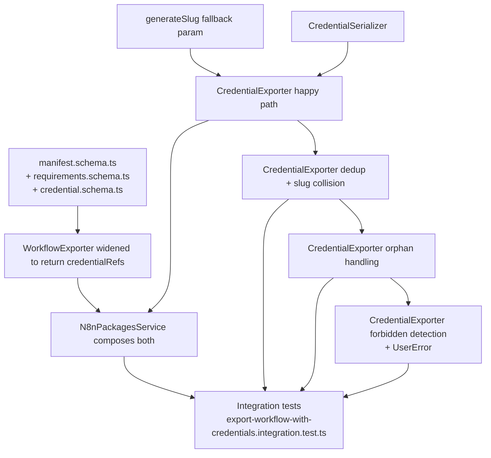

# PLAN: Credential Export in `.n8np` Packages

> Companion to [SPEC.md](../SPEC.md). Source of truth for *what* the slice is.
> This plan is the *how*.

## 1. Dependency graph



**Critical path:** schemas → workflow-exporter widening → credential serializer
+ exporter happy path → service wiring → first integration test green. Once
that's green, dedup/orphan/forbidden are independent leaves that can be tackled
in any order.

**Risk concentration:** the orphan-vs-forbidden disambiguation in step G is the
only place we add a DB query the existing tests don't exercise — that's where
to look first if anything misbehaves.

## 2. Slicing strategy

Five vertical slices, each landing on `master`-buildable, test-green code.
Each slice is a complete user-observable behaviour, not a horizontal layer —
no "PR for schemas, PR for service, PR for tests" splits.

```
V1  Happy path                    ── single accessible credential round-trips
V2  Dedup + slug collision        ── multiple workflows, multiple creds
V3  Orphan reference handling     ── deleted credential still in node ref
V4  Forbidden credential          ── caller without credential:read → UserError
V5  Sweep + docs                  ── full repo lint/typecheck, manual smoke
```

Each slice owns: the production code it needs, its unit tests, and the slice
of the integration test that exercises it. V1 establishes the file scaffold;
V2–V4 add cases to the same files.

## 3. Tasks

### V1 — Happy path

#### T1.1 — Schemas: requirements + credential + manifest extension

**Files:**
- new `packages/cli/src/modules/n8n-packages/spec/requirements.schema.ts`
- new `packages/cli/src/modules/n8n-packages/spec/serialized/credential.schema.ts`
- modify `packages/cli/src/modules/n8n-packages/spec/manifest.schema.ts`

**Acceptance criteria:**
- `packageCredentialRequirementSchema` has `id`, `name`, `type`,
  `usedByWorkflows` (all required, `usedByWorkflows` min-length 1).
- `packageRequirementsSchema` wraps `{ credentials?: … }`.
- `serializedCredentialSchema` is `.strict()` with exactly `id`/`name`/`type`.
- `packageManifestSchema` gains optional `credentials: ManifestEntry[]` and
  optional `requirements: PackageRequirements`.
- `packageFormatVersion` constant unchanged at `"1"`.
- Exported types: `PackageCredentialRequirement`, `PackageRequirements`,
  `SerializedCredential`.

**Verification:**
- `cd packages/cli && pnpm typecheck` clean.
- Run existing module tests; nothing should break:
  `pnpm test src/modules/n8n-packages` — all green.

---

#### T1.2 — Slug helper: parameterise the empty fallback

**Files:** `packages/cli/src/modules/n8n-packages/io/slug.utils.ts`,
`packages/cli/src/modules/n8n-packages/io/__tests__/slug.utils.test.ts`

**Acceptance criteria:**
- `generateSlug(name, fallback?)` accepts an optional fallback (default
  `'workflow'` so existing callers don't change).
- New unit test asserts `generateSlug('', 'credential') === 'credential'`.

**Verification:**
- `pnpm test src/modules/n8n-packages/io` from `packages/cli` — all green.

> Tiny but real: without it, an unnamed credential exports to
> `credentials/workflow/credential.json`, which is wrong and a future-debugging
> trap.

---

#### T1.3 — Widen `WorkflowExporter` to surface credential references

**Files:**
- `packages/cli/src/modules/n8n-packages/entities/workflow/workflow.exporter.ts`
- `packages/cli/src/modules/n8n-packages/entities/workflow/__tests__/workflow.exporter.test.ts`

**Acceptance criteria:**
- Define `CredentialReferenceFromWorkflow = { workflowId; credentialId;
  credentialName; credentialType }` (export from
  `entities/workflow/workflow.types.ts` — create the file if it doesn't exist,
  one type only).
- `WorkflowExporter.export(...)` returns `{ entries: ManifestEntry[];
  credentialReferences: CredentialReferenceFromWorkflow[] }`. The `entries`
  field is unchanged in shape and content.
- The exporter walks each workflow's `nodes[*].credentials` map and emits one
  reference per `(workflowId, credentialTypeKey)` pair. Same credential id
  referenced twice in one workflow is fine to emit twice or once — pick once
  (dedup per `(workflowId, credentialId)`) and lock it in a test.
- Existing unit tests updated to read `.entries` from the new shape (small
  diff, mechanical).
- One new unit test: a workflow with two distinct credential refs emits two
  reference records with the right `workflowId`.

**Verification:**
- `pnpm test src/modules/n8n-packages/entities/workflow` — all green.

> This is the *only* breaking-shape change in the slice. The service is the
> sole caller, so the blast radius is contained.

---

#### T1.4 — `CredentialSerializer`

**Files:**
- new `packages/cli/src/modules/n8n-packages/entities/credential/credential.serializer.ts`
- new `packages/cli/src/modules/n8n-packages/entities/credential/__tests__/credential.serializer.test.ts`

**Acceptance criteria:**
- `@Service()` class with one method `serialize(credential:
  CredentialsEntity): SerializedCredential`.
- Returns exactly `{ id, name, type }` via
  `serializedCredentialSchema.parse(...)`.
- Test: extra fields on the entity (`data`, `isManaged`, `isGlobal`) do not
  appear in the output, and `.strict()` would throw if we tried to add them.

**Verification:** unit test green; `pnpm typecheck` clean.

---

#### T1.5 — `CredentialExporter` (happy path only)

**Files:**
- new `packages/cli/src/modules/n8n-packages/entities/credential/credential.exporter.ts`
- new `packages/cli/src/modules/n8n-packages/entities/credential/__tests__/credential.exporter.test.ts`

**Scope of this task:** rows 1, 2, 8 from the spec's unit test table. Dedup,
collision, orphan, forbidden land in later slices.

**Acceptance criteria:**
- `@Service()` class, constructor injects `CredentialsFinderService`,
  `CredentialSerializer`.
- `async export({ user, references, writer }):
  Promise<CredentialExportResult>`.
- For an empty `references` array → returns `{ entries: [], requirements: []
  }`, writes nothing.
- For one accessible credential → calls
  `findCredentialForUser(id, user, ['credential:read'])`, writes
  `credentials/<slug>/credential.json` and `credentials/<slug>/` directory,
  returns one manifest entry and one requirement record with
  `usedByWorkflows: [workflowId]`.
- The serialized credential file content equals `JSON.stringify(serialized,
  null, '\t')` (parity with workflow exporter formatting).

**Verification:** unit tests green; `pnpm typecheck` clean.

---

#### T1.6 — `N8nPackagesService` composes both exporters

**Files:**
- `packages/cli/src/modules/n8n-packages/n8n-packages.service.ts`
- `packages/cli/src/modules/n8n-packages/__tests__/export-workflow.integration.test.ts`
  (touch only if needed to keep existing assertions green — *not* to add
  credential cases)

**Acceptance criteria:**
- `N8nPackagesService` now also depends on `CredentialExporter`.
- `exportWorkflows`:
  1. Calls `workflowExporter.export(...)` and unpacks
     `{ entries: workflowEntries, credentialReferences }`.
  2. Calls `credentialExporter.export({ user, references:
     credentialReferences, writer })`.
  3. Builds manifest with `workflows`, plus `credentials` and `requirements`
     **only when non-empty** (matches spec's "omit empty" decision).
- Existing integration tests still green — manifest with no credentials must
  still be byte-for-byte the same shape (no `credentials` key, no
  `requirements` key).

**Verification:**
- `pnpm test src/modules/n8n-packages` — all existing green.
- `pnpm typecheck` clean.

---

#### T1.7 — Integration test: happy path

**Files:** new
`packages/cli/src/modules/n8n-packages/__tests__/export-workflow-with-credentials.integration.test.ts`

**Acceptance criteria:**
- File mirrors structure of `export-workflow.integration.test.ts`
  (`beforeAll`/`afterAll`/`beforeEach` setup, `readExport` helper).
- One test: owner with a workflow that references one accessible credential.
  Assertions:
  - Tar contains `credentials/<slug>/credential.json` (find by manifest
    target).
  - File body parses to `{ id, name, type }` only — no other keys.
  - `manifest.credentials` contains one matching entry.
  - `manifest.requirements.credentials` contains one entry with
    `usedByWorkflows: [workflow.id]`.
- Uses `saveCredential` from `@test-integration/db/credentials` (already in
  the repo, used by `chat-hub.service.integration.test.ts`).

**Verification:**
- `pnpm test export-workflow-with-credentials` from `packages/cli` — green.
- Existing `export-workflow.integration.test.ts` still green.

---

### 🔍 CHECKPOINT 1 — End of V1

Before starting V2, confirm:

- [ ] Full pipeline works for one accessible credential end-to-end.
- [ ] No existing tests have been weakened or skipped.
- [ ] `pnpm lint` and `pnpm typecheck` from `packages/cli` both clean.
- [ ] Manifest with zero credentials is byte-identical to today's output.
- [ ] Manual smoke: hit `POST /n8n-packages/export` (curl or REST client)
      against a dev instance with a credential-bearing workflow; inspect the
      `.n8np` tar contents.

Surfaces any wrong assumption about manifest shape **before** we layer on the
edge-case logic.

---

### V2 — Dedup and slug collisions

#### T2.1 — Dedup credentials referenced by multiple workflows

**Files:**
- `packages/cli/src/modules/n8n-packages/entities/credential/credential.exporter.ts`
- `packages/cli/src/modules/n8n-packages/entities/credential/__tests__/credential.exporter.test.ts`

**Acceptance criteria:**
- Same credential id appearing in references from two workflows:
  - Single file written.
  - Single `manifest.credentials` entry.
  - Single `requirements.credentials` entry with both workflow ids in
    `usedByWorkflows`, deduplicated and in deterministic order (insertion
    order is fine — lock it in the test).
- Unit test for row 3 of the spec table.

**Verification:** `pnpm test src/modules/n8n-packages` — green.

---

#### T2.2 — Slug collisions across credentials

**Files:** same as T2.1.

**Acceptance criteria:**
- Two credentials with identical names produce
  `credentials/<slug>`, `credentials/<slug>-2`.
- Reuse `generateSlug` with `'credential'` fallback.
- The collision-suffix logic is duplicated from `WorkflowExporter` for now;
  if it appears identical, defer extraction to V5 — *do not* refactor in this
  task.
- Unit test for row 4 of the spec table.

**Verification:** unit test green.

---

#### T2.3 — Integration test: dedup case

**Files:**
`export-workflow-with-credentials.integration.test.ts`.

**Acceptance criteria:**
- Two workflows, both referencing the same credential, are exported in one
  request. Assert one credential file, one manifest entry, one requirement
  with two workflow ids.

**Verification:** integration test green.

---

### 🔍 CHECKPOINT 2 — End of V2

- [ ] All unit + integration tests green.
- [ ] No public method signatures changed since V1.
- [ ] Decision logged: keep collision-suffix duplication for now (or extract
      with reason).

---

### V3 — Orphan credential references

#### T3.1 — Probe to distinguish orphan vs forbidden

**Files:**
- `packages/cli/src/modules/n8n-packages/entities/credential/credential.exporter.ts`
- `packages/cli/src/modules/n8n-packages/entities/credential/__tests__/credential.exporter.test.ts`

**Acceptance criteria:**
- When `findCredentialForUser(id, user, ['credential:read'])` returns `null`,
  exporter calls `credentialsFinder.findCredentialById(id)` to disambiguate.
- If that returns `null` → treat as orphan: emit only a
  `requirements.credentials` entry built from the node-side reference
  (`credentialName`, `credentialType`). No file, no manifest entry.
- If that returns a credential → treat as forbidden (handled in V4; for now,
  rethrow / placeholder).
- Unit test for row 5 of the spec table.

**Verification:** unit test green; existing tests still green.

> Inline a 1-line comment on the second `findCredentialById` call explaining
> *why* (orphan vs forbidden disambiguation). It's the only non-obvious
> branch in the class.

---

#### T3.2 — Integration test: orphan case

**Files:** `export-workflow-with-credentials.integration.test.ts`.

**Acceptance criteria:**
- Workflow node has a `credentials` block referencing id `does-not-exist`.
  Export.
- Assert: no `credentials/` file for that id; no manifest entry; one
  `requirements.credentials` entry with `id: 'does-not-exist'`, the
  node-side `name`/`type`, and `usedByWorkflows: [wf.id]`.

**Verification:** integration test green.

---

### 🔍 CHECKPOINT 3 — End of V3

- [ ] All tests green.
- [ ] `findCredentialById` is the only added query path; no surprise N+1
      patterns introduced (one extra lookup *only* for the null case).
- [ ] Behaviour: every workflow with a credential ref can be exported; only
      forbidden-credential refs (V4) still error.

---

### V4 — Forbidden credentials

#### T4.1 — Detect forbidden + throw aggregated `UserError`

**Files:**
- `packages/cli/src/modules/n8n-packages/entities/credential/credential.exporter.ts`
- `packages/cli/src/modules/n8n-packages/entities/credential/__tests__/credential.exporter.test.ts`

**Acceptance criteria:**
- When `findCredentialById(id)` returns a credential (i.e. it exists but
  the caller lacked `credential:read`), collect the id into a forbidden list.
- After processing all references, if the forbidden list is non-empty, throw
  `new UserError('N credential(s) not accessible. Export aborted.', {
  description: 'Inaccessible credential IDs: id1, id2, ...' })` (mirror the
  truncation rule from `WorkflowExporter` — show first 20, suffix
  `, and N more`).
- **No partial writes:** the exporter buffers its writer calls until the
  forbidden-check has cleared. Simplest implementation: do the entire DB
  resolution + classification pass first, then iterate and write. Avoids the
  writer needing rollback.
- Unit tests:
  - Row 6 of the spec table — single forbidden credential, message lists
    the id, writer was never called for any credential path.
  - Bonus: forbidden + accessible mixed — error wins, accessible credential
    is *not* written.

**Verification:** unit tests green.

---

#### T4.2 — Integration test: forbidden case + ensure no stream leak

**Files:** `export-workflow-with-credentials.integration.test.ts`.

**Acceptance criteria:**
- Setup: owner creates credential `secret-cred`. Owner creates workflow
  `shared-wf` referencing `secret-cred`. Workflow is `shareWorkflowWithUsers`'d
  to a member. Member calls export.
- Assert: `UserError` thrown with the standard message containing the
  credential id (substring match).
- Assert: response did **not** get a tar stream — the throw happens inside
  `exportWorkflows` before the writer's `finalize()` is reached. (Test by
  ensuring the controller path is bypassed; rely on service-level rejection.)

**Verification:** integration test green; full `n8n-packages` test suite
green.

---

### 🔍 CHECKPOINT 4 — End of V4

- [ ] All 4 acceptance criteria from the SPEC's `Acceptance criteria`
      section pass (1–7).
- [ ] Unit table rows 1–8 from SPEC §5 all have backing tests.
- [ ] Integration test file has 4 cases (T1.7, T2.3, T3.2, T4.2).
- [ ] `pnpm lint && pnpm typecheck` from `packages/cli` clean.

---

### V5 — Sweep

#### T5.1 — Full-repo build, lint, typecheck

**Verification:**
- From repo root: `pnpm build > build.log 2>&1 && tail -n 20 build.log` —
  clean.
- From repo root: `pnpm lint && pnpm typecheck` — green.

#### T5.2 — Manual smoke

**Verification (manual):**
1. Start dev instance, create a workflow with a credential.
2. `POST /n8n-packages/export` → save `.n8np`.
3. Untar: confirm `credentials/<slug>/credential.json` contains exactly
   `{id, name, type}` and manifest.json carries both `credentials[]` and
   `requirements.credentials[]`.
4. Delete the credential from the DB; re-export; confirm orphan behaviour.

#### T5.3 — Decide on collision-suffix duplication

**Choice point:** if T2.2's slug-collision logic is byte-identical to
`WorkflowExporter.allocateUniqueFileName`, lift it into `io/slug.utils.ts` as
a second helper now (one PR, two call sites — exactly meets SPEC §4's rule).
Otherwise document why it diverged.

**Verification:** post-extraction, both exporter unit suites still green.

#### T5.4 — Open the PR

Use `gh pr create --draft` per project conventions. PR description references
the Linear ticket (will be supplied by the user) and links to SPEC.md.

---

## 4. Out-of-band risks to watch

1. **`isGlobal` credentials.** SPEC §1 declares them out-of-scope. Today,
   `findCredentialForUser` returns global creds for the read-only scope. If a
   workflow references a global credential, our happy path will export it
   like any other — that's actually fine for v1 since the file is still just
   `{id,name,type}`. Note in V5 retrospective so we don't regress when global
   support gets formal.
2. **Multiple credential types per node.** A node's `credentials` map is
   keyed by credential-type-key (`{ slackOAuth2Api: { id, name } }`). Step
   T1.3 must iterate the values, not the keys. Easy to get wrong; spec it
   into the unit test.
3. **Concurrent edits during export.** If a credential gets deleted between
   the `findCredentialForUser` call and the second-probe, the second probe
   sees `null` → we classify as orphan. That's correct (the file can't be
   written) but may surprise a user. Acceptable behaviour; no mitigation
   needed.
4. **`UserError` truncation.** Mirror the workflow exporter's behaviour
   verbatim — copying the constant `20` and the `, and N more` pattern. Same
   user-facing error grammar across both classes.

## 5. Estimate

Five slices, ~7+3+2+2+~ small tasks. With no surprises: ~half-day of focused
work, mostly in the CredentialExporter and its tests. Integration test
fixtures may eat more time than expected.

## 6. Open questions to track during build

1. Final decision on omit-vs-empty for `credentials` / `requirements` in
   manifest when nothing applies. (Recommendation in SPEC §"Open
   assumptions" #2: omit.) Lock in T1.6, document in test.
2. Whether the V5 slug-helper extraction is in-scope for the same PR or a
   follow-up. Decide at checkpoint 4.
