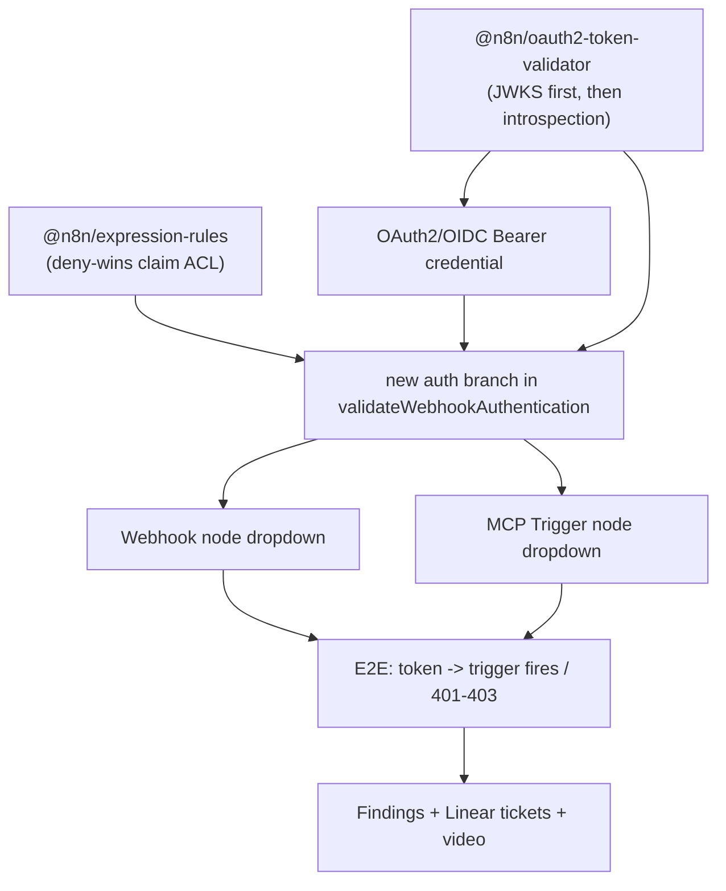

# Implementation Plan: OAuth2/OIDC Trigger Auth POC (ENT-28, M1)

> Spike, timeboxed to **2 days**. Goal is a *working POC* + accurate ticket
> breakdown, not production-grade code. Optimize for proving the shape of the
> three unknowns: validator package, credential UX, trigger wiring.
> Linear: https://linear.app/n8n/issue/ENT-28

## Overview

Add an "OAuth2/OIDC Bearer Token" authentication option to n8n's **Webhook
Trigger** and **MCP Trigger** so an incoming request must carry a valid,
short-lived IdP-issued token before the workflow fires. Tokens are validated
two ways: locally as a **JWT via JWKS** (default, fast, stateless) or remotely
via **RFC 7662 introspection** (for opaque tokens / instant revocation). A
validated token's **claims** are then checked against configurable allow/deny
rules (**deny-wins**).

The single most important codebase fact: both triggers authenticate through one
shared function, `validateWebhookAuthentication` at
`packages/nodes-base/nodes/Webhook/utils.ts:235`. MCP Trigger imports and reuses
it (`McpTrigger.node.ts:150`). So wiring *both* triggers is essentially *one*
new branch in that function plus two dropdown/credential registrations.

## Architecture Decisions

- **New package `@n8n/oauth2-token-validator`** — owns both validation
  strategies behind one entry point `validateToken(token, options) -> claims`.
  JWKS path uses `jose` + OIDC discovery (`/.well-known/openid-configuration`)
  with key caching. Introspection path is lifted from the existing
  `oauth2-introspection-identifier.ts` (RFC 7662, metadata discovery, caching),
  decoupled from `CacheService` and the credential-resolver so it is reusable.
  *Rationale:* isolates the genuinely new logic from the node layer; this is the
  package M2 will later migrate the other 5 sites onto.
- **New package `@n8n/expression-rules`** — extracted from
  `role-resolver.service.ee.ts`. It already evaluates claim expressions via
  `Expression.resolveWithoutWorkflow(expr, context)` (role-resolver:129). We
  lift that wrapper + the claims-context builder and add **deny-wins**
  evaluation over a rule list. *Rationale:* reuse a proven evaluator; avoid a
  second expression dialect.
- **New credential type `OAuth2/OIDC Bearer Token`** (`oAuthBearerToken`) in
  `packages/nodes-base/credentials/`. Inbound-only, so it has **no
  `authenticate` block** (that is for outbound API calls). Fields: issuer/
  discovery URL, audience, validation mode (`jwks` | `introspection`),
  introspection endpoint + client id/secret, and claim rules. Modeled on
  `HttpBearerAuth.credentials.ts`.
- **One new branch in `validateWebhookAuthentication`** (utils.ts:281 area)
  for `authentication === 'oAuthBearer'`, calling the validator then the rule
  evaluator, throwing `WebhookAuthorizationError(401|403)` on failure. Both
  nodes inherit it; we only add the option to each node's `authentication`
  dropdown + `credentials` array.

## Dependency Graph



Packages A and B are independent and can be built in parallel. Everything else
is sequential.

## Task List

### Phase 1 — Thinnest end-to-end path (JWKS only)
Prove the whole pipe with the simplest strategy before adding the second one.

- [ ] **Task 1**: Scaffold `@n8n/oauth2-token-validator` with JWKS validation
- [ ] **Task 2**: Create `OAuth2/OIDC Bearer Token` credential (JWKS fields only)
- [ ] **Task 3**: Add `oAuthBearer` branch to `validateWebhookAuthentication` + wire Webhook node

### Checkpoint: E2E JWKS path
- [ ] A short-lived JWT from a real/local IdP fires the Webhook; expired/invalid → 401/403
- [ ] Builds clean, package unit tests pass
- [ ] **Review with human before proceeding** (de-risk decision: is the shape right?)

### Phase 2 — Second strategy + claim ACL
- [ ] **Task 4**: Add RFC 7662 introspection strategy to the validator package
- [ ] **Task 5**: Extract `@n8n/expression-rules` from role-resolver (deny-wins)
- [ ] **Task 6**: Wire claim-rule check into the auth branch + add `{effect, expression}` rule list to credential (see "Claim-ACL design")

### Checkpoint: full validation + ACL
- [ ] Opaque token validated via introspection; revoked token → 403
- [ ] Claim rule allows matching caller, denies non-matching; deny-wins verified
- [ ] Package unit tests pass (nock for introspection, mock JWKS)

### Phase 3 — MCP wiring + spike deliverables
- [ ] **Task 7**: Add the option to MCP Trigger node (dropdown + credentials array) + E2E
- [ ] **Task 8**: Capture findings, create M1 Linear tickets w/ estimates, record walkthrough

### Checkpoint: Spike complete
- [ ] Both triggers gated by OIDC tokens end-to-end
- [ ] All M1 implementation tickets created with POC-informed estimates
- [ ] Knowledge-share video recorded
- [ ] Remaining unknowns documented in tickets

## Risks and Mitigations

| Risk | Impact | Mitigation |
|------|--------|------------|
| No IdP to issue test tokens | High | Stand up a tiny local issuer: self-signed RSA key, serve a static JWKS + sign short-lived JWTs with a script. Or run Keycloak in docker. Decide in Task 1. |
| `jose`/JWKS not already a dep where needed | Med | `jose` is already used in `oauth-jwe` module; reuse. Confirm in Task 1. |
| Extracting expression-rules drags in role-resolver deps | Med | Keep extraction minimal — copy the `resolveWithoutWorkflow` wrapper + claims context only; leave role-resolver calling the new package as a thin follow-up (or skip rewiring role-resolver in the spike). |
| Introspection latency / caching ergonomics | Med | Lift existing cache logic; note findings rather than perfecting. |
| 2-day timebox | High | Phase 1 alone satisfies the "working POC" AC. Phases 2–3 are layered so partial completion still yields value + documented gaps. |

## Resolved Decisions (locked 2026-06-03)

1. **Config home → credential**, matching existing `httpBearerAuth` wiring.
   *Add a `TODO` comment in the credential file* flagging this as a revisit
   point (credential vs node-config ergonomics to reassess during M1 build).
2. **Test IdP → local self-signed issuer.** A small script: generate an RSA
   key, serve a static JWKS, sign short-lived JWTs (and an opaque-token +
   introspection stub for Phase 2). Built in Task 1.
3. **Role-resolver → not rewired.** Only *create* `@n8n/expression-rules` and
   use it in the new trigger path. Rewiring role-resolver is logged as M2.
4. **Claim-rule UX → expression strings**, reusing n8n expression syntax
   (e.g. `$claims.groups includes "admin"`), evaluated directly.

## Claim-ACL design (first iteration)

**A trigger's authz decision is binary** — fire the workflow or reject. Unlike
the REST API surface (many operations, each gated by an n8n scope like
`workflow:execute`), a webhook/MCP trigger has one operation. So the M1 mapping
produces a **boolean gate**, not a claim→n8n-scope mapping.

**Rule shape** (stored in the credential for M1):

```jsonc
"claimRules": [
  { "effect": "allow", "expression": "$claims.scope contains 'wf-execute'" },
  { "effect": "allow", "expression": "$claims.realm_access.roles includes 'wf-admin'" },
  { "effect": "deny",  "expression": "$claims.groups includes 'suspended'" }
]
```

**Gate logic:** at least one `allow` matches AND no `deny` matches → fire; else
`403`. **Deny-by-default**: an empty allow list rejects everything. This is the
`@n8n/expression-rules` deny-wins evaluator (Task 5).

**No right-hand-side n8n scope in M1.** The `expression -> "workflow:execute"`
mapping form is correct for the *REST API* surface (many operations), not for
triggers. Logged as a separate API-surface ticket in Task 8.

**Expose validated claims into the workflow run** (Sixt requirement): surfacing
the decoded claims as trigger output lets builders do fine-grained
routing/authz in the workflow itself, keeping the M1 gate a simple boolean.

## Config storage location (where the policy lives)

Split the config into **trust config** (issuer, audience, JWKS URI, allowed
algorithms) and **claim→gate rules**.

- **M1 / POC → both in the CREDENTIAL.** Fast, encrypted at rest, reuses the
  webhook auth wiring, and credential sharing gives a basic access story.
- **Known limitation:** a credential is attached by the workflow author at the
  node, so an author who can edit the workflow can swap/weaken it. This does
  **not** satisfy Sixt's *"lockable, platform-managed policy that authors cannot
  weaken"* nor *"multiple trusted issuers at once."*
- **End-state (Sixt-driven, separate ticket):** lift trust config to an
  **instance/admin-owned trusted-issuer registry** (multi-issuer, principal
  types), and bind **per-endpoint policy to a stable identifier** (workflow ID /
  webhook path / stable webhook ID), enforced server-side and lockable
  regardless of node config.

## Sixt feature-request alignment (input for Task 8 tickets)

Source: `~/Downloads/Sixt Feature Request - External IdP.pdf`. Sixt's ask is
broader than M1 (three surfaces: REST API + Webhook + MCP; multi-issuer;
human-vs-agent principals; claim→permission mapping; governance). M1 covers the
*validation core* + trigger wiring. Cheap hardening worth pulling into M1:

- explicit **algorithm allow-list + reject `alg:none`** in the validator
- standard **`WWW-Authenticate: Bearer`** challenge + clean 401 (invalid) vs
  403 (unauthorized) split
- **never log token contents**; stateless per pod (already true)

Larger, out-of-M1 (capture as tickets): Public REST API surface; multi-issuer
registry; human/agent principal types + JIT/virtual principals; structured
claim→n8n-permission mapping + audit events; lockable central webhook policy;
MCP RFC 9728 protected-resource metadata + RFC 8707 resource/audience binding;
SixtGPT delegated user+app identity.
